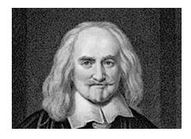
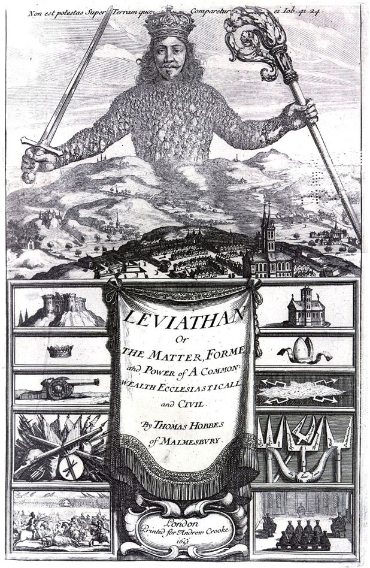

# ZEILER .me - IT & Medien, Geschichte, Deutsch - Texterörterung

**Thomas Hobbes:**

**Auszüge aus dem „Leviathan“ (S. 40 – 43)**

Aus: Thomas Hobbes, Leviathan oder Stoff, Form und Gewalt eines bürgerlichen und kirchlichen Staates, hg. v. Iring Fetscher, Neuwied und Berlin 1966.

„\[…\] Die Natur hat die Menschen hinsichtlich ihrer körperlichen und geistigen Fähigkeiten so gleich geschafften, dass trotz der Tatsache, dass bisweilen der eine einen offensichtlich stärkeren Körper oder gewandteren Geist als der andere besitzt, der Unterscheid zwischen den Menschen alles in allem doch nicht so beträchtlich ist, als dass der eine auf Grund dessen einen Vorteil beanspruchen könnte, den ein anderer nicht ebenso gut für sich verlangen dürfte.

Denn was die Körperstärke betrifft, so ist der Schwächste stark genug, den Stärksten zu töten – entweder durch Hinterlist oder durch ein Bündnis mit anderen, die sich in derselben Gefahr wie er selbst befinden.Und was die geistigen Fähigkeiten betrifft, so finde ich, dass die Gleichheit unter den Menschen noch größer ist als bei der Körperstärke – einmal abgesehen von den auf Wörtern beruhenden Künsten und besonders von der Fertigkeit, nach allgemeinen und unfehlbaren Regeln vorzugehen, was man Wissenschaft nennt. \[...\] Denn Klugheit ist nur Erfahrung, die alle Menschen, die sich gleich lang mit dem gleichen Dinge beschäftigen, gleichermaßen erwerben.\[...\] So liegen also in der menschlichen Natur drei hauptsächliche Konfliktursachen: erstens Konkurrenz, zweitens Misstrauen, drittens Ruhmsucht. Die erste führt zu Übergriffen der Menschen des Gewinns, die zweite der Sicherheit und die dritte des Ansehens wegen. Die ersten wenden Gewalt an, um sich zum Herrn über andere Männer und deren Frauen, Kinder und Vieh zu machen, die zweiten, um dies zu verteidigen und die dritten wegen Kleinigkeiten wie ein Wort, ein Lächeln, eine verschiedene Meinung oder jedes andere Zeichen von Geringschätzung, das entweder direkt gegen sie selbst gerichtet ist oder in einem Tadel ihrer Verwandtschaft, ihrer Freunde, ihres Volkes, ihres Berufs oder ihres Namens besteht.\[…\]Das natürliche Recht ist die Freiheit eines jeden, seine eigene Macht nach seinem WiIlen zur Erhaltung seiner eigenen Natur einzusetzen und folglich alles zu tun, was er als das geeignetste Mittel ansieht.

Unter Freiheit versteht man nach der eigentlichen Bedeutung des Wortes die Abwesenheit äußerer Hindernisse. \[…\]

Aus der Gleichheit der Fähigkeiten entsteht eine Gleichheit der Hoffnung, unsere Absichten erreichen zu können. Und wenn daher zwei Menschen nach demselben Gegenstand streben, den sie jedoch nicht zusammen genießen können, so werden sie Feinde und sind in Verfolgung ihrer Absicht, die grundsätzliche Selbsterhaltung ist, bestrebt, sich gegenseitig zu vernichten oder zu unterwerfen.

Und wegen dieses gegenseitigen Misstrauens gibt es für niemanden einen anderen Weg, sich selbst zu sichern, als Vorbeugung/Zuvorkommen: nämlich dass ein jeder mit Gewalt oder List all jene sich so lange zu unterwerfen versucht, solange er sieht, dass es noch solche gibt, vor denen er sich hüten müsse. Und dies ist nicht mehr, als seine Selbsterhaltung fordert und ist allgemein erlaubt.

Daraus ergibt sich klar, dass die Menschen während der Zeit, in der sie ohne eine allgemeine, sie alle im Zaum haltende Macht leben, sich in einem Zustand befinden, der Krieg genannt wird, und zwar in einem Krieg eines jeden gegen jeden.

\[…\]

Ein Staat wird eingesetzt genannt, wenn bei einer Menge von Menschen, die freiwillig zusammengekommen sind, jeder mit jedem, dass alle demjenigen Menschen oder demjenigen Zusammenschluss gehorchen, dem der Großteil die Stimme gab, damit er die Rolle aller übernehme. Jeder von ihnen ist verpflichtet, sei es, dass sie ihm die Stimme gegeben haben, sei es, dass sie sie ihm nicht gegeben haben, ihm, den der Großteil gewählt hat, zu gehorchen, und er ist für den Urheber aller seiner Maßnahmen zu halten. Denn wenn man nicht versteht, dass die Stimmen aller im Großteil erfasst worden sind, ist man umsonst zusammengekommen und ihm von jedem entgegen einem Ziel versprochen worden, natürlich den Frieden und der Schutz aller.

Der alleinige Weg zur Errichtung einer solchen allgemeinen Gewalt, die in der Lage ist, die Menschen vor dem Angriff Fremder und vor gegenseitigen Übergriffen zu schützen und ihnen dadurch eine solche Sicherheit zu verschaffen, dass sie sich durch eigenen Fleiß und von den Früchten der Erde ernähren und zufrieden leben können, liegt in der Übertragung ihrer gesamten Macht und Stärke auf einen Menschen oder eine Versammlung von Menschen, die ihre Einzelwillen durch Stimmenmehrheit auf einen Willen reduzieren können.

\[…\] ..., ich autorisiere diesen Menschen oder diese Versammlung von Menschen und übertrage ihnen mein Recht, mich zu regieren, unter der Bedingung, dass du ihnen ebenso dein Recht überträgst und aller ihre Handlungen autorisierst.

Ist dies geschehen, so nennt man dieser zu einer Person vereinte Menge Staat, auf Lateinisch *civitas*. Dies ist die Erzeugung jenes großen Leviathan oder besser, um es ehrerbietiger auszudrücken, jenes sterblichen Gottes, dem wir unter dem unsterblichen Gott unseren Frieden und Schutz verdanken. Denn durch diese ihm von jedem einzelnen im Staate verliehene Autorität steht ihm so viel Macht und Stärke zur Verfügung, die auf ihn übertragen worden sind, dass er durch den dadurch erzeugten Schrecken in die Lage versetzt wird, den Willen aller auf den innerstaatlichen Frieden und auf gegenseitige Hilfe gegen auswärtige Feinde hinzulenken.

**\[…\]**Die Verpflichtung der Untertanen gegen den Souverän dauert nur so lange, wie er sie auf Grund seiner Macht schützen kann, und nicht länger. Denn das natürliche Recht der Menschen, sich selbst zu schützen, wenn niemand anderes dazu in der Lage ist, kann durch keinen Vertrag aufgegeben werden. Die Souveränität ist die Seele des Staates, von der die Glieder keinen Bewegungsantrieb empfangen können, wenn sie einmal den Körper verlassen hat. Der Zweck des Gehorsams ist Schutz.

**Aufgaben:**

1\. Gliedert den Text zunächst nach inhaltlichen Kriterien!

2\. Findet Überschriften, die eurer Gliederung entsprechen!

3\. Erörtert die Aussagen von Thomas Hobbes!

## 

Informationen zum Autor

*Hobbes, Thomas (1588-1679), englischer Philosoph und Staatstheoretiker. \[…\] Er schrieb den "Leviathan" nach den Erfahrungen des englischen Bürgerkrieges (1641-49).*

*Hobbes vollzog den Bruch der englischen Philosophie mit der mittelalterlichen Scholastik. Gleichzeitig legte er den Grundstein für die moderne wissenschaftliche Soziologie, indem er versuchte, die Prinzipien der Naturwissenschaft auf die menschliche Gesellschaft zu übertragen. In seinen politischen Schriften geht Hobbes davon aus, dass die Menschen im Naturzustand durch den Trieb zur Selbsterhaltung und einem unersättlichen Machtstreben bestimmt werden. Diese Idee fasste er in der Formel „Homo homini lupus" („Der Mensch ist des Menschen Wolf") zusammen. Nach Hobbes kann erst durch die Gründung des Staates, die sich durch Schließung eines Staatsvertrags vollzieht, und durch eine eingreifend überordnende Gewalt die Willkür überwunden und Frieden hergestellt werden. (Siehe dazu: http://de.wikipedia.org/wiki/Thomas\_Hobbes)*

