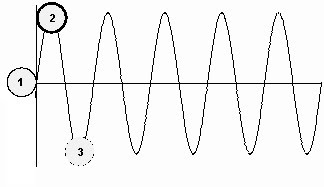

# ZEILER .me - IT & Medien, Geschichte, Deutsch - Versuch einer Beschreibung menschlicher Moral

Wenn man einmal annimmt, dass Tiere instinktgeleitet sind und sich innerhalb der Vorgaben ihrer Instinkte bewegen, dann könnte man dies als Mindestmaß an Verhalten im Sinne der Lebenserhaltung ansehen. Da nur minimale Abweichungen möglich sind, würde ich hier eine Linie ziehen, die als Richtschnur für natürliches Verhalten gilt. (1)

Der Mensch hat sich im Laufe von Jahrtausenden durch die Entwicklung seiner Sprachfertigkeiten, durch sein soziales Verhalten im Überlebenskampf und durch zunehmende Verstandesleitung aus dem instinktgeleiteten Leben heraus entwickelt. Die Instinkte aus der Tierwelt bleiben natürlich (bis heute) bestehen, werden aber zunehmend durch Anforderungen einer sozialen Moral überformt und durch Verstandesleitungen auf verschiedene Weise gebremst. Interessant dabei, dass die Zunahme des Hirnvolumens lange vor dem eigentlichen „Absprung“ aus der Tierwelt hinaus stattgefunden hat. Interessant auch, dass mit dem Sprung aus der instinktgeleiteten Tierwelt (lange nach der Zunahme des Hirnvolumens) religiöse Vorstellungen, religiöse Rituale und künstlerische Betätigungen zugenommen haben.

Damit wäre denkbar, dass religiöse Vorstellungen und künstlerische Betätigungen eine Art „Gerüst“ für die moralischen Denkweisen waren, die den Menschen aus der instinktgeleiteten Welt der Tiere in eine neue Welt geleitet haben. Hier wurde durch Ansammlung von sprachlich festgehaltenem Wissen (zuerst mündlich, dann schriftlich) ein geistiger Überbau entwickelt, der die Entwicklung der Menschen vorantrieb. Prosoziales Verhalten wurde durch Kunst und Religion, später auch durch philosophische Systeme, verstärkt. Die Erziehung des Nachwuchses lief zwar weiterhin zu einem Großteil über Imitation erwachsener Vorbilder, nahm aber zunehmend neue Wissenstoffe auf. Es entstand eine Ahnung davon, dass es etwas geben musste, das über das Vermögen des einzelnen hinausgehen musste und das Tiere ganz offensichtlich nicht im gleichen Maße aufwiesen. Jede neue Erfindung, die tradiert wurde, gab den kommenden Generationen einen Vorteil, den sie auf vorangegangene Generationen zurückführen konnten. Daher die Achtung vor den "Ahnen“. (Aber auch die vor der älteren Generation, von der man das jeweilige Wissen durch Nachahmung und Sprache mitbekommen hatte). Und der Blick auf das „Übernatürliche“ diente als Rahmen für einen „moralischen Kompass“, der Menschen anleitet und nach Verbesserungen streben lässt. Der erstarkende „Homo faber“ war sich meist bewusst, dass es etwas Höheres geben musste, als er es sich als einzelner Mensch vorstellen konnte. Das wäre dann der positive moralische „Überschuss“, den Menschen erreichen können. (2)

Zugleich lebte aber der Dominanztrieb aus der Tierwelt im Menschen weiter – und man war sich immer bewusst, dass „das Böse“ wieder hervorbrechen und alle kulturellen Errungenschaften vernichten konnte. Das zeigten Nachbarschaftsstreits, aber erst recht Kriege und Verwüstungen jeder Generation von Neuem. Das, was wir das „Böse“ nennen, lebt in verschiedenen Formen bis heute weiter. Es wäre in einem Schaubild als Kurve unterhalb der gleichbleibenden Instinkte einzuzeichnen. (3)

Menschen können also als moralisch über der Tierwelt stehend angesehen werden; sie können aber auch – unabhängig von ihrer jeweiligen Intelligenz - unter das Niveau der Tierwelt fallen, indem sie sich rücksichtslos gegen Mitmenschen und die jeweilige Stufe der erreichten prosozialen Moral verhalten. Schon Goethe hat dies in Faust I seinen Mephistopheles sagen lassen: „Er nennt's Vernunft und braucht's allein, / Nur tierischer als jedes Tier zu sein.“

Interessant erscheint mir die Frage, welche psychologischen und sozialpsychologischen Faktoren den Weg in „das Böse“ bewirken – und wie weit ein Ausschlag dorthin bei den verschiedenen Faktoren stattfindet.

Dass Menschen oder Gruppen von Menschen, die z.B. von anderen in räuberischer Absicht überfallen werden, sich wehren, das dient der jeweiligen Gemeinschaft und stellt zugleich eine aktive Kritik am Verhalten der Angreifer dar. Gefühle wie Zorn oder Wut über die Angreifer führen dabei leicht über die prosoziale Moral hinaus, entgrenzen das Verhalten der Verteidiger und lassen auch diese „böse“ werden. Ist die jeweilige Sicherheit wiederhergestellt und auch aus Eigeninteresse die Einsicht erreicht, das Leben müsse wieder seinen normalen Verlauf nehmen, dann pendelt sich das Verhalten prosozialer Menschen wieder in einen friedlichen Gleichgewichtszustand ein, in dem das gegenseitige Vertrauen dominiert.

Eigennützige Anführer innerhalb einer Gruppe können jedoch behaupten, andere Gruppen oder einzelne Menschen wollten Schaden an der Gemeinschaft anrichten – und man müsse präventiv handeln und angreifen. Insbesondere psychopathische Figuren, deren starker Wille mit der Moral der anderen nur spielt, können hier schwache Menschen in die Irre führen und eigennützige Absichten hinter einem fiktiven Gruppennutzen verstecken. Dies wäre ein Einfallstor für „das Böse“. Es gibt aber noch viele andere Einfallstore. So können z.B. auch schwache Figuren, eventuell anfangs nur als Mitläufer, mit der Zeit Spaß am Quälen anderer Menschen bekommen. Und dann sind sie nicht weniger böse als die, welche sie auf die Seite des Bösen gelockt haben. Auch kann ein echtes oder eingebildetes Gefühl von Demütigung zu unzivilisiertem Verhalten führen, was wiederum leicht auf eine abschüssige Bahn führt. Vor allem Psychopathen haben einen Riecher dafür...

Langandauerndes bösartiges Verhalten kann m.E. nicht mit einem Rückfall in das Verhaltensrepertoire von Tieren verglichen werden, auch wenn dies manchmal so aussieht. Tiere sind instinktgeleitet und bewegen sich, werden sie nicht von bösartigen Menschen falsch behandelt, gemäß ihren vorgegebenen Instinkten. Ja es kommt sogar vor, dass sie sich, wenn man genauer hinschaut, sehr menschenähnlich verhalten. Am 1. Januar 2018 lief im ZDF eine Dokumentation mit dem Titel „Spione im Tierreich“. Dort wurde eine Affenhorde gezeigt, die einen künstlichen Affen, dem eine Kamera eingebaut war, im Spiel umwarf, worauf dieser wie tot (oder schwer verletzt) regungslos auf dem Boden liegen blieb. Und daraufhin hat die ganze Affenhorde Mitleid empfunden und durch gegenseitige Umarmungen, Tröstungen usw. Trauer für ein Wesen gezeigt, das nicht einmal zur eigenen Horde gehörte! Es war rührend. Es gibt, wie nicht nur die Geschichte zeigt, nicht wenige Menschen, die dieses Verhalten „moralisch“ (menschlich?) locker unterbieten. Man denke nur an die Gestalten, die an einem Unfall vorbeifahren, die Verletzten filmen und die Helfer bei ihrer Arbeit stören.

Auch wenn es schwerfällt, es wäre dennoch falsch, bösartige Menschen nicht wie Menschen anzusehen oder sie nicht als solche zu behandeln. Denn nur das, das Aushalten der dahinterliegenden Paradoxie, hilft dabei, die Zivilisation zu erhalten.