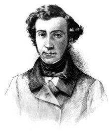

# ZEILER .me - IT & Medien, Geschichte, Deutsch - Alexis de Tocqueville über die plötzliche Grausamkeit in einer unglücklichen Zeit

Alexis de Tocqueville (1805-1859) ist vor allem mit seinem Buch „Über die Demokratie in Amerika“ (1835/1840) bekannt geworden. In seinen „Erinnerungen“ hinterlässt er aber auch ein lebensnahes historisches Dokument über die Geschehnisse der 1848er Revolution und der niedergeschlagenen Juniaufstände der Arbeiter von 1848. So schildert er, was für Auswirkungen die Bürgerkriegsatmosphäre auf seine Nachbarn, die bei der Nationalgarde Dienst taten, und auf ihn selbst hatte:

„Als ich mit ihnen sprach, bemerkte ich, mit welch erschreckender Schnelligkeit selbst in einem zivilisierten Jahrhundert wie dem unseren die friedfertigsten Seelen sich sozusagen auf Bürgerkriege einstimmen und wie sich der Geschmack an der Gewalt und die Verachtung des Menschenlebens plötzlich in dieser unglücklichen Zeit dort ausbreiten. Die Menschen, mit denen ich mich unterhielt, waren gut gestellte und friedfertige Handwerker, deren sanfte und ein wenig weiche Gewohnheiten noch weiter von der Grausamkeit als vom Heroismus entfernt waren. Trotzdem dachten sie nur noch an Zerstörung und Massaker. Sie klagten darüber, dass man nicht mit Bomben, Minen und Gräben gegen die aufständischen Straßen vorging, und wollten gegenüber niemandem mehr Gnade walten lassen. \[…\] als ich meinen Weg fortsetzte, kam ich nicht umhin, über mich selbst nachzudenken und über die Natur meiner Argumente zu staunen, mit der ich mich selbst unversehens binnen zweier Tage mit diesen Ideen erbarmungsloser Vernichtung und großer Härte vertraut gemacht hatte, die mir natürlicherweise so fern liegen.“ Was Tocqueville hier selbstkritisch und reflektiert beschreibt, das wiederholt sich immer wieder in gesellschaftlichen Umbruchszeiten – und es scheint nicht vom jeweiligen Bildungsstand abzuhängen, wie sehr sich jemand von gewalthaltigen Ereignissen mitreißen lässt. Die Decke der Zivilisation ist viel dünner, als man sich das in Friedenszeiten vorstellen mag. Schlimmer als ein plötzlicher Ausbruch von Gewalt, der danach reflektiert wird, ist aber die allmähliche Gewöhnung an verdeckte Gewalt, wie sie sich heute abzuzeichnen scheint.