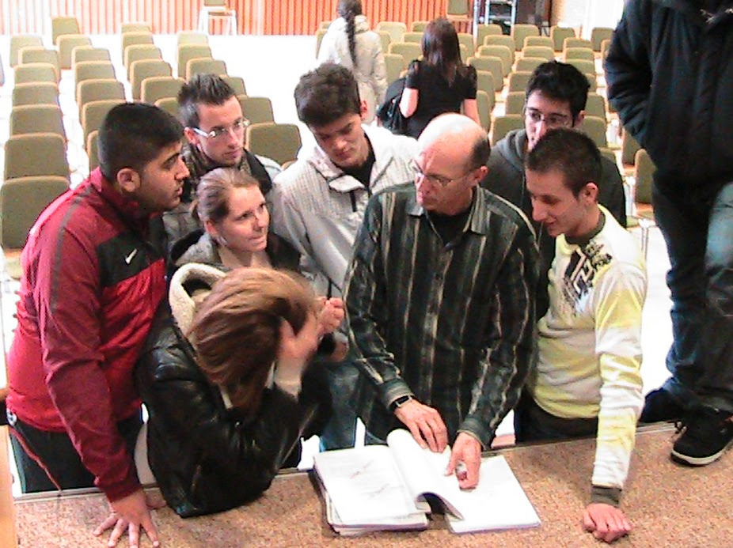

# ZEILER .me - IT & Medien, Geschichte, Deutsch - Berichte aus einer deutschen Diktatur

**„Die haben sogar promoviert auf Methoden, wie man Leute weichbekommt.“**

*Berichte aus einer deutschen Diktatur. Zwei ehemalige politische Gefangene liefern einen Rückblick auf die DDR.*

Seit 1989, seit dem Sturz des kommunistischen Systems in Ostdeutschland, ist bei uns eine neue Generation herangewachsen, die die DDR nur noch vom Hörensagen kennt. Um der zunehmenden Unwissenheit über die zweite deutsche Diktatur entgegenzuwirken, hat der Berliner Senator für Bildung, Wissenschaft und Forschung in der Gedenkstätte Berlin-Hohenschönhausen eine Pädagogische Arbeitsstelle eingerichtet. Von der Gedenkstätte aus wurde die „Zeitzeugenbörse“, ein Netzwerk an ehemaligen politischen Gefangenen aufgebaut. Hier engagieren sich Menschen, die hochmotiviert sind, über die ehemalige DDR zu berichten.

Am Donnerstag, den 31.3. 2011, stellten sich zwei Zeitzeugen, ehemalige politische Gefangene, die 1981 und 1982 von der Bundesrepublik Deutschland für jeweils ca. 90 000.- DM freigekauft worden waren, in der Aula der Johann-Philipp-Bronner Schule den Fragen mehrerer Schulklassen. Sie berichteten über ihre Erfahrungen aus der kommunistischen Diktatur, aus einem Staat, der sich offensichtlich nur zum Schein als Rechtsstaat ausgegeben hat.

**Werner Konik** (geb. 1955 in Pollitz) arbeitete als EDV-Facharbeiter in einem Rechenzentrum. Er war Musiker in einer populären Rockband und sah sich selbst als Freigeist. Ein Studium wurde ihm mehrfach verwehrt. Bei einer Reise in die Tschechoslowakei wurde er im April 1979 festgenommen. Wegen "Republikflucht" zu zwei Jahren verurteilt, wurde er durch eine Amnestie im November 1979 in die DDR entlassen, wo er unter anschließendem Berufsverbot und einem erzwungenen Umzug litt. Im Oktober 1981 gelangte er im Rahmen des Häftlingsfreikaufs in die Bundesrepublik. Lange Jahre, von 1985 bis zu seiner Pensionierung, arbeitete er als hoch qualifizierter Mitarbeiter bei der Firma SAP.

**Horst Savelsberg** (geb. 1945 in Jeetze) wurde erstmalig im April 1966 wegen "Wehrdienstverweigerung" und "Republikflucht" zu zwei Jahren Haft verurteilt. Nach vorzeitiger Haftentlassung absolvierte er ein Fernstudium zum Ingenieur und war als Betriebsleiter tätig. Nach einem Ausreiseantrag erhielt er Berufsverbot und wurde arbeitslos. Im Januar 1978 wurde er erneut verhaftet und wegen "staatsfeindlicher Hetze" zu fünf Jahren und sechs Monaten verurteilt. Nach seiner Entlassung im Dezember 1979 infolge eines Amnestiebeschlusses wurde er innerhalb der DDR verbannt und litt unter beruflicher Degradierung. Seine dritte Verhaftung erfolgte im Februar 1981 nach einem erneut gestellten Ausreiseantrag. Verurteilt zu weiteren fünf Jahren wegen "staatsfeindlicher Hetze" und "Nachrichtenübermittlung", gelangte er im Rahmen des Häftlingsfreikaufs im September 1982 in die Bundesrepublik.

Die Erfahrungen ehemaliger Häftlinge ermöglichen eine Beschäftigung mit der jüngsten deutschen Geschichte, die oftmals mehr bewirkt als viele Unterrichtsstunden. Das hat sich auch in der Aula der Johann-Friedrich-Bronner Schule bewahrheitet. Nach den Vorträgen, die durch Fragen unterbrochen werden konnten, blieben viele Schüler noch für eine Nachbesprechung bei den Referenten – und wären gerne noch länger geblieben... So viel Interesse würde sich jeder Geschichtslehrer auch wünschen.

