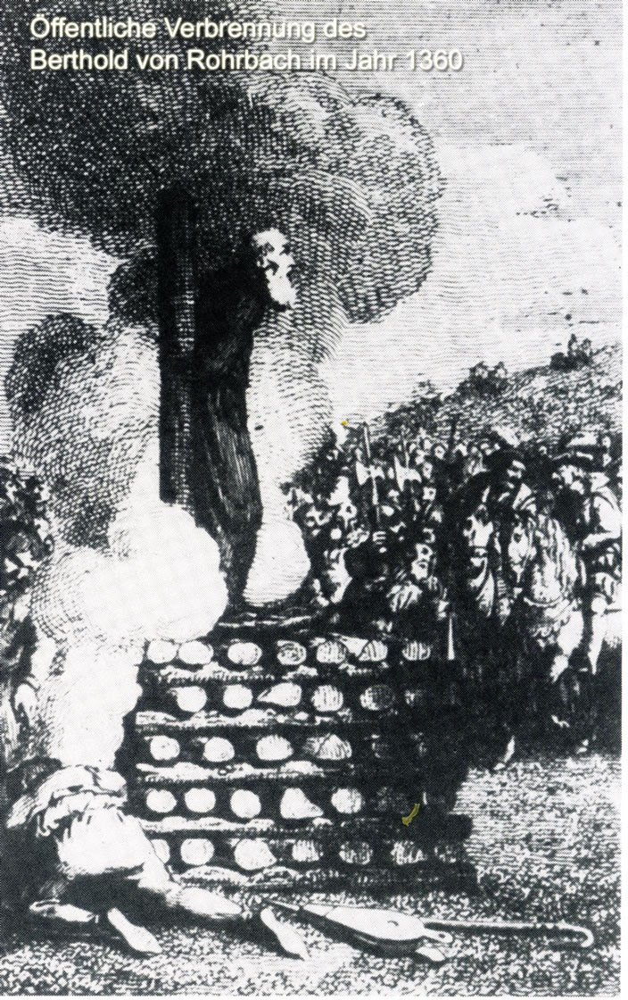

# ZEILER .me - IT & Medien, Geschichte, Deutsch - Berthold von Rohrbach

Grausam und schrecklich war das Ende eines Rohrbachers, der sich mit der kirchlichen Justiz angelegt hatte.

Bruder Berthold von Rohr­bach war Mitglied ei­ner der im 13.-15. Jahrhundert immer wieder auflebenden Sektierergruppen, die in ihren Glaubensansichten von der kirchlichen Lehre abwichen und freieren religiösen Anschauungen huldigten. Da sie nun andere Gläubige von ihren Ideen zu überzeu­gen versuchten, ging die Kirche durch die „Inquisition", eine Art kirchliche Justizbe­hörde, mit aller Härte gegen die Ketzer vor. Berthold, Angehöriger der Gemeinschaft der „Gottesfreunde", zog in den Landen umher und predigte seine Lehre, bis man ihn in Würzburg festnahm und vor das Inquisi­tionsgericht stellte, das ihn verwarnte. Als er aber dennoch weiterpredigte, wurde er er­neut verhaftet und zur höchsten Strafe verur­teilt. Im Jahre 1360 wurde das Urteil voll­streckt und Berthold bei lebendigem Leibe in Speyer verbrannt.

