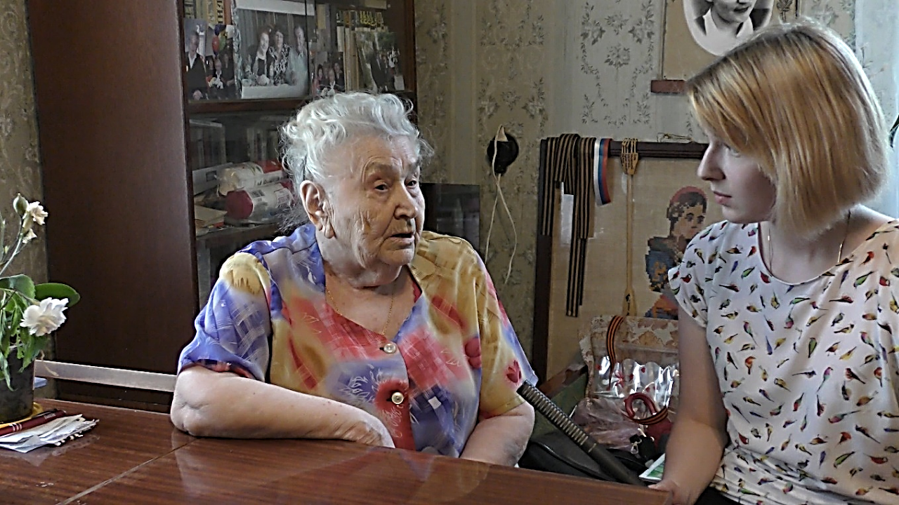

# ZEILER .me - IT & Medien, Geschichte, Deutsch - Besuch in Simferopol 2018

**Mein Besuch unserer Partnerstadt Simferopol**

Am 22. Mai 2018 bin ich mit Aeroflot über Moskau auf die Krim geflogen. Am nagelneuen Flughafen von Simferopol wurde ich von Mitarbeitern des dortigen Heidelberg-Zentrums empfangen und mit dem Taxi zu einer privaten Unterkunft gebracht: 25.-€ pro Nacht, inklusive Frühstück. Da kann man nicht meckern.

Allen Unkenrufen und Warnungen zum Trotz bin ich dorthin gereist, ein wenig skeptisch war ich natürlich auch – aber ich kann sagen, die Reise hat sich gelohnt. Genügend Einwände hatte es gegeben. Das Außenministerium habe gewarnt. Man unterstütze mit dem Besuch eine falsche Politik, konterkariere eine Politik, die Russland eine Lektion in Demokratie und Völkerrechte erteilen will. Schließlich habe ja Russland sich die Halbinsel Krim unrechtmäßig unter den Nagel gerissen. Aber sollte man wegen solcher Konflikte aus der großen Politik, auf die man keinen Einfluss hat und die man nur aus dem Blickwinkel westlicher Medien kennt, auch alle menschlichen Begegnungen stoppen?

Über den Freundeskreis Heidelberg-Simferopol hatte ich erfahren, dass es in Simferopol noch überlebende Zwangsarbeiterinnen aus der Zeit des Dritten Reiches gibt, die gerne ihre Geschichte erzählen würden. Da alle zwar noch geistig fit, aber um die 90 Jahre alt sind, sollte ich mich beeilen, wenn ich eine kleine Filmdokumentation zu dem Thema erstellen wollte. Ich hatte zuvor schon mehrere historische Filmdokumentationen mit Zeitzeugen erstellt, also warum nicht?

Zunächst besuchte ich Lidia Chodirewa, eine sehr sympathische Frau, die in einem kleinen unscheinbaren Häuschen wohnt, das man über einen langgezogenen Hinterhof erreicht. Da mein Russisch noch sehr zu wünschen übrig lässt, wurde mir vom Heidelberg-Zentrum unserer Partnerstadt eine Studentin, Alyona, zur Seite gestellt, die gut Deutsch sprach.

Lidia ist gerade 80 Jahre alt geworden. Sie ist in Weißrussland geboren und wurde als Kind zusammen mit ihrer Mutter von den Nazis in verschiedene Lager verschleppt, bis beide schließlich im Gefängnis der Stadt Görlitz landeten. Dort wurde die Mutter misshandelt und dann in ein Vernichtungslager gebracht. Das aber hatte Lidia trotz intensiver Suche erst 60 Jahre später mit der Hilfe einer deutschen Frau namens Ruth Pilz herausgefunden. Der Ort, in dem ihre Mutter 1945, kurz vor Kriegsende starb, wurde makabrer Weise „Schonungslager Mittwerda“ genannt. Es war ein von der SS gewählter Deckname für ein Lager in der „Todeszone Uckermark“. Die Vergasungen fanden wohl im Konzentrationslager Ravensbrück statt. Ihren jüngeren Bruder, der ebenfalls verschleppt worden war, hat Lidia bis heute nicht gefunden.

Lidia fällt es nicht leicht, darüber zu berichten, aber sie möchte es dennoch, um das Schicksal ihrer Mutter nicht in Vergessenheit geraten zu lassen.

Unser nächster Besuch galt der 92-jährigen Xenia. Ihr Schicksal ist bereits in dem Buch „Verschleppt und vergessen“ des Freundeskreis Heidelberg-Simferopol e.V. (Hrsg.: Susanne Kraatz) gut beschrieben, aus dem ich hier zitiere:

„Xenia wurde 1927 in Simferopol geboren. \[…\] Während des Krieges versteckte die Familie einen jüdischen Jungen, der dadurch überlebte. Im August 1942 wurde Xenia mit 15 Jahren nach Deutschland verschleppt, weil sie ein Plakat der deutschen Besatzer zur Anwerbung von Ostarbeitern abgerissen hatte. Sie hatte kurz bei einem Bauern in der Nähe von Hannover gearbeitet, bevor sie auf einem anderen Bauernhof in der Nähe von Göttingen eingesetzt wurde \[…\]. Nach ihrer Rückkehr wurde sie Buchhalterin.“ (S. 131)

Xenia hatte, anders als einige andere Zwangsarbeiterinnen, keine Schwierigkeiten nach ihrer Rückkehr auf die Krim. Xenia ist stolz, auch im hohen Alter von 92 Jahren noch die deutsche Sprache zu verstehen. Nur bei ihren Antworten muss sie einige Male auf die Hilfe unserer Dolmetscherin zurückgreifen, wenn sie nach einem Wort suchte. Wohl dem, der mit 92 Jahren noch so klar im Kopf ist wie Xenia!

*\[Im Bild von links nach rechts: Violetta Tischina, Leiterin des Heidelberg-Zentrums, Valentina Medwedewa, ihre Stellvertreterin, Xenia Garasjuta, rechts daneben Alyona Mirgorodskaya\]*

Unser letzter Besuch einer „Ostarbeiterin“ galt der 1926 in Simferopol geborenen Ljubov. Sie war 15 Jahre alt, als der Krieg begann. Es war grausam für sie, mit ansehen zu müssen, wie Juden an ihrem Haus vorbei in die Landstraße nach Feodosia zum Erschießen gebracht wurden. Und im Park der Kultur musste sie dann die z.B. wegen Diebstahls öffentlich Erhängten sehen!

Ljubov wurde von einheimischen Polizisten auf die „Liste nach Deutschland“ gesetzt, weil sie sich allzu vehement für russische Jugendliche eingesetzt hatte, die von Polizisten geschlagen wurden. So lebhaft, wie sie auch heute im hohen Alter noch erzählt, kann man sich ihr damaliges Temperament gut vorstellen.

Über eine Stunde hat uns Ljubov von ihrer Arbeit in einem Krankenhaus, ihrem heimlichen Besuch von russischen und anderen Zwangsarbeitern in einem entfernten Lager erzählt, mit denen sie sich unterhalten und sogar getanzt hatte. Im Februar 1944 wurde die Baracke der Ostarbeiter von Bomben getroffen und Ljubov wurde einem Bauern in Bayern zugewiesen, wo sie gut behandelt wurde. Doch dann bekam sie wegen fehlender Papiere Ärger mit dem Bürgermeister des Örtchens und wurde für einige Zeit in ein Konzentrationslager bei München geschickt. Als im Februar 1945 dort ebenfalls die Baracken durch Bombeneinschlag abbrannten, kam sie zurück zu ihrer Bauersfamilie. Nach der Niederlage der Nazis wurde sie in die russische Besatzungszone gebracht – und konnte nach einigen Überprüfungen zurück in die Heimat, nach Simferopol, fahren. Dort wurde sie allerdings zum KGB gerufen und nochmals überprüft. Bei der Arbeitssuche hat man ihr wegen der Arbeit in Deutschland oft Steine in den Weg gelegt. Sie musste ja schließlich angeben, beim Feind, in Nazideutschland gearbeitet zu haben. Erst sehr spät wurde sie rehabilitiert.

1959 ging sie nach der Arbeit regelmäßig zur Abendschule und absolvierte die Handelsfachschule, was ihr ermöglichte, 18 Jahre lang bis zur Rente in einem Kurzwarngeschäft zu arbeiten.

Ljubov erzählte so lebhaft, anschaulich, aber auch ausführlich von ihrer Vergangenheit, dass wir Mühe hatten, unsere Zwischenfragen zu stellen. Einerseits wunderbar, da man so viel vom Leben in der damaligen Zeit erfährt. Andererseits wird es schwierig, unseren geplanten Dokumentarfilm auf ca. 30 Minuten zu begrenzen.

Bei all den Interviews fällt mir auf, dass die Zugehörigkeit zu Russland nirgends als Zwang empfunden wird. Und das nicht nur bei den Rentnern, deren Renten auf russisches Niveau angehoben wurden. Auch andere Gespräche bestätigten den Eindruck: Keine versteckten „grünen Männer“, die Druck ausüben, keine ängstlichen Heimlichkeiten, wie man sie früher in der DDR gespürt hatte. Keinerlei Andeutungen von einem willkürlichen Polizeistaat. Niemand, den ich getroffen habe, auch nicht die zufälligen Gesprächspartner in Cafés oder auf der Straße, fühlte sich gegängelt oder hatte die Abstimmung über die politische Zugehörigkeit als Zwang gesehen. Im Gegenteil: Man war froh, dass die Abstimmung nicht von ukrainischer Seite verhindert werden konnte. Allenfalls waren Stimmen zu hören, die sagten: Die Krim ist ganz einfach die Krim, sie ist seit jeher weder ganz Russland, noch ganz Ukraine gewesen. Und sie bleibt auch jetzt ganz einfach die Krim. Sie hatte schon immer nach Unabhängigkeit gestrebt – und die größere Unabhängig biete ihnen eher Russland. Vielleicht sind meine Eindrücke nicht repräsentativ, aber sie decken sich mit denen anderer Reisender, denen ich begegnet bin. Der Zwang, der jetzt ausgeübt werde, liege eher darin, dass sich alle eher an Recht und Gesetz halten müssen und es weniger Korruption gebe.

Am Ende der Reise habe ich auf Anraten des Oberbürgermeisters Viktor Ageev, der die Mitglieder des „Freundeskreises Heidelberg Simferopol“ im Rahmen des 234. Jubiläums der Stadt Simferopol im Rathaus empfangen hatte, noch das „Memorial“ am Rande der Stadt Simferopol besucht.

Dort wird das Schicksal der Opfer der Kriegszeit sehr anschaulich dokumentiert – und man kann einen 15-minütigen Film sehen, der einen Einblick in die damalige Zeit gibt und einen hoffen lässt, dass sich solche Grausamkeiten, wie sie damals stattfanden, niemals wiederholen mögen.

*Detlef Zeiler, Heidelberg.*

