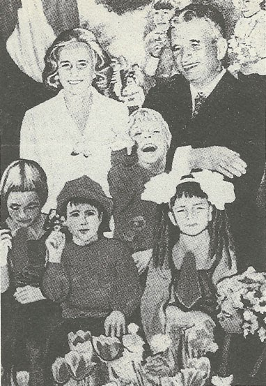
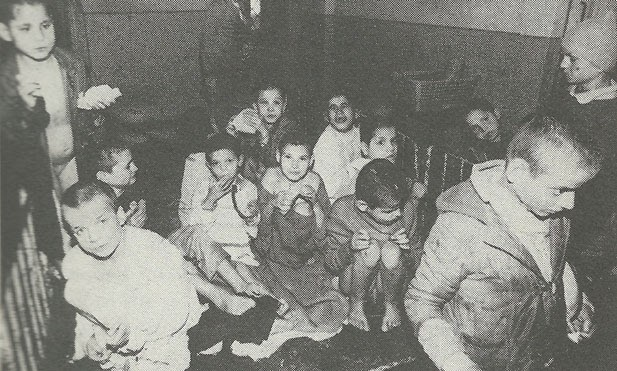

# ZEILER .me - IT & Medien, Geschichte, Deutsch - Idylle und Realität unter Ceaucescu

Grausame Menschen zeigen oft eines Vorliebe für die Inszenierung einer heilen Welt, einer Idylle. Beinahe alle klassischen Diktatoren betrieben einen großen Aufwand dabei, sich als tierlieb oder kinderlieb zu zeigen. Insbesondere Ceaucescu hatte ein Faible für entsprechende Inszenierungen:

***Links die Idylle - rechts ein Teil der brutalen Realität.*** Isolierstation im Kinderheim Cighid

[Zurück](http://www.google.com/url?q=http%3A%2F%2Fwww.zeiler.me%2Fdetlef%2Fgeschichte%2Fceausescu&sa=D&sntz=1&usg=AOvVaw2T1nazTt_xManKoSDoaLeJ)

