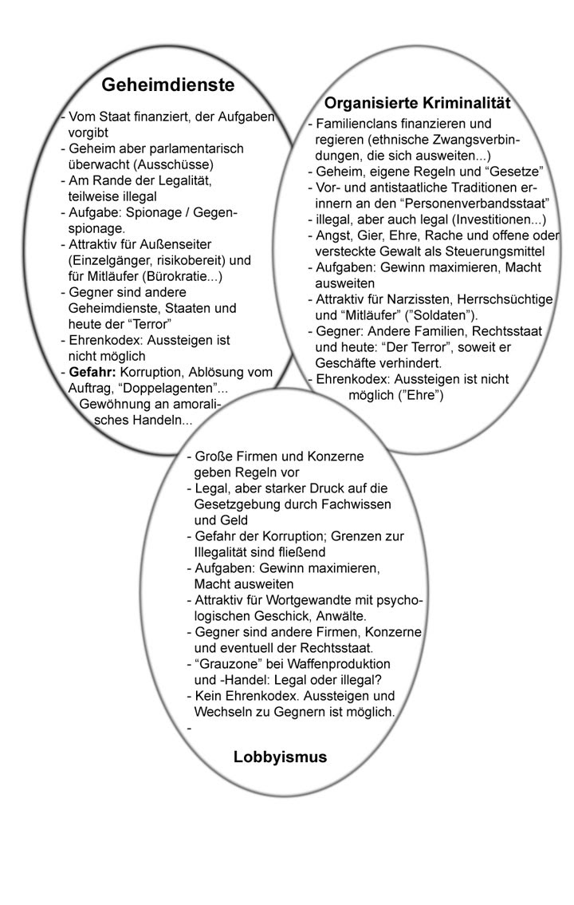
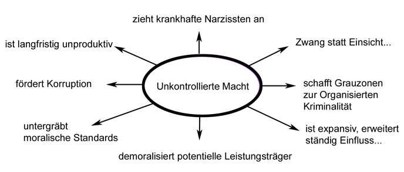

# ZEILER .me - IT & Medien, Geschichte, Deutsch - Faschismus im 21. Jahrhundert?

### 

Der Essay wurde von mir gelöscht. Einige Aussagen sind durch die aktuellen Entwicklungen überholt. Und das Thema ist mir heutzutage, in den politisch "korrekten" Zeiten, etwas zu heikel. Je weniger Meinungsäußerungen bei uns noch wirklich frei sind, desto mehr wird die "Freiheit" wie ein letztes Statussymbol westlicher Gesellschaften immer wieder betont (- was ja in wirklich freien Gesellschaften gar nicht notwendig wäre).

**Nachtrag:**

Welche Überschneidungen gibt es, wenn man die Aufgaben und die inneren Zusammenhänge von Geheimdiensten, Organisierter Kriminalität („Mafia“) und Lobbyismus vergleicht?

Ein Vorschlag:

Unkontrollierte Macht:

Macht muss normalerweise mit Verantwortung verbunden sein. Dafür haben Menschen sich kontrollierbare Institutionen geschaffen und Regeln, an die sich alle halten sollten. Nicht erst die Demokratie sollte hier Sicherheit geben, schon der davor exisierende "Rechtsstaat" entlastete die Gesellschaft von destruktiven Ehrsüchteleien und gegenseitigen Racheaktionen. Heute gibt es Cyberwaffen, "Drohnen", biochemische Waffen, Techniken, durch Wände zu sehen und unliebsame Personen in ihren Wohnungen zu terrorisieren - viele Entwicklungen, die ältere Menschen nicht mehr verstehen und brave Bürger nicht für möglich halten. All dies erfordert eine erhöhte Wachsamkeit gegenüber Machtmissbrauch, eine Wachsamkeit, für die in der hektischen Betriebsamkeit des Alltags oft keine Zeit bleibt. Verantwortung wird bisweilen schrittweise verlassen – und beim ersten Schritt übersieht man oft den Weg noch nicht, vor allem im jüngeren Alter. Aber gerade wir Deutschen müssten wissen: „Das erste steht uns frei, beim zweiten sind wird Knechte.“ (Goethe) Wer sich auf "das Böse" zu sehr einlässt, der muss den Weg in den Abgrund, den er nicht gewollt hat, am Ende mitgehen. Und vielleicht hat man früher mit Sprichwörtern das Verhalten der Menschen besser im zivilen Bereich halten können, als heute mit den Daten aus dem Internet, denn: „Wer sich an eine falsche Vorstellung gewöhnt, dem wird jeder Irrthum willkommen sein.“ (Goethe)