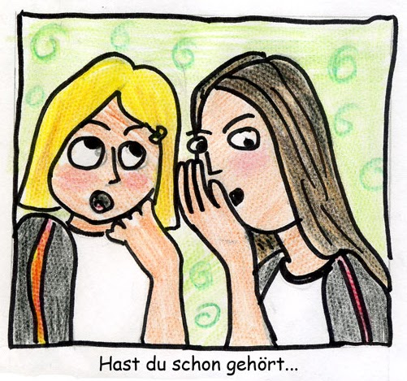

# ZEILER .me - IT & Medien, Geschichte, Deutsch - Gerüchte

***"Aus Lügen, die wir ständig wiederholen, werden Wahrheiten, die unser tägliches Leben bestimmen." (Georg Wilhelm Friedrich Hegel, 1770-1831, deutscher Philosoph)***

Gerüchte sind "alternative Fakten", die sich entweder ständig aktualisieren oder rasch zerfallen und von der Bildfläche verschwinden. Sie können harmlos, aber auch gefährlich sein. Ihre Spannung erhalten sie durch die eine Frage, die sie zwangsläufig aufwerfen: Wahrheit oder zweckgerichtete Lüge? Gerüchte waren im Dritten Reich mit Sicherheit ein wichtiges Mittel für das Verhetzen von Menschen, also gefährlich. Gerüchte spielen heute immer noch eine große Rolle. Das gilt in Dörfern, das gilt in Städten, das gilt für Nachbarschaften und das gilt auch für das große Geld, die Börse und die Welt der Spekulanten, das gilt bei Mobbing, bei Stalking usw. Die aggressiv vorgetragene These von der "Lügenpresse", also die Behauptung, die offizielle Presse oder alle offiziellen Medien verbreiteten nur Lügen, erweitert heute den Wirkungsgrad von Gerüchten.

Die bis heute beste Darstellung von Entstehung, Ausbreitung und Wirkung von Gerüchten findet sich in dem im Jahr 2000 auf Deutsch erschienenen Buch von Jean-Noel Kapferer »Gerüchte, das älteste Massenmedium der Welt«. Das Buch ist nur noch gebraucht bei Amazon zu bestellen, hätte aber eine Neuauflage verdient. Michael Scheeles Werk »Das jüngste Gerücht« (Heidelberg, 2006) verengt m.E. die Problematik zu sehr durch den Bezug auf persönliche Erlebnisse. In bildlicher Darstellung kennt man dazu sicher noch die Lithographien von Andreas Paul Weber, der von 1893 bis 1980 gelebt hat. Die bekanntesten Werke zu unserem Thema sind [»Das Gerücht« (1943) und »Der Denunziant« (1934).](http://www.google.com/url?q=http%3A%2F%2Fwww.weber-museum.de%2Fwerk%2Fgeskrt%2F&sa=D&sntz=1&usg=AOvVaw339Ucua1T1PMiNiEEKwE4D) An diesen beiden Lithographien lässt sich gut die Veränderung der Gerüchte und des Denunziantentums bis heute aufzeigen. Das vieläugige Gerücht mit der langen, spitzen Nase und den übergroßen Ohren würde sich mittlerweile auf Zielgruppen spezialisieren, die in unserer fragmentierten Öffentlichkeit in verschiedenartigen Formen emotionaler Kommunikation verankert sind, denn Gerüchte wirken nur in einem jeweils dafür bereiten Publikum, neudeutsch: einer Zielgruppe. Auch die Werbung geht heute zielgruppengerecht vor. So gibt es heute einen immer größeren Vermarktungsbereich, der sich Ethno-Marketing nennt. Man wählt also Personen und Hintergründe bei der Vermarktung von Waren entsprechend der jeweiligen Zielgruppe aus. Ähnlich muss man auch bei Gerüchten kalkulieren. Webers Bild für Gerüchte passt da nicht mehr. Und der »Denunziant« muss nicht mehr vor einer Türe lauschen und mitschreiben, sondern kann technische Mittel der Überwachung nutzen: »Wanzen«, Minikameras, GPS, Handyüberwachung etc. Man müsste vielleicht jemanden zeigen, der vor mehreren Bildschirmen sitzt, was aber in der Wirkung nicht annähernd an die der Lithographie Webers he­rankäme. Denunzianten sind übrigens keine "Spione", denn sie riskieren so gut wie nichts, was man bei einem Spion nicht sagen kann. Denunzianten sind meistens feige, haben einen Hang zur Hinterhältigkeit.

Das Verbreiten von Gerüchten kann man auf der Basis der gegenwärtigen Forschungen auch wissenschaftlich unterstützen. Wie eine Gruppe von Werbepsychologen und Marketingexperten, die ein neues Produkt auf den Markt drücken, könnte eine Gerüchte-Expertengruppe heute mit neuester Technik arbeiten. Man kann E-Mails abfangen, Menschen abhören, Stimmen verfälschen oder auch ganz einfach den Blödsinn, den jeder ab und zu in seiner Privatsphäre oder am Telefon redet, abhören und dann mit dem »passenden« Hintergrund an die Menschen weiterleiten, die leicht zum Mobben oder Stalken zu verführen sind. Der Begriff der »Ehre« könnte hier eine Rolle spielen, denn er schafft leicht Emotionen, die zu übergriffigen Handlungen führen. Verstärkt wird die Gerüchtewirkung, wenn Gerüchte mit religiösen Motiven verbunden werden - und auf Gesellschaften treffen, die intern zunehmend fragmentiert sind.

So war die Wählerbeeinflussung im US-Wahlkampf "auch deshalb so schwer zu durchschauen, weil es im Zeitalter der Algorithmen keine einheitliche Öffentlichkeit mehr gibt; jeder von uns sieht heute sein eigenes Internet. Diesen Umstand machte sich Trumps Wahlkampfteam 2016 zunutze, indem es gezielt sogenannte *dark posts* auf Facebook einstellte - Beiträge also, die nur für einen ausgewählten Personenkreis einsehbar waren, in diesem Fall schwarze potentielle Clinton-Wähler im umkämpften Pennsylvania. Ziel der Kampagne war es nicht, Stimmen für Trump zu werden. Es ging darum, die Menschen vom Gang ins Wahllokal abzuhalten.

Agenten einer russischen Propagandaagentur haben im US-Wahlkampf demonstriert, dass man selbst mit minimalem Aufwand Menschen am anderen Ende der Welt real aufeinanderhetzen kann. Mitarbeiter der Internet Research Agency gründeten dafür zwei Facebook-Gruppen. Die erste hieß Heart of Texas und wandte sich gegen die angebliche Islamisierung des Bundesstaats. Die zweite nannte sich United Muslims of America und machte sich für die Bewahrung islamischen Kulturguts stark. Beide Facebook-Gruppen luden zu Kundgebungen in Houston ein und bewarben diese mit Anzeigen im Wert von gerade einmal 200 Dollar. Tatsächlich standen sich ein paar Tage vor der Präsidentschaftswahl zwei Gruppen von Texanern wütend gegenüber und beschimpften sich gegenseitig - beide ferngesteuert von ein paar Hackern aus Russland.

'Mikrotargeting' nennt sich das gezielte Ansprechen winziger Zielgruppen." (Aus: DIE ZEIT, 8.2.2018, S. 35/35)

Abgesehen davon, dass der Verweis auf russische Hacker auch falsch sein kann, denn wann immer etwas Böses im Internet passiert, erscheint sofort der spontane Hinweis auf Russland, also abgesehen von dieser gewohnheitsmäßigen Unterstellung scheint doch Folgendes klar: 1.: Es ist heute extrem leicht geworden, Menschen aufeinander zu hetzen - und 2.: Der Spaßfaktor für die Manipulatoren dürfte enorm groß sein. Oft reichen bereits kleinste Gerüchte, um Menschen gegeneinander aufzustacheln und dann genüsslich zuzuschauen, welche Macht man mit so wenig Aufwand bekommt.

Die ganz großen Gerüchte sind den meisten heutzutage ein Begriff: Man denke nur an die Angriffe auf das World-Trade Center 2001, an die Mondlandungen der Amerikaner, an die Ermordung der Kennedys usw. Im Allgemeinen oder offiziell werden sie eher negativ bewertet, obwohl natürlich jeder Skeptiker zugleich auch seinen ideellen Gegenanwalt im Kopf hat, der sich hinter solchen Sprüchen versteckt: "Wo Rauch ist, muss es auch ein Feuer geben (oder gegeben haben)". Und tatsächlich sind manche Gerüchte ja auch Hinweise darauf, dass versucht wird, eine Wahrheit zu verstecken. Sonst wären die Hinweise von Edward Snowden nicht von so vielen begierig aufgenommen worden, auch wenn sie seine Veröffentlichungen nicht selbst gelesen haben. Hier scheint die Glaubwürdigkeit der Aussagen durch den Mut und die charakterliche Stärke der Vermittler gewährleistet. Und Geheimdienste werden schon immer als dubiose Anstalten betrachtet.

Natürlich nicht von allen. Und damit kommen wir wieder auf die Zielgruppen mit ihren jeweilig passenden Sündenböcken, auf die schon Jean-Noel Kapferer mit zahlreichen Beispielen in seinem Buch "Gerüchte" (1997/2000) verwiesen hat: "Jede Gemeinschaft, jede soziale Gruppe hat ihre bevorzugten, beinahe institutionalisierten Sündenböcke. Daher lässt sich voraussehen, welchen Markt ein Gerücht hat, wenn man prüft, wen sie als Sündenbock anbietet, und wenn man sich fragt: Für wen ist er traditionsgemäß ein Sündenbock? So verbreiteten sich antisemitische Gerüchte während des Zweiten Weltkrieges stärker an der Ostküste der Vereinigten Staaten (in einer weißen und christlichen Umwelt); die Gerüchte, die die Schwarzen der schlimmsten Übeltaten bezichtigten, kursierten im Süden; die Gerüchte, die die Regierung und Präsident Roosevelt als Sündenböcke bezeichneten, entwickelten sich besonders im Mittelwesten (in der Kornkammer der Vereinigten Staaten)." (S. 114)

In den 80er Jahren des letzten Jahrhunderts kursierten in Frankreich Gerüchte über Verführungen und Mädchenhandel, die ihren Ausgangspunkt in Boutiquen hatten. Verursacher waren hier meist junge Schülerinnen, die ihre sexuellen Phantasien gegenseitig im Weitererzählen von Geschichten hochschaukelten oder ältere, nicht mehr so hübsche Frauen, die sich noch als begehrlich bzw. als begehrenswert darstellen wollten. "Die jüngsten und hübschesten Mädchen waren eher geneigt, sich über das Gerücht zu amüsieren, und sie erzählten es weiter, weil es erregend wirkte, was auf den Reiz des Verbotenen und auch auf Narzissmus zurückzuführen war." (S. 112) - "In Frankreich ist es normal, dass die von den Gerüchten über Mädchenhandel angegriffenen Modeboutiquen als Sündenbock ausgewählt wurden. Zunächst einmal sind diese Orte stark erotisiert: Man entkleidet sich dort, um zu gefallen und zu verführen. \[…\] Solche Geschäfte haben aber auch eine soziale Funktion: Sie bewirken Veränderung. Sie sind eine institutionelle Stütze des Sittenwandels: Sie führen neue Moden ein, die im Wesentlichen für Jugendliche bestimmt sind, und ermöglichen ihnen damit, sich eine neue Identität zu schaffen, die mit der ihnen von den Eltern auferlegten Identität bricht." (S.115/116)

Dass Frauen früher eher als Gerüchteverstärker galten ("Tratschtanten", "Waschweiber" etc.) hat mit der Geschichte der Frauenrollen zu tun. Das französische Wort "commérage" (Weibergeschwätz, heute nur noch "Tratsch") hat seinen etymologischen Ursprung im lateinischen commater, was Patin heißt. Im Englischen hat "gossip" den gleichen Ursprung in "god-sib", was ebenfalls "Patin" heißt. Tatsächlich war Klatsch unter Frauen ein sichtbares Zeichen ihrer gegenseitigen Solidarität, solange sie von dem Recht auf die Übernahme offizieller Rollen in der Öffentlichkeit ausgeschlossen waren, weil diese nur den Männern zugewiesen waren: Familienvorstand, Politik in der Stadt und im Land. "Mit dem Klatsch holten sie sich dieses Recht zurück, das ihnen die Männer verweigert hatten, wobei sie nicht nur die städtischen Angelegenheiten, sondern auch deren verborgene Aspekte besprachen. Da ihnen der Zugang zum öffentlichen Leben versperrt war, brachten sie das Privatleben an die Öffentlichkeit." (S. 122)

Gerüchte wirken sich leicht in Gruppen aus, die benachteiligt sind oder sich benachteiligt vorkommen und nicht direkt Gegenwehr leisten können. Gerüchte schweißen dann solche Gruppen zusammen, geben ihnen eine Art Identität, die man immer wieder neu bestätigt – ja sogar bestätigen muss. "Wenn zwei Gesprächspartner gemeinsam einen Dritten beurteilen, erkennen sie indirekt an, dass sie ähnliche Ansichten haben, und damit festigen sie ihre Verbindung auf Kosten jenes Dritten. Im Grunde bietet das Gerücht ein Sprungbrett für die Herstellung engerer gesellschaftlicher Beziehungen und die Vertiefung der freundschaftlichen, nachbarschaftlichen und verwandtschaftlichen Verbindungen." (S. 74) Was im Kleinen gilt, gilt auch im Großen.

"Je fester eine Gruppe zusammenhält, je besser ihre Struktur und die Verbindung durch ein wirksames Austauschnetz sind, desto leichter machen Nachrichten bei allen die Runde." (S. 75) Jeder, der hier an der Verbreitung eines Gerüchtes teilnimmt und es als gläubiger Vermittler von der Story her noch verstärkt, ist nicht nur Vermittler, er ist "Komplize".

Geschickte Anstifter von Gerüchten wissen dies zu nutzen. Vor allem intelligente Psychopathen, die es ja überall gibt, ohne dass sie gleich kriminell werden, sind hier im Vorteil. Aber: "Wenn das Gerücht keine eindeutige Quelle hat und sich stattdessen auf das Hörensagen bezieht, wird die Aufgabe einer Überprüfung an die Gruppe delegiert. Tatsächlich lässt sich feststellen, dass ein Gerücht umso leichter überzeugt, je weiter es sich verbreitet. So viele Menschen können sich angeblich nicht irren: Das Gerücht bezieht seine Glaubwürdigkeit aus unserem Vertrauen an irgendeinen natürlichen Auswahlmechanismus der Informationen. \[…\] So gehen wir von der Annahme aus, dass die Gruppe das Gerücht kontrolliert hat, bevor es uns erreicht. \[…\] Allgemein gesagt ist es also üblich, dass wir Berichte nicht überprüfen: Es wird unterstellt, dass ein Komplex natürlicher Prozesse an unserer Stelle die Spreu vom Weizen trennt. Wenn man selbst eine Überprüfung vornimmt, müssen außerdem zwei Voraussetzungen gegeben sein, die bei Gerüchten oft fehlen: dass man imstande und willens ist, es zu tun." (S. 128/129) Meine eigenen Erfahrungen haben mir immer wieder gezeigt: Die meisten Menschen sind Mitläufer. Bildung scheint diese Eigenschaft etwas abzuschwächen, weil sie auch einem einzelnen Menschen inneren Halt geben kann. Aber oft ist die Anerkennung durch eine Gruppe wichtiger als der Drang, die Wahrheit zu erfahren. Und dazu kommt: "Tatsächlich ist das Gerücht ein Gemeinschaftsphänomen, das nicht Tausende von Einzelpersonen, sondern die Gruppe betrifft. Wenn man sein Einverständnis mit einem Gerücht erklärt, so bekundet man seine Treue zur Stimme der Gruppe, zur kollektiven Meinung. Das Gerücht bietet der Gruppe eine Gelegenheit, ihre Anhänger zu zählen und sich zu äußern: Das geschieht im Allgemeinen auf Kosten einer anderen Gruppe, eines Sündenbocks. \[…\] Deshalb sind in Betrieben, im politischen und gewerkschaftlichen Leben, in den Dörfern und Gemeinschaften diejenigen selten, die sich um eine Überprüfung von Gerüchten bemühen. In kleinen Gruppen bedeutet ein solcher Schritt, dass man seine Partner anzweifelt und somit die Einheit zerstört: Ein Skeptiker ist ein Dissident." (S. 130)

Besonders für Jugendliche, die nach äußerer Anerkennung suchen, ist, wenn sie erst mal Teil einer Gerüchtegemeinschaft sind, ein Ausbrechen kaum noch möglich. Das haben alle totalitären Bewegungen in der Geschichte gezeigt: Im "Kommunismus", im "Faschismus", bei der IRA, bei der RAF, bei der IS, bei Al-Kaida usw.

Aber auch weniger radikal und ohne in der Öffentlichkeit groß aufzufallen, gibt es heute Gerüchtegemeinschaften, die sich "Sündenböcke" suchen. In multikulturellen Gesellschaften erhöht sich die Gefahr der Entwicklung zu solchen Gemeinschaften. Aber nicht nur dort. Ist die Gerüchtegemeinschaft, egal ob groß oder klein, nicht Teil einer Verhaltensweise, die wir "Korruption" nennen? Auch dort geht es darum, an der Öffentlichkeit vorbei Sonderprofite der verschiedensten Art zu gewinnen und (Zwangs-) Loyalitäten zu schaffen.

Das folgende Kapitel aus J.-N.-Kapferers Buch über Gerüchte erläutert die Faszination des Dunklen, des Bösen, des "Schwarzen" für den Aufbau von Gerüchtegemeinschaften. Deshalb gebe ich es in voller Länge wieder:

***Warum sind Gerüchte schwarz?***

*Die meisten Gerüchte kündigen etwas Übles an, eine Katastro­phe, eine Gefahr, einen Verrat: Die bei Gerüchten vorherrschende Farbe ist Schwarz. Dennoch gibt es auch rosarote Gerüchte: 1945, am Ende des Zweiten Weltkriegs, entstanden jeden Tag neue Gerüchte über die langersehnte Kapitulation Deutschlands; in einem Unternehmen gibt es Gerüchte über Beförderungen und Gehaltserhöhungen; an der Börse können Gerüchte auch eine Kurssteigerung ankündigen. Über die Welt der Stars werden zahl­reiche Gerüchte von Heiraten, Verlobungen und Geburten ver­breitet. Obwohl jede genaue Berechnung schwierig ist, scheinen die rosaroten Gerüchte allerdings deutlich in der Minderzahl zu sein. Warum ist das so?*

*Eine schnelle und praktische Antwort auf diese Frage wäre die Behauptung, die Öffentlichkeit habe eine besondere Neigung für das Schwarze, eine morbide Vorliebe für Unglück, Katastrophen und Tod. Die Berufung auf Thanatos, den Todestrieb, ist ein be­quem für alles zu gebrauchendes Argument, um mit komplizier­ten Fragen fertig zu werden. Unserer Ansicht nach müssen Ge­rüchte zwangsläufig schwarz sein: Damit etwas eine Nachricht wird, ist im allgemeinen ein negatives Element nötig. Anderer­seits heißt »schwarz« nicht immer, dass es sich um schlechte Nachrichten handelt: Manche Unglücksfälle werden herbeige­wünscht. Schließlich ist der negative Charakter eines Gerüchts für die Gruppe nützlich, in der es kursiert. Das Schwarze hat eine kathartische Funktion.*

***Der Informationswert des Schwarzen***

*Jede Nachricht (jedes Gerücht) ist eine Aussage: Jemand (nen­nen wir ihn »P«) hat etwas (nennen wir es »F«) getan, tut es oder wird es tun. In struktureller Hinsicht ist das ein Satz des Typs P-F (eine Person tut etwas). Diese Person kann entweder negativ oder positiv bewertet sein: Für südafrikanische Buren ist »ein Schwar­zer« negativ, für die Anhänger der R.P.R.[\[1\]](https://www.zeiler.me/gerchte.html) ist Francois Mitter­rand ebenfalls eine negative Person; manche junge Arbeiterin­nen schätzen Caroline von Monaco oder Anthony Delon positiv ein. Ebenso ist das, was man tut (F), entweder negativ (sterben, töten, stehlen, Mädchenhandel treiben) oder positiv (helfen, un­terstützen, heiraten ...). Somit kann jede Information eine der folgenden vier Formen annehmen \[165\]:*

**Tabelle 3: Die vier Informationstypen**

*Der erste Informationstyp kommt in Gesprächen selten vor. Das ist normal: Er liefert fast keine zusätzlichen Informationen über das, was man von der betreffenden Person erwartet hatte. Dieser Informationstyp beschränkt sich auf die Mitteilung: Ein guter Mensch hat etwas Gutes getan. Das ist beinahe eine Bin­senwahrheit: Das ist keine Nachricht. So etwas hat geringen »Wert« und bietet sich kaum an, als Gerücht verbreitet zu wer­den.*

*Der zweite Informationstyp ist eine ungeheure Überraschung, eine Widersinnigkeit. Er teilt eine Verletzung der bestehenden Ordnung mit, er stellt das bisherige Weltbild in Frage: »Unser hochverehrter Präsident lässt sich heimlich Diamanten von einem blutrünstigen afrikanischen Kaiser schenken«, »unser größtes Idol, eine Popsängerin, ist nicht das, wofür man sie gehalten hat«. Ein derartiger Satz ist unausgewogen: Er enthält ein nega­tives und ein positives Element. Nun werden aber unausgewogene Sätze am leichtesten im Gedächtnis behalten \[153\]: Sie überra­schen die Leser oder Zuhörer und prägen sich ihnen ein. Es ist begreiflich, warum das Gerücht über die den Tod des Kardinals Danielou erklärenden Hintergründe so sehr die Gemüter beschäf­tigt hat: Es bringt den Teufel und den lieben Gott zusammen. Im Gegensatz zur offiziellen Darstellung sollte Kardinal Jean Daniélou, ein Mitglied der Academie francaise, nicht an einem Herz­schlag auf dem Trottoir der Pariser Rue Dulong, sondern in der Absteige eines jungen, »Mademoiselle Mimi« genannten Call­girls im vierten Stock der Nr. 56 derselben Straße gestorben sein.[\[2\]](https://www.zeiler.me/gerchte.html) Angeblich hatte man die Leiche des Prälaten im Adamskostüm auf dem Bett der Dame gefunden.*

*Da uns ausgewogene Sätze lieber sind, kann dieser Informa­tionstyp zu zwei Entscheidungen führen: Entweder lehnt man die Information ab (»das ist unmöglich: nicht er!«), oder das Bild der betreffenden Person wird beeinträchtigt, so dass nun auch sie negativ bewertet wird. Dennoch ist die Widersinnigkeit so augenfällig, dass die Information zunächst die größten Chancen hat, weitergegeben zu werden, und wäre es auch nur, um sich ge­meinsam zu überzeugen, dass sie unmöglich oder im Gegenteil nicht unmöglich ist.*

*Der dritte Informationstyp ist ebenfalls ein unausgewogener Satz: Eine negativ bewertete Person tut etwas Positives. Das könnte zum Beispiel sein: »Ein Verbrecher kommt dem Opfer eines Verkehrsunfalls zu Hilfe und rettet ihm das Leben.« Eine derartige Unausgewogenheit führt zu einer verdächtigen Infor­mation. Man bestreitet nicht die Fakten, wird aber deren Bedeu­tung relativieren. Tatsächlich stellt eine solche Information die Negativität der Kategorie »Verbrecher«, das heißt eines ganzen Stereotyps, in Frage. Diese Information bewirkt einen unange­nehmen Widerspruch, eine quälende Unausgewogenheit: Da sie Unbehagen hervorruft, hat sie wenig Chancen, in einer solchen Form verbreitet zu werden. Im Lauf der Zeit muss dieser wider­sprüchliche Erkenntnisstand überwunden werden: Das wird ent­weder durch die psychologische Reaktion geschehen, dies als Ausnahme hinzustellen (»ja, aber das ist kein Verbrecher wie die anderen«), oder indem man die Tat weniger positiv erscheinen lässt (»sein wirkliches Motiv war, das Opfer zu bestehlen, das hat er aber nicht geschafft«). In dem Fall, dass man diese Information nicht mit Stillschweigen übergeht, hat sie daher die größten Chan­cen, im »negativ-negativen« Sinn umgestaltet zu werden, so dass sie nicht mehr »negativ-positiv« wie am Anfang erscheint. Man wird das Ereignis in einem Sinn interpretieren, der die geltenden Stereotype bestätigt.*

*Der vierte Informationstyp ist nun gerade ein Satz, der eine ne­gativ bewertete Person vorführt, die etwas Negatives tut: »Die Zigeuner schreiben bestimmte Zeichen neben die Türen, um die Diebe zu unterrichten.« Dieser Informationstyp ist eine Nach­richt: Natürlich erwartet man, dass eine negativ bewertete Person eine negative Tat begeht. Es ist jedoch lebenswichtig, diese die Gemeinschaft gefährdende Tat zu kennen. Andererseits bestätigt ein derartiges Gerücht die Stereotype: Es rechtfertigt die Vorur­teile gegen den Fremden, den Nichtangepassten, den Nomaden. Indem das Gerücht eine angebliche Tatsache (die geometrischen Graffiti) anführt, gestattet es, Aggressivität offen zu äußern. Die Funktion von Informationen des »negativ-negativen« Typs ist da­her nicht nur, als Alarmsignal zu dienen, sondern auch, Vorur­teile auszudrücken und zu verstärken.*

*Wie man sieht, erhöht die Einführung eines negativen Elements in den Satz zwangsläufig den Informationswert der Botschaft, also deren Chancen, weiterverbreitet zu werden. Außerdem ver­ändern sich unausgewogene (positiv-negative oder negativ-po­sitive) Informationen unvermeidlich während ihrer Verbreitung. Wenn sie zu einem positiv-positiven Sinn tendieren, verlieren sie ihr Interesse und kursieren nicht mehr als Gerücht; wenn sie ein negativ-negativer Satz werden, dient ihr Nutzen für die Ge­meinschaft als Treibstoff für ihre Verbreitung. Daher überleben in den meisten Fällen nur negative Sätze als Gerücht.*

*Kurze Zeit nach dem schrecklichen Erdbeben, das San Francisco am 18. April 1906 verwüstet hatte, verbreiteten sich die schlimm­sten Gerüchte in den Überresten der Stadt: »Eine Flutwelle hat New York verschlungen«; »Chicago ist im Michigansee unter­gegangen« usw. Diese Gerüchte sind zwar schwarz, doch sie ha­ben eine positive Funktion: Sie geben den von Angst und Fru­stration gequälten Einwohnern, die die Katastrophe überlebt haben, eine vorläufige Gnadenfrist. Wenn auch andere Groß­städte betroffen sind, so hat man Schicksalsgefährten gefunden, und das Unglück ist daher weniger groß. Wenn man das Gerücht verbreitet, die 113. Division sei vollständig vernichtet worden, so relativiert man, wie wir weiter oben gesehen haben, die Schwere der von der eigenen Division erlittenen Verluste.*

*Ständig bemühen wir uns, allgemein gesagt, unsere Leistung oder unsere Fähigkeiten einzuschätzen, indem wir sie mit denen der anderen Bezugsgruppen vergleichen. Wenn diese in einer schlimmeren Lage sind, so befriedigt uns das. Wenn sie in einer besseren Lage sind, so wird das Gerücht die Funktion erfüllen, die hierdurch entstandene schmerzliche Frustration zu verrin­gern: Es geht darum, das Gesicht zu wahren, indem man den grö­ßeren Erfolg der anderen nicht auf deren Talent, sondern auf ir­gendeine Arglist, Schändlichkeit oder Betrügerei zurückführt, in Kriegszeiten wird man daher Gerüchte finden, denen zufolge eine bestimmte soziale Gruppe »Druckposten im Hinterland hat« oder »übermäßige und ungerechtfertigte Privilegien genießt«. In beiden Fällen erfüllt die Schwärze des Gerüchts eine kathartische Funktion.*

***Das Schwarze schafft Einmütigkeit***

*Das Gerücht ist ein kollektiver Akt. Einmütigkeit entsteht leich­ter, wenn sie gegen etwas gerichtet ist und nicht für etwas eintritt. Sobald politische Regime spüren, dass die Einmütigkeit abbröckelt, zögern sie nicht, einen neuen Kreuzzug, einen neuen Krieg gegen den Feind zu inszenieren. Die Anprangerung des Fremden ist ein erprobtes Rezept, um die nationale Einheit wiederzufinden.*

*Die Negativität des Gerüchts bringt den gleichen Nutzen. Wenn man den Fremden in der Stadt beschuldigt, schafft man Solidarität gegen ihn. In dem Maße, wie sich das Gerücht immer weiterverbreitet, wird sich die Gruppe ihrer eigenen Existenz und ihrer Kraft bewusst. Das negative Gerücht ist ein mächtiger Hebel, um den bedrohten sozialen Zusammenhalt wiederherzustellen. (Kapferer, a.a.O., S. 159-163)*

**Rollenverteilung bei Gerüchten**

Obwohl Gerüchte immer ein Gemeinschaftswerk sind, so kann man – zumindest bei den "kleinen" Gerüchten - doch eine gewisse Rollenverteilung feststellen. Für die großen, strategisch angelegten Gerüchte, die oft von psychopathischen Machtmenschen gestreut werden, gilt das nur teilweise. Bei ihnen geht es z.B. um Bürgerkriege, Kriege oder Revolutionen. Sie lassen sich oft nur schwer von "Propaganda" abgrenzen. Hier also zu den kleinen Gerüchten, die jedoch oft auch großes Leid verursachen:

**1\. Die Anstifter:**

Sie sind oft in einer eingespielten Machtstellung bedroht oder fühlen sich lediglich bedroht durch einen "Eindringling" oder eine Person, die beliebter oder intellektuell überlegen sein könnte. Oder sie wollen selbst in ein eingespieltes soziales oder politisches System eindringen und einen Konkurrenten aus dem Weg räumen. Natürlich können auch Gefühle wie "Eifersucht" und Neid oder auch Kränkungen Auslöser sein. (Man denke an die Affäre Kachelmann.) Weniger durchsichtig sind Anstifter, wenn sie lediglich aus Langeweile handeln und sich über ihre manipulative Wirkung auf andere freuen. Typischerweise verschwinden die Anstifter rasch in der Anonymität der Gerüchtemaschine, die einmal ins Laufen gekommen ist. Genau das macht das Gerücht heute wieder attraktiv in der neuen Unübersichtlichkeit nach dem Ende des Kommunismus. Geheimdienste, Terroristen und machtgierige antidemokratische Politiker können Gerüchte zur Steuerung von Menschen gezielt streuen. Je heterogener eine regionale oder nationale "Öffentlichkeit" ist, je weniger Vertrauen es zwischen den Menschen gibt, desto leichter sind einzelne Gruppen mit Gerüchten anzustacheln und aufzuhetzen. Das beobachten wir gerade auch in Europa.

**2\. Die Interpreten:** Sie greifen die Anfangsgeschichte auf, schmücken sie aus, um sie plausibler zu gestalten und räumen dabei Zweifel aus dem Weg. Hier bekommt das Gerücht seine Form, weil es auf eine psychische Disposition trifft, in die das Gerücht passt. Z.B. könnte es zuvor schon Neid oder Eifersucht auf das Gerüchte-Opfer oder den Sündenbock gegeben haben. Und jetzt kommt jemand mit einer Geschichte oder es kommt ein zufälliger Vorfall und liefert der latenten Abneigung einen plausiblen Auslöser, um loszuschlagen. Interpreten mit einer im langweiligen Alltag nicht zum Zuge kommenden Vorstellungskraft sind aber auch schon dadurch zu gewinnen, dass man ihnen die "Schlüssellochperspektive" in eine fremde Privatsphäre gibt. Das reicht oft, um eine Geschichte zu generieren. Dass diese Schlüssellochperspektive mit moderner Technologie leicht zu erzeugen ist, hat WikiLeaks gerade am Beispiel der Abhöreinrichtungen in Smartphones und Fernseher gezeigt. Wer glaubt, das machten nur Geheimdienste, der täuscht sich.

**3\. Die Meinungsführer:** Sie gilt es zu gewinnen, zu überzeugen (oder zu bestechen), denn von ihrem Urteil hängt die Aufgeschlossenheit der Gruppe für das Gerücht ab. Da viele Menschen Mitläufer und oft nicht in der Lage sind, selbstständig und kritisch Sinnfindung zu betreiben, braucht man bei der Verbreitung von Gerüchten "gate-keeper" ("Pförtner"). Ihr Urteil ist für die Breitenwirkung wichtig.

Ganz hoch im Kurs steigt der Wert von Gerüchten, wenn sie von offiziellen "gate-keepern", der Presse und dem Fernsehen, aufgegriffen werden.

**4\. Die "Apostel":** Das sind Menschen, die sich vollständig, "gläubig" und rückhaltlos mit dem Gerücht identifizieren – und sich deshalb bemühen, ihr ganzes Umfeld zu überzeugen. Meist geben sie dem Gerücht noch einen letzten Schliff oder ergänzen offene Stellen in der Geschichte, die sich aus Fragen zweifelnder Menschen ergeben. Sie mindern die Gefahr, dass das Gerücht nach einigen Wochen oder Monaten in sich zusammenbricht.

**5\. Die Stimmungsmacher:** Das sind Personen, die aus irgendwelchen Gründen an der Weiterverbreitung des Gerüchtes mitarbeiten, ohne dass sie daran glauben. Entweder erzählen sie die Story auf einer Feier weiter, füllen damit aufkommende Gesprächspausen – oder sie machen sich einen Jux über Menschen aufgrund von deren Manipulierbarkeit. Bisweilen ergötzen sie sich an ihrer eigenen Fabulierkunst. Bei politischen Gerüchten gibt es enorm viele Stimmungsmacher, ohne dass sie wirklich an die Ausgangsstory glauben. Diese könnte kurz vor einer Wahl lediglich nützlich sein.

Die Fähigkeit der Stimmungsmacher, Gefühle gut ausdrücken oder auch nur gut spielen zu können, gibt dem Gerücht eine starke Ansteckungskraft.

**6\. Die Opportunisten:** Sie nutzen die Story z.B., um die eigene "Autorität" mit einer Warnung vor solchen Leuten wie dem "Opfer" bzw. dem Sündenbock zu stärken. Der Wahrheitsgehalt des Gerüchts interessiert hier weniger. Ihre Rolle ist den Stimmungsmachern - in abgeschwächter Form - ähnlich.

**7\. Die Genießer:** Das sind Menschen, die überhaupt nicht an das Gerücht glauben, es jedoch genüsslich auskosten. Sie freuen sich, wenn sie ihr Umfeld in Aufregung versetzen können: Angst, Grusel, aber auch Häme oder gemeinsames Lachen über eine Person oder Personengruppe können hier eine Rolle spielen.

Schon das „Erschaffen“ eines Gerüchts kann Spaß bereiten. Dieses Motiv mag z.B. eine Rolle gespielt haben, als für den 21. 06. 2016 eine Lehrerfortbildung mit dem Titel „Wir fälschen eine Rede“ durch das Regierungspräsidium Karlsruhe angeboten wurde.

In einer Extremform können "Genießer" auch Spaß am Demütigen gewinnen. Im realen Leben übersteigt dieser "Spaß" bei weitem den Spaß, der über das Demütigen virtueller Figuren in Computerspielen aufkommen kann.

**8\. Die passiven Vermittler:** Sie behaupten, von dem Gerücht nicht überzeugt zu sein, schaffen es aber nicht, es mit Schweigen zu übergehen. Sie sind meist zu feige, um sich offen gegen das Gerücht zu stellen. Da aber Gerüchte von der Spannung leben, ob sie denn nun wahr oder unwahr sind, halten die passiven Vermittler diese Spannung aufrecht, - ob sie dies wollen oder nicht.

**9\. Die Widerstandskämpfer:** Sie sind wichtige Figuren bei der Abwehr von Gerüchten, riskieren aber, sich selbst beim Gegenangriff in Gefahr zu bringen. Erfolgreich können sie nur sein, wenn sie in breiten Kreisen Anerkennung genießen und als integer bekannt sind. Am besten, sie sind selbst Meinungsführer. Jedoch: "Nur wenige Menschen sind stark genug, um die Wahrheit zu sagen und die Wahrheit zu hören." (Vauvenargues, 1715-1747)

**Der lange Atem der Gerüchte.**

Gerüchte strukturieren die Umwelt. Sie bestätigen sich wie von selbst, wenn sie unsere Wahrnehmungen in ein halbwegs plausibles System integrieren. Hier wirkt ein Mechanismus, den man generell bei der Interpretation von "Tatsachen" findet: Wenn jemand uns sagt, ein Kind sei "nervös", wird man vermutlich jeden brutalen körperlichen Ausbruch bei ihm als "nervösen Ausbruch" ansehen; hätte man das Kind aber zuvor als "energisch und vital" vorgestellt, dann wäre der gleiche körperliche Ausbruch als "vitale Äußerung" durchgegangen. Die Mehrdeutigkeit der meisten Ereignisse macht aus ihnen eine ideale Projektionsfläche für Bilder, Hypothesen und Meinungen, die wir bereits im Kopf haben.

Es gibt typische Situationen, die eine Gerüchtewelle auslösen können. (1) So z.B., wenn sinngemäß wohlbekannte Sachverhalte von "Kundschaftern" oder "Eingeweihten" enthüllt werden. Vor allem, wenn sie sich beeilen, ihre Aussagen "vertraulich" weiterzugeben! Gerüchte am Devisenmarkt oder Gerüchte über Währungsparitäten wären hier zu nennen. (2) Wenn hochsensible Entwicklungen bei der Versorgungslage einer Bevölkerung einen altbekannten Verdacht reaktivieren, der lange Zeit "geschlafen" hat, kann ebenfalls eine Gerüchtewelle erzeugt werden. So wurden z.B. die Hungerkrisen vor der Französischen Revolution von 1789 als Verschwörung betrachtet, weil man dachte, das Brot würde absichtlich zurückgehalten – und im Oktober 1789 marschierten die Pariserinnen nach Versailles, weil sie den König (wie einen korrupten Bäcker?) zwingen wollten, das Brot rauszurücken. Und (nicht nur!) für uns Deutsche ist das seit dem Mittelalter immer wiederkehrende Gerücht bekannt, die Juden seien an katastrophalen Entwicklungen schuld.

"Das Gerücht kehrt nicht wie der Halleysche Komet zurück, der sich außerhalb der Sphäre unseres Planeten befindet und diesen gewissermaßen wie ein Zuschauer beobachtet. Tatsächlich sind die vagen Befürchtungen und Ängste oder Frustrationen niemals aus dem gesellschaftlichen Organismus verschwunden: Man hat lediglich ihre Äußerungen verdrängt, kanalisiert und legitimiert. Sie konkretisieren sich in der Flüsterpropaganda und in Parolen, die unter günstigen Umständen zu Gerüchten werden können. Diese Parolen beziehen sich auf Orte, Stellen und Personen, die gute Voraussetzungen für eine Konkretisierung des Mythos aufweise: Dessen Prototyp ist das von einem 'Fremden' geführte Geschäft, das einen neuen Lebensstil fördert. \[…\] Die Wiederkunft des Gerüchts ist also ein Indikator für die Fortdauer der Beunruhigung in der Stadt, der sozialen Gruppe, dem Land. Es ist wie ein unterirdischer Wasserlauf, der vorübergehend zutage tritt, wenn ein Riss im Erdboden ihm das ermöglicht." (a.a.O., S. 145)

So gesehen leben wir heute in einer zunehmend multikulturellen Welt in einem zerklüfteten Gebiet, in dem ganz plötzlich Risse auftauchen können. Unser Vorteil gegenüber dem Mittelalter oder der frühen Neuzeit ist lediglich der folgende: Wir wissen heute durch das Studium der Geschichte mehr als früher, wo solche "Risse" auftauchen können und welche Mittel zur Entschärfung der Lage wir hätten (, wenn wir wollten). Eines der gefährlichsten Gerüchte läge heute in der Politisierung der Religionen, einer Politisierung, bei der alle "fremden" Weltbilder als feindlich ausgegrenzt werden. Je geringer der Grad an (echter) Bildung in einer sozialen Gruppe ist, umso eher können einfache Weltbilder zur eigenen Aufwertung und zur Abwertung fremder Gruppen benutzt werden.

Und statt einer Religion kann man hier den "völkischen" Nationalismus nehmen, der m.E. den Wunsch nach der Erhaltung sozialer Sicherungssysteme ausdrückt, die bei einer ungebremsten Zuwanderung nicht haltbar wären. Die Angst vor dem Verlust des Schutzes durch den eigenen Staat führt zur aggressiven Ausgrenzung von "Fremden". Das eigentliche Motiv für so einen "Nationalismus" liegt in der notwendigen Begrenzung sozialer und politischer Einheiten, die subsidiär (Hilfe zur Selbsthilfe) und weitgehend berechenbar funktionieren. Werden Landesgrenzen in einer überschaubaren staatlichen Einheit mit gesetzlich garantierten sozialen Sicherungen zu schnell und kaum kontrolliert für Zuwanderer geöffnet, dann muss zwangsläufig die gesetzlich garantierte soziale Sicherung gekürzt werden oder wegfallen. Denn anders als noch in den 60er und 70er Jahren des letzten Jahrhunderts gibt es heute keine moralische Begrenzung (Schamgefühl) beim Zugriff auf soziale Sicherungssysteme. So ist es auch kein Zufall, dass die vor längerer Zeit zugewanderten Arbeitskräfte, die sich in Deutschland mit eigener Kraft eine sichere Existenz aufgebaut haben, sich am heftigsten gegen eine ungebremste Zuwanderung wehren.

**Das Dilemma der "Verstrickung"**

Gerüchtewellen sind kaum berechenbar. Aber was sie noch gefährlicher macht, das ist die Verstrickung von "Mitläufern", die sich aufgrund von Gerüchten zu aggressiven und illegalen oder inhumanen Handlungen haben verführen lassen. Sie können sich, selbst wenn sie ahnen, dass sie falsch liegen, aus mehreren Gründen nicht einfach bei "Opfern" oder "Sündenböcken" entschuldigen. Zum einen wäre das "Verrat" an der Gerüchtegruppe, zu der sie eine Bindung spüren; zum anderen besteht noch die Gewissheit oder die Hoffnung, es komme aufgrund der Vielzahl der Mitläufer und der Stärke der "Meinungsführer" nicht heraus; wer sollte sich auch trauen, dagegen aufzustehen?

Aber der Hauptgrund besteht in dem natürlichen Legitimationszwang der "Täter", die ihre Tat bzw. ihre Teilnahme an der Gerüchtegruppe mit irgendeiner "Schlechtigkeit" des Opfers rechtfertigen müssen. Eher kann das "Opfer" verzeihen als ein Täter sich entschuldigen. Das lernen wir aus der Geschichte.

Wer aber nun diese "Mechanismen" kennt, der könnte sie auch zu seinen Gunsten ausnutzen. Z.B. indem er möglichst viele gesetzestreue Menschen auf irgendeine Weise zu "Mitspielern" in einem Gerüchtezirkel oder gar zu "Tätern" im Hinblick auf ein ausgedeutetes Opfer, d.h. im Hinblick auf einen "Sündenbock" macht. Bekannt dürften diese Mechanismen auf intuitive Weise eher in Clangesellschaften sein als in Staaten mit einer langen demokratischen Tradition, eher in mafiösen Zirkeln als in der Exekutive eines demokratischen Staates, eher in ländlichen Gebieten als in der Großstadt – dort höchstens in tristen Vorstädten, die als Problembezirke gelten. In Demokratien könnten allenfalls Geheimdienste im aufreibenden Kampf gegen den "Terror", der meist aus dem Hinterhalt agiert, auf diese Art der Menschensteuerung verfallen. Sie sollten von daher weiterhin von parlamentarischen Gremien kontrolliert bleiben. Eine vom Vertrauen in die Mechanismen der Demokratie geprägte Gesellschaft wird sich jedoch nur schwer in die Winkelzüge autoritärer Zwangssysteme hineindenken können. Denn dort werden Gerüchte oft bewusst von oben eingesetzt. Während Führungsfiguren, die aus einer autoritären Zwangsgesellschaft mit wechselnder Gerüchtesteuerung kommen, die Menschen in traditionell demokratischen Staaten für naiv halten dürften, d.h. aber auch für leicht steuerbare Opfer von Gerüchten.

Multikulturelle Gesellschaften sind auf dem Vormarsch. Das wird sich auch nicht verhindern lassen. Also müssen wir damit umgehen. Mag sein, dass eine Zeitlang aus Angst um den Verlust der eigenen Kultur Abgrenzungskämpfe stattfinden; dabei werden moralische Standards bei weniger gebildeten Menschen sinken – und Gerüchtewellen hie und da Einfluss bekommen. Langfristig jedoch wird es eine Gegenbewegung seitens gebildeter Schichten geben, die in der Lage sind, Globalisierung und Erhalt kultureller Identitäten auf friedliche Weise nebeneinander stehen zu lassen.

(Wird fortgesetzt.)

[\[1\]](https://www.zeiler.me/gerchte.html#_ftnref1) Rassemblement pour la République (die gaullistische "Sammlungsbewegung für die Republik")

[\[2\]](https://www.zeiler.me/gerchte.html#_ftnref2) Le Canard enchainé, 29. Mai 1974