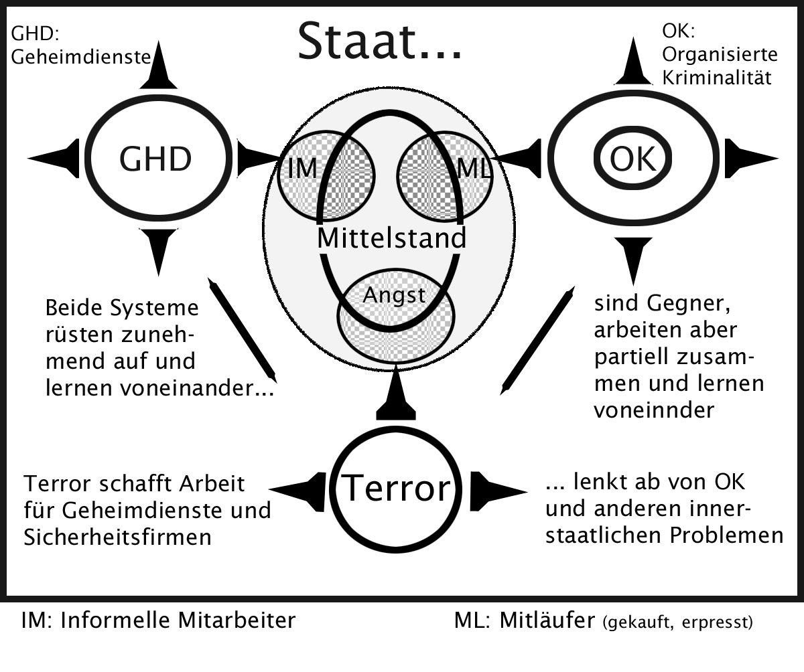
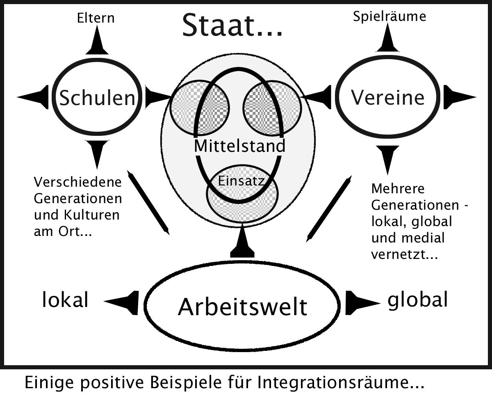

# ZEILER .me - IT & Medien, Geschichte, Deutsch - Integration

## Integration und die Politik des Unmuts

Im Gegensatz zur öffentlich geäußerten Skepsis sind die „Teil­habe­chancen von Minderheiten“ heute „wesentlich besser als noch vor zwanzig, dreißig oder fünfzig Jahren.“ (Aladin El-Mafaalani, „Das Integra­tionsparadox. Warum gelungene Integration zu mehr Konflikten führt.“ S. 11) „Im Schuldienst und in der Wissenschaft, bei der Polizei und in der öffentlichen Verwaltung, in der freien Wirtschaft und im Kul­tur­­betrieb werden wichtige Aufgaben von Menschen mit Migrations­hintergrund wahrgenommen. Natürlich noch nicht so viele, wie es ihrem Bevölkerungsanteil entspricht, aber viel mehr als je zu­vor.“ (A.a.O., S.12) Aber wenn „Integration oder Inklusion oder Chancen­gleichheit gelingt, dann wird die Gesellschaft nicht homogener, nicht harmonischer und nicht konfliktfreier. Nein. Das Gegenteil ist viel wahrscheinlicher. Die zentrale Folge gelungener Inte­gration ist ein erhöhtes Konfliktpotential. \[…\] Mehr Menschen können und wollen partizipieren, sich aktiv beteiligen und etwas abbekommen. Alle an einem Tisch. Immer mehr und immer unterschiedlichere Menschen sitzen mit am Tisch und wollen ein Stück vom Kuchen. Wie kommt man eigentlich auf die Idee, dass es ausgerechnet jetzt harmonischer werden soll? Diese Vorstellung ist entweder naiv oder hegemonial. Das wäre Multikulti-Romantik oder Monokulti-Nostalgie. Die Realität ist offen­sichtlich eine ganz andere. (a.a.O., S. 44-45)

El-Mafaalani, selbst Kind einer Einwanderungsfamilie, beschreibt die realen sozialpolitischen Probleme der westlichen Demokratien in einer zuneh­mend globalisierten Welt, in der Aus- und Einwanderungs­bewegungen zunehmen. Und er beschreibt sie voller Optimismus für unser Land, dem Integration bisher weitgehend gelungen sei.

„Die erste Generation der Einwanderer ist noch bescheiden und fleißig, beansprucht nicht die volle Zugehörigkeit und Teilhabe. Im Alltag mag es zu Irritationen kommen, aber genau genommen ist der Umgang mit Einwanderern ‚gemütlich‘. Sie sitzen am Katzentisch, während die Einheimischen am Tisch sitzen. Diese Menschen, also die Migranten selbst, sind froh, überhaupt da zu sein, und vergleichsweise anspruchs­los. Integration ist hier eine Herausforderung und findet in der Regel nur auf niedrigem Niveau statt.

Die ersten Nachkommen beginnen, sich an den Tisch zu setzen. In der zweiten Generation gelingt Integration zunehmend. Die Migranten­kinder sprechen deutsch, haben nie in einer anderen Heimat als Deutschland gelebt und sehen sich schon als Teil des Ganzen. \[…\] Und deshalb steigt das Konfliktpotential. Denn mehr Menschen sitzen jetzt am Tisch, wollen einen schönen Platz und wollen ein Stück vom Kuchen. Es geht hier also um Teilhabe an Positionen und Ressourcen.

In der dritten Generation geht die Reise noch mal weiter. Die Enkel der Migranten möchten nicht mehr nur am Tisch sitzen und ein Stück vom servierten Kuchen bekommen. Sie wollen mitbestellen. Sie wollen mitentscheiden, welcher Kuchen auf den Tisch kommt. Und sie wollen die alten Tischregeln, die sich entwickelt und etabliert haben, bevor sie dabei waren, mitgestalten. Das Konfliktpotential steigert sich weiter, denn nun geht es um die Rezeptur und die Ordnung der offenen Tisch­gesell­schaft.“ (a.a.O., S. 45)

Bis hierher gebe ich El-Mafaalani Recht, jedenfalls wenn ich auf die alten Bundesländer blicke, auf die sich seine Analyse ja in erster Linie bezieht. Allerdings sehe ich nicht nur die früheren Einwanderungsbewegungen ab den 60er Jahren des 20. Jahrhunderts, sondern die neue, be­schleunigte Zuwanderung in der Folge von Kriegen und Staats­versagen. Und ich ziehe andere Schlussfolgerungen aus der Analyse, denn ich bewerte die Kraftfelder in unserer Gesellschaft seit dem Ende des alten Ost-Westkonflikts und seit der Wiedervereinigung Deutsch­lands anders als er. Das Aushandeln der gemeinsamen „Tisch­regeln“ verläuft m.E. nicht mehr nur nach den Regeln, die wir – bzw. die Siegermächte des Zweiten Weltkrieges – uns mit dem Grund­gesetz gegeben haben. Wer den Blick über die Grenzen Westeuropas hinaus richtet und die großen Ströme der Zuwanderung genauer betrachtet, der bemerkt schnell, dass z.B. die „Würde des Men­schen“ ganz verschieden interpretiert wird, dass Autorität, Erzie­hung, Geschlechter­verhältnisse und vieles mehr in verschiedenen Kulturen anders gesehen werden, als bis vor kurzem noch bei uns. Und natürlich verweisen Einwanderinnen, in deren Kultur seit 2000 Jahren die weibliche Beschneidung üblich war, darauf, dass dies auch in Deutschland die einzige Möglichkeit sei, als Frau kulturell anerkannt zu werden. Ein „Urlaub“ im Heimatland – und schon ist es passiert. Strafe in Deutschland? Fehlanzeige. Wie auch, wenn man die Täterinnen nicht erreichen kann. Sicher ist dies ein Extrembeispiel - und es gibt Versuche, dies einzuschränken. Aber es gibt zahlreiche Beispiele, wie Menschen aus Kulturen, in denen über lange Zeit Gewaltbeziehungen "normal" waren, diese "Normalität" auch in ihre neue Heimat mitnehmen. Das betrifft das Verhältnis von Männern zu Frauen, das betrifft die Mittel in der Erziehung, das betrifft aber auch ganz generell die Vorstellungen über die verschiedenen Arten der Menschensteuerung, die in jeder großen Gemeinschaft unvermeidlich sind.

Das Deutschland von heute hat nicht mehr viel mit dem von vor 1989 zu tun. Es gleicht – zumindest in manchen Regionen – eher einem Viel­völkerstaat, in dem mehrere Kulturen nebeneinander leben und es keine religiös- oder sonstwie zusammenhängende Mehrheits­gesell­schaft mehr gibt, die stark und optimistisch genug wäre, eine nationale Identität zu entwickeln. Und von einer europäischen will ich gar nicht erst reden. Sie gibt es in erster Linie bei den gut ausgebildeten Jugend­lichen, die gerne reisen – und wenn diese erwachsen werden, bei deren Kindern. Es scheint im Übrigen so, als ob es nur mit einer soliden Bildungsgrundlage gelingt, fremde Kulturen als anregend zu empfinden und eine (entspannte) Neugierde auf mögliche Differenzen und Ähnlich­keiten zu entwickeln. Gerade der Blick in die Geschichte der verschiede­nen Kulturen zeigt, wie zeitgebunden und variabel Verhaltensweisen und Weltanschauungen sind.

Defensiv und ohne Zukunftsoptimismus lassen sich unterschiedliche Kulturen aber nur mit Überwachung und Druck (verstecktem oder offenem Druck) zusammenführen und „regieren“, weil es keine zusam­men­hängende innere Bindungskraft gibt. Fehlt in einem Staat aber die innere Bindungskraft, dann ist es umso wichtiger, dass der Staat stark genug ist, wenigstens die Bindungskraft der Gesetze für alle durch­zusetzen. Er darf nicht schwach erscheinen und er braucht die Mittel, Legalität auch gegen konkurrierende Kräfte durchzusetzen. Und diese Kräfte sind heute in Zeiten der Globalisierung vielfältiger denn je. Nicht nur durch finanzkräftige internationale Konzerne, Medien­monopole oder große ethnische Clans, die sich nach außen ab­schot­ten. Allein die wirtschaftliche Entwicklung und die Veränderungen auf dem Arbeits­markt erzeugen permanent Gewinner und Verlierer. Und die Verlierer von heute sehen einen viel größeren Abstand zu den Gewinnern als früher. Selbst der Aufstieg über Bildung in den Mittelstand ist heute schwieriger geworden. Der Anspruch bleibt zwar, aber die Hürden sind höher oder zumindest anders als zuvor. Bildung und ehrliche Anstrengung alleine sind nicht mehr die zentralen Mittel. Herkunft und Beziehungsnetzwerke schon eher. Und so steigt ein Unmut, vor allem da, wo die Rechtfertigungen für den Aufstieg und für hohe Gewinne nicht verallgemeinerbar sind, wo Gewinne oft auch einen kriminellen Hinter­grund haben und weniger auf Leistung und Anstrengung beruhen. Wenn Menschen, die bisher auf individuelle Rechte gebaut haben, sehen, wie das Einklinken in halblegale Netzwerke andere auf die Überholspur bringen, empfinden sie das zunächst als ungerecht und dann als Demütigung. Ein Gefühl von Kränkung, Missachtung und von Verlust an „Würde“ stellt sich heute schneller ein als in den Zeiten, in denen Veränderungen noch langsamer stattfanden, als mehr Zeit zur Orientierung blieb und staatliche Institutionen mehr Sicherheit und Autorität ausstrahlten.

Francis Fukuyama beschreibt in dem 2019 auf Deutsch erschienenen Werk mit dem Titel „Identität - wie der Verlust der Würde unsere Demokratie gefährdet“ einen weltweiten Trend hin zur „Identitäts­politik“. D.h. nicht mehr Klassenkämpfe oder ideologische Auseinan­der­setzungen um allge­mein­gültige Menschenrechte wie Freiheit und Gleichheit bestimmen die politische Entwicklung, sondern der Wunsch nach Anerkennung einer irgendwie missachteten „Identität“ und einer meist gruppenbezogenen „Würde“.

„Im 20. Jahrhundert hatte sich die Politik an einem Links-rechts-Spektrum orientiert, das durch Wirtschaftsthemen definiert wurde, wobei die Linke mehr Gleichheit und die Rechte größere Freiheit verlangte. Die linke Politik konzentrierte sich auf Arbeiter, Gewerk­schaften und sozialdemokratische Parteien, die sich um bessere gesellschaftliche Schutzmechanismen und wirtschaftliche Umver­teilung bemühten. Die Rechte dagegen interessierte sich hauptsächlich dafür, die Verwaltung zu reduzieren und den Privatsektor auszubauen. Im zweiten Jahrzehnt des 21. Jahrhunderts scheint dieses Spektrum in vielen Ländern von einem durch Identität definierten Angebot verdrängt zu werden. Die Linke richtet ihr Augenmerk nicht mehr primär darauf, weitestmögliche ökonomische Gleichheit herzustellen. Statt­dessen geht es darum, die Interessen einer Vielfalt von benach­teiligten Gruppen zu unterstützen, wie etwa von Schwarzen, Einwan­derern, Frauen, Hispanics, der LGBT-Community und Flüchtlingen. Unterdessen liegt der Rechten vor allem der Patriotismus am Herzen, der Schutz der traditionellen nationalen Identität, die häufig explizit mit Rasse, Ethnizität oder Religion verknüpft wird.

\[...\]

Diese Entwicklungen könnten als Politik des Unmuts bezeichnet werden. In zahlreichen Fällen gelingt es politischen Führern, ihre Anhänger mit Hilfe der Vorstellung zu mobilisieren, dass die Würde der Gruppe beleidigt, herabgesetzt oder wie auch immer missachtet wor­den sei. So erklingen Rufe danach, die Würde der betreffenden Gemein­schaft öffentlich an­zu­erkennen. Eine erniedrigte Gruppe, die ihre Würde wiederherstellen will, verfügt über weit mehr emotionales Gewicht als eine, die nur ihren wirt­schaftlichen Erfolg verfolgt.

Das ist der Grund, warum der russische Präsident Wladimir Putin den Zusammenbruch der Sowjetunion eine Tragödie nennt und warum er Europa und den Vereinigten Staaten vorwirft, die Verwundbarkeit Russlands in den neunziger Jahren ausgenutzt zu haben, um die NATO an seine Grenzen vorzuschieben. \[...\] Der ungarische Minister­präsident Viktor Orban erklärte 2017, seine Rückkehr an die Macht im Jahre 2010 markiere den Zeitpunkt, an dem ‘wir Ungarn überdies beschlossen, dass wir unser Land, unsere Selbstachtung und unsere Zukunft zurück­gewinnen wollen.’ Die chinesische Regierung unter Xi Jinping geht aus­führlich auf Chinas ‘Jahrhundert der Demütigung’ ein und behauptet, die Vereinigten Staaten, Japan und andere Länder bemühten sich, seine Rückkehr zu dem Großmachtstatus, den es in den ver­gangenen Jahrtausenden genossen habe, zu verhindern.“ (A.a.O. S. 23/24)

Auch in Indien entsinnt man sich an irgendwie glorreiche frühere Zeiten und schürt Träume von einem starken hindu-nationalistischen Staat, in dem vor allem Moslems stören. Es wird ein Feind angeboten – und wenn dieser Feind, gegen den man sich einig zeigen müsse, erst einmal weg sei oder wenigstens ausgegrenzt, dann werde alles besser. Wie illusionär solche Gedanken sind, das merkt man, wie immer, erst hinterher…

Man könnte diese Aufzählung noch mit unzähligen anderen Beispielen verlängern, die alle auf eine entsprechende Identitätspolitik verweisen, eine Politik, die den Unmut von „missachteten“ Gruppen anspricht. In den USA z.B. hat Trump diesen Unmut geschickt angesprochen, miss­achtet aber selbst aktiv andere Länder und auch Europa als Ganzes und erzeugt damit zunehmend Unmut. In Großbritannien hatte die „Brexit“-Bewegung den Unmut, der 2015 durch eine plötzlich zunehmende Migration nach Europa verstärkt wurde, geschickt in ihre Bahnen gelenkt.

In Deutschland führt diese Entwicklung nun nicht dahin, dass, wie El-Mafaalani meint, aufgrund der weitgehenden Integration einge­wanderter Minderheiten alle gleichberechtigt am Tisch sitzen und offen über gleiche Tischregeln verhandeln. Vielmehr entwickelt sich eine „Politik des Unmuts“, die eine noch halbwegs bestehende nationale Identität aufweicht, ohne eine neue Form der „Iden­ti­tät“ anzubieten, die sich weiterhin an den allgemeinen „Menschen­rech­ten“ der Aufklärung orientiert.

Wie verschieden die Tischregeln in den einzelnen Kulturen sind, die jetzt eng beieinander sitzen, das zeigt sich gerade erst ganz allmählich. Man muss nur genauer hinschauen und ein wenig den Kopf über den Teller­rand seiner eigenen Subkultur rausstrecken. Denn wenn jetzt Wander­be­­we­gungen in großem Maßstab über den Globus ziehen, dann nehmen Migranten ihre jeweiligen Gewohnheiten und zumindest Teile ihrer Kultur mit in die neue Heimat. Und die ist bisher meist nicht darauf vorbereitet – und es entwickeln sich bei den „Einheimischen“ Gefühle von Vernachlässigung und Unmut, die sich gegen die eigenen Eliten richten.

Wie stark sich eine „Politik des Unmuts“ auswirken kann, konnte man vor kurzem in den Ländern des Nahen Ostens sehen, die ihre Diktaturen abschütteln wollten, ohne sich Gedanken um alternative Strukturen gemacht zu haben: „Schwache nationale Identitäten sind ein wesent­liches Problem im größeren Nahen Osten, wo der Jemen und Libyen zu gescheiterten Staaten geworden sind und wo Afghanistan, der Irak und Somalia unter inneren Aufständen und Chaos lei­den.“ (Fukuyama, a.a.O., S. 152)

„Im Unterschied dazu hatten Japan, Korea und China ausgebildete natio­nale Identitäten, lange bevor sie ihre Gesellschaften moder­ni­sierten - und sogar schon vor ihrer Konfrontation mit dem Westen im 19. Jahr­hundert.“ (a.a.O., S. 153)

In Staaten, die ihren inneren Zusammenhalt verlieren, in denen zugleich extrem unterschiedliche Gruppen „am Tisch sitzen“, verliert meist auch das staatliche Gewaltmonopol an Einfluss und lokale oder gruppen­bezogene „Räume der Gewalt“ (Jörg Baberowski: „Räume der Ge­walt“ ­Frank­furt/Main, 2015) breiten sich aus.

Oft gibt es den Zentralstaat auch dann noch, wenn ihm sein Gewalt­monopol entgleitet, aber er verliert seine zentrale Legitimation, die in der Durchsetzung der Gesetzlichkeit und der Sicherheit für seine Bürger liegt. Denen bleibt dann meist nicht viel mehr übrig, als sich regionalen oder clanartigen Gewalten anzuschließen oder sich denen zu unter­werfen, die noch Sicherheit versprechen. Im Extrem kann man dies z.B. in Mexiko beobachten oder in einigen Ländern Afrikas, die eigentlich reich sind, aber ohne eine starke staatliche Struktur den Bach herunter gehen oder nicht auf die Beine kommen.[1](https://www.zeiler.me/integration.html#sdfootnote1sym) Ein Problem, das man in Deutschland aufgrund der langen Zeiten der Ruhe und Sicherheit nicht zu sehen scheint – oder zumindest öffentlich nicht sehen will. Unter der Hand macht sich dennoch ein Bewusstsein davon breit. Und unter der Hand bilden sich heute auch neuartige Koali­tionen, die den Gang in die Öffentlichkeit noch scheuen. Koalitionen, die z.B. den Schutz, den der Staat nicht bieten kann, in die eigene Hand nehmen. Gerade in den weniger dem Bildungsbürgertum zuge­wandten Teilen des Mittelstandes werden „hemdsärmelige“ Lösungen im Sicherheitsbereich attraktiv, wenn der Staat gegenüber kriminellen Gruppen lächerlich wirkt. Und genau darüber lassen sich Brücken bauen zu antidemokratischen Strömungen, die latent immer vorhanden sind, in Krisenzeiten aber wachsen. (Siehe Schaubild Nr. 1)

Seit Ende der 90er Jahre bilden auch Deutsche eigene Netzwerke unterhalb des Staates, die sich sukzessive mit ähnlichen nichtdeutschen Netzwerken verbinden. Übergreifend kann man einen kleinsten ge­mein­samen Nennen finden: Es geht um den Einsatz von Gewaltmitteln, die am Staat vorbei bei solchen Menschen Wirkung zeigen, die sich über den Rechtsstaat nur lustig machen. Die Hoffnung auf die Durchsetzung einer intrinsischen Motivation für die Akzeptanz der in Europa nach 1945 aufgebauten Zivilisation habe sich verflüchtigt. Dafür hätten die naiven antiautoritären Strömungen im Gefolge der „68er“ und von „Rot-Grün“, aber auch die Zuwanderungen aus autoritären, lange Zeit diktatorisch geprägten Kulturen gesorgt. Der Zusammenbruch des Kom­munismus habe kleptokratische Regime hinterlassen, in denen sich alte und neue Formen der Organisierten Kriminalität ausbreiten konnten. Das hätte z.B. in Deutschland mit seinen nun nach Osten zunehmend offenen Grenzen nur dann aufgefangen werden können, wenn man das Gewaltmonopol des Staates entsprechend gestärkt – und nicht, wie geschehen, lange Zeit an allen Ecken geschwächt hätte. Unterhalb der Welt, in der sich Politiker aufhalten, wurde sehr wohl wahrgenommen, wie sich inner­halb zugewanderter Gruppen eigene Machtstrukturen ent­wickeln, die rechtsstaatlich nicht eingebunden sind. Wenn der Rechts­staat zu schwach wird – oder mit aufkommenden inneren Gegenmächten nicht mehr mithalten kann – verliert er nicht nur seine zentrale Legitimation, nämlich die, für alle gleichermaßen Sicherheit zu gewähren. Nein, er lässt es zu, dass der Glaube an seine Funktionalität schwindet und das entsteht, was man landläufig „Systemkritik“ nennt. Man appelliert dann vielleicht an die „Anständigen“, an „Zivil­cou­rage“ usw., aber nichts dergleichen, keine noch so gewaltige Demon­stra­tion der „Anständigen“ kann den Machtapparat des Staates ersetzen. Keine „Selbsthilfe“ kann die Sicherheit für alle gewährleisten. Der Historiker Michael Wolffsohn hat dieses Problem in seinem 2016 erschienenen Buch „Zivilcourage – Wie der Staat seine Bürger im Stich lässt“ gut beschrieben.

Polizeiaufgaben und Landesverteidigung können Bürger nicht selbst übernehmen. Das sollte jedem einleuchten. Dennoch werden die dafür notwendigen Institutionen nicht entsprechend ihrer gewachsenen Auf­gaben ausgerüstet – und nicht nur von den Medien in ein schlechtes Licht gerückt. Für unsere Bundeswehr hat das Nariman Hamouti-Reinke sehr anschaulich erläutert in ihrem 2019 erschienenen Buch „Ich diene Deutschland. Ein Plädoyer für die Bundeswehr – und warum sie sich ändern muss.“ Sie, eine Muslima, hat zweimal in Afghanistan für Deutschland ihren Auftrag erfüllt, ist seit 2018 Offizier und legt aus ihrer Erfahrung heraus überzeugend dar, wieso Institutionen wie die Bundeswehr nicht ge­schwächt werden dürfen. Ein sehr lesenswertes Buch über unsere Landes­verteidigung, ein Buch, das die Bundeswehr trotz aller Kritik positiv darstellt und eines zeigt: Rassismus ist in einem international vernetzten Land wie die Bundesrepublik Deutschland ein dummes Ideengespinst. Und das nicht nur bei der Bundeswehr. Ein Land wie Deutschland genetisch oder auch nur religiös wieder „auf­dröseln“ zu wollen und nach Rassen und Religionen aufzuteilen, das wäre ein Witz! (Und wie stehen wir da, wenn uns auffällt, dass unser Nachbarkontinent Afrika auch wirtschaftlich immer wichtiger wird, bei uns aber der Rassismus wächst?)

Dass der Staat sich einer Religion unterwirft, ist in Deutschland weniger eine Gefahr als dass er sich der Organisierten Kriminalität unterwirft, die sich innerhalb einiger ethnischer Gruppen ausgebreitet hat. Insbe­son­dere die partielle überregionale Zusam­men­arbeit verschie­dener krimi­neller Großgruppen, die sich Geschäftsfelder aufteilen und gegenseitige „Amtshilfe“ gewähren, lässt den Staat oft schwach erscheinen. Vor allem nach der sukzessiven Öffnung der Grenzen in und nach den 1990er Jahren fällt auf, dass ethnisch organisierte Groß­gruppen sich Territorien im Land aneignen und teilweise wie eigene Staaten benehmen. Wer sich für die Geschichte der Organisierten Kriminalität interessiert und etwas genauer nach­liest, der stellt fest, dass man sich immer zuerst in der eigenen ethnischen Gruppe ein Standbein schafft, Gefolgschaften mit welchen Mitteln auch immer organisiert – und dann seine Macht sukzessive ausweitet. Ist genügend Kapital akkumuliert, dann kann man sich Rechtsanwälte „mieten“ und zumindest versuchen, einzelne Vertreter der Exekutive und der Legislative zu kaufen. Gerade weil wir das in Deutschland durch den Blick auf die ruhige Nach­kriegsentwicklung ausschließen, wirkt unser Land für schlaue Kriminelle wie ein Schlaraf­fenland. Die Organisierte Kriminalität zieht es für gewöhnlich immer dahin, wo entweder wenig Kontrolle droht – und/oder dorthin, wo das große Geld lockt. Für beides steht nun mal, das muss man zugeben, unser heutiges Deutschland. Wer sich hier aber festsetzen und seine Macht ausdehnen will, der muss andere Gewalt­mittel einsetzen als z.B. die Organisierte Kriminalität in Mexiko. Für die dortige Szene hat das sehr gut Don Winslow in seinem Roman „Das Kartell“ beschrieben, einem monu­mentalen Epos über den mexi­ka­nisch-amerikanischen Drogenkrieg. Hier bei uns sind eher versteckte Druckmittel gefragt, wie sie z.B. in den Geheimdiensten (nicht nur in der ehemaligen Stasi) entwickelt wurden - und möglicher­weise über deren Verbindungsleute (V-Leute) in die kriminelle Szene gelangt sind. Und bei dem enormen Reichtum der kriminellen Szene lassen sich Spezialisten aller Art, die über technisches, biologisches oder medi­zinisches Wissen verfügen, leicht kaufen. Ein Problem, das von ihrem Fach­gebiet her begeisterte und engagierte Wissenschaftler und Tech­niker oft nicht überblicken.

Aber zurück zur Mehrheitsgesellschaft: Wie will sich z.B. ein Gastwirt oder ein Handwerker, der bisher auf den Schutz des Staates vertrauen konnte, gegen die Übermacht der verschiedenen kriminellen Groß­gruppen, die teilweise mit Geheimdiensten aus ihren Heimat­ländern verbunden sind, zur Wehr setzen? Ich denke: Gar nicht. Jeder, der hart arbeitet, hat nicht die Zeit, sich um die Versäumnisse des Rechtsstaates zu kümmern. Er zahlt entweder sein „Schutzgeld“ oder er lässt sich auf milizartige Gegen­struk­turen ein, die mit dem Hinweis auf die Schwäche des Staates und die „Naivität“ der heimischen „Eliten“ aufgebaut werden. Und das auch dann, wenn er sich nicht sicher sein kann, wer wirklich an der Spitze der klan­destinen Milizen steht. „If you can’t beat them, join them!“

Wenn man die Wege der Legalität im Schutze von starken Gruppen verlässt, meinetwegen nur zeitweise und im Ausmaß begrenzt, es bleibt ein schlechtes Gewissen, das übertönt sein will. Genau dafür müssen die Anführer der Milizen Sündenböcke liefern, denen man die Schuld für was auch immer geben kann und die als Projektionsfläche für ange­staute Aggressionen taugen. Ein Blick in die Geschichte zeigt, wie beliebig die wechselnde Auswahl von „Sündenböcken“ ist. Und je stärker dann die Ahnung ist, dass das „Opfer“ im Grunde harmlos ist und je größer das ungute Gefühl bei eigenem Fehlverhalten ist, desto heftiger muss das „Opfer“, d.h. der „Sünden­bock“ leiden. Eine uralte Geschichte, die sich immer wiederholt. Für den Mitläufer in der Normal­form gilt auch heute noch, was Thomas Hobbes schon vor Jahr­hun­derten festgestellt hatte: Nicht das Opfer muss den Täter hassen, nein, der Täter muss das Opfer hassen, hat er erst einmal die Grenze zivili­sierten Verhaltens über­schritten. Täter müssen ihr Mitmachen innerlich rechtfertigen. Also muss das Opfer böse und gefährlich sein. Und die Anstifter, die wirklich Bösen, lachen sich ins Fäustchen, denn sie spielen nur damit, dass andere ihre Handlungen innerlich rechtfertigen müssen und am Ende dankbar sind, wenn man ihnen schlimme Gerüchte über das Opfer liefert.

Je autoritärer Gruppen sind, die über eine Ideologie, über Gier oder Zwang gesteuert sind, desto unkontrollierter und direkter wirken Ge­rüch­te. Das zeigt ein Blick in die Geschichte der Organisierten Krimi­nalität. Was den kriminellen Großgruppen aber im 21. Jahrhundert wie ein riesiges Weihnachtsgeschenk vorgekommen sein muss, das war der Angriff auf die Twin-Towers 2001 in New-York - und die nachfolgende Umorientierung und Umrüstung der Geheimdienste und der Polizei auf die Bekämpfung des radikalen Islamismus. Das vergrößerte das Feld für die diversen Mafia-Gruppen! Die staatlichen Gelder sind natürlich begrenzt und nicht genug, um beide Akteure gleichermaßen zu bekämpfen. Im Gegenteil, mafiöse Gruppen bieten gerne ihre Hilfe gegen die Islamisten an, die immer auch ein Standbein in der krimi­nellen Szene haben. Die Geldquellen der Organisierten Kriminalität weiten sich zudem nach all den neoliberalen Marktöffnungen immer mehr aus.

Wenn nun immer mehr Staaten in dem aktuellen Durcheinander der Globalisierung Orientierung im Blick auf (wenn auch nur fiktive) frühere Stärke suchen, so ist zumindest Deutschland diese Art der Orientierung ver­sperrt. Jeder Versuch, in diese Richtung zu denken, würde - und wird - sofort mit dem Verdacht des Rechtsradikalismus belegt. Aber jedem, der nach Orientierung sucht, fällt auch auf, dass es keine ähnlich starke Bewegung gibt, die der „Politik des Unmuts“ entgegenstehen würde. Im Gegenteil: Es finden sich eher heterogene Gruppen zusammen, die sich aus völlig verschiedenen Gründen in eine Position manövrieren lassen, in der sich Unmut stabilisieren lässt. So könnten sich die Schlaueren, die mit dem Unmut der heterogenen Gruppen einfach nur kalt kalkulieren, am Ende zu mächtigen Feinden des Staates entwickeln. Sie verstärken einfach überall den Unmut und bieten einfache Lösungen an, die in Notzeiten und in Zeiten der Angst attraktiv wirken. Denn wer einfach nur dagegen ist, dem fehlt meist die Fantasie für die Ausbildung langfristiger Ziele und politischer Zusam­menhänge.

Was tun? Einem „Europa“ als starke Orientierung, als positive Vision, steht in den Mitgliedsländern der EU die jeweilige „Politik des Un­muts“ entgegen, wobei die länderspezifischen Organisatoren des anti­europäischen Unmuts untereinander keineswegs Alternativen anbie­ten können, sich allenfalls im Dagegensein treffen – und nach fremden Herren, z.B. China oder die USA, Ausschau halten. Dabei wäre es heute wich­tiger denn je, an einer pro-europäischen Identität (auf demo­kratischer Basis) zu arbeiten. Und unter Europa verstehe ich ein Europa, das Russland mit einschließt, denn nur mit Russland werden sich Konflikte wie der in der Ukraine lösen lassen. Horst Teltschik hat das gut in seinem 2019 erschienenen Buch „Russisches Roulette – Vom Kalten Krieg zum Kalten Frieden“ beschrieben. Europa kann sich nur mit Russland zusammen stabilisieren – und nicht, wenn es sich Russland zum Feind macht (oder aus leicht durchschaubaren Gründen machen lässt). Das zeigt gerade die Ukraine Krise. „Militärisch kann die Ukrainekrise nicht gelöst werden. Daran werden die gemeinsamen ukrainisch-amerikanischen Manöver nichts ändern. Sie sind eher geeignet, die Gesamtsituation zu verschärfen. Das sogenannte Normandie-Format, also Verhandlungen zwischen Deutschland, Fran­kreich, Russland und der Ukraine, bleibt vorläufig das einzige Instru­ment, um Fortschritte in der Ukrainekrise zu erreichen.“ A.a.O., S. 224)

Zudem ist die Entwicklung in Polen wichtig für eine entspanntere Politik Russland gegenüber. Im Herbst 2019 fanden in Polen Parla­mentswahlen statt, die von der russlandskeptischen PiS gewonnen wurden. Und 2020 kommen die Präsident­schaftswahlen auf uns zu. Beide Ereignisse sind entscheidend für unser Verhältnis zu Russ­land. Nur wenn Polen sich auf ein starkes Europa (und eine USA, die Russland weniger zum Feind stilisiert) verlassen kann, wird es seine russland-skepitische Haltung ändern. „Deutsch­land, Frankreich und Polen könnten gemeinsam ein ent­schei­dender Motor für die Ent­wicklung konstruktiver Beziehungen zu Russland sein.“ (Teltschik, a.a.O., S.232/233)

„Die gemeinsamen Ziele sind mit der Charta von Paris von 1990 längst definiert und von allen unterschrieben worden. Eine gesamt­euro­päische Sicherheitsordnung und eine gesamteuropäische Freihandels­zone müssen im Interesse aller sein, auch Polens.“ (A.a.O., S. 233) Horst Teltschik blickt in seinem Buch zurück auf die Zeit der Ent­span­nung nach dem Ende des Kalten Krieges – und weckt damit Hoff­nungen, dass wir auf ähnliche Weise aus der derzeit verfahrenen politischen Lage wieder herauskommen.

Und seien wir ehrlich: Mit Russland und den inzwischen vielen russisch­sprachigen Zuwanderern könnte man sich in Deutschland und Europa leichter auf gemeinsame „Tischregeln“ einigen als beispiels­weise mit Saudi-Arabien und einigen anderen Ländern, wo man Men­schen aus­peitscht, Hände abhackt und viele andere Sitten pflegt, die uns völlig fremd sind.

Lassen wir die aktuellen Streitigkeiten bezüglich der Halbinsel Krim und der Ukraine mal beiseite und blicken nach vorne, dann leuchtet doch ein: Nur mit Russland, das unser Nachbar ist, lässt sich eine neue europäische Vision entwickeln. Eine antirussische Politik, die sich entweder den egoistischen Ambitionen einer USA unter Trump oder einem chinesischen Großmacht­streben unterwirft, wird die Euro­päische Union in ihrer jetzigen Form zerreißen. Schon ein zuneh­mend ge­spaltenes Europa wird niemand ernst nehmen.

Die USA unter Trump ersetzen den bisherigen Zusammenhalt des „Westens“ durch einen länderspezifischen Egoismus, der Europa genauso spaltet wie es die Verlockungen der Chinesen tun. Und in Europa, was wollen wir in Europa? Die Wahlen im Mai 2019 haben gezeigt, dass die Europäer weiter zusammenbleiben wollen, auch wenn ein Interessens­ausgleich zwischen den verschiedenen Nationen noch schwierig ist. Aber die Schwierigkeiten werden immerhin besprochen und Kompromisse können nicht einfach von „oben“ diktiert werden, wie man am Beispiel von Polen, Ungarn und Italien in Bezug auf die Einwanderungs- und Asylpolitik sehen kann. Dass z.B. Italien und Griechenland andere Grenzprobleme haben als Deutsch­land und deshalb auf die Flüchtlingsfrage anders reagieren als Deutschland, wird in Europa allmählich respektiert. Durch „Selbsthilfe“ von irgendwelchen „Anständigen“ oder ein bequemes Moralisieren – z.B. aus Ländern wie Deutschland – kann die Migrationsfrage auf Dauer nicht gelöst werden. Wir müssen die äußeren Grenzen auch für Griechenland und Italien schützen. Dabei sind wir auf eine intakte und staatlich funktionsfähige Türkei angewiesen, die ihre europäische Perspektive trotz aller Schwierigkeiten nicht verliert. Gerade mit der Türkei als einem islamisch geprägten Land ließe sich zeigen, dass Religion kein Hindernis für ein freundschaftliches Zusammenleben auf Augenhöhe sein muss. Eine europäische Perspektive könnte es zudem erleichtern, inner­türkische Konflikte zu befrieden. So wie viele Türken auch in Krisenzeiten stolz auf ihr Land sind, so könnten sie auch stolz auf Europa sein, wenn sie sich nicht nur wirtschaftlich auf Europa verlassen könnten. Auch die Türkei ist alleine zu schwach zwischen den großen globalen Playern. Sie gehört zu Europa, nicht nur beim Fußball.

In den großen türkischen Städten gibt es eine breite Mittelschicht, die uns freundlich zugewandt ist und der wir in Europa freundlich begegnen sollten. Von ihr könnten wir lernen, die harten politischen Fakten klarer als bisher in den Blick zu nehmen. So hart die Argumente aber auch aufeinander­prallen, man ist in Europa gezwungen zu argumentieren – und sich den Problemen zu stellen, die sich global zeigen. Europa wird ein Staatenbund bleiben und noch lange kein Bundesstaat werden. Als Staatenbund, der fair um Kompromisse kämpft, könnte Europa aber – eher als z.B. die USA oder China - Vorbild für andere Regionen der Welt werden. Nicht als Weltpolizist, aber als Beispiel für ein friedliches Zusammenleben verschiedenartiger Länder.

Zurück zur Ausgangsfrage: „Integration und die Politik des Unmuts“. In allen europäischen Ländern gibt es heute nicht nur Entwicklungen, die zu Desintegration und Unmut führen. Nein, es gibt auch weiterhin gegenläufige Trends. So bringt die Frage, wie man die negativen Folgen des Klimawandels beschränken kann, viele junge und gebildete Men­schen zusammen. Ihren Idealismus gilt es in politische Macht zu über­setzen. Denn dieser Idealismus ist unabhängig von Herkunft oder Haut­farbe, passt also genau in die globalisierte Welt, in der weder das Klima noch die Ökonomie noch die sozialen Fragen oder infektiöse Krankheiten vor Landesgrenzen Halt machen.

Hier einige Faktoren, die innerhalb des Staates integrativ wirken: (Schaubild Nr. 2)

**Detlef Zeiler, 2020**

[1](https://www.zeiler.me/integration.html#sdfootnote1anc) Ein positives Gegenbeispiel ist ausgerechnet das nach einem Bürgerkrieg neu formierte Ruanda!