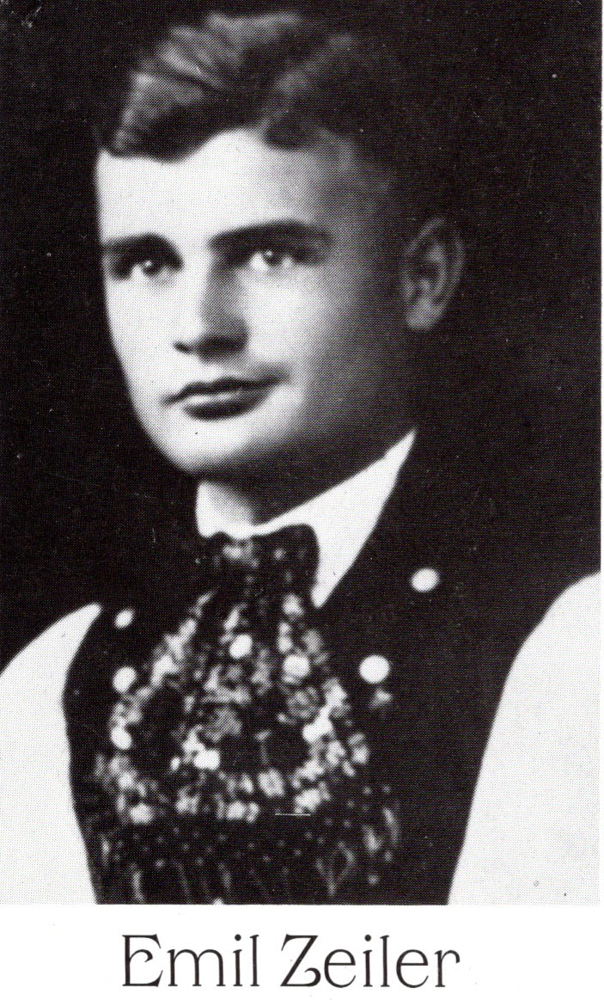

# ZEILER .me - IT & Medien, Geschichte, Deutsch - Mein  Onkel Emil

Emil Zeiler (1919-2011) lebte bis 2011 als pensionierter Lehrer und Gelegenheitsdichter in Kitzingen. (Biographische Notizen später auf dieser Seite).

2005 schrieb er mir einige Notizen zur Geschichte unserer Familie:

"... Unsere Vorväter waren ja auch große Wanderer vor dem Herren. Ich kenne einen Teil unserer Familiengeschichte vom Hören-Sagen. Der erste in der Reihe war angeblich Paul Zeiler, der aus dem Württembergischen nach Nordbessarabien zog, um Brücken zu bauen. Ich erinnere mich dunkel, dass mein Großvater Jakob mit mir an den Djestr (wir sagen Nister) fuhr und mir zeigte: "Bu\[b\], diese Brücke hat mein Großvater gebaut." Pauls Sohn Friedrich war ein "Heiliger". Alte Frauen konnten in Neu-Strimba noch aus ihrer Erinnerung von ihm berichten. Mein Großvater Jakob ist ja mit Familie nach Sibirien gewandert und gleich wieder zurück - wegen der Kälte und dem Schnee.

Einer der größten Wanderer war doch unser Vater Rudolf \[mein Großvater, D.Z.\]. Es zog ihn nach dem Kaukasus, wo er Mutter kennenlernte \[meine Oma, D.Z.\]. Dann musste er nach Stettin fliehen. \[Grund war 1919 die Drohung kommunistischer Truppen, ihn aufzuhängen, wenn er nicht noch in der Nacht verschwinde!\] Die nächste Reise führte wieder nach Neu-Strimba. Von dort nach [Siebenbürgen](https://www.google.com/url?q=https%3A%2F%2Fde.wikipedia.org%2Fwiki%2FSiebenb%25C3%25BCrgen&sa=D&sntz=1&usg=AOvVaw2QvxqtZa6C67seDITxLhXA). Dann \[1945, D.Z.\] wieder Flucht nach Österreich. Die Wanderungen unserer Generation sind dir bekannt. Dein Vater \[Leopold, 1921-2013, D.Z.\] und ich haben jetzt nur noch unsere letzte Reise vor uns."

Von 1939 bis 1940 war Emil Lehrer in [Botsch](https://www.google.com/url?q=https%3A%2F%2Fwww.siebenbuerger.de%2Fortschaften%2Fbotsch%2F&sa=D&sntz=1&usg=AOvVaw0rJP--U-M0fAla4-yTZJS-) (hier im Bild als Junglehrer), einem Ort, über den er bis 2005 mehrere Gedichte aus der Erinnerung heraus schrieb. Hier ein Auszug aus "Gruß an Botsch":

"Was die Eltern einst geschaffen,

blieb bestehn für lange Zeit.

Mit des Geistes edle Waffen

schufen sie Geborgenheit.

Doch das Schicksal hat gesprochen,

trieb uns von der Heimat fort.

Feste Grenzen sind zerbrochen.

Lebe wohl, mein Heimatort!"

Was heutige "Wanderer", egal ob Türken, Iraker, Russen, Kurden, Araber usw. durchmachen, haben meine Vorfahren seit über 200 Jahren immer wieder auch erlebt.

