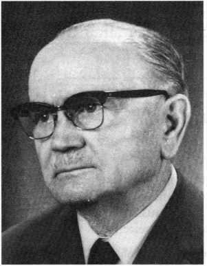

# ZEILER .me - IT & Medien, Geschichte, Deutsch - Mein Großvater Rudolf Zeiler

Mein Großvater Rudolf Zeiler (1893 - 1973) war Lehrer und evangelischer Küster. Er wurde 1919 aus einem deutschen Dorf im Süden Russlands von der Roten Armee vertrieben, lebte und arbeitete einige Jahre in Bessarabien, danach in Siebenbürgen. Hier im Bild als Pensionist in Österreich mit seiner Frau Alma Zeiler, mit der er 7 Kinder hatte. (Eines war auf der Flucht aus Russland unterwegs gestorben. Sechs seiner Kinder haben ebenfalls Familien gegründet.)

Hier ein Auszug aus der Seite "www.bessarabien.de/...":

**Neu-Strymba**

Wir haben unseren nordbessarabischen Heimatdichter Rudolf Zeiler als Mitschüler in der Wernerschule kennen und schätzen gelernt. Des Öfteren eilte er mit einer Rolle unter dem Arm, einer neuen Federzeichnung, in die Schule, um seine Kunst unter Beweis zu stellen. Er ging stets eiligen Schrittes. Man hatte den Eindruck, der Mann hatte noch viel vor. In der Tat, er arbeitete an sich, um die Dichtergaben, die ihm in die Wiege gelegt waren, ohne daß sie in der Abgeschlossenheit eines Volkssplitters Nahrung finden konnten, zu vervollkommnen. Er arbeitete als einer der Begabtesten und Eifrigsten, um seiner engeren Heimat auf allen Gebieten zu dienen. Jene Jahre sind auch unserem ganzen Volk zugute gekommen: „Hans Nimmerruh“ war mit seinem rastlosen Streben uns allen ein Vorbild. Der Zeichner konnte aber auch mit Worten malen. So beschreibt er die nördlichste Gegend Bessarabiens: **„Mein Geburtsort war die kleine, schmucke Kolonie Naslawtscha. Sie lag im nördlichen Zipfel Bessarabiens, wo der Dnjestr im weiten Bogen das Wolhynische Plateau durchschneidet und eine bezaubernde Gebirgslandschaft bildet, die man im wahren Sinne des Wortes als die ,bessarabische Schweiz' bezeichnen kann. Die Kolonie lag am hohen, steilen Ufer und bot einen wunderbaren Ausblick auf hohe, zackige Berge mit phantastischen Gipfeln. Um einen dieser Berge schlängelte sich die Eisenbahnlinie; die kleine Bahnstation Naslawtscha hing wie ein Schwalben­nest an den gewaltigen Felsen . . . Dunkle, schattige Wälder mit rauschenden Sturzbächen ergänzten das landschaftliche Bild“** („Heimat“, 8. September 1963)-

Wenden wir uns nun der Gemeinde zu, in welcher Rudolf Zeiler am längsten als Lehrer und Küster gewirkt hat.

Neu-Strymba liegt 17 Kilometer nördlich von der Kreisstadt Beiz, am rechten Ufer des Flüßchens Reut. Die ersten Siedler, die nach Neu-Strymba kamen, gehörten zu jenen Württembergern, Badensern, Pfälzern, die vor 1812 nach Polen auswanderten und von dort nach Südrußland weiter­zogen. Sie schlossen sich den Auswanderern an, die dem Rufe Alexanders I. folgten, wie die Siedler in Südbessarabien. In Kischinew erhielten sie vom Fürsorgekomitee die Anweisung auf je 60 Deßjatinen Land bei Tiraspol im Chersonischen. — Sie fielen in Kischinew aber in die Hände des Gauners Rasalowitsch, der Geschäftsführer und Großpächter des Edel­mannes Krupenskij war. Er überredete sie, nach dem Nord’en Bessarabiens zu ziehen, wo sie als Pächter übergenug Land haben könnten…

*(Auszug aus einem bessarabischen Heimatkalender)*

Ausführlicher unter: http://www.bessarabien.de/mitteilungsblatt/Naslawtscha\_BV.pdf

oder:

*www.scholtoi.de/PDF/Reisebericht\_2013\_Teil1.pdf*

**Im Jahre 1990 wurde im "Jahrbuch der Deutschen aus Bessarabien" ein Portrait des Küsterlehrers Julius Ehrhardt abgedruckt, das mein Großvater Rudolf Zeiler angefertigt hatte. Der Text spiegelt ein wenig die Lage der Deutschen in Russland zum Ende der Zarenzeit wider.**

**"Bilder und Gestalten aus meiner alten Heimat"**

**Der Küsterlehrer Julius Ehrhardt**

Von "HANS NIMMERRUH" / = RUDOLF ZEILER

*Rudolf Zeiler, geh. 26. August 1893 — gest. 23. Januar 1973.*

Ich kannte ihn gut, den alten Ehrhardt. Ein typischer Kolonisten Schulmeister. Wie lebend steht er noch heute vor meinen Augen.

Eine hohe, hagere Gestalt, kerzengerade wie eine Tanne. Das lange, knochige Gesicht hat scharfgeschnittene, strenge Züge. Die hohe Stirn von vielen Runzeln durchfurcht, ist von schütterem, schlohweißem Haar umrahmt. Über der gera­den, spitzauslaufenden Nase liegen zwei stahlblaue, klarblickende Augen, die alles sehen und sich nie täuschen lassen. Um den breiten, herb geschlossenen Mund ha­ben sich einige energische und zugleich auch sarkastische Falten tief eingegraben. Das glatte, spitze Kinn ist etwas vorgeschoben. Alles an ihm ist würdevoll, korrekt und achtunggebietend.

\[…\]

Als im Jahre 1915 \[im Ersten Weltkrieg, D.Z.\] die Zarengesetze über die Liquidierung des deutschen Grundbesitzes wie ein furchtbarer Orkan über alle deutschen Gemeinden Ruß­lands hinbrausten, kamen die Staatsbeauftragten auch in Ehrhardts Gemeinde, um sämtliche Liegenschaften aufzunehmen. Und gleich hinter ihnen kamen auch fremde Bauern aus den umliegenden Ortschaften, um sich die schönsten Höfe aus­zusuchen. Denn die »verfluchten Germanzi« und »inneren Feinde Rußlands« soll­ten ja alle nach Sibirien vertrieben werden. Da wollte das viele Jammern und Wehklagen in allen Häusern kein Ende nehmen. Es war ja nicht leicht, sein war­mes Nest in der trauten Heimat zu verlassen und bettelarm in die weite schneebe­deckte Fremde zu ziehen.

Da war es der alte Ehrhardt, der zum allmächtigen Pristav ging, um gegen das gewaltige Unrecht zu protestieren und es von seiner Gemeinde abzuwenden. Er stellte sich breitbeinig und wuchtig vor den strengen Beamten des Zaren \[…\] und sagte: „Was wol­len Sie, Euer Wohlgeboren, von uns? Sie suchen die »Germanzi«, in meiner Ge­meinde gibt es keine.“ „Wer seid ihr denn?“ fragte der Gewaltige interessiert. „Wir sind lauter gute Schwaben.“ „Schwaben!“ staunte der dicke Pristav und kratzte sich hinter den Ohren. Er dachte lange nach und meinte schließlich mit einer wegwer­fenden Handbewegung: „Eto odin tschort, odno plemja“ (das ist ein Teufel, eine Nation) „Es ist nicht dasselbe, Euer Wohlgeboren. Wir sind friedliebende schwä­bische Bauern vom Rhein und von der Mosel, von euren Zaren vor hundert Jahren in dieses Land gerufen, um Kultur und Wohlstand zu bringen. Viele Generationen hindurch haben wir uns hier geplagt und geschuftet, um aus der Wildnis ein Kul­turland zu schaffen. Wir sind Kolonisten und keine »Germanzi«. Wir sind auch die treuesten, ruhigsten und ergebensten Staatsbürger, die fleißigsten Steuerzahler und die besten Weizenproduzenten. Unsere Väter und Söhne stehen unter den Fahnen des Zaren und kämpfen gegen die »Germanzi«. Auch meine beiden Söh­ne. Was wollen Sie? Hier gibt es weder »Germanzi« noch irgendwelche Feinde des Staates. Die müssen Sie schon anderswo suchen.“

Da seufzte der Dicke, kratzte sich wieder hinter den Ohren und sagte: „Wa sam tschort ne rasberjot! (Aus euch wird auch der Teufel nicht klug) Geh einstweilen nach Hause, Väterchen, und beruhige deine Leute. Ich werde bei meiner »nat- schalstwo« (Behörde) nähere Instruktionen verlangen.“

Und als die fremden Bauern, die immer noch von Hof zu Hof wanderten und sich um die besten Wirtschaften stritten, vom »urjadnik« (Gendarm) nach Hause geschickt wurden, da sagten sie ganz enttäuscht: „Also, das sind keine »German­zi«! Das kann schon stimmen, denn es sind ja dieselben Menschen wie wir. Die »Germanzi« sind grausame Bestien, die den Frauen die Bäuche aufschlitzen und die Kinder lebend an ihren Spießen braten.“ Gospodi pomilui!“ (Gott, erbarme dich)“

Die Bauern zogen ihre Pelzmützen, bekreuzigten sich und gingen zum alten Ehrhardt. Das Schuldbewußtsein drückte sie. „Radi Boga (um Gottes willen), ver­zeih uns, Julius Karlowitsch“, baten sie unter vielen Bücklingen. „Der Pope und die »natschalstwo« haben uns verblendet. Wir waren ja sonst immer gute Freunde gewesen und wollen es auch bleiben.“ „Schon gut,“ erwiderte der Alte. „Geht nur in Frieden nach Hause, Gott wird euch die Dummheit vergeben, wir haben’s schon getan.“ Und die Fremden trollten sich.

Der alte Ehrhardt war auch ein guter Landwirt, Bienenzüchter und Winzer. Auch in dieser Hinsicht diente er seiner Gemeinde als Vorbild. Aus seiner langjäh­rigen Schulmeisterei schlug er kein Kapital, hatte auch keine Hoffnung, als Kü­sterlehrer von der Kirche oder vom Staat eine Pension oder Altersrente zu bekommen. Als »Veteran« hätte er entweder zum Bettelstab greifen oder seine letz­ten Jahre bei Kindern oder Verwandten fristen müssen. Diesem traurigen Schick­sal griff er weise vor, in dem er in seiner Freizeit den Schulmeisterstock mit dem Pflug vertauschte.

\[…\] Als ich ihm einmal klagte, die Welt sei voller Ungerechtigkeit und man würde von der Wiege bis zur Bahre in dieser oder jener Form wie ein Hund verprügelt, da erwiderte er mit einem stillen, wissenden Lächeln: „Das Leben, mein junger Freund, ist eben eine große Kunst. Die meisten Menschen laufen wie blind durchs Leben, ohne seinen tiefen Sinn zu verstehen. Dabei ist dieser Sinn so einfach und kindlich klar. Des Menschen Glück, nach dem alle dürsten und rennen, liegt nicht in den Dingen dieser Welt. Das Glück ist etwas Geistiges, das man im Herzen ha­ben kann, ohne all das andere, das man mit Geld erwirbt. Man muß sich irgendeinen Altar im Alltag aufbauen, auf dem man die Kerzen der Freude anzündet. Die Welt ist arm geworden an großen Freuden. Nur die alltäglichen kleinen Freu­den machen unser Leben schön und gut. Es kommt nur darauf an, sie zu sehen und zu empfinden. Ich sah einmal einen meiner Bauern vom Felde kommen. Ein arm­seliges, verhutzeltes Männlein. In seiner schwieligen, zerschundenen Hand trug er einen Strauß Feldblumen, den er seiner Alten brachte. Und ich sah auch, wie seine müde, abgearbeitete Frau, die es mit den vielen Kindern nicht leicht hatte, diesen Strauß mit einem glücklichen Lächeln hinnahm, obwohl er ohne ein Schmeichel­wort dargebracht wurde. Es war plötzlich etwas Sonne in die düstere Wohnung ge­kommen, eine kleine Freude, wie eine teure Erinnerung an vergangene Zeiten, da dieser Mann und diese Frau jung waren, verliebt und sich zärtliche Torheiten zu­flüsterten. Sehen Sie, das sind die kleinen, alltäglichen Freuden, mit denen wir uns und unsere Mitmenschen glücklich machen können. Nicht für sich leben, son­dern für die Mitmenschen — das ist der Sinn des Lebens. Und vergessen Sie nicht, junger Freund, daß sich die liebe Sonne nicht nur im großen Gewässer spiegelt, sondern auch in der kleinen und kleinsten Pfütze. Man muß nur offene Augen ha­ben. Und das Leben selbst ist immer das, wie wir es nehmen — ein Paradies oder eine Hölle. Das Glück liegt eben nicht in den Dingen, sondern im Herzen der Menschen.“ —

