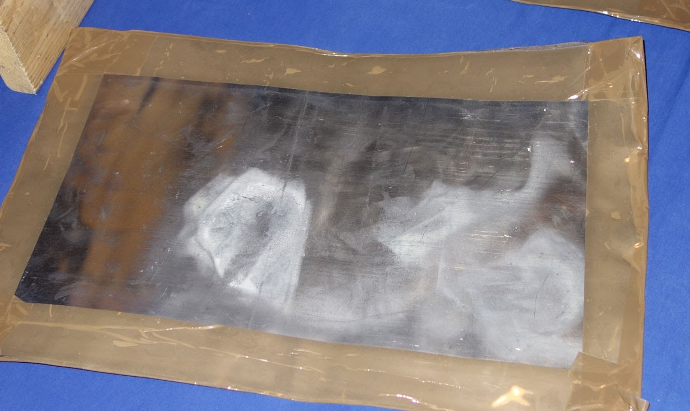
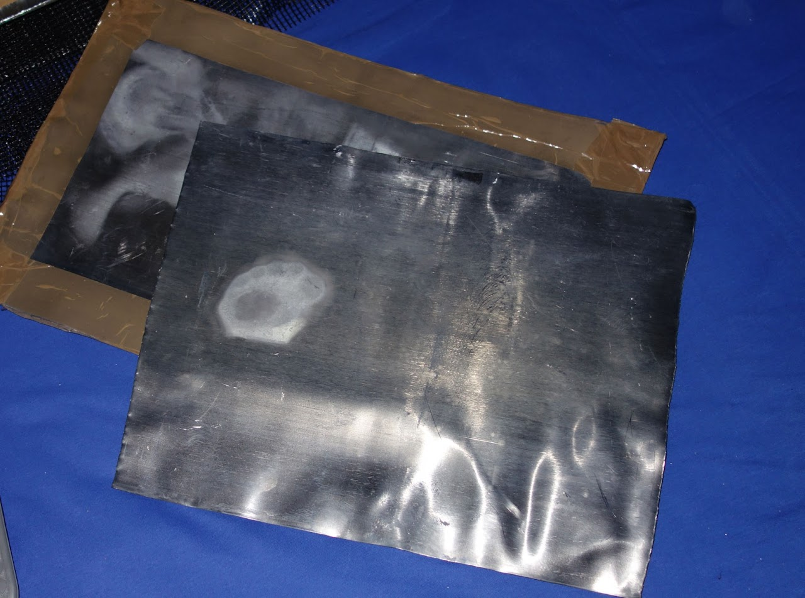
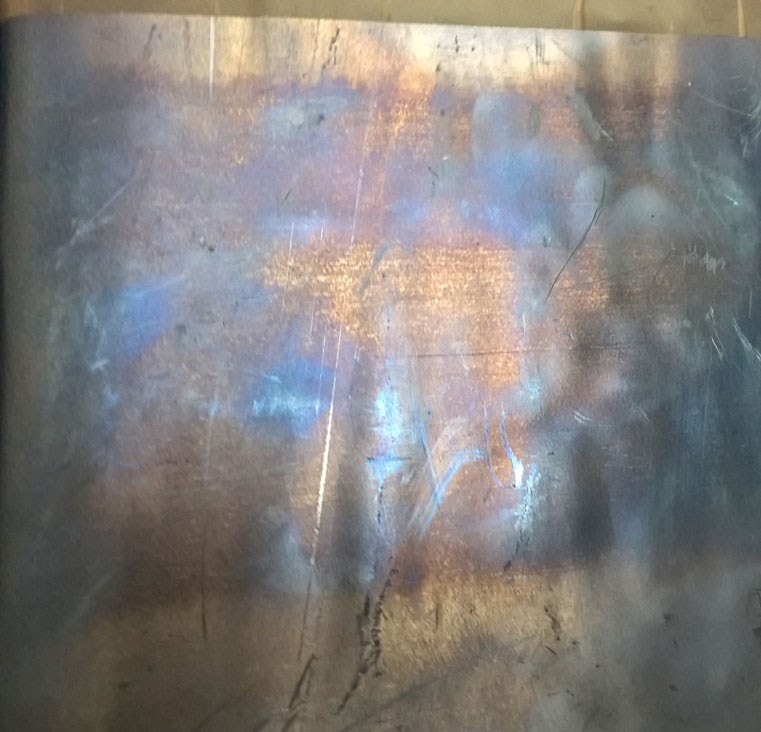

# ZEILER .me - IT & Medien, Geschichte, Deutsch - Nicht-tödliche Waffen

**Über die Gefahren der „Nicht-tödlichen Waffen“**

*„Das erste steht uns frei, beim zweiten sind wird Knechte.“ (Goethe)*

Wer heute beim Thema „Nicht-tödliche-Waffen“ nur an den Einsatz von Tränengas, Taser-Waffen oder anderen bekannten nichttödlichen Waffen denkt, der täuscht sich. In den Erfinderküchen der Kriegswaffenproduzenten wurde ein neues, viel effektiveres Waffensystem entwickelt, das zurzeit auf vielfältige Weise getestet wird. Im zivilen Bereich war es anfangs nur dafür gedacht, [den Wasserwerfer oder den Gummiknüppel zu ersetze](http://www.google.com/url?q=http%3A%2F%2Fwww.mikrowellenterror.de%2Fforum%2Fread.php%3F84%2C10062%2C10062&sa=D&sntz=1&usg=AOvVaw0Wo7tkeK6y-Yv2UrnR8xNs)n, die ja meist unangenehme Bilder in die Medien bringen. (Vor allem nach den bürgerkriegsähnlichen Aufständen Ende April 1992 in Los-Angeles – mit vielen Toten und Verletzten - hatte man die Entwicklung der Mikrowellenwaffen forciert!) Auf Dauer würden diese Bilder den Glauben an den Rechtsstaat unterminieren.

Ende der 90er Jahre wurde offen darüber berichtet, geradezu spannend für alle Technikfreunde, aber auch für Befürworter oder Kritiker der Staatsmacht. Doch plötzlich, geradezu abrupt, brachen dann die offiziellen Informationen nach dem Jahre 2000 ab. Ohne Begründung wurden die euphorischen Polizeiberichte und die Werbefilme der Gerätehersteller eingestellt – und nur vereinzelt meldeten sich verzweifelte Kritiker der nicht-tödlichen Waffen im Internet, umstellt von Vorwürfen aller Art. Vor allem die Unterstellung, sie verbreiteten „Verschwörungstheorien“ oder litten unter „Paranoia“ kam und kommt immer wieder wie der „Knüppel aus dem Sack“, sobald sich ein Kritiker meldet. Und auch aus den Versuchsfeldern der Kriegsgebiete, wie dem Irak oder Afghanistan wurden diese neuen Waffensysteme wieder zurückgezogen. Nur bei der Minensuche und der Sprengung gefundener Minen aus sicherer Entfernung werden (oder wurden) Mikrowellenwaffen offensichtlich noch eingesetzt. Jedenfalls gibt es heute keine weitergehenden Meldungen darüber, dass diese Waffensysteme angewandt oder gar weiterentwickelt werden. Lediglich die zwanghaft ironischen Seiten, die aufkommende Kritik an Mikrowellenwaffen desavouieren, nehmen zu.

Nun wurde diese Technologie aber inzwischen individualisiert und durch leicht handhabbare Radartechnik ergänzt. Sie lässt sich heute gegen "Testpersonen", anfangs meist alleinstehende alte Frauen oder isolierte Harz IV-Empfänger, zunehmend aber auch gegen missliebige Einzelpersonen einsetzen. Das Verlockende dabei: Die neuartigen Mikrowellenwaffen - nicht zu verwechseln mit Laserwaffen - sind unsichtbar und hinterlassen, richtig dosiert, kaum Spuren beim Opfer. In Kombination mit den [radartechnischen Möglichkeiten, hinter Wände und Decken zu blicken](http://www.google.com/url?q=http%3A%2F%2Fwww.spiegel.de%2Fnetzwelt%2Fweb%2Frange-r-neue-polizei-radargeraete-koennen-durch-waende-sehen-a-1013897.html&sa=D&sntz=1&usg=AOvVaw03JTuIGcfXZvoJofWkKqxj) und Personen passgenau in ihren Bewegungen zu erkennen, hat sich hier ein Druckmittel herauskristallisiert, das die bisher kaum erst realisierten Möglichkeiten der Personenkontrolle ergänzt - und eine leicht handhabbare Technik liefert, Menschen Schmerzen zuzufügen oder sie gar zu töten. Äußerliche Spuren wären nicht zu finden. Übermüdung am Steuer, unverhoffter Saunatod, Herzinfarkt, Schlaganfall, Lungenembolie, alle möglichen Ausreden wären denkbar, nichts mehr wirklich sicher; im Katalog "normaler" Krankheiten ließen sich eine Menge Legenden herauspicken. In der Forensik müsste von daher die Ausbildung erweitert werden, um hier mitzuhalten. Aber die Mittel für die Forensik wurde ja nicht erweitert, eher noch gekürzt. (Über die möglichen Angriffe auf die Elektronik von Kraftwerken und deren Folgen möchte ich hier gar nicht reden. Das wäre ein anderes Thema. Siehe dazu: [http://www.mikrowellenterror.de/forum/read.php?84,11072,11095](http://www.google.com/url?q=http%3A%2F%2Fwww.mikrowellenterror.de%2Fforum%2Fread.php%3F84%2C11072%2C11095&sa=D&sntz=1&usg=AOvVaw1p0bzpqRfEvdbrGtEPM1LS))

Nun wäre das alles nicht so schlimm, wenn diese Waffen in den Händen des Rechtsstaates blieben und streng kontrolliert würden. Ist dies aber in der globalisierten und multikulturellen Welt überhaupt möglich? Kann man heute eine klare Grenze zur organisierten Kriminalität (OK) oder zu den verschiedenartigsten Terrorgruppen ziehen, die ja zum Glück "nur" mit Explosivwaffen operieren? Und kann man den immer stärker werdenden Geheimdienstbereich, der gegen Terror und OK aufgebaut wird, heute noch von der rechtsstaatlichen Seite her kontrollieren? Kann sich hier nicht eine Nische für krankhaft narzisstische Personen bilden, die ihren latenten Sadismus ausleben wollen? Und kann diese Nische nicht geradezu wie ein Magnet für krankhafte Narzissten wirken? Wer könnte gerade diesen Personenkreis heute noch stoppen, wenn doch die Mehrheit der moralisch intakten Menschen unter steigendem Arbeits- und Zeitdruck steht und sehen muss, wie sie gerade so über die Runden kommt? Sind Polizei und Verfassungsschutz überhaupt dafür ausgerüstet und ausgebildet, mit dieser neuen Gefahr umzugehen? Oder kann man dort seinen Auftrag überhaupt noch erfüllen, wenn man bereits Angst haben muss, selbst ein "Opfer" zu werden? Könnte da nicht die Versuchung entstehen, partiell mit Leuten zusammenzuarbeiten, die nicht an die Legalität gebunden sind?

Zu diesen offenen Fragen kommen noch andere hinzu, die man vorerst nur andenken kann:

1.  Wie leicht lassen sich mit diesem neuen Mix von Radar und Mikrowellenwaffen Sportereignisse durch Schädigungen von Sportlern beeinflussen? Vor allem, wenn und solange die beiden Techniken der Öffentlichkeit nicht bekannt gemacht werden (dürfen). Die Wettmafia verfügt über enorme Geldmengen und könnte sich diese heute schon preiswerte Technologie locker leisten. Damit hätte sie eine innovative Ergänzung zu den bisher üblichen Bestechungen. Einmal angenommen, jemand wird von einem gebündelten Mikrowellenstrahl genau in dem Moment an einem Muskel getroffen, in dem dieser voll angespannt, also in Höchstleistung ist. (Schon seit einiger Zeit lassen sich gebündelte Mikrowellen zentimetergenau fokussieren.) Der Verursacher wäre nicht sichtbar, keine Spur. Dieser Sportler würde sofort einen Muskelfaserriss bekommen oder umknicken, sich einen Gelenkschaden zufügen – und weg wäre er. Generell geht es ja im Hochleistungssport um kleine Unterschiede an Konzentration und Willenskraft. Und auch da lässt sich - z.B. mit Substanzen, die in einer Umkleidekabine über die Schleimhäute aufgenommen werden - eingreifen und manipulieren, ohne dass man dies gleich nachweisen kann. Man könnte eine überlegene Fußballmannschaft eine Halbzeit lang gut spielen lassen, dann mit konzentrationshemmenden Stoffen in der Kabine eingreifen - die Wetten laufen noch - und die überraschende Wende des Spiels in der zweiten Halbzeit genüsslich aus dem Hintergrund beobachten. Oder man beackert eine Mannschaft vor einem Spiel, z.B. im Bus auf der Fahrt zum Gegner oder in der Kabine - und die erste Halbzeit geht daneben, während die Spieler dann in der zweiten Halbzeit, auf unerklärliche Weise erholt, wieder auftrumpfen. Ein Attentatsversuch, wie er am 11. April 2017 von dem Deutschrussen Sergej W. gegen den Mannschaftsbus von Borussia Dortmund unternommen wurde, erübrigt sich, wenn man die neuesten Ergebnisse der medizinischen Forschung ins ausufernde System der Sportwetten überträgt. Man darf vermuten, dass gerade Dortmunds Spieler immer mal wieder ins Visier der Wettmafia geraten.
2.  Ist es nicht denkbar, dass kriminelle Gruppierungen, die mit Strahlenwaffen arbeiten, von Mitarbeitern wohlhabender, großer Unternehmen aus Industrie und der Finanzwirtschaft angeheuert werden, um einige ihrer Gegner auszuschalten, ohne dass es nachweisbar wäre? Denkbar wäre auch eine Steigerung beim Kampf um lukrative Arbeitsplätze - oder generell beim Kampf um bezahlte Arbeit. Was gedacht werden kann, wird auch irgendwann gemacht. Die jeweilige "Moral" kann jederzeit nachgeliefert werden, wenn die Standards der Menschenrechte nur noch für eine mediale Vorderbühne gelten. (Da die gegenwärtigen Moralhüter, die noch selbst an ihre Vorgaben glauben, meist keine Ahnung von den "non-lethal"-Techniken haben, kann man auf der Hinterbühne beruhigt bleiben und die Testläufe an geköderten Mitläufern und harmlosen Opfern weiterführen.) Sollte doch einmal ein "Leck" bei den heimlichen Nutzern moderner nicht-tödlichen Waffen entstehen, das einzelne Attacken bekannt werden lässt, dann gibt es für den Teilnehmerkreis bereits 17 detailliert ausgearbeitete Desinformationsregeln. (Diese Regeln sind bekannt, aber ich halte es nicht für sinnvoll, sie weiter zu verbreiten. Neu dazugekommen ist lediglich der Versuch, dem jeweiligen Opfer selbst die Schuld an seiner Verfolgung zu geben - und sich dabei auf eigene "Experten" zu berufen.)
3.  Wer Interesse an einer Wohnung hat oder eine solche „entmieten“ will, könnte seine Nachbarn leicht vergraulen. Und wenn er es nicht selbst machen will, weil er Skrupel hat, könnte er sich „Profis“ mieten. Wer über längere Zeit drangsaliert oder gar krank gemacht wird, der wird irgendwann gerne ausziehen. - Seit einigen Jahren scheint nämlich die Radarortung in Gebäuden perfektioniert worden zu sein und offensichtlich kann man beliebige Menschen innerhalb von Gebäuden orten und bestrahlen. Wenn die inzwischen zahllosen Berichte stimmen, können dabei sogar einzelne Körperstellen beinahe punktgenau angesteuert werden. Die jeweiligen Stellen werden immer eine Zeitlang "bearbeitet" - auch von verschiedenen Tätern, die untereinander vernetzt sein müssen - , dann wird die nächste Körperstelle anvisiert.
4.  **Stichwort Nr. 1: [Bioradar](http://www.google.com/url?q=http%3A%2F%2Fwww.meder-commtech.de%2Fpersonenortung.html&sa=D&sntz=1&usg=AOvVaw33cCXodIpoJuNk2TWMe-5s).** Ergänzt inzwischen durch [Wi-Vi (Wireless-Visualization)-Geräte in Kombination mit WLAN](http://www.google.com/url?q=http%3A%2F%2Fwww.taz.de%2FDurch-Waende-schauen-%2F!127081%2F&sa=D&sntz=1&usg=AOvVaw2Bt1KlRSMkPx_s8OWPJZiZ). Siehe dazu auch: [http://www.ingenieur.de/Branchen/IT-Telekommunikation/Mit-WLAN-Mauern-sehen](http://www.google.com/url?q=http%3A%2F%2Fwww.ingenieur.de%2FBranchen%2FIT-Telekommunikation%2FMit-WLAN-Mauern-sehen&sa=D&sntz=1&usg=AOvVaw0EVlxTbwJ6tox5BErPuLRE). Geräte, mit denen man durch Wände hindurch Personen erkennen kann, sind heute schon preiswert zu haben und leicht zu bedienen.
5.  **Stichwort Nr. 2:** [**Mikrowellenwaffen.**](http://www.google.com/url?q=http%3A%2F%2Fde.wikipedia.org%2Fwiki%2FActive_Denial_System&sa=D&sntz=1&usg=AOvVaw3FfgiyuJ4nvsZNo_7XKyOB) Auf diesem Gebiet hält unsere Vorstellungskraft leider nicht mit der realen Entwicklung mit. Nur die Ungeheuerlichkeit dieser Vorstellung hindert viele daran, sich gedanklich auf derartige Szenarien einzustellen. Aber wie oft schon wurde die moralische Integrität von Menschen überschätzt und wie oft wurden Gefahren dadurch nicht erkannt. Und selbst wenn die Erfinder dieser neuartigen Technologien keinerlei sadistische Fantasien haben, die Wahrscheinlichkeit ist extrem groß, dass intelligente Sadisten oder intelligente Fundamentalisten sich auf die eine oder andere Art diese Technologien aneignen. Ich vermute, sie werden sich zunächst als Helfer andienen. Und sind erst einmal genügend Mitläufer gefunden, dann trägt bei diesen der Spaß an der Technik und die Schadenfreude über das Leid der Opfer dazu bei, dass das heimliche Foltern von Menschen zur Gewohnheit wird oder gar zu einer Art von Sucht. Selbst wenn man versuchen wird, dies an der Öffentlichkeit vorbei rechtsstaatlich einzuhegen, es wird nicht gelingen. Die Wahrscheinlichkeit ist größer, dass Teile des Rechtsstaates von cleveren Psychopathen überlistet und zum Schweigen gezwungen werden. Diese "[Technologie der Pein"](http://www.google.com/url?q=http%3A%2F%2Fwww.alternet.org%2Fstory%2F24044%2Frumsfeld%2527s_ray_gun&sa=D&sntz=1&usg=AOvVaw17BCLqUGAciL8jnwtRzxaM) ist nicht zu begrenzen, wenn darüber nicht geredet werden darf.
6.  Menschen aus ausgeprägten (zuvor eher ländlichen und regional begrenzten) Ehre- und Rachekulturen könnten heute die High-Tech Welt infiltrieren, auf diese Folter-Technologie zugreifen und die rechtsstaatlich geprägte Zivilisation sukzessive unterwandern. Mit einer Mischung aus Druck- und Lockmitteln könnten sie ihre Anhängerschaft ausweiten und das staatliche Gewaltmonopol so weit schwächen, dass sie den Rechtsstaat kaum noch beachten müssen. Geld, das über schwarze Kassen aus Drogengeschäften, Menschenschmuggel oder Frauenhandel angesammelt wird, ist wohl genügend vorhanden. Vor allem seit dem Afghanistan-Krieg, der wie der Irak-Krieg dem militärisch-industriellen Komplex zwar ein riesiges Übungsfeld und indirekt auch ein Beschaffungsprogramm geboten hat, der damit jedoch indirekt zur Selbstschädigung des Westens führt. Über den Drogenhandel ist hier ein Anschub für die Organisierte Kriminalität geschaffen worden, der heute - z.T. auch als Folge der Kriege im "Antiterrorkampf" - durch den lukrativen Menschenhandel aus den Krisengebieten dieser Welt ergänzt wird. Und damit kommen auch clanbasierte Strukturen verstärkt in individualistisch geprägte Demokratien, deren innerer Zusammenhalt sowieso schon geschwächt ist.
7.  Aber vorstellbar wäre hier auch eine Zusammenarbeit mafiöser Gruppen, die den fundamentalistischen Terrorismus fürchten, mit Vertretern der staatlichen Exekutive, die sich oft nur schlecht ausgerüstet und unterfinanziert sehen. Und wie verlockend könnte dabei die Vorstellung sein, eine möglichst totale Überwachung zu verbinden mit einer möglichst totalen Steuerung der Bürger über dezent eingesetzte Mikrowellenwaffen? Man trifft einige ausgewählte "Opfer", zeigt damit dem Rest, was passieren könnte - und dann steuert die Angst vor dem neuen "Leviathan" all diejenigen, denen die Fortsetzung von "[*Brot und Spiele*](http://www.google.com/url?q=http%3A%2F%2Fde.wikipedia.org%2Fwiki%2FPanem_et_circenses&sa=D&sntz=1&usg=AOvVaw09-XbI4mtWZm3jMbDJO5wC)" mehr bedeutet als der demokratische Rechtsstaat. Eine "schöne neue Welt", wie sie noch nicht einmal in den schlimmsten Fantasien von SF-Autoren aufgetaucht ist.
8.  Denkbar wäre aber auch die Möglichkeit, dass obskure Wissenschaftler aus dem Bereich der Geheimdienste leicht verletzbare und verhetzbare Gruppen oder Einzelpersonen benutzen, um „künstliche Feindschaften" zu erzeugen und die Manipulierbarkeit von Menschen zu testen – und an den verschiedenartigen Opfern die sogenannte „Resilienz“, also die Widerstandsfähigkeit gegen Druckmittel der verschiedensten Art? Das wäre sogar medizinhistorisch „innovativ“, wenn man einmal die moralische Verwerflichkeit ausblendet. Man denke nur an den lange Zeit hoch angesehenen US-Mediziner [John Charles Cutler](http://www.google.com/url?q=http%3A%2F%2Fwww.independent.co.uk%2Fnews%2Fworld%2Famericas%2Freport-on-guatemala-syphilis-scandal-to-urge-testing-reform-2345976.html&sa=D&sntz=1&usg=AOvVaw38BzTm4Z57Y1vMV_-nocnT) (1915-2003), für dessen Untaten an harmlosen Menschen in Guatemala sich Präsident Obama im Namen der USA entschuldigen musste. Wenn jetzt sogar facebook ["Psycho-Experimente"](http://www.google.com/url?q=http%3A%2F%2Fwww.spiegel.de%2Fnetzwelt%2Fweb%2Ffacebook-experiment-aerger-um-manipulierte-newsfeeds-a-978147.html&sa=D&sntz=1&usg=AOvVaw2KsgxcvuKsMRVFI3e9V6AB) an seinen Nutzern durchführt, wieso sollten das Geheimdienste oder ausgelagerte wissenschaftliche Dienste nicht ebenfalls tun? Geheimdienste sind heute kaum noch kontrollierbar vom Rechtsstaat, da ihnen unter der Hand quasi eine rechtsstaatfreie "Nische" zugebilligt worden ist. Und diese Nische wurde im Kampf gegen den Terrorismus Schritt für Schritt ausgeweitet. Dabei hat sich um die Geheimdienste herum ein Kranz von "privaten" Firmen und Interessensgruppen entwickelt, der den Rechtsstaat als "schwächliches Konstrukt" verachtet. Könnten sich hier nicht heimliche Wettbüros breitmachen, von denen aus Wetten über die Manipulierbarkeit und Leidensfähigkeit von Mitmenschen geschlossen werden?
9.  Wenn der Rechtsstaat zunehmend zur bloßen Kulisse wird, quasi ein Vorderbühne, hinter der ein anderes Spiel läuft, dann entwickelt sich zwangsläufig eine neue Kultur, in der diejenigen Vorteile haben, die sich am besten mit Vertrauensverlusten im öffentlichen Leben und Doppelzüngigkeit auskennen. Die Deutschen wären dann eher als Mitläufer zu werten und nicht hoch angesehen. Mit ihrem Festhalten am Rechtsstaat gelten sie vielen als harmlos und bürokratisch oder gar als ängstlich und feige. Unter der jahrzehntelangen Obhut der Siegermächte des Zweiten Weltkrieges in Ost und West haben sie angeblich ihr Selbstbewusstsein und ihren Stolz verloren. (Sie wären auf Hilfe aus den gebildeten Kreisen in westlichen Geheimdiensten und von Zuwanderern angewiesen, die ebenfalls eine gewisse Bildung haben und sich gegen hemdsärmelige Neureiche in den eigenen ethnischen Gruppen durchsetzen müssten. Vielleicht könnte man hier auf Flüchtlinge aus Syrien setzen, die ja vor allem von rechtsstaatlich orientierten Deutschen gerettet Hilfe bekommen?)
10.  Menschen aus Zuwandererstaaten, die sich einen gewissen Stolz bewahrt haben, werden aber anfangen, uns im Westen zu verachten, weil wir uns auf breiter Ebene auf eine peinlich sichtbare Doppelmoral einlassen. Heimtücke in der Spaßgesellschaft. Leicht zu gewinnende Mitläufer, die sich mit kleinen Verlockungen auf Landsleute stürzen, auf eigene Leute, die zum Quälen freigegeben sind. Wie sonst soll man die weit verbreitete Unsitte des netzwerkartigen Stalkens interpretieren, bei der selbst Vertreter des Rechtsstaates nur noch wegblicken?
11.  Was passiert, wenn eine der vielen klassischen Mafiaorganisationen sich politisiert und den Staat nicht nur zwecks Gewinnmaximierung infiltriert oder kapert, sondern auch rechtsstaatlich entmachtet und eine „gelenkte Demokratie“ errichtet? Gelenkt aus einem mafiösen Dunkelfeld oder von großen Konzernen - und nicht von einer staatlichen Spitze aus, wie das in Russland geschieht. Diese nur noch formelle Demokratie hätte heute weit mehr Mittel als bisherige "Diktaturen", Angst zu verbreiten und attraktiv für eine Art Subproletariat zu werden, das auf einer einfachen Ebene klare Führung erwartet. Dieses Sub- oder auch "Lumpenproletariat" (Marx) kann heute durchaus eine technokratisch-solide Ausbildung oder einen vorzeigbaren Standard an Luxus vorweisen; es hat aber dennoch nichts mehr mit dem Bürgertum zu tun, das einmal für die Menschenrechte gekämpft hat. - Und wären viele nicht dankbar, wenn ihnen endlich jemand mal sagt, was sie den ganzen Tag über tun und was sie denken sollten? Ohne eine gewisse Bildung sind doch viele mit einem „Marionetten“-Leben recht zufrieden. Das hat Dave Eggers ist seinem Bestseller-Roman "Der Circle" ganz gut beschrieben. Anders als viele Kritiker hat mich dort aber vor allem beeindruckt, wie einfach Menschen zu manipulieren sind. -
12.  Ist die Vorstellung sehr abwegig, dass die Aggressionen, die in den millionenfachen Nachbarschaftsstreits stecken, von geschickten Narzissten auf die Destabilisierung des demokratischen Rechtsstaates gelenkt werden? Es zeigt sich schon heute, dass Streits im Nah-Feld der Familie, bei zerstrittenen Pärchen oder bei verfeindeten Nachbarschaften plötzlich entschärft werden, wenn von außen ein im Grunde beliebiger „Feind“ als Opfer angeboten wird, auf den man seine Aggressionen werfen kann. Und dabei kann es vorkommen, dass aufgehetzte Stalker komplett unterschiedliche, sich widersprechende Vorgaben für Hass-Aktionen gegen genau das selbe "Opfer" übernehmen. Das heißt aber doch, dass sich die zu verbreitenden Gerüchte nicht mehr am potentiellen Opfer orientieren müssen, sondern auf die jeweilige "Jagdszerne" angepasst werden. Also: Wer ist wofür empfänglich? Aus der Bandbreite der „Gerüchteküche“ findet man endlos viele Vorlagen, die alle einen gewissen Reiz ausstrahlen:
13.  Von Antisemitismus, Philosemitismus, Links- oder Rechtsradikalismus, Ausländerfeindlichkeit, Ausländerfreundlichkeit, Pädophilie, politisch korrekte, politisch unkorrekte Einstellungen, Frauenfeindlichkeit und Chauvinismus, die angebliche Beleidigung einer ethnischen Gruppe, die "Schuld" der 68er usw. usf. Könnte man mit all diesen Vorurteilen nicht mal ein wenig spielen? Wäre dies nicht eine reizvolle Fortsetzung der diversen Computerspiele, bei denen es bloß um künstliche Spielfiguren geht?
14.  Und wie kann man den zunehmenden Spaß am verdeckten Stalken, der sich auf relativ harmlose Weise im Internet zeigt - und der mit dem Angebot der Radarortung und Mikrowellenbestrahlung noch gesteigert wird, wieder zurückdrängen? Wir leben in einer Spaßgesellschaft, in der man sich bei nachlassendem Reizangebot schnell langweilt. Man kann heute auf immer mehr Vorgänge seine Wetten abschließen, um einen Spannungsfaktor zu schaffen. Das [Wetten auf den Tod](http://www.google.com/url?q=http%3A%2F%2Fwww.spiegel.de%2Fwirtschaft%2Funternehmen%2Flebensversicherungfonds-verband-ruegt-todeswetten-der-deutschen-bank-a-813421.html&sa=D&sntz=1&usg=AOvVaw3PI7knhYOcEDK4ke2cjGGz) von Menschen hat man der Deutschen Bank längst verziehen. Ich würde wetten, sie gibt es, über andere Spieler vermittelt, immer noch. (Vermutlich herrscht hier [weltweit](http://www.google.com/url?q=http%3A%2F%2Fwww.20min.ch%2Fpanorama%2Fnews%2Fstory%2FMillionen-scheffeln-mit-Wetten-auf-Todkranke-12922701&sa=D&sntz=1&usg=AOvVaw1uP17SjSCsV3h-gFdoBFBI) ein [unüberschaubares Dunkelfeld](http://www.google.com/url?q=http%3A%2F%2Fwww.merkur-online.de%2Faktuelles%2Fwelt%2Faltenpfleger-wetten-ihrer-patienten-541906.html&sa=D&sntz=1&usg=AOvVaw1TC9pAlTP_91QcP9gFv4k-).) Man muss sich nicht mehr schämen. Scham, die noch mit einer längerfristigen Gewissensbildung zusammenhängt, fällt heute zunehmend weg - zugunsten einer Fülle von gruppenspezifischen "Peinlichkeiten". Und peinlich ist etwas nur, wenn es offenkundig wird. Dieses Gefühl geht auch nicht sehr tief. Fremde Menschen ohne Risiko zu quälen, hat einen enormen Reiz. Und das nicht nur bei der Anwendung von Radar und Mikrowellen. Menschheitsgeschichtlich gesehen ist dies ein uraltes Problem. Wer die Bilder der "Hexen"-Peiniger aus der frühen Neuzeit kennt, der weiß das. Und alle Bilder aus den Foltergefängnissen in Kriegsgebieten zeigen dies ebenfalls. Vielleicht ist "Zivilisation" ja aus der Entwicklung eines inneren Widerstandes gegen die Verlockungen des Niedermachens von Mitmenschen entstanden. Kluge Eliten müssen sich früher einmal gedacht haben: Wir brauchen jedes Mitglied unserer Gemeinschaft, selbst die schrulligen Einzelgänger und die Kritiker, die für neue Ideen sorgen. Wir müssen sie – und uns - gegen die Launen des überall anwesenden Mobs schützen. Und dieser Mob taucht zu jedem Zeitalter und in jeder Gesellschaftsform immer wieder auf. Und selbst wenn er für Jahre oder Jahrzehnten zurückgedrängt oder gebannt wird, er wird seinen Spaß an Machtgewinn und Terror immer wieder von Neuen suchen, unabhängig vom erreichten Stand von Technik und Technologien. Die Einfallstore für den Mob in bereits zivilisierte Bereiche sind beliebig.
15.  Mit dem extensiven Spaß am Niedermachen und Beschämen von "Opfern", mit der hier entwickelten inneren Haltlosigkeit kann eine Zivilisation auch heute wieder zerfallen. Von daher liegt es auf der Hand: Je länger dieses moderne netzwerkartige Stalken einzelner Personen anhält und unentdeckt bleibt, desto mehr dürften sich die Beteiligten herausnehmen, desto abgebrühter werden sie. Desto schwieriger wird aber auch der Weg wieder zurück in die Zivilisation. Wo der Rechtsstaat zu schwach, unwissend oder korrumpierbar ist, springen eventuell milizartig organsierte „Wut-“ oder „Angstbürger“ in die Bresche, - ohne allerdings zu merken, dass sie sich und indirekt auch den Staat erpressbar machen. (Wer hätte das vor 20 oder 30 Jahren noch zu denken gewagt? Aber: Würde man als Jugendlicher heute nicht lieber mitmachen, Teil dieser "Macht" sein wollen, als auf der Opferseite zu verharren, wenn man erst einmal bedroht ist oder den negativen Trend in seiner vollen Konsequenz erkannt hat? Gibt es am Ende vielleicht nur den Ausweg infolge einer vollkommenen Katastrophe - so wie 1945?)
16.  Was kann man schon heute mit einiger Sicherheit feststellen:
17.  Ungefähr seit dem Jahr 2000 gibt es ein Phänomen in Deutschland, bei dem zunehmend auch Deutsche beteiligt sind: Netzwerkartig mit Mikrowellen gestalkte Personen aus verschiedenen Regionen Deutschlands berichten von gleichartig vorgehenden Tätern, die scheinbar ohne konkretes Motiv harmlosen Bürgern Schmerzen zufügen. Dieses Phänomen ist aber [nach vielen Berichten](http://www.google.com/url?q=http%3A%2F%2Fwww.stopos.info%2F&sa=D&sntz=1&usg=AOvVaw3GjqSFn4aek8kkbGYUTOL4) in der ganzen westlichen Welt verbreitet. Ein bestimmtes Schema scheint sich dabei zu wiederholen: Jemand aus der Nachbarschaft des Opfers braucht dringend einen finanziellen Zuschuss - für ein Auto, für einen Motorroller oder um Schulden abzubezahlen. Plötzlich bekommt er (oder sie) diesen Zuschuss, wird aber zugleich selbst zum Täter oder lässt Täter von seiner Wohnung aus agieren. Es werden schwere Geräte in die Wohnung des Nachbarn gebracht und/ oder es werden Anschlüsse an die Stromleitungen angebracht, die eine spezielle Funktion haben müssen, von denen der Laie noch keine Ahnung hat. Stromleitungen sind heute unverzichtbar - und sie führen in alle Privatsphären; sie wären das ideale Einfallstor für Zwangshandlungen. Von den Opfern wird dann berichtet, sie bekämen entweder punktartig "Schläge" auf verschiedene Körperstellen, "Schläge", die schmerzhaft sind, aber keine Spuren hinterlassen. Oder es wird, weniger heftig, aber großflächiger, eine Körperstelle getroffen - so als ob es eine Art Mikrowellenwaffe gebe, deren Fokus man von punktartigem Einschlag (wie nach einer momentanen "Entladung") bis hin zu breitgestreut einstellen könnte, wobei Letzteres zu einer länger anhaltenden Belästigung führt. Dabei scheint es auch verschiedenartige Wellenarten zu geben: Einmal solche, die wie bei einem Mikrowellenherd erhitzen und Rötungen hinterlassen - und dann solche, die nur von den schmerzempfindlichen Nerven wahrgenommen werden, aber keine Rötungen hinterlassen. (Vielleicht auf eine ganz bestimmte Weise gepulste Wellen.) Wenn eine Körperstelle getroffen wird, dann wird über einen längeren Zeitraum versucht, dieser Stelle eine dauerhafte "Schmerzerinnerung" zuzufügen, was auf ärztliche Kenntnisse der Täter oder deren Hintermänner verweist. Damit sind nicht die gewöhnlichen Ärzte gemeint, die dem Bürger helfen und seine Gesundheit erhalten wollen. Denkbar wäre, dass diese "Technologie der Pain" in den diversen Foltergefängnissen von korrumpierten Ärzten getestet wurden - und nun werden sie in der "freien Wildbahn" getestet.
18.  Ist die "Schmerzerinnerung" geschaffen, dann sucht man sich eine neue Stelle aus. Wer einmal attackiert wird, der hat es schwer, den Angriffen wieder zu entkommen, denn auch bei Umzügen wird nach wenigen Wochen oder Monaten der Kleinkrieg weitergeführt. Berichte im Internet werden nach einem immer gleichen Muster von ironischen Kommentaren umstellt, was dadurch erleichtert wird, dass viele Opfer von neuerer Technik keine Ahnung haben und in wildes Spekulieren verfallen.

1.  ***So sehen ursprünglich glänzende Bleibleche aus, wenn sie durch die Wand von einem Mikrowellenstrahl getroffen werden. Es scheint so, als ob die getroffenen Stellen oxydiert sind. Beim dritten Bild sieht man eine andere Art von Oxydation....***

1.  Es kann nicht ausgeschlossen werden, dass viele Opfer gar nicht wissen, dass es keine "natürlich" erworbenen Schmerzen sind, unter denen sie leiden, sondern dass sie zufällig ausgedeutete "Zielpersonen" oder "Testpersonen" sind. Auffallend ist doch die rapide Zunahme auch jüngerer "Schmerzpatienten", die von Arzt zu Arzt rennen und keine plausible Erklärung für ihre Schmerzen finden. Ebenso lässt sich vermuten, dass die Mittäter, die sich aus welchen Gründen auch immer in das "Spiel" ziehen lassen, mit einer bestimmten Absicht in das "Netzwerk" eingebunden werden; einer Absicht, die ihr Vorstellungsvermögen übersteigt. Es ist ja lange schon bekannt, dass üble Absichten so gut wie unsichtbar werden, wenn sie das Vorstellungsvermögen der Menschen übersteigen. Mit dem Grad der Ausweitung des "Netzwerks" und mit der Dauer des mental zu ertragenen Widerspruchs zwischen bürgerlicher Fassade und praktischer Niedertracht steigt jedoch die Wahrscheinlichkeit, dass alles auffliegt. Wer einmal mitgemacht hat beim Stalken, der kommt allerdings schwer wieder raus aus dieser Parallelwelt, er ist gefangen wie ein Mitglied der Mafia, das um die Macht der eigenen Gruppe weiß, das vor allem weiß, wie die Gruppe mit "Verrätern" umgeht. Wer immer dieses Netzwerk anleitet, er kann jetzt darauf hoffen, dass die Mitläufer sich selbst zensieren, ihren "Spaß" genießen und sich gegenseitig kontrollieren, damit alles unter der Decke bleibt.

2.  Die langfristige Rettung für die Demokratie - oder wenigstens des Rechtsstaates - liegt, wie so oft schon, in einer funktionierenden kritischen Öffentlichkeit. Dort, auf der Vorderbühne, müssen die existentiellen Fragen der Gesellschaft, wie sie sich aus der Entwicklung neuer Technologien ergeben, diskutiert werden. Was Edward Snowden der Öffentlichkeit mitgeteilt hat, wäre vor einigen Jahren noch als Ausdruck einer "Paranoia" abgetan worden. Heute wissen wir es besser. Wieso das moderne Netzwerk-Stalken mit Bioradar, Mikrowellen und biochemischen Reizstoffen aber gleichermaßen abgetan wird, ist nur schwer zu erklären. Immerhin entstehen hier neuartige "Räume der Gewalt" (Jörg Baberowski), in denen neueste Techniken entwickelt werden und das Denken der Beteiligten anders geformt wird, als es in einer zivilisierten Gesellschaft erforderlich ist. Es liegen genügend Berichte von Betroffenen vor - und im englischsprachigen Raum wird nicht nur offen davon berichtet, es gibt auch Firmen, die mit dieser neuartigen Technik werben. Gefährlich scheint sie für Teile unserer Elite im Westen nur zu werden, wenn, wie kürzlich berichtet, [auch China damit experimentiert](http://www.google.com/url?q=http%3A%2F%2Fwww.krone.at%2FWelt%2FChinas_Mikrowellenkanone_fuegt_starke_Schmerzen_zu-Poly_WB-1-Story-430767&sa=D&sntz=1&usg=AOvVaw3gA-khFZLqUoISRE0BH7bm). Könnte hinter diesem Trend hin zur Heimtücke nicht die Absicht stecken, unsere westliche Elite (und möglichst viele Mitläufer) so weit zu korrumpieren, dass ihr am Ende die moralische Legitimation, überhaupt noch "Elite" zu sein, auf einen Schlag entzogen werden kann? Sind wir noch die Guten?