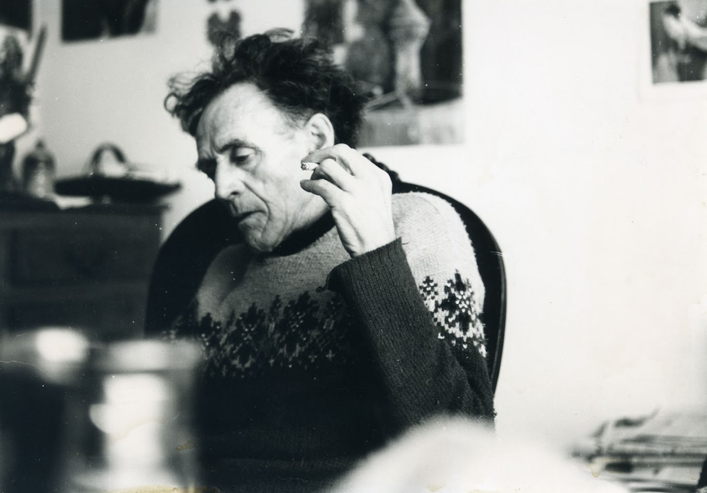

# ZEILER .me - IT & Medien, Geschichte, Deutsch - Pavel Thalmann (1901 - 1980)

Gespräch mit Pavel Thalmann

(Detlef Zeiler, Jürgen Künzig; Nizza, April 1975)

*Vorgeschichte: Schon seit längerer Zeit wurde innerhalb der studentischen Linken nicht mehr nur von den Problemen und Auswirkungen der russischen Revolution von 1917 gesprochen. Der Karin Kramer-Verlag und besonders H.M. Enzensberger ha­ben sich um die Popularisierung der Auseinandersetzungen im Spanien von 1936/37 verdient gemacht. Beim Lesen des Durruti-Buches von Enzensberger ("Der kurze Sommer der Anarchie") ging es uns wie vielen anderen Studenten, denen die Vorgänge um die spanische Revolu­tion noch kaum bekannt waren: Das Interesse am Thema war geweckt, nachdem einem der Begriff 'Anarchismus' nur mehr in zwei vagen Interpretationen bekannt war: a) kleinbürger­licher, bäuerlicher oder intellektueller Linksradikalismus;b) Ablehnung langfristiger politischer Strategien. "Der kurze Sommer der Anarchie" schien uns nach erstmaliger Lektüre (das Gefühl, auf etwas Neues gestoßen zu sein, ließ einen das Buch hastig durchblättern) wieder eine Vorstellung von Uto­pie zu geben, die über die nur politisch vermittelten Freiheits-und Gleichheitsvorstellungen hinausging. Die anfängliche Euphorie wurde jedoch schnell durch Fragen ersetzt, die im "Roman" ungeklärt blieben und von denen Enzensberger vorgab, sie der Phantasie des jeweiligen Le­sers zu überantworten. Diese im "Roman" verstreuten und leicht zu überlesenden Fragen verlieren sich im 'Puzzle' um den Helden Durruti. ("Die Rekonstruktion gleicht einem Puzz­le, dessen Stücke nicht nahtlos ineinander sich fügen lassen." Enzensberger) Durruti, so unverwundbar wie Robin Hood, schien uns bei nochmaliger Lektüre weder das Profil eines "proletarischen" Kämpfers ("exemplarischer Einzelkämpfer", S.260), noch die Problematik einer „revolutionären Avantgar­de“ zu umreißen.*

*Der "Roman" ist die Geschichte eines Helden, in dem ein "pro­letarisches Profil" Gestalt gewinnen soll. Enzensberger in­sistiert in diesem Zusammenhang auf die Differenz zum bür­gerlichen Entwicklungsroman. Die Hauptgestalt wird nicht psychologisch gefüllt, sie ist kein Charakter. Dies lässt freilich die Bezeichnung "Roman" fragwürdig erscheinen. Der Text, eine "kollektive Fiktion" ohne Erzähleridentität mar­kiert dabei kaum einen Durchbruch zu einer neuen, dem Gegen­stand angemessenen Form des Romans; er geht zurück auf die Stufe des Epos. Der Held Durruti, der kugelsicher 1000 Ge­fahren entkommt, macht den Charakter einer proletarischen Bewegung weniger erkennbar, als dass er ihn im mythischen Nebel belässt.*

*Als wir nun Mitte April den ehemaligen Spanienkämpfer Pavel Thalmann in Nizza besuchten, haben wir versucht, einige offen gebliebenen Fragen vermittelt über seine eigenen Erfahrungen so zu formulieren, dass sie auch heute noch politische Erkenntnisse vermitteln. Vor dem Gespräch mit Pavel hatten wir sei­ne Ende 1974 im Walter Verlag erschienene Biographie "Wo die Freiheit stirbt" gelesen. Der im Jahre 1975 74-jährige Revolutionär beschreibt darin seine Erfahrungen von der Schweizer kommunistischen Jugend über die Moskauer "Arbeiter Universität" (1925-28) bis zum spanischen Bürgerkrieg. Als junger Kommunist, noch beeindruckt vom Erfolg der rus­sischen Revolution, muß er in Russland selbst die Auswirkun­gen der stalinistischen Reaktion miterleben. In die Schweiz zurückgekehrt, konnte er nicht mehr lange mit der offiziel­len KP zusammenarbeiten. Entscheidend geprägt wurde seine Kritik der Kommunisten durch die Erfahrungen im revolutio­nären Spanien von 1936/37. Zusammen mit seiner Frau und Kampfgenossin Clara stellt er sich dort auf die Seite der Anarchisten und POUM-Milizen, die sich im Maiaufstand 1937 in Barcelona auch den stalinistischen Erpressungsversuchen entgegenstellten. Der Aufstand wurde niedergeschlagen. Die GPU, damals wohl der bezeichnendste Beweis des russi­schen Internationalismus, verhaftete beide schließlich und hielt sie monatelang in von aufrechten Antifaschisten über füllten Gefängnissen fest. Durch Vermittlung von Freunden, der sozialistischen Internationalen und der spanischen Re­gierung gelang es ihnen, in das Volksfrontfrankreich zu entkommen. Leider ist der dann folgende Abschnitt ihres gemeinsamen Kampfes gegen Faschismus und Stalinismus in die Biographie noch nicht aufgenommen.*

*Pavel und Clara haben sich später eine Art Landkommune in den Bergen über Nizza aufgebaut. Heute, d.h. 1975, treffen sich hier linke und demokratisch engagierte Jugendliche der verschiedensten Richtungen und aus den verschie­densten Ländern.*

D.: Wie viele, die die Rebellion der Jugendlichen, der Studenten-und Sohülerbewegung noch erlebt haben, mußten wir beobachten, wie sich ein immer stärkerer Trend in der westdeutschen Linken herausbildete, sich in die Tradition der alten Arbeiterbewegung zu stellen. Wer nicht in die SPD, DKP, bzw. deren "demokratische" Ableger eilte, suchte seine ideologische Sicherheit in einer der vielen ML-Organisationen, die sich gegenseitig den richtigen "Leninis­mus" streitig machen. Einige wenige betrachten sich als Anarchisten, große Teile der Linken stehen jedoch wie wir auch ohne weitergehende praktische Perspektive da. Sicher kannst du uns nicht die Alternative nennen, viel­leicht läßt sich das Problem aber leichter erfassen, wenn du uns von deiner Erfahrung mit der Arbeiterbewegung und der gerade bei Intellektuellen oft attraktiven leninisti­schen Theorie berichtest. P.: Ja, wie soll man da anfangen? Man müßte natürlich zurückgehen bis auf die drei russischen Revolutionen, die stattgefunden hatten» Die erste von 1905, wo zum ersten Mal in größerem Maßstabe eigene Organe der Arbeiterklasse entstanden sind, die Sowjets, die Räte„- Dann die beiden von 1917. - Und das typische für Räte ist eben, daß sie histo­risch neue Organe sind - Lenin hat das in der Kritik der Pariser Kommune richtig dargestellt - Organe, die sowohl legislative, gesetzgeberische, als auch ausübende Gewalt sind; im Gegensatz zum bürgerlichen Staat. Die Räte sind von Natur aus Organe der Arbeiterklasse, in denen alle Tendenzen innerhalb der Arbeiterklasse vertreten sind, seien es politische, seien es gewerkschaftliche. So waren im Sow­jet von Petrograd 1905 Sozialrevolutionäre, Bolschewiken, Menschewisten und Anarchisten vertreten.

Nehmen wir die deutsche Revolution von 19l8, um bei Deutschland zu bleiben: Die Räte sind auch hier - angefangen von Kiel, Bremen, dann Hamburg und Berlin - spontan entstanden. Sie sind nicht einmal unbedingt nach dem russischen Muster entstanden. Und in diesen Räten waren fast alle Parteien vertreten: Die unabhängigen Sozialisten, die USPD und die Mehrheitssozialdemokraten, auch die Kommunisten. Nur: Die Kommunisten waren eine verschwindende Minderheit. Diese Räte in Deutschland wurden von den Mehrheitssozialdemokra­ten beherrscht und von diesen einfach umgemodelt in ganz gewöhnliche Wirtschaftsorgane, was wir heute in Deutschland noch haben: Betriebsräte. Das ist zwar die alte ehemalige Form der Räte, aber die politische Spitze wurde abgebro­chen, sowohl von der SPD, als auch von der linken USPD -obwohl die USPD immer hin und her schwankte, sehr viele re­volutionäre Mitglieder hatte.

Solche Führer wie Rosa Luxemburg und Karl Liebknecht, die Kandidaten waren in den großen Arbeiter- und Soldatenräten in Berlin, wurden nie gewählt, waren eine ganz kleine Min­derheit.

In Russland waren es die Kommunisten, die die Räte zerstört haben. Die hatten schon Anfang der 20er Jahre eine ähnli­che Funktion erfüllt, wie in Deutschland die Mehrheitssozialdemokratie. Alle anderen Parteien wurden ausgeschalten aus den Räten - und zu was hat das geführt? Zur Parteiherrschaft der Bolschewiki.

D.: Aber Lenin hatte doch versucht, das Rätekonzept mit dem Parteikonzept zu verbinden.

P.: Ja, er hat es versucht. Aber man weiß doch heute, was er in seinem politischen Testament darüber geschrieben hat Er hat in den letzten Jahren seiner politischen Aktivität die Gefahr der Bürokratie gesehen, sowohl in der Partei, als auch im Staat. Staat in Russland, das hieß dann ganz einfach: Herrschaft einer Partei. Es gibt in Russland bis heute kein anderes Herrschaftsmonopol. Aber, um bei den Räten zu bleiben, die Räte, also die wirk­lich revolutionären Organe der Arbeiterbewegung haben bis­her in der Geschichte nie einen langen Stand gehabt; sie sind immer wieder von den traditionellen Parteien zerstört worden. Aber das interessante dabei ist: Bei jeder großen Massenerhebung entstehen immer wieder diese Bäte, sei es in der deutschen Revolution, sei es in der ungarischen Rebellion, wo die Bäte auch spontan entstanden sind, und zwar gegen die kommunistische Partei (in Budapest haben sie doch den großen zentralen Arbeiterrat gebildet, wo auch die verbotenen Sozialdemokraten wieder auftauchten), oder sei es in Spanien, wo alle diese hunderte, tausende von Komitees in den Dörfern und Städten -auch die Gewerkschaften unter anarchistischem Einfluss - tatsächlich die Macht hat­ten. Also: Gegen die Lenin'sche Parteikonzeption stellen wir die Konzeption der wirklichen Machtorgane der Arbeiterklasse, die Bäte. Aber sie müssen eben alle Tendenzen der Ar­beiterbewegung enthalten, auch wenn es "menschewistische" sind, auch wenn es reformistische sind, - und der ideologi­sche Kampf hat in diesen Bäten stattzufinden bis sich eine neue Gesellschaft entwickelt hat.

Dann ist die große Frage - die hat Lenin, sogar Dutschke noch in seinem neuen Buch nicht richtig gesehen: Sind die Räte nur spontane Organisationen, die sich in einer re­volutionären Situation herausbilden, oder werden sie neue strukturelle Organisationen einer kommenden sozialisti­schen Gesellschaft sein? Das ist die ganze Frage. Und, ich glaube, die Arbeiter-Bauern- und Soldatenräte (wenn es Soldaten gibt), das sind die künftigen Organe einer soziali­stischen Gesellschaft, die gesellschaftlichen Organe, auf deren Grundlage eine neue Gesellschaft entstehen kann, in der der Staat überflüssig wird. Das hat Lenin nicht rich­tig gesehen. Für ihn und für seine Nachfolger war die Par­tei immer das wichtigere.

J.: Die bolschewistische Parteiideologie scheint aber auch heute noch viele Intellektuelle zu faszinieren...

P.: Ich glaube, das rührt zum großen Teil daher, daß es im Zusammenhang mit der Entstehung und der Entwicklung der russischen Revolution eine unheimliche Legendenbildung um die Rolle der kommunistischen Partei gegeben hat. Diese Legendenbildung ist heute noch nicht durchbrochen. Bei uns hat das angefangen mit Kronstadt. Das wesentliche dabei war« Was haben die Matrosen von Kronstadt verlangt? Sie hatten Räte verlangt, in denen alle Parteien vertreten sein sollten, nicht nur die kommunistische Partei} und in ihrer Konzeption haben sie dann sogar gesagt: Kommunisten raus aus den Räten! -eben weil diese alles beherrscht hat­ten. Das war, wenn du willst, übertrieben, aber sie woll­ten die Herstellung von wirklichen Sowjets, so wie sie 1905 bestanden hatten. (1)

Es gibt eben eine Rätedemokratie, wo alle Parteien, alle Tendenzen innerhalb der Arbeiterbewegung vertreten sind, es können sogar bürgerliche sein, solange die nicht mit der Waffe in der Hand gegen eine Räteregierung ankämpfen, dann ist natürlich Schluß!

Das war ja bei der ganzen Konzeption der Rätedemokratie die Frage der politischen Polizei, die Frage der Gewalt, wie sie ja auch von Enzensberger gestellt wird. Darauf jedes Mal wieder eine richtige Antwort zu finden, das ist die Aufgabe von Revolutionären. Wieso kommt es dabei aber im­mer wieder zur Parteiherrschaft? Da die Räte wieder ver­schwinden, wenn eine revolutionäre Massenaktion absackt, - und das ist ja immer der Fall, du kannst z.B. nicht mona­telang Generalstreik machen, die Leute müssen ja fressen; wir haben das ja in Spanien auch erlebt; ja, das ist doch klar - dann bleibt was? Dann bleiben eben die alten tradi­tionellen Organisationen, dann bleibt die bolschewistische Partei, die gerade über die kommunistische Internationale unter Führung der Russen die Räte immer wieder verdrängt und an ihre Stelle die Lenin'sche Parteikonzeption setzt.

D.: Was bei J.s Frage noch mitgemeint war, war doch, daß Intellektuelle sich über die bolschewistische Partei Ideologie bis heute gerne mit einer Herrschaftsfunktion in die Arbeiterbewegung einreihen. Das ist ja eine ganz alte Sa­che. Nehmen wir Kautsky. Das war ein Sozialist, der ver­sucht hatte, vom Schreibtisch aus revolutionäre Entwick­lungen zu planen, mit radikalen Worten anzuleiten. Lenin hat sich ja zuerst stark auf ihn bezogen. Er hat dann auch gehandelt und ich würde ihn selber auf alle Fälle als Re­volutionär bezeichnen...

P.: Zweifellos!

D.: Mit dem "Leninismus", was ja erst von Stalin so ge­nannt - wurde, kam aber wieder so etwas wie eine Intellektuellenherrschaft über eine noch halbwegs intakte Arbeiter­bewegung auf.(Von der Frage der "Bürokratie" will ich hier etwas absehen) P.: Wenn du die russischen Berufsrevolutionäre anschaust, die ja die Grundlage der Lenin'schen Partei waren, dann waren das vielleicht 5% Arbeiter. Nimm die ganze Führung der russischen Revolutionäre, von Bucharin, Lenin bis Sta­lin... Das war der überwiegende Einfluss der Intellektuel­len auf die Arbeiterbewegung, auf eine Partei, die von den Interessen der Arbeiter ausgehen wollte. Nehmen wir nun die revolutionäre Situation in Deutschland von 1918-23, die großen Massenaktionen wie den General­streik gegen den Kapp-Putsch, der März-Aufstand oder der Oktober-Aufstand 23, das war nicht von den großen Parteien geführt. Das wurde von linkssozialistischen und linksgewerkschaftlichen Gruppen geführt. Die Zusammenschlagung des Kapp-Putsches, das kam durch die Gewerkschaft. An der Ruhr hatte sich eine richtige "Ruhr-Armee" gebildet; da hatten die Kommunisten nichts zu sagen. Das waren anarchistische Elemente, gewerkschaftliche Elemente, die ganz links standen, die haben sich spontan zu einer roten Armee organisiert. Die Kommunisten wurden mitgerissen, sie hatten nicht die Führung.

Da ist auch das Beispiel Max Holz in Mitteldeutschland. Holz kam aus der Arbeiterschicht. Er war kein Revolutionär mit einer großen Theorie, aber er hat immerhin die Arbeiter­schaft organisiert, hat reiche Leute zu Abgaben gezwungen für die armen. Er war ein revolutionärer Rebell; - das waren mehr oder weniger spontane Aktionen, die herausgewachsen sind aus Bedürfnissen der Arbeiterschaft. Max Holz, das war nicht die KPD. - Das war eben der Unterschied zu den Berufs­revolutionären.

Genauso war es in Spanien. Die Anarchisten waren keine Be­rufsrevolutionäre im Sinne von Lenin. Sie waren keine Funk­tionäre, die ausgehalten wurden entweder von einem Gewerk­schaftsapparat oder von einem Parteiapparat… Die hatten im Betrieb ihr Leben verdient. - Oder sie haben dann Banken überfallen. Durruti hat Banken überfallen mit Ascaso zusam­men in Bilbao. Was haben sie mit dem Geld gemacht? Sie ha­ben Schulen, anarchistische Schulen gegründet. Das konnte man damals. Durruti ist nachher wieder in den Betrieb zurückge­kehrt. Kein Pfennig ist an ihren Händen hängengeblieben. (Gut, die russischen Bolschewiken haben das z.T. auch gemacht) Anarchisten haben Schulen gegründet gegen die katholischen Schulen in Cádiz usw., auch Kooperativen - mit geraubtem Geld. Das war eine durchaus revolutionäre Haltung.

**D.:** Zu der deutschen KP: Da gab es aber auch immerhin sol­che Arbeiter wie Thälmann, die in der Partei etwas zu sagen hatten. Thälmann war ja sogar Parteivorsitzender!

**P.:** Ja, das mit Thälmann, das sind natürlich größtenteils Märchen. Thälmann war ein Hafenarbeiter, aber er hat ja nie die Partei geführt. Um ihn herum waren ja so viele Leute, die ihm die Texte für seine Reden geschrieben haben. Er konnte auftreten in Versammlungen: Ich hab ihn einmal ge­hört im Berliner Sportpalast - der Mann stand auf der Bühne und war vollkommen besoffen. Er konnte aber trotzdem schrei­en und reden, und das hat den Leuten doch immerhin noch im­poniert. - Im Herbst 1928 kam es durch den sogenannten Wit­torf-Skandal zu einem offenen Kampf in der Partei. Wittorf, Sekretär der Bezirksleitung Wasserkante, hatte laufend grös­sere Summen von Parteigeldern unterschlagen. Das Zentralkomitee sandte zwei Kontrolleure nach Hamburg, um die Affäre zu untersuchen; es waren Hugo Eberlein und Erich Hausen. Wittorf, Schwager und ehemaliger Saufkumpan von Thälmann, war nur durch die Bekanntschaft mit Thälmann in die KPD geraten. Thälmann wußte von den Unterschlagungen und wollte alles vertuschen.

Den 2 Abgesandten des ZK gegenüber erklär­te er sich bereit, das unterschlagene Geld persönlich zu­rückzugeben. Eberlein und Hausen lehnten ab. Die Fraktionen der Rechten und der "Versöhnler" benutzten den Skandal, um Thälmann und seine Clique zu stürzen. In einer stürmischen Sitzung (an der Wilhelm Pieck sogar den Ausschluß Thälmanns forderte) wurde beschlossen, die Angelegenheit dem Exekutivkomitee der Internationalen vorzulegen und bis zu einem Be­schluß dieser Instanz Thälmann von seinen Funktionen zu ent­binden. - Es kam aber ganz änderst Stalin, der zu dieser Zeit die Alleinherrschaft fast erreicht hatte, griff ein. Er konnte einen Sieg der Rechten und "Versöhnlerischen" Fraktionen in der KPB nicht dulden. Darum nicht, weil die deut­schen Rechten und "Versöhnler" Anhänger von Bucharin waren, der noch immer Präsident der Kommunistischen Internationa­len war. Eine Stärkung Bucharins in der größten kommunisti­schen Partei außerhalb Rußlands hätte ihm Schwierigkeiten bereitet. Ohne zu zögern verfügte Stalin: Thälmann bleibt Parteiführer! So geschah es; die „Versöhnler" kapitulierten, die Rechten wie Brandler und Thalheimer wurden ausgeschlos­sen. Es waren also machtpolitische Umstände in Rußland, die über das Schicksal von Thälmann und der KPB entschieden. Thälmann war ein proletarisches Aushängeschild! ein Hafen­arbeiter als Präsident der kommunistischen Partei, das ist doch eine große Sache gegenüber einem Scheidemann oder ei­nem Ebert.

Die DDR hat dann eine große Legende um Thälmann gebildet. Er hat aber z.B. an den Kämpfen im Oktober (2) nur spora­disch teilgenommen} die wirkliche Rolle im Oktober hat der Kippenberg gespielt, das war der Mann, der den Nachrichtenapparat der KP aufgebaut hat, es war ein ehemaliger Mili­tärspezialist, ein ehemaliger Offizier. Aber die Sache war ja von Anfang verloren gewesen. Moskauer Agenten wie Bela Kuhn, die haben die Weisungen überbracht und gesagt, so und so muß es gehen. Der Brandler hatte eingewandt: wir ha­ben die Mittel nicht - und sie haben ihn trotzdem gezwun­gen, diese Aktion durchzuführen. Thälmann war ein braver Mann, aber mehr wie ein Kreisleiter in irgend einem Bezirk konnte er nicht sein.

Auch der tragische Tod von Ernst Thälmann hat noch seine Hintergründe: mehrmals hätte Thälmann gegen deutsche Gefan­gene ausgetauscht werden können; Ulbricht und Pieck wider­setzten sich. Thälmann als Märtyrer war ihnen ein erstklas­siges Propagandastück. Stalin lieferte während des Paktes mit Hitler deutsche Kommunisten an Hitler aus, den Ernst Thälmann verlangten die Russen nicht.

D.: Vielleicht kommen wir wieder auf die mögliche Alterna­tive zur KP zurück, auf die du schon angespielt hast, näm­lich die anarchistische Bewegung in Spanien. Gegen die Anarchisten traten immer wieder solche Urteile auf wie« "klein­bürgerliche Ideologie", "isolierte Bauernrevolte", "keine festen politischen Vorstellungen", "ohne ökonomisches Übergangskonzept" etc. Wie beurteilst Du so was auf dem Hinter­grund Deiner Erfahrungen in Spanien?

P.: Das ist eine alte Verleumdung der Kommunisten, der Anar­chismus sei eine kleinbürgerliche Bewegung. Sie sollen doch bitte mal erklären, warum in Katalonien die anarchistische Bewegung so stark gewesen ist, daß sie sogar die absolute Mehrheit in der Bevölkerung darstellte - und Katalonien ist ja bekanntlich der industriell entwickeltste Teil von Spanien. Genau hier war der Anarchismus die stär­kste Bewegung in der Arbeiterschaft. Sie katalanischen Anarchisten in der Textil- oder in der Metallindustrie, na­türlich kamen die aus der Bauernschaft, vom Land; aber et­wa die russischen Arbeiter, die russischen Revolutionäre nicht auch?

Eine solche industrielle Reservearmee wie in Westeuropa, wo die Industrie natürlich schon ganz anders entwickelt war, das gab es nicht. Aber deshalb sind die Anarchisten doch nicht kleinbürgerlich.

D.: Dazu kommt ja die 'leninistische' Einschätzung, daß auch keine ökonomischen Übergangsforderungen, kein Über­gangskonzept da waren, auch keine längerfristigen Strate­gien - was ja immer ein Zeichen von Kleinbürgerlichkeit gewesen sein soll. Das Kleinbürgertum könne ja grundsätz­lich keine eigene Perspektive entwickeln.

P.: Auch das stimmt nicht. Die Anarchisten haben nicht ei­ne so ausgefeilte Theorie über die Entwicklung der Geschi­chte, wie der Marxismus; der Marxismus als Arbeitsmethode, um geschichtliche Entwicklungen zu erklären, ist ausgezeichnet, darüber braucht man nicht lange zu diskutieren. Aber zu sagen, die Anarchisten hätten überhaupt keine theoretische Konzeption, ist vollkommen falsch. Sie hatten eine Konzeption, und das war der freiheitliche Sozialis­mus. Ihre Konzeption bestand im Gegensatz zu den Kommu­nisten darin, daß sie jede Staatsform ablehnten; jede, auch die sogenannte "proletarische". Sie wollten den Staat zer­stören und neue Strukturen aufbauen, eben die Räte. Andere Formen hat man bis heute nicht gefunden.

1936, etwa 3-4 Monate vor dem Franko-Putsch, hat in Sara­gossa, einer Hochburg der anarchosyndikalistischen Bewe­gung, eine nationale Konferenz, ein Kongress stattgefunden. Und auf diesem Kongress haben sie bis ins einzelne darge­stellt, wie die Industrie direkt von Arbeitern geleitet werden soll, wie das Land kollektiviert - also d.h. eine vollkommen neue, man kann sagen utopische Darstellung, wie eine Übergangsbewegung sein soll. Und als der Bürgerkrieg ausbrach, haben sie das zu einem großen Teil verwirklicht. Die Gewerkschaften, die Betriebskomtees, Aktionsausschüsse die haben die Leitung der Betriebe selbst in die Hand ge­nommen und haben sie vollkommen umorganisiert. Da, wo es möglich war, haben sie mit den ehemaligen Besitzern zusam­mengearbeitet, wenn die bereit waren - aber sie mußten un­ter der Kontrolle der gewerkschaftlichen Bewegung und der Betriebskomitees arbeiten, unter Arbeiterkontrolle. Und wenn sie Sabotage machten, dann sind sie eben verschwunden. Wie kann man also behaupten, die Anarchisten hatten über­haupt keine Konzeption?

Unter den Bedingungen des Bürgerkriegs, 1938, also das war schon nach der Niederschlagung des Maiaufstandes in Barcelona, hatten die Anarchisten in Valencia wieder eine Kon­ferenz, wo sie die ganzen Übergangskonzepte neu bestätigt haben. Sie hatten eine ziemlich klare Vorstellung davon, was man machen sollte. Sie haben daraus keine große Theorie ge­macht und lange vom "Absterben des Staates" geredet; sie ha­ben praktisch den Staat zerstört, genauso wie sie es darge­stellt hatten.

D.: Vielleicht könnte man zu dem ökonomisch-sozialen Aspekt noch den politischen hinzunehmen. Unter der studentischen Linken ist das Enzensberger-Buch "Der kurze Sommer der Anarchie" ziemlich bekannt geworden. Enzensberger kritisiert nun die Anarchisten als zu unpolitisch, unkoordiniert und konzeptlos (Er hat dazu den alten Engels zitiert).Wenn‘s konkreter wird, bleibt er jedoch bei vagen Andeutungen. So z.B. bei der Frage des Eintritts der Anarchisten in die Re­gierung.

P.: lch glaube, Enzensberger hat das nicht richtig gesehen. Es stimmt nämlich auch nicht, daß die Anarchisten keinen einheitlichen Blick dafür hatten, was geschehen sollte. In den vielen Komitees, da haben sie sich laufend darum be­müht - und nicht umsonst haben sie '38 in Valencia noch ein­mal ihre ganze Konzeption besprochen. Sie hatten einen na­tionalen Plan aufgestellt, wie die Industrie und die Land­wirtschaft geleitet werden sollte. Aber um diese zahllosen Komitees wirklich zu koordinieren, dazu hatten sie die Zeit nicht, eben weil es den Bürgerkrieg gab und zweitens, weil es die (inneren) Auseinandersetzungen mit der kommu­nistischen Partei gab, die sich von Anfang an gegen diese Komitees gewandt hatte und behauptet hatte, diese Leute sind "unkontrollierbar" - das heißt doch, die KP wollte sie kontrollieren.

Aber - und dieses Problem stellt Enzensberger überhaupt nicht - hätte man in Spanien allein überhaupt siegen können? Das ist die ganze Frage. Und da darf man nicht vergessen: Das einzige Land (von Portugal einmal abgesehen), das zu Spanien überhaupt eine Grenze hatte, war Frankreich. Und in Frankreich herrschte die Volksfront, die Linke war in der Regierung unter Leon Bluhm - unterstützt von den Kommunis­ten. Wäre nun diese Volksfrontbewegung mit russischer Un­terstützung in eine revolutionäre umgewandelt worden und hätte sie wie in Spanien die Macht ergriffen,- diese Möglichkeit hatte während kurzer Zeit bestanden - dann wäre die ganze Geschichte anders gelaufen. Ich glaube, der Schlüssel zum Verständnis der spanischen Möglichkeiten liegt genau hier auf der internationalen Ebene. Eine Ausweitung des spanischen Bürgerkriegs auf Frankreich, natürlich innerhalb der französischen Verhältnisse, das hätte die gesamte Weltsituation weitgehend verändert. Vielleicht wäre der Krieg vor­her ausgebrochen; aber er ist ja 7 Monate nach dem spanischen Zusammenbruch trotzdem gekommen. - Leon Bluhm hat nicht eingegriffen, weil er Angst hatte vor einem Kriegsausbruch. Der Leon Bluhm, das war ein elender Seicher; wenn er auch ehrlich war, es war kein Revolutionär. Aber was haben die französischen Kommunisten unter russischem Einfluss hier in Frankreich gemacht? Der große Mann, der die ganze Poli­tik der Kommunisten während der Volksfront geleitet hat, war der Ukrainer Manuilski; das war die rechte Hand von Stalin, der hat hinter den Kulissen die Politik der französischen Kommunisten diktiert, dirigiert nach Weisungen aus Moskau. Diese Weisungen waren nicht, die Macht zu ergreifen, son­dern die Volksfront auszuweiten zu einer nationalen Front. Das hieß damals, man muss auch weite Kreise der Bourgeoisie in die Volksfront hineinbringen. Stalin hatte kein Vertrau­en zu einer linken Bewegung. Er hatte vertraut in eine starke Bourgeoisie - so was haben wir heute noch in der russi­schen Außenpolitik. Und darum "nationale Front". Immer mehr Teile des Kleinbürgertums und der Bourgeoisie sollten in die Front integriert werden...und dann die Macht ergreifen. Aber das ist natürlich keine proletarische Revolution, allenfalls eine linksbürgerliche unter kommunistischem Einfluss. Die französischen Arbeiter haben ihre Fabriken besetzt im Juni 36, das ist bekannt. Sie haben aber vor allem was er­reicht? Bezahlte Ferien, zum ersten Mal bezahlte Ferien. Da hat die große Masse der französischen Arbeiter das Meer, z.B. die Cóte d'Azur, entdeckt - und seit '36 ist das doch eine Massenbewegung hierher geworden. Die Arbeiter hatten die 40-Stunden Woche bekommen. Das wurde jedoch als Beitrag zum "antifaschistischen Kampf" wieder geopfert; Wie eine ganze Menge Errungenschaften ist auch diese ganz einfach wieder verschwunden unter dem Hitlerdruck.

Also das Problem der spanischen Revolution war ein interna­tionales. Da keine internationale Hilfe kam, musste Spanien untergehen. Gegen ein deutsch-italienisches Eingreifen hät­te nur eine französische Revolution die Situation ändern können. Das sieht der Enzensberger nicht. Enzensberger sieht auch nicht, daß die spanischen Anarchisten über das, was wir "Fortschritt" nennen, eine ganz andere Auffassung hatten. Die ganze Konsumgesellschaft, die wir haben, das hat die spanischen Anarchisten fast nie interessiert. Sie woll­ten eine Gesellschaft, nicht zurück zu irgendwelchen Begrif­fen von Rousseau oder so zurück zur Natur; aber sie wollten die ganzen Privilegien innerhalb der Arbeiterbewegung, diese ganze Hierarchie nicht aufkommen lassen. Für sie war es nicht so wichtig, daß man gut zu essen hat, wenn nicht alle gut essen konnten; das ist es eben. Das hat der Franz Borkenau, den wir ja gut kannten, gut erkannt. Enzensberger zitiert ihn, trotzdem hat er ihn kaum begriffen. Aber um auf die andere Frage einzugehen: Warum sind die Anarchisten in die Regierung eingetreten? Das ist natürlich eine wesentliche Sache. Im Prinzip lehnen die Anarchisten ja jede Regierung ab, weil sie eben jeden Staat ablehnen. Sie haben sich bei den Wahlen nie beteiligt, mit wenigen Ausnahmen. 1934, nach dem asturischen Aufstand saßen 3oooo im Ge­fängnis. Sa haben sie die Parole ausgegeben! Wir beteiligen uns am Wahlkampf - und dann hat die Volksfront 1936 auch gesiegt, weil 2 Millionen anarchistische Wähler zum ersten Mal in Spanien gestimmt haben. Dann wurden die Gefangenen auch freigelassen, d.h. sie haben sie sofort rausgeholt aus den Gefängnissen. Sie haben eben nicht gewartet auf ein Sekret der Regierung. Aber warum sind die Anarchisten später in die Regierung eingetreten? Einmal: Es musste natürlich eine Allianz gegen Franko geschaffen werden, das war ganz klar. Und dann gab es auch Tendenzen in der anarchistischen Bewe­gung, die eben die ganze anarchistische Utopie einer künfti­gen Gesellschaft verloren haben. Sie vier anarchistischen Minister, die eingetreten sind, haben geglaubt, man muß in die Regierung eintreten, um die Einheitsfront gegen Franko zu bilden. Das war aber ein Bruch mit der ganzen anarchistischen Theorie - und die anarchistische Basis war weitgehend dagegen. Also, das war das erste: Es gab Schwächen inner­halb der anarchistischen Bewegung. Aber das zweite war,daß die kommunistische Partei unter dem Einfluß der Russen da­rauf gedrungen hat: Sie Anarchisten müssen in die Regierung. Aus zwei Gründen; Ersten haben die ganz richtig kalkuliert, daß sie die Anarchisten in der Regierung besser unter Kon­trolle haben; dort werden sie auch eine Regierungsverantwor­tung übernehmen müssen: Sie sind dann mitverantwortlich für das, was die Gesamtregierung macht. Und diese Kalkulation war durchaus richtig. Dann war die andere Kalkulation der Kom­munisten, die ganz genau wussten, was die anarchistische The­orie besagt» Wenn wir es fertigbringen, daß Anarchisten in die Regierung eintreten, dann werden wir einen Spaltpilz in die anarchistische Bewegung hineintragen. Und das ist ja ge­lungen, sie konnten die vielen Komitees spalten und z.T. unter ihre Kontrolle bringen. Es war - wie immer - eine ge­schickte kommunistische Taktik, um die anarchistische Bewe­gung zu zerstören.

Mit den russischen Waffenlieferungen und der riesigen Pro­paganda, die man damit gemacht hat, mit den internationalen Brigaden etc. ist die kommunistische Partei ungeheuer gewachsen. Und die Leute, die dann gesehen haben, die Kommunis­ten sind gar nicht so schlecht, sind gar keine Revolutionä­re, sind in die KP eingetreten, da waren selbst Großgrund­besitzer dabei(dann wurde das eine ungeheure Kraft und hat­te die Möglichkeit, mit den anarchistischen Ministern zu­sammen, die anarchistische Bewegung z.T. unter Kontrolle zu bringen und zum anderen Teil erst noch zu spalten. Wir haben damals gesagt, die Maitage 37 in Barcelona, das war das spanische Kronstadt.- Der Enzensberger sieht das nicht.(3) Natürlich hinken alle Vergleiche, aber was ist die Gemeinsamkeit? Was wollten die Anarchisten mit ihrem Maiaufstand? Sie wollten ganz einfach die Herrschaft der KP brechen und wieder zurück zur revolutionären Tradition, wo alle Parteien in den Bauern- und Arbeiterkomitees ver­treten waren. Das war genau dasselbe, was die Matrosen von Kronstadt wollten; die wollten freie Sowjets. Insoweit ist also die historische Parallele zwischen Kronstadt 1921 und Barcelona Mai 1937 durchaus berechtigt. Die wirklich revo­lutionäre Richtung innerhalb der spanischen Arbeiterschaft -da haben auch Sozialisten mitgemacht und die POUM- die hat sich gegen die kommunistische Vorherrschaft gewendet, die wollte sie brechen.

D.: Das waren also nicht nur die Anarchisten, die gegen die Stalinisten waren, sondern auch die POUM, also die Trotzkis­ten.

P.: Nein, nein, die POUM, das waren nicht Trotzkisten! Das ist auch eine Lüge der Kommunisten. Die POUM ist entstan­den aus Abspaltungen der KP Spaniens. Zuerst waren das Joaquin Morin, Gorkin und Andrade. Maurin und Gorkin, das wa­ren - wenn du willst - rechte Kommunisten. Sie haben eine eigene Arbeiter- und Bauernpartei gegründet. Nachher gab es dann eine linke Abspaltung in der KP Spaniens, geführt von Andrade und André Nin, den sie später ermordet haben; -und die haben sich dann vereinigt. Zusammen haben sie die POUM gegründet, die vereinigte marxistische Arbeiterpartei. Nin, ein ehemaliger Freund von Trotzki, und Andrade, das waren ursprünglich Trotzkisten. Aber eben, die haben mit dem Trotzkismus gebrochen, indem sie sich zusammengeschlossen haben mit der Maurin-Gruppe. Es gab noch trotzkistische Tendenzen in der POUM, aber im Prinzip hat sie nie die trotzkistische Theorie vertreten. Ich habe ja noch ein bis­chen trotzkistische Propaganda bei der POUM gemacht. Die hätten mich glatt erschießen lassen; also, das gab es bei der POUM auch. Es gab einen starken rechten Flügel innerhalb der POUM, die haben mit den Trotzkisten kurzen Prozess gemacht, sie haben auch welche erschossen - das muß man auch wissen. Die POUM war eine revolutionäre Partei, nur stand sie zwi­schen den Kommunisten und den Anarchisten. Die Anarchisten wollten nicht so recht mit ihnen zusammenarbeiten, weil es ja Marxisten waren. Und es gab auch noch mehr oder weniger stalinistische Tendenzen innerhalb der POUM, was einer Zu­sammenarbeit mit den Anarchisten im Wege stand. Bei den Mai-Ereignissen haben viele Mitglieder der POUM mitgekämpft gegen die Stalinisten. Aber die Führung der POUM - nicht der Nin, der ist sofort verschwunden, aber der Gorkin und der Rowiera- die hatten über 1000 Leute, ihr Bataillon de Choque, da waren viele deutsche Emigranten darunter, die ha­ben sie nicht auf die Straße gelassen, die waren kaserniert. Ein großer Teil der Mitglieder, der zivilen Mitglieder sozu­sagen, stand mit den anarchistischen Arbeitern auf den Barrikaden und hat die kommunistischen Parteihäuser umzingelt. Aber die Führung hat geschwankt, die wußte nicht, was ma­chen. Sie etwa 1ooo gut bewaffneten POUM-Milizen haben sie jedenfalls nicht eingesetzt. So waren die anarchistischen Arbeiter und Teile der POUM-Arbeiter allein. So wurde Bar­celona 1957 zum spanischen Kronstadt.

D.: Aber wie hätte man innerhalb des notwendigerweise brei­ten Bündnisses gegen den Faschismus als Linker kämpfen kön­nen, als Linker, der sich im Kampf noch selbst verändern will, der die "soziale Frage" nicht verschieben will auf ir­gendwann mal?

P.: Ich meine, das große Problem war natürlich für alle, die außerhalb von Franko-Spanien standen: Wie kann man den Krieg gegen Franko gewinnen? Wir und große Teile der Anar­chisten, auch Teile der POUM, haben gesagt: Dieser Krieg kann nur durch revolutionäre Mittel und Methoden gewonnen werden. Während die Kommunisten und die Mehrheit der Sozia­listen gesagt haben: Erst den Krieg gewinnen, dann die Revo­lution durchführen. Das war doch die große Theorie der Kom­munisten. D.h. also praktisch, wir müssen zuerst eine bür­gerliche Republik schaffen und nachher die Revolution ma­chen. Das war absolut falsch. Für uns schien notwendig: Die französische Arbeiterbewegung miteinzubeziehen: Das hätte Waffenhilfe gebracht und politische Unterstützung für Spanien. Aber das wollte die Kreml-Führung nicht. Sie wollten auch in Spanien nur eine bürgerliche Republik herstellen, allerdings unter kommunistischer Kontrolle, um in ein Bünd­nis mit den Westmächten zu kommen. Wir haben vor, während und nach dem Mai-Aufstand ja mit den anarchistischen Grup­pen zusammengearbeitet, die sich "amigos de Durruti" nann­ten. Und ihre Theorie war, etwas vereinfacht: Rückkehr zu den ehemaligen Räten, wie sie im ersten Jahr des Kampfes be­standen. Dann haben wir dies nach langen Diskussionen umge­ändert in eine "Junta de defensa",das hieß, in Barcelona, der Hochburg der revolutionären Bewegung, mußte wieder eine Arbeiter-Regierung hergestellt werden, eine "Junta de defensa", die den Stalinismus liquidiert, nicht physisch, aber poli­tisch ausschaltet und auf dieser Basis einer neuen Arbeiterregierung in Katalonien mit der Zentralregierung in Madrid Verhandlungen aufnehmen muß. Ich weiß nicht, ob das wirk­lich durchführbar war. Der stalinistische Terror hat aller­dings dafür viel zu früh eingesetzt, und die Anarchisten haben das zu spät eingesehen. Während wir am dritten Tag hinter den Barrikaden waren in Barcelona, da haben die Anarchisten Frederica Montseny und der Garcia Oliver im Radio zu ihren Anhängern gesagt: Arbeiter, das ist ein Bruderkampf, wir müssen erst den Krieg gegen Franko gewinnen und nach­her werden wir die Revolution machen. Die hatten genau die kommunistische Theorie vertreten. Die Frederica Montseny, eine alte anarchistische Theoretikerin, hat ja hier in Nizza vor einer Versammlung geredet. Sa hat sie dann zwei Stun­den über Anarchismus geredet und nur 10 Minuten über den Bürgerkrieg. loh habe sie dann angegriffen und gefragt, wa­rum sie in die Regierung eingetreten sind. Da hat sie ge­sagt: Wir hatten damals geglaubt, wenn wir in der Regierung sind, könnten wir die politische Linie der Regierung be­stimmen; das haben sie geglaubt, - aber das glaubt ja jeder Reformist, der in eine Regierung eintritt. Also das war ei­ne ziemlich fadenscheinige Begründung; heute sieht sie das ein. Sie sind ja damals auch in erster Linie auf die Dro­hung der Russen hin eingetreten, da sonst Waffen und Lebens­mittel gesperrt würden. Ich habe das selbst in Barcelona erlebt, wie da Schiffe im Hafen lagen, die von stalinisti­scher Miliz bewacht waren. Die wurden nicht ausgeladen, weil erstens die Anarchisten in die Regierung in Madrid gezwun­gen werden sollten, und zweitens die POUM aus dem Milizkomitee in Barcelona hinausgeworfen werden sollte, weil sie Trotzkisten seien - und das haben sie erreicht. Die Anarchisten haben dann nachgegeben. Was hätten sie machen sollen? Lebensmittel haben sie dann gekriegt, aber Waffen nicht. Richtig moderne Waffen, das ging alles nach Madrid in die kommunistisch geleiteten Einheiten. Ich glaube, Enzensberger sieht diese Probleme viel zu wenig oder zu unge­nau. Trotzdem ist das Durruti-Buch kein schlechtes Buch, nur, er scheint eben nicht genügend informiert.

D.: Du hast uns mal ein Beispiel erzählt vom Kampf gegen die italienischen Faschisten, in dem politische Mittel eine wichtige Rolle spielten...

P.: Ja, ich habe gesagt: Sie haben nicht einen einzigen großen militärischen Sieg errungen als da gegen die italienischen Faschisten, weil sie diese Schlacht in der Guadala­jara mit politischen Mitteln geführt haben (Flugblätter, Lautsprecher etc.). - Es gibt da noch andere hochinteres­sante Fragen: Warum ist es z.B. nie gelungen, im Rücken von Franko eine wirkliche Partisanenbewegung aufzubauen, obwohl es in Sevilla, Pamplona usw. starke anarchistische Gruppen gab. Und z.T. sind die Leute auch in die Berge, ins Makkim, haben dort versucht, Partisanenbewegungen zu bilden. Die Anarchisten wollten das, aber die Kommunisten haben ab­gelehnt. Sie wollten keine Partisanenbewegung, denn eine solche im Rücken von Franko wäre unweigerlich von Anarchisten geleitet worden, nur die waren eine Kraft dort im Hin­terland von Franko. Die Kommunisten haben keine Waffen ge­geben und auch die politische Konzeption, eine Partisanen­bewegung zu bilden, verhindert. Hätte man diesen Kurs aber ernsthaft verfolgt, wäre Franko ganz schön in die Klemme gekommen. Saragossa z.B., ja das war eine Hochburg der Anarchisten vorher. Während wir vor Saragossa lagen, war die anarchistische Bewegung noch nicht völlig ausgerottet. Sie war unterdrückt, aber hätte man ihr politische und materielle Hilfe gebracht, dann hätte man Franko unerhörte Schwie­rigkeiten bereitet. Du weißt ja, was in Rußland die Partisanen-Bewegung bedeutet hatte - auch noch im 2.Weltkrieg...

D.: Wenn man nun auf die heutige Situation zurückkommt, so ist doch der früher oft verheerende Druck über die Komin­tern nicht mehr so stark. Könnte man nicht von einer all­mählichen Absetzung der kommunistischen Parteien von der russischen Politik ausgehen?

P.: Mit dem Ende der Stalin'schen Epoche hat in Russland ei­ne gewisse Liberalisierung stattgefunden, zweifellos. Dies hat es mit sich gebracht, dass die KPen in aller Welt mehr Selbständigkeit haben. Nehmen wir das Testament von Togliatti: Togliatti war einige Zeit die rechte Hand von Stalin, er hat die schlimmsten Schweinereien gemacht. Er hat auch in Spanien eine Rolle gespielt, indem er den spanischen Goldschatz nach Moskau befördert hat. Aber, er hat doch eingesehen, daß ein Land wie Italien nicht einfach den russischen Weg gehen kann, sondern daß es eben einen italie­nischen Weg zum Sozialismus gibt - sowie einen spanischen oder deutschen.

In der deutschen Revolution waren es die KAPD um Otto Rüh­le und solche Leute, die versucht haben, einen eigenen Weg ohne russische Führung zu gehen... Oder nimm diesen polni­schen Führer der Linksfraktion, Lenski hat er sich genannt, In Wirklichkeit hieß er Lenzinskij es war ein polnischer Jude, ein glänzender Kerl. Der ist in die Schweiz gekommen, um die Schweizer KP wieder auf die richtige Linie zu brin­gen - und da ist er mit uns zusammengestoßen. Wir wurden aus der KP ausgeschlossen. Dann ist er wieder nach Polen zurück, und da hat der Stalin das ganze polnische Zentralkomitee nach Moskau eingeladen, weil es diese drei politi­schen Strömungen gab, die rechte, die linke und die zentri­stische und, salomonisches Urteil: Er hat die Mehrheit des Zentralkomitees einfach erschießen lassen, darunter auch diesen Lenzinski.

Bis heute ist dies etwas anders geworden. Ausdruck davon war dieser "Prager Frühling" 1968. Natürlich waren darunter auch nationale Bestrebungen, aber das entscheidende war: Die wollten ihren eigenen Weg zum Sozialismus gehen. So was spielt sich auf der ganzen Welt ab. Das kann einen in der Hoffnung bestärken, daß ein Zerfall im russischen Machtbe­reich eintritt, früher oder später; durch welche Ereignis­se, das kann man nicht voraussehen.

D.: Nun bleibt aber doch die Frage, wohin die Kritik am Stalinismus führt. In dem noch nicht veröffentlichten Teil deiner Biographie (S.406) formulierst du, d.h. formuliert eure Pariser "Union der internationalen Kommunisten" in der konspirativen Zeit unter deutscher Besetzung folgende linke Perspektive:

1.) Russland ist ein neuer imperialistischer Klassenstaat, der auf der Grundlage verstaatlichter Produktionsmittel ei­ne ihm eigene, weder sozialistische, nach klassisch kapita­listische Ordnung geschaffen hat.

2.) Der gegenwärtige Krieg ist ein imperialistischer Krieg, an dem Revolutionäre weder auf der einen, noch auf der ande­ren Seite teilnehmen können.

3.) Das sozialistische Endziel bleibt bestehen, doch die alte Arbeiterbewegung ist tot. Aus den Wirren des Krieges wird eine neue Arbeiterbewegung entstehen, die unter schar­fer Ablehnung der bolschewistischen Partei- und Staatstheo­rie ihre eigenen Wege suchen muss."

Interessant für heute ist der dritte Punkt. Ähnliches hat nun auch ein Herbert Wehner erkannt. Ihr habt uns erzählt, daß er euch 1948 besucht hat und schon damals einige An­sätze des späteren "Godesberger Programms“ (1959) formuliert hat. Seine Kritik führt aber eindeutig nach rechts. Hier zeigt sich doch ein Dilemma der Kritik am offiziellen Kom­munismus.

P.: Ja, es gibt immer zwei Wege. Wehner ging in seiner Kri­tik am Stalinismus nach rechts, d.h. er hat schon damals (1948) die Meinung vertreten, man muß eine "Volkspartei" schaffen - und das hat sich dann im Godesberger Programm ausgedrückt. Vielleicht ist das Godesberger Programm nicht ganz so ausgefallen, wie Wehner wollte, denn da waren ja noch ein Erler, Eichler und Ollenhauer. Die haben ja auch mitgewirkt und standen ja immerhin noch weiter rechts. Aber was er wollte, war, den Gegensatz zwischen Sozialdemokra­tie und Kommunismus in einer "Volkspartei" zu überwinden. Das hat ihn aber auf den rechten Flügel geführt, er hat ja praktisch die Zusammenarbeit mit der Bourgeoisie gefordert. - Später hat er ja die "Große Koalition" gemacht, dann die Kleine - und was er morgen macht, das wissen wir nicht. Wehner kannte natürlich den Stalinismus sehr gut und ging aus Enttäuschung auf diesen Weg der Kritik, - während wir uns auf die revolutionäre Tradition der Arbeiterbewegung beru­fen, in Deutschland, Spanien und Rußland, und wir sehen ei­ne kommende revolutionäre Bewegung unter dem Aspekt einer weit umfassenden Rätedemokratie. Da möchte ich aber sofort sagen: Es geht nicht, Rätebewegungen einfach als Arbeiter­bewegungen zu identifizieren. Auch die Kader, die Techni­ker, die Ingenieure, Forscher, alles muß dort vertreten sein. Aber sie müssen geführt sein vor allem unter dem Ein­fluß der Arbeiterinteressen. Eine Rätebewegung ist antiau­toritär! Eine antiautoritäre Bewegung lehnt den Oberbau der kapitalistischen Gesellschaft prinzipiell ab; sie will die Armee und die Polizei überflüssig machen, den ganzen Justizapparat ausschalten - und nicht ersetzen durch einen sogenannten "proletarischen". Das ist unsere Schlussfolgerung aus der neuen Weltsituation. \[...\]

**Nachwort:**Von heute aus gesehen, ist Vieles, was wir danach noch besprochen haben, nur schwer nachzuvollziehen, da es sich auf die Tagespolitik bezogen hatte. Und da haben sich die Koordinaten dermaßen verschoben, vor allem nach 1989/90, dass man Aussagen von 1975 kaum noch nachvollziehen kann, wenn man die damalige Zeit nicht selbst erlebt hat. Für jeden, der sich mit der Geschichte des spanischen Bürgerkrieges, in dem Hitler ja den Franko-Putsch unterstützt hatte, beschäftigen will, ist das hier veröffentlichte Gespräch aus dem Jahre 1975 sicher eine nützliche Quelle, um die Auseinandersetzungen innerhalb des Anti-Franko-Bündnisses zu verstehen. Zudem sehen geschichtliche Ereignisse mit Abstand betrachtet immer wieder anders aus. Sie werden aus der jeweiligen Gegenwart neu interpretiert. Das hat schon Goethe bemerkt: »Daß die Weltgeschichte von Zeit zu Zeit umgeschrieben wer­den müsse, darüber ist in unseren Tagen wohl kein Zweifel übrig­geblieben. Eine solche Notwendigkeit entsteht aber nicht etwa daher, weil viel Geschehenes nachentdeckt werde, sondern weil neue Ansichten gegeben werden, weil der Genosse einer fort­schreitenden Zeit auf Standpunkte geführt wird, von welchen sich das Vergangene auf neue Weise überschauen und beurteilen läßt...« GOETHE, Geschichte der Farbenlehre (1840)*(Detlef Zeiler)*(Foto: Improvisierter Arbeitsplatz hinter dem Haus der Thalmanns)

