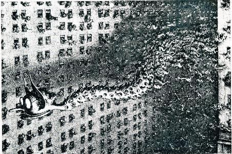
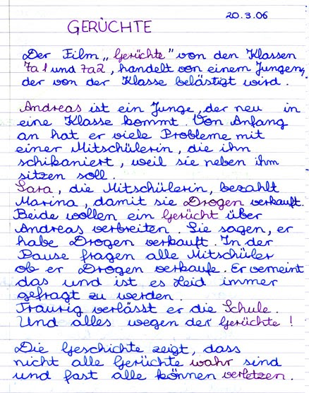
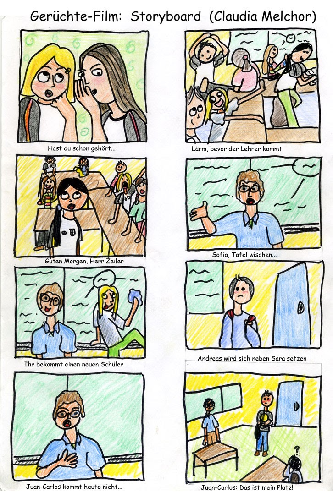
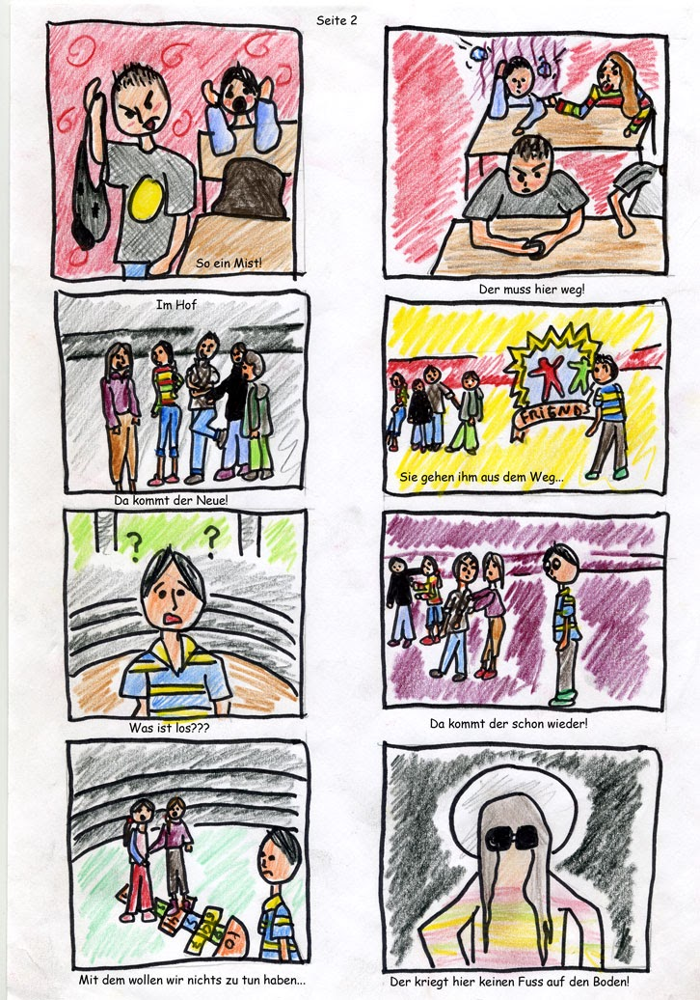
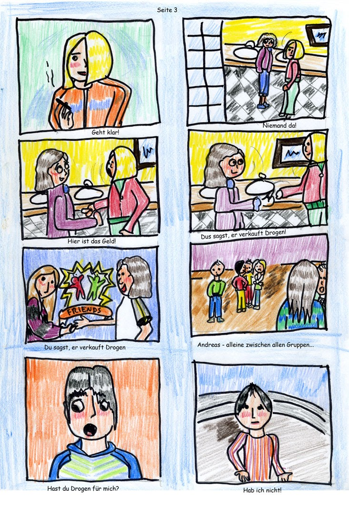
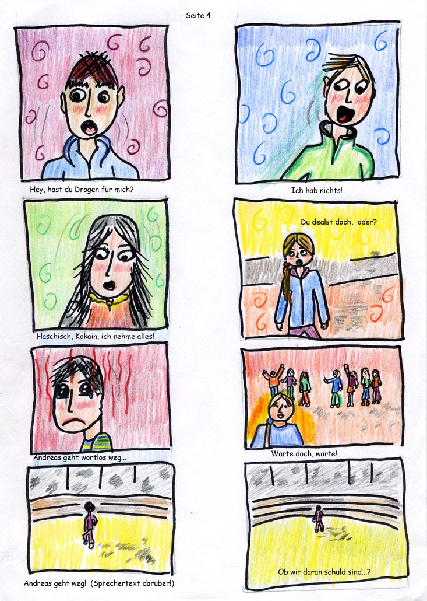

# ZEILER .me - IT & Medien, Geschichte, Deutsch - Gerüchte – Rumores (Drehbuch und Storyboard)

**INNEN, KLASSENZIMMER, TAG:**

Mehrere Nah- oder Großaufnahmen von Schülern, die sich etwas ins Ohr flüstern. Zu hören ist nur folgender Text, der sich immer wiederholt:

*Hast du schon gehört?*

Der Rest geht unter, denn es läuft im Hintergrund weiter die Titelmusik… Während die Schüler sich immer das Gleiche zuflüstern, wird folgender Text in Laufschrift von rechts nach links durchs Bild laufen lassen:

*In fast jeder Klasse drangsalieren Kinder ihre Mitschüler.*

*Das haben wir in einer deutschen Zeitung gelesen.*

*Oft spielen Gerüchte eine wichtige Rolle dabei.*

*Deshalb haben wir einen Film zum Thema „Gerüchte“ gemacht.*

Danach wieder kurz eine Flüsterszene ohne Lauftext. Und dann über das letzte Flüster-Bild und in die darauf folgende Klassenszene hinein DIE SPRECHERIN; die im Blue-Box-Verfahren über das Bild geblendet wird:

**SPRECHERIN:**

*Eigentlich hat es keiner von uns so gewollt. Aber dann haben doch alle mitgemacht. Es war so wie immer: Laut, bevor der Lehrer kommt. Und die Tafel mal wieder nicht geputzt.“*

Noch während die Sprecherin redet, findet im Hintergrund ein Szenenwechsel statt:

**INNEN, KLASSE, TAG:**

Im Bild ist eine Schülergruppe, halbnah, die auf und um einen Tisch herum sitzt. Es ist laut in der Klasse. Neue Hintergrundmusik.

Zweites Bild in der Klasse: Eine Gruppe von Schülern, halbnah bis amerikanisch gegen die Tafel gefilmt. Die Tafel ist von der letzten Stunde noch voll geschrieben. Auf dem Lehrerpult vor der Tafel sitzen SARA und MONICA, die bei einem Spiel die Hände aufeinander klatschen. Dann plötzlich der Ruf:

*Er kommt! (mehrfach)*

Und alle eilen auf ihre Plätze. SCHWENK AUF DIE TÜRE:

Es tritt ein: **DER LEHRER** (Halbtotale)

**LEHRER:**

*So liebe Schüler, guten Morgen!*

**GEGENSCHUSS** auf die Klasse: Alle sind aufgestanden.

**KLASSE:**

*Guten Morgen! Herr Zeiler!*

**LEHRER** (jetzt in Nahaufnahme):

*Sofia, würdest du bitte die Tafel wischen?*

Die Frage klingt wie ein Befehl. Hinter dem Lehrer ist die voll geschriebene Tafel zu sehen. Die Kamera öffnet das Bild bis in die „amerikanische Einstellung“, während SOFIA hinter dem Lehrer vorbei an die Tafel geht und diese putzt. Dabei macht sie ein paar Grimassen in Richtung Klasse…

**LEHRER:**

*So, derweil kann ich euch erklären: Ihr kriegt einen neuen Schüler. Und ich möchte euch bitten, euch anständig zu ihm zu verhalten. Und sobald Sofia fertig ist, werde ich ihn reinrufen.*

Mehrere kurze Großaufnahmen von Gesichtern, die plötzlich in Richtung Türe aufschauen. Dabei klopft es an der Türe.

Im Bild jetzt die Türe….

**SRECHERIN:** (Bluebox)

*Und dann sollte der Neue kommen, Andreas!*

Die Türe geht auf und es tritt ganz schüchtern DER NEUE ein. Im Bild: ANDREAS (nah).

**LEHRER** (im OFF):

*So, darf ich euch vorstellen: Andreas. Er wird sich heute neben Sara setzen.*

**SARA** (zunächst im OFF):

*Nee! Hier sitzt doch Juan-Carlos!*

Schnitt auf Sara (halbtotal), die alleine am Tisch sitzt. Hinter ihr sind noch einige Schüler zu erkennen.

**SARA:**

*Es ist besetzt.*

Während sie das sagt, wirft sie ihren Rucksack auf den Stuhl neben sich. Sie ist sauer.

**LEHRER** (nah):

*Aber Sara, das ist nur für einen Tag – bis ihr einen anderen Platz gefunden habt. Heute setzt sich Andreas neben dich.*

**SARA** (aus dem OFF):

*Und wenn Juan-Carlos später kommt??*

***Lehrer:** (nah)*

*Juan-Carlos kommt heute nicht!*

Er streckt die Hand aus und deutet energisch in Richtung Sara, während er zu Andreas schaut.

**LEHRER:**

*Bitte, setz dich dorthin!*

Das Bild wird von Nah auf Halbnah geöffnet. Es klopft. Die Kamera schwenkt vom Lehrer hin zur Türe…

**LEHRER** (jetzt im Off):

*Ja!*

Es tritt ein: **JUAN-CARLOS**.

*Es tut mir leid! (Er bleibt im Bild)*

**LEHRER** (im OFF):

*Ja, was ist denn jetzt schon wieder?*

**JUAN-CARLOS:**

*Der Bus hatte ‚nen Stau!*

**LEHRER:**

*Schon wieder! Das hab ich schon dreimal gehört. Setz dich!*

Die Kamera öffnet das Bild zur Halbtotale. Im Bild: J.C., Andreas von hinten – und vorne links der Lehrer. Juan Carlos sieht auf einmal, dass sein Platz besetzt ist.

**JUAN-CARLOS:**

*Das ist doch mein Platz!*

**SARA:**

(von hinten zu sehen, wie sie mit dem Bleistift auf Andreas deutet)

*Jetzt muss er weg!!*

**LEHRER** (jetzt voll im Bild)

*Er ist neu! Er bleibt heute. Juan-Carlos setzt sich heute neben die LAURA.*

Gegenschuss aus der Lehrerperspektive auf Juan-Carlos. Im Hintergrund ist gerade noch Sara zu sehen, wie sie mit einem Bleistift auf Andreas stößt. Juan-Carlos in der Halbtotalen.

**JUAN-CARLOS:**

*So ein Mist!!*

Er schmeißt seine Tasche neben den Tisch auf den Boden…

**BLENDE**

**AUSSEN; SCHULHOF; TAG**

SCHÜLER sitzen auf der Treppe. Davor spielen Laura und Claudia ein Spiel, bei dem sie herumhüpfen. Im Vordergrund wird die Sprecherin eingeblendet. (Bluebox)

**SPRECHERIN:**

*Juan-Carlos war gekommen und Andreas war auf seinem Platz gesessen. Damit hat alles angefangen. Eigentlich harmlos!*

**ÜBERBLENDUNG**

Zoom auf Gruppe, die auf der anderen Seite des Schulhofes an der Wand steht, - bis auf Halbnah. DANIEL deutet in Richtung Kamera, d.h. in die Richtung aus der er jemanden kommen sieht. Dann Blende zur Großaufnahme von Sara.

**SARA:**

*Ich hab gehört, dass er aus seiner letzten Schule rausgeflogen ist!*

**MARTA:** (groß)

*Echt?!*

**CARLOS** (groß, Untersicht):

*Man hat ihn rausgeschmissen!*

**DANIEL:**

(Auf die Gruppe zugehend, von Halbnah zu Groß)

*Hey, was hat er gemacht??*

**EDUARDO** (Jetzt wieder mit der ganzen Gruppe in Halbnah):

*Ich hab gehört, er sei ein Dieb.*

**MARTA** (groß):

*Ein Dieb?*

**EDUARDO** (wie zuvor):

*Ein Dieb!*

Schnitt auf Türe (halbnah) gegenüber, die zur Cafeteria führt. Aus dieser tritt nun Andreas – und geht hinaus auf den Hof. Dabei öffnet sich das Bild und seitlich wird die Sprecherin eingeblendet (Bluebox):

**SPRECHERIN:**

*Ob er ein Dieb war? Eigentlich war uns das egal! Aber was soll man machen? Manche sind eben stärker als andere und können sich durchsetzen. Und wir waren nur Mitläufer…*

Während die Sprecherin redet, öffnet sich das Bild ein wenig über die Halbnah- Einstellung des Hofes hinaus. Man sieht links an der Treppe wieder die spielenden Kinder hüpfen. Andreas läuft auf die Kamera zu und knapp rechts daran vorbei.

**GEGENSCHUSS** auf die Schüler, die schlecht über Andreas geredet haben. Hinter ihnen an der Wand Graffitis, darunter das Wort „FRIENDS“, was in dieser Situation ironisch wirkt. Sie laufen, während Andreas auf sie zukommt, nach links weg in die Schulhofecke. Dabei gehen sie zunächst nur aus dem Bild…

**SCHNITT** auf Andreas (nah):

**ANDREAS:**

*Was ist? Was ist los?*

Die Kamera verfolgt danach die Gruppe in der Halbtotalen bis in die Hofecke, wo alle stehen bleiben und sich an die Wand drücken. Die Schüler blicken feindselig in Richtung Andreas, tuscheln herum, bis Andreas wieder ins Bild kommt und vor ihnen stehen bleibt. Daraufhin laufen sie wieder nach links aus dem Bild. Andreas steht hilflos alleine in der Ecke und schaut ihnen nach. ZOOM bis hin zu Nahaufnahme von Andreas.

Dabei **ÜBERBLENDUNG** zu den beiden Mädchen (Halbtotale), die in ihr Hüpfspiel vertieft sind. Eine der beiden (Claudia) flüstert der andere (Laura) etwas ins Ohr, während Andreas ins Bild tritt. Sie unterbrechen ihr Spiel und gehen nach links aus dem Bild. Andreas hebt den Stein auf, mit dem sie gespielt haben und hält ihn in ihre Richtung, so als wollte er darüber eine Verbindung zu ihnen suchen. Dabei Überblendung zu Andreas in Nahaufnahme.

**INNEN; SCHULFLUR; TAG.**

Die „subjektive“ Kamera rast durch den Flur und biegt am Ende in das Zimmer der Klasse 7A ein. BLENDE auf den „BOSS“, der von Sara gespielt wird.

**INNEN, KLASSENZIMMER; TAG.**

**DER BOSS.**

Untersicht (Froschperspektive), groß; er trägt Sonnenbrille und einen Hut.

*Der Neue, der kommt sich als was Besseres vor. Er ist ein Streber und schleimt sich bei den Lehrern ein!*

**GEGENSCHUSS** auf den **1\. MITLÄUFER**; hier gespielt von Marina.

**1\. MITLÄUFER:**

groß, Aufsicht, zuerst mit Kopfnicken, dann einem Zug an einer (Spiel-) Zigarette.

**BOSS:** (wie zuvor)

*Zudem hat er Juan-Carlos von seinem Platz vertrieben!*

**1\. MITLÄUFER:** (wie zuvor)

*Der hat sich aber auch kaum gewehrt.*

**BOSS:**

(wie zuvor, jetzt aber mit der Hand deutlich Zeichen setzend)

*Egal! Das Lassen wir uns nicht gefallen! Klar! Der kriegt keinen Fuß auf den Boden.*

**1\. MITLÄUFER:** (wie zuvor)

Nippt an einem Glas Wasser. Dann, wie nach einem kurzen Überlegen:

*Es scheint zu klappen. Aber sie hauen nur vor ihm ab. Sie machen nichts gegen ihn! Ich glaube, das mit dem Dieb war zu schwach.*

Nach dem letzten Satz nimmt er (sie) scheinbar einen Zug aus der Zigarette, die er in der rechten Hand hält: Es sieht cool aus…

BOSS: (wie zuvor)

Gut, dann eben eine Stufe höher… Sag einfach, er war schon im Knast!

**1\. MITLÄUFER:** (wie zuvor)

*Klingt gut! Aber ob das in der Schule jemand glaubt? Die Schule hat einen guten Ruf!*

**BOSS:** (wie zuvor)

*Deswegen will er sich doch hier verstecken! Du wirst sehen, die Leute glaube alles! Das Ganze muss von jemandem kommen, dem man vertraut. Zur Not kauft ihr mir jemand!*

**1\. MITLÄUFER:** (wie zuvor)

*Geht klar! Aber für wie viel Euro? So ein Gerücht braucht mindestens 10 Euro!*

Er (sie) zieht an der Zigarette, was wieder sehr cool aussieht…

**BOSS:** (wie zuvor)

*Das (Zug an der Zigarette) – werden wir schon hinkriegen!*

**SCHNITT**

**INNEN, TOILETTE** (Kunstlicht), **TAG:**

Vier **FOTOS**, die Marina und Monica bei der Geldübergabe zeigen, jeweils mit dem **KLICK**einer Fotokamera eingeblendet…

**BLENDE**

**AUSSEN, SCHULHOF, TAG:**

**KAMERAFAHRT** im Hof, Kameramann sitzt auf einem Rollwagen und wird um Monica und Marta herumgeschoben, die sich unterhalten. Dabei Einblendung (Bluebox) der Sprecherin:

**SPRECHERIN:**

*Es war nur Rache, ganz klar! Aber wir haben das alles nicht bemerkt.*

Die Sprecherin wird ausgeblendet, derweil die Kamerafahrt endet und nun Monica und Marta in Halbnah von der Seite gezeigt werden. Im Hintergrund wieder Graffiti an der Wand: „Friends“

**MÓNICA:**

*Hier sind 5 Euro. Du sagst, du hättest von ihm Drogen gekauft, OK?*

**MARTA** (nimmt den Geldschein entgegen):

*OK, geht in Ordnung!*

**SCHWARZBLENDE**

**AUFBLENDE – WIEDER DER HOF.**

Kamerafahrt herum um mehrere Schülergruppen im Hof, die in Gespräche verwickelt sind, während in der Mitte zwischen den Gruppen einsam und verlassen Andreas zu sehen ist. Am Ende der Fahrt sieht man Andreas in Halbnah in der Bildmitte. Dann Überblendung auf JAN, der auf ihn zuläuft. (Subjektive Kamera aus der Sicht von Andreas).

**JAN** (nah):

*Hast du Drogen für mich?*

Gegenschuss auf Andreas.

**ANDREAS** (nah):

*Nein, hab ich nicht!*

**SCHNITT** auf andere Gruppe im Hof (Sofia, Alejandro, Pablo). PABLO löst sich aus der Gruppe und kommt auf Andreas zu. Gefilmt aus der Sicht von Andreas (subj. Kamera).

**PABLO** (groß):

*Hast du Drogen für mich?*

**ANDREAS** (nah)

*Nein! (Pause) Hab ich nicht!*

Schnitt auf zweite Gruppe. (Eduardo, Laura 2, Marta, Mónica) EDUARDO löst sich von der Gruppe und kommt auf Andreas zu. Gefilmt aus subjektiver Sicht von Andreas.

**EDUARDO:** (groß)

*Hey, hast du Drogen für mich. Du verkaufst doch Stoff, oder?*

**ANDREAS** (nah):

*Nein! Keine! Ich hab doch nichts!*

Eduardo geht zurück. Marta löst sich jetzt aus der Gruppe und kommt auf Andreas zu. Einstellung der Kamera wie zuvor.

**MARTA** (groß):

*Koks oder Haschisch, egal was du hast, ich nehme alles!*

**ANDREAS** (nah):

*Ich hab gar nichts!*

Schnitt auf eine Gruppe, die an der linken Hofseite auf einer Bank sitzt. (Sara, Juan-Carlos, Jan) Sara steht auf und kommt auf Andreas zu. Einstellung wie zuvor.

**SARA** (nah):

*Du dealst doch, oder?*

Blende auf Andreas (Gegenschuss), der jetzt in GROß gezeigt wird. Er dreht sich weg und schaut dabei noch einmal traurig zurück auf Sara (= in die Kamera), ohne etwas zu sagen. Er entfernt sich in die Richtung, aus der er ursprünglich gekommen war: Cafeteria. Dabei schaut er sich ängstlich um.

**GEGENSCHUSS** auf die sich jetzt zu einer einzigen Gruppe vereinigenden Schüler, die ihm langsam nachgehen und rufen:

**SCHÜLER** (Totale):

*Warte doch! Warte doch mal!*

Dabei Bluebox-Einblendung der Sprecherin am Bildrand.

**SPRECHERIN** (nah):

*Andreas hatte nie irgendetwas mit Drogen zu tun gehabt – jedenfalls solange er noch bei uns an der Schule war.*

Die Sprecherin verschwindet wieder aus dem Bild und die Gruppe bleibt im Hintergrund stehen. **GEGENSCHUSS** auf Andreas, der sich weiter in Richtung Cafeteria entfernt. Das Bild des gebeugt laufenden Andreas wird „eingefroren“…

Einblendung der Sprecherin.

**SPRECHERIN** (nah):

*Und dann ist er gegangen. Seine Eltern haben ihn von der Schule genommen und in eine andere gesteckt.*

Die Sprecherin verschwindet wieder aus dem Standbild. Sie wird dann erneut eingeblendet, aber auf der anderen Bildseite.

**SPRECHERIN** (nah):

*Ob wir daran schuld sind, dass er dann wirklich Drogen genommen hat, das können wir nicht wissen.*

Weiterhin das Standbild von Andreas vor der Treppe zur Cafeteria.

Darüber läuft der **ABSPANN**: Laufschrift von unten nach oben.

**Ein Film der Klasse 7A in der Deutschen Schule Teneriffa –**

**in Zusammenarbeit mit Detlef Zeiler.**

**Februar 2006.**

**In der Hauptrollen:**

Erzählerin: Laura Tascón

Ihr Scriptgirl: Claudia Melchor

Der „Boss“: Sara Perera

Juan Carlos: Juan-Carlos Schickora.

1.  Mitläufer: Marina Calderin
2.  Mitläufer: Mónica Senante
3.  Mitläufer: Jan Moreno
4.  Mitläufer: Pablo Diaz
5.  Mitläufer: Eduardo Betancor
6.  Mitläufer: Marta Corona
7.  Außenseiter und Held der Geschichte: Andrés Conesa

**In den übrigen Rollen:**

Naike Dürr

Claudia Melchor

Daniel Kilders

Laura Tascón

Scriptgirl: Claudia Melchor

**Nach Ideen von:**

Detlef Zeiler

Marina Calderin

Sara Perera

Laura Tascón

**© Mopäd 2006**

**Storyboard:**

