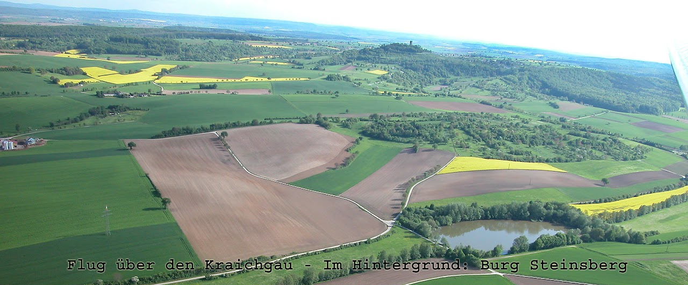

# ZEILER .me - IT & Medien, Geschichte, Deutsch - Die Elsenz und der Kraichgau

Vier Schülergruppen der Klasse TG12 des Technischen Gymnasiums der Friedrich-Hecker-Schule haben Material zu folgenden Themen zusammen gestellt:

-   [Geographische Lage](https://www.zeiler.me/die-elsenz-und-der-kraichgau/geographische-lage.html)
    -   Die Elsenz
    -   Der Steinsberg
    -   Gesteinsschichten im Sinsheimer Raum
-   [Kultur / Religion](https://www.zeiler.me/die-elsenz-und-der-kraichgau/kultur-religion.html)
    -   Der zweite Teil unseres Projektes handelt davon, wie die Menschen hier kulturell und religiös geprägt wurden....
-   [Geschichte und Politik](https://www.zeiler.me/die-elsenz-und-der-kraichgau/geschichte-und-politik.html)
    -   Über den Gaubegriff, die Burg Steinsberg, Renaissance im Kraichgau, Bauernunruhen, Joss Fritz und der Bundschuh...

-   [Die Elsenz und der Kraichgau.](http://www.youtube.com/watch?v=xaMXUxUg3jw) Ein Videoprojekt der Klasse 12 des Technischen Gymnasiums Sinsheim.
    -   (ca. 13 Minuten)
-   [Ausschnitt aus einer Ritterspiel-Aufführung auf dem Steinsberg](http://www.youtube.com/watch?v=DAPUUHwJ5H8) (15 Minuten)
    -   (Der Film mit 45 Min. Länge ist komplett bei "MOPAED" hinterlegt)

