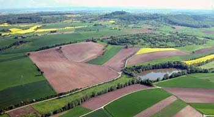
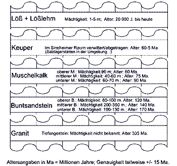

# ZEILER .me - IT & Medien, Geschichte, Deutsch - Geographische Lage

Der Kraichgau

Copyright © Detlef Zeiler

-   [Die Elsenz](https://www.zeiler.me/geographische-lage/die-elsenz.html)
    -   Die Elsenz ist von der Mündung bis zur Quelle 53,5 Kilometer lang. Ihr Einzugsgebiet beträgt 542 Quadratkilometer, d.h. die Elsenz dominiert ganz eindeutig den Kraichgau - sie ist dessen Lebensader....
-   [Der Steinsberg](https://www.zeiler.me/geographische-lage/der-steinsberg.html)
    -   Der Steinsberg liegt 333 Meter über dem Meeresspiegel. Er besteht - wie auch der Katzenbuckel im Odenwald - aus hartem Basalt, denn er ist der Überrest eines alten Vulkans...

Gesteinsschichten im Sinsheimer Raum

Copyright © Detlef Zeiler