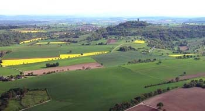

# ZEILER .me - IT & Medien, Geschichte, Deutsch - Der Steinsberg

Der Steinsberg liegt 333 Meter über dem Meeresspiegel. Er besteht - wie auch der Katzenbuckel im Odenwald - aus hartem Basalt, denn er ist der Überrest eines alten Vulkans. Weil der Basalt langsamer verwittert als der ihn umgebende Muschelkalk, ragt er heute weit über seine Umgebung hinaus. Den achteckigen Turm mit seinen vier Meter dicken Mauern, den so genannten "Bergfried" der Burg Steinsberg, kann man schon von Weitem sehen. Daher der Name "Kompass des Kraichgaus". Die Burg wurde ursprünglich um das Jahr 1230 herum gebaut und gehörte den Grafen von Öttingen. Diese gaben sie später den Pfalzgrafen weiter, deren Beamte von hier aus die Besitztümer des Kurfürsten überwachten. 1525, im Bauernkrieg, wurde die Burg von Eppinger Bauern zerstört, die dafür später 5000 Gulden Schadensersatz zahlen mussten. Im Kraichgau gibt es eine Unmenge anderer Burgen, denn das relativ milde und fruchtbare Gebiet war ein beliebter Siedlungsraum für den Adel. Nahezu jedes Dorf besitzt eine alte Burg oder ein altes Schloss - und in zahlreichen Heimatstuben oder Heimatmuseen kann man einiges über die Geschichte der Region erfahren.

Der Steinsberg

Copyright © Detlef Zeiler