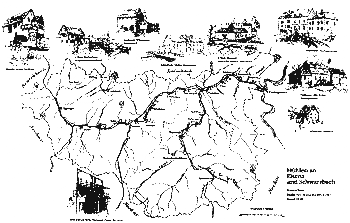

# ZEILER .me - IT & Medien, Geschichte, Deutsch - Die Elsenz

Die Elsenz ist von der Mündung bis zur Quelle 53,5 Kilometer lang. Ihr Einzugsgebiet beträgt 542 Quadratkilometer, d.h. die Elsenz dominiert ganz eindeutig den Kraichgau - sie ist dessen Lebensader. Von der Quelle bei dem Ort "Elsenz" in 240 Metern über dem Meeresspiegel bis zur Mündung ergibt sich ein Gefälle von 128,30 Metern. Auf ihrem langen Weg durchquert die Elsenz 15 Orte. Dabei fließen ihr unterwegs (in Fließrichtung gesehen) von links 15 und von rechts 19 Nebenbäche zu.

Copyright © Detlef Zeiler