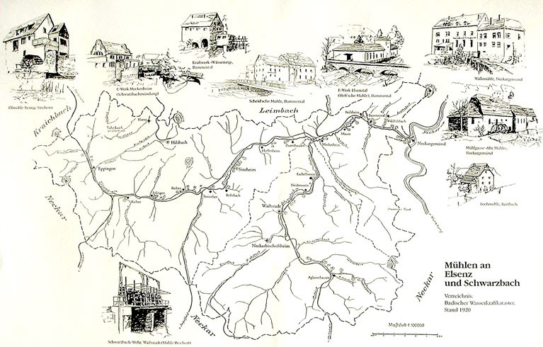

# ZEILER .me - IT & Medien, Geschichte, Deutsch - Mühlen an der Elsenz

Search this site

Embedded Files

Skip to main content

Skip to navigation

[ZEILER .me - IT & Medien, Geschichte, Deutsch](../../../../home.html)

-   [Startseite](../../../../home.html)
    
-   [Detlef Zeiler](../../../../detlef.html)
    
    -   [Deutsch](../../../deutsch.html)
        
        -   [Erörterung](../../../deutsch/errterung.html)
            
        -   [Essay-Themen](../../../deutsch/essay-themen.html)
            
            -   [Essay](../../../deutsch/essay-themen/essay.html)
                
            
        -   [Fremdenfeindlichkeit](../../../deutsch/fremdenfeindlichkeit.html)
            
            -   [Armer und reicher Teufel](../../../deutsch/fremdenfeindlichkeit/armer-und-reicher-teufel.html)
                
            
        -   [Homo Faber](../../../deutsch/homo-faber.html)
            
        -   [Nayirah](../../../deutsch/nayirah.html)
            
        -   [Needful Things - "In einer kleinen Stadt"](../../../deutsch/needful-things---in-einer-kleinen-stadt.html)
            
            -   [In einer kleinen Stadt](../../../deutsch/needful-things---in-einer-kleinen-stadt/in-einer-kleinen-stadt.html)
                
                -   [In einer kleinen Stadt](../../../deutsch/needful-things---in-einer-kleinen-stadt/in-einer-kleinen-stadt/in-einer-kleinen-stadt.html)
                    
                
            
        -   [Texterörterung](../../../deutsch/texterrterung.html)
            
        -   [Textinterpretation](../../../deutsch/textinterpretation-1.html)
            
        -   [Textinterpretation (Beispiele)](../../../deutsch/textinterpretation.html)
            
            -   [Das Eiserne Kreuz (Autor: Heiner Müller)](../../../deutsch/textinterpretation/das-eiserne-kreuz.html)
                
            -   [Ein netter Kerl (Beispiel, Mittelstufe)](../../../deutsch/textinterpretation/ein-netter-kerl.html)
                
            -   [Einige Beispiele](../../../deutsch/textinterpretation/einige-beispiele.html)
                
                -   [Armer und reicher Teufel (Ernst Bloch)](../../../deutsch/textinterpretation/einige-beispiele/armer-und-reicher-teufel-ernst-bloch.html)
                    
                -   [Wie ist der Mensch? (Michel de Montaigne)](../../../deutsch/textinterpretation/einige-beispiele/wie-ist-der-mensch-michel-de-montaigne.html)
                    
                
            -   [Homo Faber](../../../deutsch/textinterpretation/homo-faber.html)
                
            -   [Wie ist der Mensch (Michel de Montaigne)](../../../deutsch/textinterpretation/wie-ist-der-mensch-michel-de-montaigne.html)
                
            
        -   [Versuch einer Beschreibung menschlicher Moral](../../../deutsch/versuch-einer-beschreibung-menschlicher-moral.html)
            
        -   [Versuch einer kurzen Beschreibung einer menschlichen Moral](../../../deutsch/versuch-einer-kurzen-beschreibung-einer-menschlichen-moral.html)
            
        -   [Vom Text zum Schaubild](../../../deutsch/vom-text-zum-schaubild.html)
            
        
    -   [Geschichte](../../../geschichte.html)
        
        -   [Alexander von Humboldts Südamerikareise](../../../geschichte/alexander-von-humboldts-sdamerikareise.html)
            
        -   [Alexis de Tocqueville über die plötzliche Grausamkeit in einer unglücklichen Zeit](../../../geschichte/ber-die-pltzliche-grausamkeit-in-einer-unglcklichen-zeit.html)
            
        -   [Berichte aus einer deutschen Diktatur](../../../geschichte/berichte-aus-einer-deutschen-diktatur.html)
            
        -   [Berthold von Rohrbach](../../../geschichte/berthold-von-rohrbach.html)
            
        -   [Besuch in Simferopol 2018](../../../geschichte/besuch-in-simferopol-2018.html)
            
        -   [Ceausescu](../../../geschichte/ceausescu.html)
            
            -   [Idylle und Realität unter Ceaucescu](../../../geschichte/ceausescu/idylle-und-realitt-unter-ceaucescu.html)
                
            
        -   [Faschismus als Massenbewegung](../../../geschichte/faschismus-als-massenbewegung.html)
            
            -   [Geräusch](../../../geschichte/faschismus-als-massenbewegung/gerusch.html)
                
            
        -   [Faschismus im 21. Jahrhundert?](../../../geschichte/faschismus-als-massenbewegung-2.html)
            
        -   [Geschichte des Neckars und des Philosophenwegs (Ludwig Merz/Otto Jäger)](../../../geschichte/geschichte-des-neckars-und-des-philosophenwegs-ludwig-merzotto-jger.html)
            
        -   [Grenzen](../../../geschichte/grenzen.html)
            
        -   [Grenzen II](../../../geschichte/grenzen-ii.html)
            
        -   [Grenzen III](../../../geschichte/grenzen-iii.html)
            
        -   [Hooligans - Angry Young Men](../../../geschichte/hooligans---angry-young-men.html)
            
        -   [Künstliche Feindschaften](../../../geschichte/knstliche-feindschaften.html)
            
        -   [Mein Großvater Rudolf Zeiler](../../../geschichte/mein-grovater-rudolf-zeiler.html)
            
            -   [Rudolf Zeiler](../../../geschichte/mein-grovater-rudolf-zeiler/rudolf-zeiler.html)
                
            
        -   [Nicht-tödliche Waffen](../../../geschichte/nicht-tdliche-waffen.html)
            
        -   [Pavel Thalmann (1901 - 1980)](../../../geschichte/thalmann.html)
            
        -   [Über die Grausamkeit](../../../geschichte/ber-die-grausamkeit.html)
            
        -   [Zeit der Intrigen](../../../geschichte/zeit-der-intrigen.html)
            
        -   [Integration](../../../geschichte/integration.html)
            
        -   [Die "Mittelschicht" (Diskussionsthemen)](../../../geschichte/die-mittelschicht-diskussionsthemen.html)
            
        -   [Jeremia](../../../geschichte/jeremia.html)
            
        
    -   [Impressum](../../../impressum.html)
        
    -   [Medien](../../../medien.html)
        
        -   [Gerüchte – Rumores (Drehbuch und Storyboard)](../../../medien/geruechte-rumores-drehbuch.html)
            
        -   [Medienerziehung](../../../medien/medienerziehung.html)
            
            -   [Altersgemäße Schwerpunktsetzungen](../../../medien/medienerziehung/altersgemaesse-schwerpunktsetzungen.html)
                
            -   [Aufgabenbereiche und Zielsetzungen](../../../medien/medienerziehung/aufgabenbereiche-und-zielsetzungen.html)
                
            -   [Erlebnis- und Handlungsorientierung als Prinzipien](../../../medien/medienerziehung/erlebnis-und-handlungsorientierung-als-prinzipien.html)
                
            -   [Gestaltung von audiovisuellen Medien](../../../medien/medienerziehung/gestaltung-von-audiovisuellen-medien.html)
                
            -   [Leseerziehung und Hörerziehung](../../../medien/medienerziehung/leseerziehung-und-hoererziehung.html)
                
            -   [Medienerziehung als gesamtgesellschaftliche Aufgabe](../../../medien/medienerziehung/medienerziehung-als-gesamtgesellschaftliche-aufgabe.html)
                
            -   [Medienerziehung im Bereich von Computerspielen und interaktiven Medien](../../../medien/medienerziehung/medienerziehung-im-bereich-von-computerspielen-und-interaktiven-medien.html)
                
            -   [Medienerziehung im Erziehungs- und Bildungszusammenhang](../../../medien/medienerziehung/medienerziehung-im-erziehungs-und-bildungszusammenhang.html)
                
            -   [Medienkompetenz - Vorbemerkung](../../../medien/medienerziehung/medienkompetenz-vorbemerkung.html)
                
            -   [Schülerzeitschriften](../../../medien/medienerziehung/schuelerzeitschriften.html)
                
            -   [Spielfilme](../../../medien/medienerziehung/spielfilme.html)
                
            -   [Verankerung in den Lehrplänen](../../../medien/medienerziehung/verankerung-in-den-lehrplaenen.html)
                
            -   [Veränderung der Bildungs- und Erziehungssituation](../../../medien/medienerziehung/veraenderung-der-bildungs-und-erziehungssituation.html)
                
            -   [Zukünftige Ansatzpunkte](../../../medien/medienerziehung/zukuenftige-ansatzpunkte.html)
                
            -   [Zum Begriff Medienkultur](../../../medien/medienerziehung/zum-begriff-medienkultur.html)
                
            
        
    -   [Projekte](../../../projekte.html)
        
        -   [Der Heiligenberg bei Heidelberg](../../heiligenberg.html)
            
            -   [Der unheimliche Berg](../../heiligenberg/der-unheimliche-berg.html)
                
            -   [Die Geschichte des Heiligenbergs](../../heiligenberg/geschichte.html)
                
            -   [MOPÄD - Mobile Pädagogen](../../heiligenberg/mopaed.html)
                
            -   [Unser Projekt](../../heiligenberg/projekt.html)
                
            
        -   [Die Elsenz und der Kraichgau](../../die-elsenz-und-der-kraichgau.html)
            
            -   [Geographische Lage](../geographische-lage.html)
                
                -   [Der Steinsberg](der-steinsberg.html)
                    
                -   [Die Elsenz](die-elsenz.html)
                    
                -   [Mühlen an der Elsenz](mhlen-an-der-elsenz.html)
                    
                
            -   [Geschichte und Politik](../geschichte-und-politik.html)
                
                -   [Bauernunruhen](../geschichte-und-politik/bauernunruhen.html)
                    
                -   [Der Gaubegriff](../geschichte-und-politik/der-gaubegriff.html)
                    
                -   [Der Kraichgau als militärisches Operationsgebiet](../geschichte-und-politik/der-kraichgau-als-militaerisches-operationsgebiet.html)
                    
                -   [Die Burg Steinsberg](../geschichte-und-politik/die-burg-steinsberg.html)
                    
                -   [Friedrich Hecker](../geschichte-und-politik/friedrich-hecker.html)
                    
                -   [Joss Fritz und der Bundschuh](../geschichte-und-politik/joss-fritz-und-der-bundschuh.html)
                    
                -   [Renaissance im Kraichgau](../geschichte-und-politik/renaissance-im-kraichgau.html)
                    
                
            -   [Kultur / Religion](../kultur-religion.html)
                
            
        -   [Dritte Gewalt - Strafvollzug](../../dritte-gewalt-strafvollzug.html)
            
            -   [Anmerkungen](../../dritte-gewalt-strafvollzug/anmerkungen.html)
                
            -   [Beispiel für ein Projekt](../../dritte-gewalt-strafvollzug/beispiel-fuer-ein-projekt.html)
                
            -   [Gymnasium](../../dritte-gewalt-strafvollzug/gymnasium.html)
                
            -   [Hauptschule](../../dritte-gewalt-strafvollzug/hauptschule.html)
                
            -   [Medienforum Heidelberg e.V.](../../dritte-gewalt-strafvollzug/medienforum-heidelberg-ev.html)
                
            -   [Realschule](../../dritte-gewalt-strafvollzug/realschule.html)
                
            
        -   [Heidelberg im Mittelalter](../../heidelberg-im-mittelalter.html)
            
            -   [Armenpflege und soziale Einrichtungen](../../heidelberg-im-mittelalter/armenpflege-und-soziale-einrichtungen.html)
                
            -   [Auszug aus der Sittenstrafordnung für Dirnen des Heidelberger Kurfürsten Ott-Heinrich des Jahres 1532](../../heidelberg-im-mittelalter/sittenstrafordnung-fuer-dirnen.html)
                
            -   [Das älteste Gewerbe im alten Heidelberg](../../heidelberg-im-mittelalter/das-aelteste-gewerbe.html)
                
            -   [Dr. Jochen Goetze](../../heidelberg-im-mittelalter/dr-jochen-goetze.html)
                
            -   [Freizeit im Mittelalter](../../heidelberg-im-mittelalter/freizeit.html)
                
            -   [Hexenglauben und Hexenprozesse](../../heidelberg-im-mittelalter/hexenglauben-und-hexenprozesse.html)
                
            -   [Juden im mittelalterlichen Heidelberg](../../heidelberg-im-mittelalter/juden.html)
                
                -   [Phase relativer Toleranz](../../heidelberg-im-mittelalter/juden/phase-relativer-toleranz.html)
                    
                -   [Spielball fremder Interessen](../../heidelberg-im-mittelalter/juden/spielball-fremder-interessen.html)
                    
                
            -   [Literaturverzeichnis](../../heidelberg-im-mittelalter/literaturverzeichnis.html)
                
            -   [MOPÄD - Mobile Pädagogen](../../heidelberg-im-mittelalter/mopaed.html)
                
            -   [Praktische Heimatkunde](../../heidelberg-im-mittelalter/praktische-heimatkunde.html)
                
            -   [Stadtgründung - Stadtentwicklung](../../heidelberg-im-mittelalter/stadtgruendung-stadtentwicklung.html)
                
                -   [Der Stadtaufbau von Heidelberg](../../heidelberg-im-mittelalter/stadtgruendung-stadtentwicklung/stadtaufbau.html)
                    
                -   [Heidelberg: Entstehung und Namensgebung](../../heidelberg-im-mittelalter/stadtgruendung-stadtentwicklung/entstehung-und-namensgebung.html)
                    
                -   [Stadtgründung - Stadtentwicklung Stadtverfassung](../../heidelberg-im-mittelalter/stadtgruendung-stadtentwicklung/stadtverfassung.html)
                    
                
            -   [Strafrecht und Strafvollzug](../../heidelberg-im-mittelalter/strafrecht-und-strafvollzug.html)
                
                -   [I. Strafe - der Triumph des Guten](../../heidelberg-im-mittelalter/strafrecht-und-strafvollzug/triumph-des-guten.html)
                    
                -   [II. Constitutio Criminalis Carolina](../../heidelberg-im-mittelalter/strafrecht-und-strafvollzug/constitutio-criminalis-carolina.html)
                    
                -   [III. Verbrechen und Strafen](../../heidelberg-im-mittelalter/strafrecht-und-strafvollzug/verbrechen-und-strafen.html)
                    
                -   [IV. Strafordnung im mittelalterlichen Heidelberg](../../heidelberg-im-mittelalter/strafrecht-und-strafvollzug/strafordnung.html)
                    
                -   [V. Richtstätten und Gefängnisse im alten Heidelberg](../../heidelberg-im-mittelalter/strafrecht-und-strafvollzug/richtstaetten-und-gefaengnisse.html)
                    
                -   [VI. Anmerkungen](../../heidelberg-im-mittelalter/strafrecht-und-strafvollzug/anmerkungen.html)
                    
                
            -   [Universität und Studenten im Heidelberger Mittelalter](../../heidelberg-im-mittelalter/universitaet-und-studenten.html)
                
                -   [Ausbau und Finanzierung der Universität](../../heidelberg-im-mittelalter/universitaet-und-studenten/ausbau-und-finanzierung.html)
                    
                -   [Motive für den Aufbau einer Universität](../../heidelberg-im-mittelalter/universitaet-und-studenten/motive-fuer-den-aufbau-einer-universitaet.html)
                    
                -   [Studentenunruhen im alten Heidelberg](../../heidelberg-im-mittelalter/universitaet-und-studenten/studentenunruhen.html)
                    
                -   [Universität und Studenten im Heidelberger Mittelalter: Einleitung](../../heidelberg-im-mittelalter/universitaet-und-studenten/einleitung.html)
                    
                -   [Ausbau der Universität und Rückschläge](../../heidelberg-im-mittelalter/universitaet-und-studenten/ausbau-der-universitaet-und-rueckschlaege.html)
                    
                -   [Die Anfänge: Stadt, Hof und Universität](../../heidelberg-im-mittelalter/universitaet-und-studenten/die-anfaenge-stadt-hof-und-universitaet.html)
                    
                -   [Die Universität zwischen Mittelalter und Neuzeit](../../heidelberg-im-mittelalter/universitaet-und-studenten/die-universitaet-zwischen-mittelalter-und-neuzeit.html)
                    
                -   [Konflikte mit Hofbediensteten, Bürgern und Juden](../../heidelberg-im-mittelalter/universitaet-und-studenten/konflikte-mit-hofbediensteten-buergern-und-juden.html)
                    
                
            
        -   [Heidelberger Schulgeschichten](../../heidelberger-schulgeschichten.html)
            
            -   [Bürger und Bauern](../../heidelberger-schulgeschichten/buerger-und-bauern.html)
                
            -   [Das 18. Jahrhundert](../../heidelberger-schulgeschichten/das-18te-jahrhundert.html)
                
            -   [Das 19. Jahrhundert](../../heidelberger-schulgeschichten/das-19te-jahrhundert.html)
                
            -   [Das 20. Jahrhundert](../../heidelberger-schulgeschichten/das-20te-jahrhundert.html)
                
            -   [Die Anfänge](../../heidelberger-schulgeschichten/anfaenge.html)
                
            -   [Die Lehrerschaft des Heidelberger Kurfürst-Friedrich-Gymnasiums in der Zeit des Nationalsozialismus](../../heidelberger-schulgeschichten/lehrerschaft-kfg-3tes-reich.html)
                
            -   [Schülerunruhen am Kurfürst-Friedrich-Gymnasium im Jahre 1968](../../heidelberger-schulgeschichten/schuelerunruhen-am-kfg.html)
                
            
        -   [Neuenheim ist halb Europa](../../neuenheim.html)
            
            -   [Die Eingemeindung Neuenheims 1891](../../neuenheim/eingemeindung.html)
                
            -   [Interview mit Herrn Krauch](../../neuenheim/interview-krauch.html)
                
            -   [MOPÄD - Mobile Pädagogen](../../neuenheim/mopaed.html)
                
            -   [Neuenheim wird Stadtteil von Heidelberg](../../neuenheim/otto-jaeger-ludwig-merz.html)
                
            -   [Projekt](../../neuenheim/projekt.html)
                
            -   [Und plötzlich war die Klasse "judenfrei"...](../../neuenheim/judenfrei.html)
                
            -   [Überblick](../../neuenheim/ueberblick.html)
                
            -   [„Neuenheim ist halb Europa“](../../neuenheim/ist-halb-europa.html)
                
            
        -   [Old Providence - Die Insel Providencia](../../old-providence-die-insel-providencia.html)
            
            -   [1817-1821 - Die Korsaren](../../old-providence-die-insel-providencia/1817-1821-die-korsaren.html)
                
            -   [Aktuell - 1903-heute](../../old-providence-die-insel-providencia/aktuell-1903-heute.html)
                
            -   [Jahr 1629](../../old-providence-die-insel-providencia/jahr-1629.html)
                
            -   [Jahr 1641](../../old-providence-die-insel-providencia/jahr-1641.html)
                
            -   [Jahr 1666 - Piraterie](../../old-providence-die-insel-providencia/jahr-1666-piraterie.html)
                
            -   [Jahr 1666-1670](../../old-providence-die-insel-providencia/jahr-1666-1670.html)
                
            -   [Jahr 1670](../../old-providence-die-insel-providencia/jahr-1670.html)
                
            -   [Jahr 1670-1767](../../old-providence-die-insel-providencia/jahr-1670-1767.html)
                
            -   [Jahr 1767](../../old-providence-die-insel-providencia/jahr-1767.html)
                
            -   [Jahr 1790-1803](../../old-providence-die-insel-providencia/jahr-1790-1803.html)
                
            -   [Jahr 1822 - Die Republik](../../old-providence-die-insel-providencia/jahr-1822-die-republik.html)
                
            
        
    -   [Jeremia](../../../jeremia.html)
        
    
-   [Julian Zeiler](../../../../julian.html)
    
    -   [About me (old)](../../../../julian/about-me.html)
        
    -   [Artikel](../../../../julian/artikel.html)
        
        -   [Agile Methoden in der Softwareentwicklung](../../../../julian/artikel/agile-methoden-in-der-softwareentwicklung.html)
            
        -   [Auswirkungen von Ideologien der Open Source Lizenzen](../../../../julian/artikel/auswirkungen-von-ideologien-der-open-source-lizenzen.html)
            
        -   [Was ist das Web 2.0?](../../../../julian/artikel/was-ist-das-web-20.html)
            
        
    -   [Contact / Impressum](../../../../julian/contact.html)
        
    -   [Techzap](../../../../julian/techzap.html)
        
        -   [Design](../../../../julian/techzap/design.html)
            
            -   [Microsoft Paint](../../../../julian/techzap/design/microsoft-paint.html)
                
                -   [favicon ico mit MS Paint und BMP2ICO erstellen](../../../../julian/techzap/design/microsoft-paint/favicon-ico-mit-ms-paint-und-bmp2ico-erstellen.html)
                    
                
            
        -   [Programmierung](../../../../julian/techzap/programmierung.html)
            
            -   [Einführung in das Programmieren (alt und unvollendet)](../../../../julian/techzap/programmierung/einfuehrung-in-das-programmieren.html)
                
                -   [Einführung in die Programmierung - Kapitel 1: Die Grundlagen](../../../../julian/techzap/programmierung/einfuehrung-in-das-programmieren/grundlagen-variablen-operatoren-funktionen.html)
                    
                
            -   [Perl](../../../../julian/techzap/programmierung/perl.html)
                
                -   [Perl Einzeiler: Suchen und Ersetzen in Dateien](../../../../julian/techzap/programmierung/perl/perl-einzeiler-suchen-und-ersetzen-in-dateien.html)
                    
                
            
        -   [Server](../../../../julian/techzap/server.html)
            
            -   [Unix/Linux](../../../../julian/techzap/server/unix-linux.html)
                
                -   [Mit grep Zeilen entfernen, die in zwei Dateien doppelt vorkommen](../../../../julian/techzap/server/unix-linux/grep-in-zwei-dateien-vorkommende-zeilen-entfernen.html)
                    
                
            -   [Windows](../../../../julian/techzap/server/windows.html)
                
                -   [IIS und Apache auf einem Server parallel betreiben](../../../../julian/techzap/server/windows/iis-und-apache-auf-einem-server-parallel-betreiben.html)
                    
                -   [ListenOnlyList Registry Werte - IIS an IP binden](../../../../julian/techzap/server/windows/listenonlylist-registry-werte-iis-an-ip-binden.html)
                    
                
            
        -   [Technik](../../../../julian/techzap/technik.html)
            
            -   [VMware](../../../../julian/techzap/technik/vmware.html)
                
                -   [Strg+Alt+F1 bzw Ctrl+Alt+F1 an VMware senden](../../../../julian/techzap/technik/vmware/strg-alt-f1-bzw-ctrl-alt-f1-an-vmware-senden.html)
                    
                
            
        
    -   [Work (old)](../../../../julian/work.html)
        
        -   [Projects](../../../../julian/work/projects.html)
            
        -   [Selfmade](../../../../julian/work/selfmade.html)
            
        
    

[ZEILER .me - IT & Medien, Geschichte, Deutsch](../../../../home.html)

# Mühlen an der Elsenz

Copyright © 1996 - 2020 Detlef und Julian Zeiler

Google Sites

Report abuse

Page details

Page updated

Google Sites

Report abuse