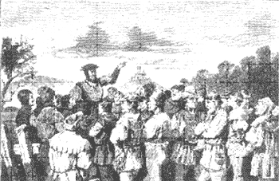

# ZEILER .me - IT & Medien, Geschichte, Deutsch - Bauernunruhen

Früher gab es einen uralte "Kontrakt": Die Herrschenden schützen unser Land, dafür dienen wir ihnen. Doch die Bauern wurden durch weltliche und geistliche Herrschaft immer mehr ausgepresst, ihre Freiheit noch weiter eingeschränkt und der Adel kam seinen Schutzverpflichtungen immer weniger nach. Im 15. Jahrhundert verteidigten sich die Bauern erfolgreich selbst, als Truppen im Elsass einfielen, weshalb der Kontrakt abgeschafft wurde. Auch die Kirche hatte durch Missstände und ihre Feudalherrschaft Ansehen verloren, was auch die Reformation in Gang brachte. Aus Achtung wurde Hass, der auch beim Anführer der Bundschuh-Verschwörung von 1502, Joß Fritz, tief saß. Er und seine Anhänger hatten den "Bundschuh" als Symbol, Feldzeichen und Name. Joß Fritz formulierte seine Ziele klar und verständlich:

Bauern

Copyright © Detlef Zeiler

Sein Ruf: "Nichts als die Gerechtigkeit Gottes", seine Devise: "Niemanden mehr Renten und Gülten" . Joß Fritz wollte die Macht den Bauern und Bürgern überantworten. In den Dörfern um Bruchsal fand Joß Fritz breite Zustimmungen. Der erste von ihm geplante Aufstand, ein Überfall auf die Burg in Obergrombach, wurde durch einen Verrat vorzeitig vereitelt. Doch er gab nicht auf. Mehrmals versuchte er den Aufstand, wie z.B. 1513 in Lehen bei Freiburg und 1517 im Elsass. Die Spur von Joß Fritz, den die Geschichtsschreibung "eine der wenigen revolutionären Gestalten des deutschen Bauerntums" nennt, verlor sich in den Wirren des großen Bauernkrieges von 1525. Die Bauernunruhen waren keineswegs beendet. Durch Hungernot, Teuerungen, Seuchen und neue Steuerordnungen in den Jahren 1517/18 hatten zur Folge, dass sich die Bruchsaler Bürger bei den schweren Bauernunruhen 1525 auf die Seite der Aufständischen stellten. Begonnen hatten die Hauptunruhen am Palmsonntag 1525 in Malsch, dem Hauptsitz der Verschwörung. Der "Bauernhaufen" wütete allerdings nicht lange. Noch im Mai 1525 bereitete die Streitmacht von Kurfürst Ludwig V. dem Aufstand ein blutiges Ende. Malsch wurde in Brand gesteckt und viele Bauern hingerichtet. Bruchsal und die beteiligten Dörfer wurden mit einer großen Geldbuße (40.000 Goldgulden) belegt. >Das war das Ende des Traumes von Freiheit und Gerechtigkeit!