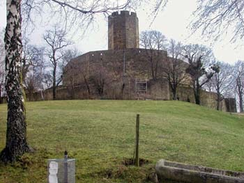

# ZEILER .me - IT & Medien, Geschichte, Deutsch - Die Burg Steinsberg

Der Steinsberg, ein schon lange erloschener Vulkan, ist mit 333 Metern die höchste Erhebung im Kraichgau und diente frühen Kosmosgraphen als Orientierungsmarke (daher die Bezeichnung: "Kompass des Kraichgaus"). Eine so beherrschende Lage nach allen Seiten forderte geradezu eine Befestigung. Die Burg Steinsberg wurde 1109 erstmals urkundlich erwähnt. Sie wechselte im Laufe der Jahre mehrmals ihre Burgherren. Um 1200 kam sie in den Besitz des Grafen von Öttingen, welcher den mächtigen Burgfried erbauen lies, wodurch die Burg zum bedeutendsten Grafensitz des Kraichgaus wurde. In den nächsten Jahrhunderten wechselte sie noch ein paar mal ihre Besitzer, bis sie schließlich 1777 aufgrund eines Blitzschlages in den Turm aufgegeben wurde. 1973 kaufte die Stadt Sinsheim die inzwischen zur Ruine zerfallende Burg, von der nur der Burgfried und Teile der Ringmauer erhalten blieben.

Die Steinsburg

Copyright © Detlef Zeiler