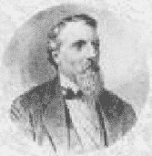

# ZEILER .me - IT & Medien, Geschichte, Deutsch - Friedrich Hecker

Friedrich Franz Karl Hecker wurde 1811 in Eichtersheim/Baden geboren. Als Student und später als Alter Herr, gehörte er drei schlagenden Verbindungen an. Wie auch sein Zeit- und womöglich teilweise Gesinnungsgenosse Karl Marx war er Corpsstudent. Nach seinem Studium in Heidelberg und München bestand er 1834 die juristische Staatsprüfung und promovierte anschließend. Danach absolvierte er eine typische Beamtenlaufbahn. 1842 wurde er als bisher jüngstes Mitglied der liberalen Oppositionspartei in die zweite Kammer des badischen Landtags gewählt, welche jedoch mit heutigen Parlamenten nicht zu vergleichen ist. Nur sehr wenige Bürger hatten damals Wahlrecht (Zensuswahlrecht), und der Großherzog konnte sich sogar über Beschlüsse des Parlaments hinwegsetzen. Im Landtag fiel Hecker schnell als geschickter und für ein "Honoratioren-Parlament" radikaler Redner auf. Nachdem im Februar 1848 die meisten reaktionären Regierungen vertrieben werden konnten, tagte Ende März in Frankfurt das sogenannte Vorparlament. Er versuchte, die Errungenschaften der Revolution zu sichern, hatte damit aber im Parlament keinen Erfolg. Eine Gruppe von radikalen Republikanern um Friedrich Hecker wollte diesen Zustand nicht länger hinnehmen und rang sich zu einer Aktion durch. Sie planten, von Konstanz aus, wo die erste deutsche Republik ausgerufen wurde, einen Zug durch Baden zu unternehmen, um letztendlich bis zur badischen Hauptstadt Karlsruhe vorzudringen (den so genannten Heckerzug). Jedoch, der Plan scheiterte recht kläglich: Noch südlich von Freiburg kam es zu den ersten Scharmützeln zwischen Bundestruppen und den Revolutionären. Da sich die Hecker-Anhänger vorher nicht mit anderen Revolutionsgruppen hatten vereinigen können, waren sie hoffnungslos unterlegen. Friedrich Hecker musste in die Schweiz fliehen. Die Popularität von Hecker blieb aber ungebrochen. Im ganzen Land singt man die Hecker-Lieder, der Heckerhut wird zum Kennzeichen der Demokraten. Von der Schweiz aus emigrierte er in die USA. Friedrich Hecker war einer der populärsten Achtundvierziger und als er in New York ankam, erwarteten ihn über 20 000 Menschen mit einem Meer von schwarz-rot-goldenen Fahnen und sangen das einst so berühmte Heckerlied. Als es im Mai 1849 den Revolutionären tatsächlich gelang, den Großherzog zu vertreiben und die Republik auszurufen, reiste Friedrich Hecker mit Freiwilligen aus Amerika an, kam aber zu spät und emigrierte danach endgültig in die USA.

Friedrich Hecker

Copyright © Detlef Zeiler