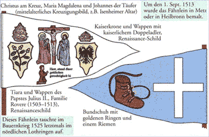

# ZEILER .me - IT & Medien, Geschichte, Deutsch - Joss Fritz und der Bundschuh

Joß Fritz wurde ca. 1470 in Untergrombach bei Bruchsal geboren; es wird angenommen, dass er nicht aus der Not leidenden Unterschicht stammte. Er war Führer der Bundschuhbewegung und bereitete zwischen 1502 und 1517 drei Bauernaufstände im Zeichen des Bundschuhs vor. Nach dem blutigen Scheitern des großen Bauernkrieges von 1525 verliert sich seine Spur. 1493 gab es die erste Bauernerhebung unter dem Zeichen des Bundschuhs im elsässischen Schlettstadt. Der Bund wird zerschlagen, einige Anführer hingerichtet. 1502 geschehen in Ersingen und Biflingen bei Pforzheim im Januar des Jahres politische Gewalttaten die wahrscheinlich mit dem Bundschuh zu tun haben. Ab März werden Vorbereitungen für den ersten Bundschuhaufstand getroffen. Er soll am 22. April stattfinden, wird jedoch auf Anfang Mai verschoben. Im April erhält die Verwaltung Speyer Kenntnis von dem geplanten Aufstand. Viele Beteiligte werden verhaftet, einige können fliehen. So auch Joß Fritz. Die Verhafteten werden zum Tod oder zu schweren Strafen verurteilt. 1510 kommt es zu einem Volksauflauf gegen die städtischen Autoritäten in Schlettstadt. Das Schlagwort "Bundschuh" kursiert. Im Frühjahr 1513 sucht Joß Fritz neue Verbündete für den Bundschuh in Lehen und den umliegenden Dörfern. Anläufe zur Bemalung einer Bundschuhfahne in Lehen undFreiburg scheitern. Joß Fritz gelingt es das Banner in Heilbronn oder Metz bemalen zu lassen. Am 23. September kommt es zum entscheidenden Treffen der Bundschuher von Lehen. Ein für den 9. Oktober in Biengen geplanter Aufstand wird verraten und Joß Fritz flieht mit einigen Mitverschwörern nach Seewen bei Basel. Dort entgeht er nochmals am 19. Oktober seiner Verhaftung. Später kursiert das Gerücht, Joß Fritz habe die Lehener Bundschuhfahne in der Wallfahrtskirche Einsiedeln hinterlegt. Im April 1517 versammeln sich Bundschuher in Derlingen bei Bretten. Der Geheimbund wird größer. Joß Fritz trifft sich im elsässischen Oberehnheim, sowie in Zurzach, Villingen und Horb mit Anhängern. Im September wird Michel von Dinkelsbühl, einer der wichtigsten Anhänger des Joß Fritz gefasst und verhindert durch sein Geständnis weitere Aktionen des Bundschuh. Der Geheimbund von 1517 ist zerschlagen, Joß Fritz aber gelingt erneut die Flucht. Im Juni 1525 beginnt die Bauernrevolution. Bei Klettgau wird Joß Fritz zum letzten Mal gesehen. Über sein Schicksal ist ab 1524/25 nichts mehr bekannt.

Bundschuh

Copyright © Detlef Zeiler