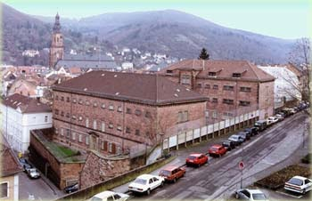

# ZEILER .me - IT & Medien, Geschichte, Deutsch - Dritte Gewalt - Strafvollzug

Am Beispiel der Justizvollzugsanstalt "Fauler Pelz" in Heidelberg

Ein - noch unvollendetes - Videofilmprojekt der (ehemaligen) Landesbildstelle Baden und des Medienforum Heidelberg e.V.

-   *Das LMZ ist eine Anstalt öffentlichen Rechts:* [Landesbildstelle Baden](http://www.google.com/url?q=http%3A%2F%2Fwww.lmz-bw.de%2F&sa=D&sntz=1&usg=AOvVaw2GV4w2ys5QW3PSfuwV78lT)
-   [Medienforum Heidelberg e.V.](https://www.zeiler.me/dritte-gewalt-strafvollzug/medienforum-heidelberg-ev.html)
    -   Die Zahl der TV-Kanäle steigt und steigt, die Programme verflachen, der Blick auf die Mattscheibe wird oberflächlicher, man zappt sich so durch. Schon seit längerer Zeit wird von Pädagogen und Psychologen über die negativen Folgewirkungen exzessiver Nutzung audiovisueller Medien geklagt. Wir klagen nicht, wir machen selber Programm...

## 

Lehrplanbezüge:

-   [Gymnasium](https://www.zeiler.me/dritte-gewalt-strafvollzug/gymnasium.html)
    -   Rechtsgeschichte und Rechtsbewußtsein sind Themen der 11. Klasse des Gymnasiums. Im Bildungsplan für das Gymnasium vom 4. Februar 1994 ist für das Fach Gemeinschaftskunde in der "Lehrplaneinheit 3" vorgegeben, "das Recht und die Rechtsordnung in der Bundesrepublik Deutschland" (S. 539/40) zu behandeln...
-   [Hauptschule](https://www.zeiler.me/dritte-gewalt-strafvollzug/hauptschule.html)
    -   Weniger theoretisch als im Gymnasium muß der Stoff für die 8. Klasse der Hauptschule im Fach Gemeinschaftskunde zentral angesiedelt werden....
-   [Realschule](https://www.zeiler.me/dritte-gewalt-strafvollzug/realschule.html)
    -   Wie in der Hauptschule, so muß unser Thema auch in der Realschule vom Lehrplan her in der 8. Klasse verankert werden....
-   [Beispiel für ein Projekt](https://www.zeiler.me/dritte-gewalt-strafvollzug/beispiel-fuer-ein-projekt.html)
    -   In Zusammenarbeit mit dem Kurfürst-Friedrich-Gymnasium und dem Medienforum Heidelberg möchte die Landesbildstelle ein beispielhaftes Videoprojekt durchführen, in dem fächerübergreifend die Themen "3. Gewalt/ Strafvollzug" am Beispiel lokaler Geschichte angesprochen werden....
-   [Anmerkungen](https://www.zeiler.me/dritte-gewalt-strafvollzug/anmerkungen.html)

"Fauler Pelz" Heidelberg

Copyright © Detlef Zeiler