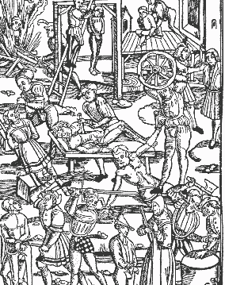

# ZEILER .me - IT & Medien, Geschichte, Deutsch - Strafrecht und Strafvollzug

-   [I. Strafe - der Triumph des Guten](https://www.zeiler.me/strafrecht-und-strafvollzug/triumph-des-guten.html)
    -   Aus heutiger Sicht erscheinen Strafrecht, Strafverfahren und Strafvollzug im Mittelalter als unvollstelbar grausam und mitleidslos. Die mit fantasievollen Qualen verbundenen öffentlich vollstreckten Hinrichtungen wurden von der Obrigkeit bewußt als Volksfeste inszeniert....
-   [II. Constitutio Criminalis Carolina](https://www.zeiler.me/strafrecht-und-strafvollzug/constitutio-criminalis-carolina.html)
    -   Das erste allgemeine deutsche Strafgesetzbuch war die Constitutio Criminalis Carolina (Peinliche Halsgerichtsordnung Kaiser Karls V.), die 1532 auf dem Regensburger Reichstag verabschiedet wurde. In ihr wurde der sogenannte Ordalprozeß, dessen anerkanntes Beweismittel das Gottesurteil war, von einem Indizien- und Geständnisprozeß abgelöst....
-   [III. Verbrechen und Strafen](https://www.zeiler.me/strafrecht-und-strafvollzug/verbrechen-und-strafen.html)
    -   Für Tötungsdelikte wurde stets die Todesstrafe (meist Rädern und Enthaupten) verhängt. Vieh- und Getreidediebstahl sowie Diebstahl in Kirchen, Schmieden und Mühlen zog in der Regel den Tod durch den Strang nach sich....
-   [IV. Strafordnung im mittelalterlichen Heidelberg](https://www.zeiler.me/strafrecht-und-strafvollzug/strafordnung.html)
    -   Wer in unseren Tagen auf Heidelbergs Marktplatz verweilt, ahnt kaum, daß zwischen Rathaus und Heiliggeistkirche jahrhundertelang Menschen enthauptet wurden. Da der Marktplatz im Mittelalter ohnehin Zentrum des öffentlichen Lebens war, lag es nahe, ihn auch für den Strafvollzug zu nutzen....
-   [V. Richtstätten und Gefängnisse im alten Heidelberg](https://www.zeiler.me/strafrecht-und-strafvollzug/richtstaetten-und-gefaengnisse.html)
    -   Auch außerhalb der Stadt gab es eine stattliche Anzahl von Richtstätten. An der Kreuzung Rohrbacherstraße / Bergheimerstraße befand sich einst der "Rabenstein", wo ebenfalls mit dem Schwerte gerichtet wurde....
-   [VI. Anmerkungen](https://www.zeiler.me/strafrecht-und-strafvollzug/anmerkungen.html)

Holzschnitt aus Teuglers Laienspiegel Mainz 1508

Verbrennen, Hängen, Ertränken, Blenden, Entdärmen (Häuten), Rädern, Auspeitschen, Enthaupten, Handabhauen.

Copyright © Detlef Zeiler