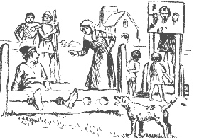

# ZEILER .me - IT & Medien, Geschichte, Deutsch - III. Verbrechen und Strafen

Für Tötungsdelikte wurde stets die Todesstrafe (meist Rädern und Enthaupten) verhängt. Vieh- und Getreidediebstahl sowie Diebstahl in Kirchen, Schmieden und Mühlen zog in der Regel den Tod durch den Strang nach sich. Wegen Münz-, Urkundenfälschung und Raub Verurteilte wurden ebenfalls hingerichtet. Sittlichkeitsdelikte wie Vergewaltigung, Homosexualität, Blutschande und Bigamie strafte man mit Enthauptung, Ehebruch wurde nach Gebieten unterschiedlich mit Pranger, Gefängnis, Rutenstrafe, aber auch mit dem Tod geahndet. Für Gotteslästerung, Ketzerei und Hexerei, also Religionsdelikte, mit denen ursprünglich kirchliche Gerichte befaßt waren, wurden ab dem 13. Jahrhundert auch weltliche Gerichte zuständig, da man überzeugt war, daß daraus Schaden für die Gesellschaft erwachsen könne, indem Gott als Vergeltung das ganze Land mit Plagen überziehe. Ketzer und Hexen starben den Feuertod. Sie hatte in so abscheulicher Weise gegen göttliches und menschliches Recht verstoßen, daß sie gänzlich vom Erdboden vertilgt werden mußten. Staatsverbrechen galten seit alters her als schwere Verbrechen und wurden daher mit verschiedenen Todesarten bestraft: Landesverrat mit Erhängen, Ertränken, Rädern und Vierteilen, Verschwörung und Aufruhr, sogenannte Majestätsverbrechen, mit Enthauptung.

Neben den Todesstrafen wurden auch Verstümmelungsstrafen wie Blenden, Handabschlagen, Finger-, Ohren- und Zungenabschneiden verhängt. Im Spätmittelalter waren sie unter dem Aspekt der Abschreckung weit verbreitet. Die "Carolina" überließ es dem Ermessen des Richters, ob die Verstümmelung anstelle der Todesstrafe angewandt wurde.

Freiheitsentzug als eigenständige Strafe begann sich erst ab dem 14. Jahrhundert durchzusetzen; in der Regel wurde sie jedoch - wenn überhaupt - zum Tode Verurteilten zuteil, die begnadigt worden waren. Fraglich ist, ob der Delinquent diesen Gnadenakt auch als solchen empfand, denn die Gefängnisse waren in einem grauenvollen Zustand. Die Häftlinge, womöglich gefesselt oder in einen Stock gespannt, litten unsägliche Qualen durch Dunkelheit, Kälte, Hunger, Ungeziefer, so daß wohl mancher den Tod als Erlösung herbeisehnte.

Nicht nur die vielfältigen Leibesstrafen, sondern auch Schandstrafen, die für geringfügige Delikte wie Unzucht, Ehebruch, Trunkenheit, Streitsucht, Fernbleiben vom Gottesdienst verhängt wurden, zeugen vom Erfindungsreichtum des Menschen, wenn es darum geht, dem "Laster" zu wehren.

Die Schandstrafen gaben arme Sünder dem Gespött und der Schadenfreude des Volkes preis, also Verhaltensweisen, die wir heute, zumindest offiziell, moralisch nicht sehr hoch einschätzen. Die Strafen wurden auf dem Marktplatz vollstreckt und erfreuten sich außerordentlicher Beliebtheit, denn hier brauchte das Volk nicht nur zuschauen wie beim Vollzug der Leibesstrafen, sondern durfte selbst mit Hand anlegen, etwa beim Drehen des Trillers oder beim Fußkitzeln von Missetätern, die in den Stock gespannt waren. Auch gab es ja wenig Gelegenheiten, sich zu vergnügen und zu zerstreuen, und jede Abwechslung des mühevollen täglichen Einerleis wurde dankbar angenommen. (3)

