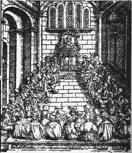

# ZEILER .me - IT & Medien, Geschichte, Deutsch - Universität und Studenten im Heidelberger Mittelalter

-   [Universität und Studenten im Heidelberger Mittelalter: Einleitung](https://www.zeiler.me/universitaet-und-studenten/einleitung.html)
    -   Die Heidelberger Universität feierte im ihr 1986 ihr 600-jähriges Bestehen und rühmt sich, die älteste deutsche Universität zu sein. (Wir vermeiden hier jegliche Problematisierung der Frage, was man unter "deutsch" verstehen kann: Das Kaiserreich des Spätmittelalters? Das wilhelminische Kaiserreich? Deutschland vor der nationalsozialistischen Expansion oder einer der beiden Rumpfstaaten Deutschlands nach 1945?)...
-   [Motive für den Aufbau einer Universität in Heidelberg](https://www.zeiler.me/universitaet-und-studenten/motive-fuer-den-aufbau-einer-universitaet.html)
    -   Der ehrgeizige Wittelsbacher Ruprecht I. wollte das durch viele kleine Besitztümer zerschnittene pfälzische Territorium abrunden und eine einheitliche Verwaltung aufbauen. Dafür brauchte er kenntnisreiche Leute, die mit Besitzrechten verschiedener Rechtslagen kalkulieren, taktieren und unterschiedliche Traditionen ausgleichen konnten....
-   [Ausbau und Finanzierung der Universität](https://www.zeiler.me/universitaet-und-studenten/ausbau-und-finanzierung.html)
    -   Im Jahre 1398 vergab der Papst auf Bitten der Kurfürsten der Universität 12 Pfründen aus den Domstiften Speyer und Worms und aus weiteren Stiften der beiden Städte und dem Territorium der Kurpfalz. Da es bei der Pfründenverteilung um einen gravierenden Eingriff in bestehende Besitzstände zugunsten des Neuankömmlings Universität ging, war jeweils das Zusammenspiel von Papst und Landesherren notwendig, um die neuen Rechte auch durchzusetzen. Wenn der alte Inhaber einer Pfründe verzichtete oder starb, konnte diese dann an einen Universitätslehrer fallen....
-   [Studentenunruhen im alten Heidelberg](https://www.zeiler.me/universitaet-und-studenten/studentenunruhen.html)
    -   \# Die Anfänge: Stadt, Hof und Universität
    -   \# Konflikte mit Hofbediensteten, Bürgern und Juden
    -   \# Ausbau der Universität und Rückschläge
    -   \# Die Universität zwischen Mittelalter und Neuzeit
    -   ...

Hohe Schul zu Heydelberg (Holzschnitt von Sebastian Münster)

Copyright © Detlef Zeiler