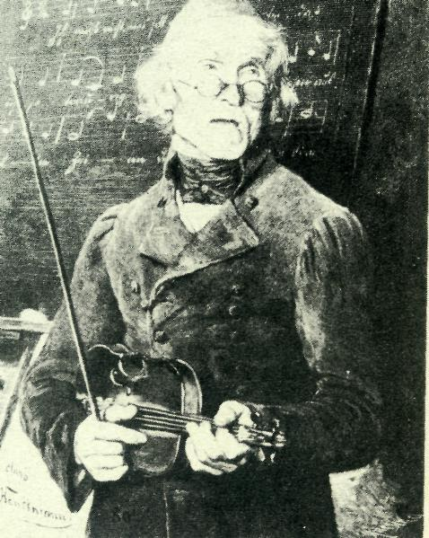

# ZEILER .me - IT & Medien, Geschichte, Deutsch - Die Anfänge

## 

Etappen der Schulentwicklung

## 

Die Anfänge: Kirchentradition und Obrigkeit.

Eines der am wenigsten drängenden Probleme zur Zeit der Heidelberger Stadtgründung im 12. Jahrhundert war der Aufbau von Schulen. Im kras­sen Gegensatz zur römischen Tradition, die im Zeitalter der Völkerwan­derung rasch zerfallen war, galt Bildung im Mittelalter der weltlichen Oberschicht als nicht besonders erstrebenswert. Die wenig differen­zierte Gesellschaft mit ihren vielen kleinräumigen Herrschaften legte nicht viel Wert auf Schriftlichkeit. Reiten, Jagen, Feste feiern, Feh­den und Turniere austragen, das bestimmte die Kultur der feudalen Machthaber. Allein der Klerus besaß spezialisierte Bildungsinstitutio­nen - vor allem in den Klöstern. Der Prototyp des Lehrers war lange Zeit der Mönch. Allein unter Karl dem Großen, Ende des 8. Jahrhun­derts, schien sich das Ansehen von Lehrern auch im weltlichen Bereich verbessert zu haben. Aber der Versuch einer Ausweitung von Bildung durch engagierte Geistliche scheiterte am Desinteresse der herrschen­den Oberschicht und der Kirche. Da die Entwicklung einer germanischen Schrift im karolingischen Reich nicht durchgesetzt werden konnte, blieb Latein die einzige Schriftsprache.

Die Mönche auf dem Heiligenberg waren sicher die ersten, die sich im Raum Heidelberg als Lehrer betätigten; und auch unten in der Stadt wa­ren es vor allem kirchliche Bemühungen, die für den Fortbestand einer (lateinischen) schriftlichen Tradition sorgten. Wer Schreiber brauchte oder Texte verstehen musste, konnte auf die kleine Schicht gebildeter Kleriker (das englische Wort clerk bedeutet Angestellter/Schreiber) zurückgreifen. Dies verhalf der Kirche zu einem Monopol, das sie - mit gewissen Abstrichen in den neuaufkommenden Universitäten - in die Neu­zeit hinüberretten konnte.

Die an Schriftlichkeit gebundene Ausbildung orientierte sich am 'Be­darf der Kirche, die auch für deren Finanzierung aufkam. Schulen wa­ren in diesem Sinne sehr zweckgebunden und - ähnlich wie die 1386 in Heidelberg gegründete Universität - im eigentlichen Sinne Berufsschulen für einen ideologisch und sozial eingeschränkten Kreis. Dieses kirchlich getragene Berufsschulwesen wurde über die Universitäten "nach oben" hin ausgeweitet, keineswegs aber für das Volk geöffnet. Die Gründung der Heidelberger Universität war von einem Kurfürsten veranlasst worden, der sich hierbei zum einen an europäischen Machtzentren wie Paris und Prag orientierte, zum anderen erkannte, dass zur Arrondierung eines zersplitterten Besitztums eine religiös gebundene geistige Elite von großem Nutzen ist. Der Aufbau überregionaler Beziehungen und der innerterritoriale Ausbau der Pfalz brachten vom 15. Jahrhundert ab einen Trend zum Vorschein, den man mit "Verwissenschaftlichung der Politik" bezeichnen könnte (1).

Von Anfang an war der Erwerb höherer Bildung bei uns aber auch mit der Festlegung auf eine bestimmte 'Partei' verbunden. Wer sich in Heidelberg qualifizieren wollte, musste sich gegen den Papst in Avignon entscheiden: Die Kirche war gespalten. Zwei Päpste, der eine in Rom, der andere in Avignon kämpften um Anerkennung. Und wer sich Ende des 14. Jahrhunderts als Teil der internationalen Akademikerkaste gerade in Paris qualifizierte und weiter dem römischen Papst anhängen wollte, der musste gehen. In dieser Situation bot sich Heidelberg quasi als Auffangstation an. Aber nicht nur aus Paris, auch aus Prag, wo sich die Studienbedingungen für Deutsche erschwert hatten, konnte die Hei­delberger Universität viele Gebildete und deren Anhang an sich ziehen. Mit der Universität hatte die Landesherrschaft eine normbildende Institution für die Elitebildung geschaffen, die allerdings eine gewisse rechtliche und geistige Unabhängigkeit in dem komplizierten Geflecht von Kirche und weltlicher Macht behaupten konnte. Mit dem - in Heidelberg recht frühen - Aufkommen des Humanismus erhöh­ten sich die Ansprüche an den Wissenschaftsbetrieb. Schriftliche Quel­len sollten möglichst im Original gelesen werden, brüchig gewordene scholastische Theoriegebäude wurden in Frage gestellt. "Der kriegeri­sche Aufstieg der Kurpfalz war 1450 sozusagen abgeschlossen, und der Hof öffnete sich den südlichen Idealen. Unter Kurfürst Philipp (1476-1508), seinem Kanzler Johann von Dalberg, erschien der Heidelberger neben dem Hof Kaiser Maximilians als einer der elegantesten mäzenatisch-humanistischen Orte im Reich."(2)

Der Tod Dalbergs im Jahre 1503 und die Folgen des bayrisch-pfälzischen Erbfolgekrieges brachten dem Humanismus in Heidelberg jedoch Rück­schläge, die nur allmählich wieder aufzuholen waren. Die Berufung des Erasmus von Rotterdam scheiterte an leeren Kassen, und bedeutende Män­ner wie Sebastian Münster kehrten der Stadt schnell wieder den Rücken. Erst unter Friedrich II. (1544-1556) wurden die Folgen neuzeitlicher Gedanken auch äußerlich sichtbar. Der lateinsprechende Nachwuchs für die Universität musste besser ausgebildet werden und die universitären 'Bursen' - studentische Wohngemeinschaften, denen eine Lehrkraft vorstand - bekamen Konkurrenz durch das "Pädagogium". Wie schon beim ersten Auftreten des Humanismus sträubte sich die um ihre Autonomie fürchtende Korporation Universität auch jetzt lange Zeit gegen diese Neuerung. Ausgerechnet unter Ott-Heinrich (1556-1559), der mit seiner klaren Festlegung auf den evangelischen Glauben den neuen Kräften erlaubte, mit dem alten Glauben auch die Restbestände der verknöcher­ten Scholastik aus der Universität zu drängen, wurde die Entwicklung des Pädagogiums vorübergehend unterbrochen. Aber schon unter Friedrich III. (1559-1576), der sich dem Calvinismus und damit einer europäi­schen Minderheitenposition zuwandte, wurde die verbesserte Ausbildung der Lateinschüler wieder dem Pädagogium übertragen. Bei allen Reli­gionskämpfen - bis hin zur Rekatholisierung im 18. Jahrhundert durch die Jesuiten - hat die schulische Ausbildung (wenn man von direkten Kriegs- und Wiederaufbauzeiten absieht) von nun an immer dazugewonnen. Jeder Regent wollte die Köpfe der Untertanen immer intensiver beein­flussen und vor allem: seine eigene Elite heranbilden. Seit der Entscheidung Luthers für das Landeskirchentum war die Kirche der weltlichen Obrigkeit unterstellt. Fürsten und Stadtmagistrate wa­ren Luthers Ansprechpartner bei seiner Forderung nach Verbesserung der schulischen Bildung. Dafür gab es handfeste Gründe: Mit der Einziehung kirchlicher Güter nach der Reformation drohte vielen Bildungsanstalten der wirtschaftliche Zusammenbruch, und so kam es zwangsläufig zu einer finanziellen Regelung über staatliche Kassen. Vor allem die Univer­sitäten wurden so allmählich zu den Beamtenschulen des späteren absolutistischen Staates. Die Lateinschulen wurden eine Art "Zuliefer­betrieb" zur Universität - oder auch - je nach Stärke des städtischen Bürgertums - in den unteren und mittleren Klassen als "Gesamtschule" von der städtischen Oberschicht genutzt. Viele Konflikte in der Aus­gestaltung des Schulwesens lassen sich in den seit 1528 immer häufiger auftauchenden "Kirchen- und Schulordnungen" ablesen. Schulen, auch die in der Obhut der Kirche, mussten sich fast immer nach dem regionalen Kräfteverhältnis der weltlichen Mächte richten. "Die enge Verbindung von Schule und Kirche könnte zur Annahme führen, die Schule sei nur ein Anhängsel der Kirche gewesen. Diese Meinung kann nur in dem Sinne vertreten werden, daß sowohl Kirche wie Schule der weltlichen Obrig­keit unterstanden; die später geforderte und erreichte Loslösung der Schule von der Kirche bedeutet daher nicht die 'Verstaatlichung' einer bis dahin kirchlichen Schule, sondern die Differenzierung zweier staatlichen Anstalten."(3)

