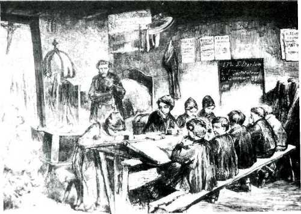

# ZEILER .me - IT & Medien, Geschichte, Deutsch - Bürger und Bauern

Vom 11. bis zum 14. Jahrhundert ist in ganz Mitteleuropa ein enormes Städtewachstum zu verzeichnen. Während um das Jahr Tausend 200 bis 300 Städte in Mitteleuropa geschätzt werden, sind es Ende des 15. Jahrhun­derts 4000, darunter allerdings 2800 Orte unter 1000 Einwohner (4). Im Gebiet des späteren Großherzogtums Baden gab es im 15. Jahrhundert 15 Reichsstädte, neben denen allein noch das 1120 gegründete Freiburg hervorsticht. Viele Städte waren klein und kamen nur zufällig zu ihrem Stadtrecht. Ihre Autonomiebestrebungen scheiterten meist an der man­gelnden Größe und Wehrkraft. Heidelberg war im Jahre der Universitäts­gründung, 1386, mit knapp 4000 Einwohnern eine verhältnismäßig kleine Stadt, deren Zentrum der Hof bildete. Fernhandel war kaum vertreten. In einer Zeit, in der sich der Übergang des Transportwesens vom Aben­teuer (5) zur Verwaltungstätigkeit vollzog, wurde die Schriftlichkeit des Geschäftsverkehrs unumgänglich. In den reichen Handelsstädten (vor allem im Norden Deutschlands) waren plötzlich auch deutsch unterrich­tende Lehrer gefragt. "Die erste weltliche Schule in Deutschland wird 1266 in Lübeck gegründet. Dort unterrichtet auch der erste von Kirche und Krone unabhängige Lehrer Deutschlands. Er ist vom Rat der Stadt engagiert."(6) Um 1300 beschweren sich viele Pädagogen, dass ihr Latein immer weniger gefragt sei, da Schenkungen, Verordnungen und alle möglichen Dokumente zunehmend in deutscher Sprache abgefasst würden. Lehrerklagen waren also von Anfang an in Umbruchszeiten zu hören.

In Heidelberg gab es dafür noch lange Zeit wenig Anlass. "...das einzi­ge Kraftzentrum von Rang war der kurfürstliche Hof."(7) Dem kirchli­chen und universitären Schriftverkehr in Latein hatte kein Kaufmanns­stand etwas entgegenzusetzen. Erst mit der Reformation wurde hier das Schriftmonopol des Klerus durchlöchert, das die Kirche seit dem Bann­fluch des Papstes 1199 über deutschsprachige Bibelausgaben zu zemen­tieren versucht hatte.(8) "An dieser Stelle ist die Bedeutung Luthers sowohl für die deutsche Sprache wie für eine auf das Wort gestützte und im individuellen Gewissen verankerte Theologie und damit für die religiöse Massenunterweisung zu bedenken. Es sollte fortan nicht mehr genügen, an den kirchlichen Amtsvollzügen teilzunehmen, und die 'Schrift' sollte nicht mehr durch eine sprachliche und schriftliche Barriere als Sonderwissen verschlossen sein. Bibelübersetzungen und Leseunterricht gehören zusammen, sie bedeuten sozialgeschichtlich die Überführung der Muttersprache in den Status einer Schriftsprache; und der Ort ihrer ersten pädagogischen Realisierung sollte die reformato­rische Katechismusschule sein." (10)

Nun gab es allerdings schon damals eine immense Kluft zwischen Theorie und Praxis. Auf einer Synode in Heidelberg von 1563 wurde beschlossen, in Zukunft sollten nur solche Glöckner angestellt werden, die befähigt sind, Kindern den Katechismus zu lehren. (10) Man wollte also auch von kirchlicher Seite aus die Alphabetisierung verbreiten. Entsprechende Schulen wurden jedoch erst seit 1593 eingerichtet. Die schlecht bezahlten Glöckner lehrten Schulanfänger das Lesen und Schreiben, so­weit sie das selbst konnten und soweit es ihnen die dunklen, überfüll­ten Schulräume erlaubten. Mit dem Schuldienst der sogenannten "Kindermeister" oder "Schreibmeister" wurde später das Küsteramt ver­bunden. Die zwangsläufig enge Bindung an die jeweils in Heidelberg do­minierende Religion dürfte für die sehr schlecht bezahlten, pädago­gisch überhaupt nicht vorgebildeten Lehrer in jedem Fall das geringste Problem gebildet haben. Wer wirklich schreiben, lesen und mit Kindern umgehen konnte, hatte damals weit mehr Chancen, sich mit Privatunter­richt in großen Handelsstädten durchzuschlagen. "Entsprungene Mönche, halb ausgebildete Theologen, Novizen, entlaufene Priester und ge­scheiterte Studenten lassen sich in großen und reichen Handelsstädten nieder und bieten ihr Wissen gleichsam als Ware an."(11)

Privatunterricht in deutscher Sprache gab es auch in Heidelberg, und zwar schon vor der Einrichtung von "Pfarrschulen". Der Unterricht der "teutschen Schulen" kann kaum schlechter gewesen sein als der kirch­lich geförderte. Dennoch war diese frühe private 'Lehrerselbsthilfe' vom Kirchenrat nicht gerne gesehen - und man warnte vor dem Besuch der sogenannten "Hecken- und Winkelschulen".

Bereits im 15. Jahrhundert war die Druckkunst erfunden worden, was der Schriftsprache einen starken Aufschwung und (in Heidelberg) vor allem dem höheren Bildungswesen Impulse gab. Seit 1466 bestand in Heidelberg eine Druckerei. In den Religionsstreitigkeiten des 16. Jahrhunderts gewann die Rolle der Schrift und des Lehrers in den Territorialstaaten und den Städten allmählich auch für die Beeinflussung breiter Schich­ten an Bedeutung. Viele wollten auch von sich aus die "Zeytungen", wie man allgemein die Nachrichten nannte, verstehen können, wollten wissen, was in den jeweils neuesten Pamphleten verkündet wurde. Han­delsstädte mit starkem Bürgertum errichteten eigene deutsche Schulen, arrangierten sich jedoch in den meisten Fällen (vor allem im Südwesten Deutschlands) mit der Kirchengemeinde. In Heidelberg gab es auf schu­lischem Gebiet kaum Konflikte. Wie die Universität, so richteten sich auch die Schulen zwangsläufig nach dem Hin und Her der Glaubenspolitik des Hofes. Die Auslesebasis für staatlich-kirchliche Elite wurde all­mählich erweitert. Für einzelne besonders begabte Kinder aus dem Bür­gertum gab es Mobilitätsschleusen über die Neckarschule und (später) das Sapienz-Kollegium. Damit wurden vom kurfürstlichen Hof Ressourcen ausgeschöpft, die schon länger auch von kirchlicher Seite genutzt wur­den. Die allgemeine Literarisierung des Volkes, das nun die Bibel und vor allem den "richtigen" Katechismus verstehen sollte, blieb jedoch nur Fernziel. Soviel war den Entscheidungsträgem bald klar: Das Volk richtete sich auch ohne Katechismusschule nach der jeweiligen Machtlage.

Ein Handwerker, Bauer oder Gastwirt hatte lange noch andere Probleme als das Verständnis der Schriftsprache. Die meisten lernten durch An­schauung und Imitation ihre spätere Tätigkeit. Kindheit als eine ge­sonderte Lernphase war gesellschaftlich noch nicht ausgeprägt. Bäuer­liches oder handwerkliches Berufswissen war noch nicht analytisch in Teileinheiten zerlegt und schriftlich erläutert. So wurde z.B. in der Schmiedemeisterprüfung verlangt, "in nur zwei Hitzen den vollständigen Hufbeschlag zu fertigen, ohne Maß genommen zu haben, ohne die Hufe auch nur genau betrachtet zu haben, vielmehr nachdem das Pferd zweimal an der Werkstatt vorbeigeritten war. Vergleichbare Leistungen waren in fast allen Handwerken üblich. Die Schulung der Sinne und der Hand, der Merk- und Schätzfähigkeit führte zu ganz außerordentlichen Befähigun­gen, die aber als selbstverständlich galten..."(12)

Dem einfachen Volk galt das Leben noch lange als ein Kreislauf von Jahreszeiten, Heiligenverehrung, ritualisierten Festen und ständisch abgegrenztem Sozialverhalten, dem auch die allmählich aufkommenden (vor allem städtischen) "Volksschulen" nichts entgegensetzen konnten. Noch bis ins 19. Jahrhundert hinein ging es vor allem auf dem Lande meist um äußerliches Nachplappern von Sprüchen der jeweils verordneten Religion (13).

Die Reformation war kein wirklicher Wendepunkt, vor allem nicht für die auf dem Lande lebende Mehrheit der Bevölkerung. Das hatte Gründe. Die Bauern hatten Anfang des 16. Jahrhunderts die bis heute stärkste freiheitliche Volksbewegung in Deutschland zustande gebracht, um sich unter Berufung auf demokratische Motive der Reformation aus jahrhun­dertealter Unterdrückung zu befreien und komnunale politische Mitbe­stimmung zu erzwingen. Ihre Niederlage im Bauernkrieg von 1525, die Verfolgung und Ermordung sogenannter "Rädelsführer" (ein Begriff, der sich von da an durchsetzte), dies alles bedeutete einen Wendepunkt in der deutschen Geschichte der frühen Neuzeit. Luther hatte sich auf ge­hässige Weise von den Aufständischen distanziert und seine Lehre vor allem den Fürsten angedient. Die Bauern waren ohne genügend ausgebil­dete und entschlossene Anführer ihren eigenen Unsicherheiten und den diplomatischen Taschenspielertricks der Herren nicht gewachsen und verloren trotz anfänglicher Überlegenheit die Auseinandersetzung und 100 000 ihrer besten Kräfte (14). Fürsten, Kirche und feudale Kräfte gewannen auf ganzer Linie. Zurück blieb jedoch ein Trauma für Herrscher und Beherrschte, das sich bis ins 19. Jahrhundert hinein festsetzte. Der innere Ausbau der Länder, bei dem die Schulentwicklung eine wichtige Rolle spielte, vollzog sich nach 1525 auf äußerst re­pressive Weise. Und genau hier liegt die Wurzel des später häufig beklagten deutschen Untertanengeistes. Luthers Katechismusunterricht ist danach in einem anderen Licht zu sehen. Seine unbarmherzigen, ja grausamen pädagogischen Ratschläge galten genauso für den politischen, wie für den pädagogischen Bereich. Die Fürsten sollten aufrührerische Bauern erschlagen "wie tolle Hunde", die Eltern sollten Kinder lieber totschlagen, als ungehorsam aufwachsen lassen. Luther ist einer der wichtigsten Begründer der Prügelpädagogik. Luthers Erziehungsmaximen galten leider, trotz Rousseau, bis weit ins 19. Jahrhundert hinein:

Kinder seien von Geburt an böse, schlecht und verderbt. Ohne Erziehung seien sie "eitel wilde Tiere und Säu in der Welt, die zu nichts nutze sind, denn zu fressen und saufen." (16) Nur durch harte Strafen seien Kinder zu erziehen. Diese pessimistische Sicht der menschlichen Natur wurde dann von J. Calvin (1509-1564) an Strenge noch übertroffen und von Volksdichtern wie Sebastian Brant und Hans Sachs weit verbreitet.

Zu dem Motiv der Einführung allgemeiner Bibelkenntnis kam also von Anfang an das Motiv der Untertanenerziehung (17). Dabei entstand -neben der Abwehrhaltung der Bauern selbst - auch eine Abwehrhaltung des Kleinadels gegen die Einführung von Schulen. Schließlich "berührte die Durchsetzung des Willens zur Dorfschule die Herrschafts- und Wirtschaftsinteressen des Adels, der seine Machtstellung vornehmlich in der noch feudal verfassten Landwirtschaft hatte und sich, ebenso wie die Städte, dem Willen der Landesherren zum Ausbau 'ihres' Staates entgegenstellte. Insofern gehört gerade die Geschichte der mühseligen Realisierung einer Schulbesuchsmöglichkeit für die breite Masse der ländlichen Bevölkerung in den... Zusammenhang der 'Staatsbildung'. Unter diesem... Gesichtspunkt kann man sagen, dass die Dorfschule von Anfang an, und nicht erst durch ihre spätere Loslösung aus der kirchlichen Bindung, ein Instrument zur Durchsetzung der landesherrli­chen Zuständigkeit war, sich gegen die Interessen des Adels richtete und den Bauern aufgezwungen wurde: ein frühes Beispiel für die politi­sche Funktion der Schule."(18)

Weder das religiöse, noch das staatliche Motiv führten jedoch zu schnellen realen Erfolgen in der Literarisierung des Volkes. Der Dreißigjährige Krieg (1618-48) verwüstete Stadt und Land, - aber auch viele zählebige alte Strukturen. Dennoch konnten die eigentlichen Sie­ger, die gegenüber Stadt und Kleinadel erstarkten Territorialmächte, im 17. Jahrhundert die schulische Situation kaum wesentlich verbes­sern. Oft kam es eher noch zu Rückschlägen. So auch in Heidelberg: "1651 war das reformierte Schulhaus zu St. Peter in solch erbärmlichem Zustand, daß die Schulfrau in Miete wohnen und unterrichten mußte." (19)

Die Verwüstungen der Kriege haben sicher eine kontinuierliche Entwick­lung im Schulwesen verhindert, aber auch die gesellschaftlichen Ent­wicklungen selbst erzwangen noch nicht den Aufbau einer allgemein und überall zugänglichen Volksschulbildung. Die Geschichte der Pädagogik wurde bisher oft entlang der heeren Willenskundgebungen von Pädagogen geschrieben, die ihren Berufsstand aufwerten wollten. Aber wer las schon Amos Comenius (1692-1670), der 1613 als Student der Theologie nach Heidelberg gekommen war und später mit seinen Hauptwerken "Orbis pictus" und "Didacta magna" zum größten Pädagogen des 17. Jahrhunderts geworden war. Wer hielt sich an sein realistisches Unterrichtsprinzip: "Erst Sachen, dann Worte", das die geistlose Repetierpädagogik ablösen sollte, die längst auch die humanistischen Bildungsideale abgelöst hatte? Für die Mehrheit der Schüler hat sich das Plädoyer für mehr An­schaulichkeit und Praxisnähe bis heute nicht realisieren lassen. Im 17. Jahrhundert ging die Mehrheit der Bevölkerung überhaupt noch nicht zur Schule. Auf den Dörfern rund um Heidelberg, die heute eingemeindet sind, musste erst noch die "Winterschule" mit Strafandrohung durchge­setzt werden. Und wer konnte deren magere Lernergebnisse schon über die langen Sommermonate retten? Der Lehrer auf dem Dorf hing vom Geld­beutel der Gemeinde ab. Bauern und Kleinhandwerker leisteten der Schule genauso Widerstand, wie in späteren Zeiten die neuaufkommende Industrie. "Das Hauptmotiv des Widerstandes... war, daß die Eltern während der Schulzeit auf die Arbeitskraft ihrer Kinder verzichten mußten - eine Belastung des handwerklichen und bäuerlichen Betriebs, überhaupt des Familieneinkommens, die die Beziehungen zwischen Eltern und Schule bis tief ins 19. Jahrhundert, ja sogar bis ins 20. Jahr­hundert prägte."(20)

