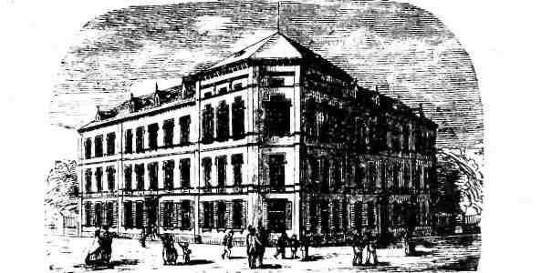

# ZEILER .me - IT & Medien, Geschichte, Deutsch - Das 19. Jahrhundert

Bei aller - auch von den deutschen Dichtern mitgetragenen (32) - päd­agogischen Aufbruchsstimmung darf man nicht vergessen, dass als Erblast des 18. Jahrhunderts der stete Blick "nach oben", zum staatlichen Ent­scheidungsträger hin, weiterlebte. Mehr Wissen für das Volk sollte auf keinen Fall zu "Aufruhr" führen. Das brachte konsequenterweise den re­ligiös-nationalen Gesinnungsunterricht, wie er schließlich im Kaiser­reich seine Blüten trieb. Der alte religiöse Plapper-Unterricht jedoch war nun allzu äußerlich und konnte nicht mehr genügen; das wurde immer mehr Entscheidungsträgern klar. In seinen Schulerinnerungen aus den 90er Jahren des 18. Jahrhunderts berichtet der preußische Regierungs­beamte Karl Friedrich Klöden, wie selbst in Stadtschulen der pure Stumpfsinn herrschte: "An jedem Tag war die erste Schulstunde dem Bi­bellesen gewidmet. Es wurde da angefangen, wo man am vorigen Tag stehen geblieben war, bis man mit der Bibel 'fertig' war... Zwar wußten wir, die Bibel sei Gottes Wort; doch hatte das für uns keine rechte Bedeutung. Uns war der Titel, die Vorreden, die Kapitelüberschriften ebensogut Gotteswort, weil sie in der Bibel standen, und hätte es dem Buchbinder gefallen, noch ein anderes Buch mit der Bibel zusammenzu­binden, wir hätten nicht bezweifelt, daß es ebenfalls Gottes Wort sei. Auch das Gesangbuch galt uns als Gottes Wort. Diese völlige Gedanken­losigkeit beim Lesen war es auch, die da machte, daß wir bei solchen Stellen der Bibel, die man Kindern billig vorenthalten sollte, ohne irgendeinen Anstoß wie bei allen anderen vorübereilten; denn wir wußten nicht, was wir gelesen hatten."(33)

Aufklärung und Innerlichkeit, die den beschriebenen Zustand verbessern sollten, führten, das ist hier schon herauszuhören, zu einer neuen Stufe der Prüderie, einer Verhaltenskontrolle, wie sie gerade so enga­gierte und verdienstvolle pädagogische Vordenker wie Rousseau und Pestalozzi mit einem Eifer betrieben haben, den man heute als krank­haft beschreiben möchte.(34)

Mit dem Nachlassen der äußeren Kontrolle durch festgelegte Rollen mussten Freiheiten erlaubt werden, die nur bei genügend "innerer" Kontrolle nicht zu gefährlichen demokratischen Forderungen führen konnten. Das Trauma des Bauernkrieges war Ludwig von Seckendorff durchaus noch in Erinnerung, als er im "Christen-Stat" schon 1685 den Fürsten vor Augen hielt: "Denn es ist nicht müglich/ wider alle Fehler der Menschen mit der Schärfe der Gesetze zu verfahren; Es müsse einem ieden ein besonderer Aufseher/ und über diesen wieder einer/ und so fort/ ohne Endschaft/ verordnet werden/ wann man dergleichen Satzungen in stetem Schwang und Gang erhalten wolte... Wer aber ein Gewissen und Gottesfurcht hat/ der heget/ so zureden/ ein wohlbestelltes Polizey-Gericht in seinem Hertzen..."(35)

Die mühsam von engagierten Pädagogen und Poeten erkämpften Fort­schritte in der Literarisierung des Volkes trugen von Anfang an auch die Merkmale der Kontrolle. "Das Aufschreibesystem von 1800 widerruft an allen Fronten Luthers Befehl, die Bibel 'von Wort zu Wort zu verzelen'. Ihn ersetzt der neue Befehl, nur das lesen zu lassen, was Schüler und Lehrer 'verstehen'. Es ist klar genug formuliert und, wie das 'Nur' sagt, eine Selektion und Diskurskontrolle wie alle anderen, auch wenn Hermeneutik ihren Sieg gerade der Maskerade verdankt, als Gegenteil jeder Kontrolle aufzutreten. Aber darauf sind die Leute von Anfang an nicht hereingefallen."(36) Das konnten allerdings die meisten auch gar nicht, muss man ehrlicherweise ergänzen. Der Schulzwang für alle und ein einfühlsamer Unter­richt sind auch im 19. Jahrhundert aus mehreren Gründen noch nicht durchsetzbar:

Zu viele Eltern sind noch auf die Mitarbeit oder den Zuverdienst der Kinder angewiesen. "Die Schulzeit der Kinder erschien den El­tern als Abstrich von deren Arbeitszeit, d.h. als Bedrohung ihrer materiellen LebensSicherung."(37) 1816 waren maximal 60% der Schul­pflichtigen überhaupt erfasst (38). Noch zu Beginn der 40er Jahre blieben rund 20% aller schulpflichtigen Kinder dem Unterricht fern. In den Industriegebieten lag die Quote noch beträchtlich höher(39).

Vor allem die unteren Lehrer haben sich noch nicht zu einem eigenen Berufsstand mit gesicherten Qualifikationen und gesichertem Einkom­men emanzipieren können. Sie befinden sich noch gänzlich in Abhän­gigkeit von Kirche und Gemeinde. "Die Forderung nach einem festen Lehrergehalt, das ihn von Nebenverdiensten unabhängig machen soll­te, wurde von der Lehrerschaft zum ersten Mal kämpferisch in der Revolution 1848 erhoben. Bis zum Lehrerbesoldungsgesetz von 1897 mussten die Kommunen für die Lehrerbesoldung aufkommen und erhielten nur dann staatliche Unterstützung, wenn ihnen die Finanzierung unmöglich war." (40)

Staatlich unterstützte "Armenschulen" oder an rasch expandierende Industrie angegliederte Fabrikschulen waren in erster Linie an der blanken Ausbeutung der Kinder interessiert (41). Es zeugte geradezu von Kinderfreundlichkeit, wenn nach Alarmmeldungen von Militärs wegen der gesundheitlichen Untauglichkeit von Rekruten aus Fabrik­gegenden am 17. Juni 1837 im Rheinischen Landtag gefordert wurde, daß Kinder nicht unter dem Alter von 9 Jahren und nicht länger als 10 Stunden täglich arbeiten dürfen.(42) Ein Aufschrei der Empörung seitens vieler Industrieller, die um ihre Konkurrenzfähigkeit fürchteten, verzögerte noch lange eine effektive Kinderschutzgesetzgebung.

"Wo Seminare für Lehrer bestanden, waren sie fest in den Händen der Geistlichkeit. Um 1830 jedoch hatte noch nicht einmal die Hälfte aller Lehrer ein Seminar oder Hilfsseminar absolviert, und immer noch hielt die Kirche zäh an ihrem Recht fest, den Lehrer auch als Küster zu benutzen."(43) Aber auch in Seminaren wird oft nur das "Pauken" gelernt. "Tatsächlich wird dort auch nicht allzuviel ver­langt. Noch bis ins 20. Jahrhundert hinein genügt es in den meisten Ländern Deutschlands, sich dem Besuch einer Lehranstalt und 'einer ersten Prüfung mehr theoretischer Art zu unterziehen', wie 'Meyers Großem Konversationslexikon' von 1908 zu entnehmen ist."(44) "Wir haben immer wieder die Bibel gelernt", klagt 1855 ein Lehrer in Württemberg. Und aus Bayern, wo seit langem die perfekteste und kleinkarierteste kirchliche Schulaufsicht herrschte, wo man - wie sonst nur in Württemberg - auch in der Weimarer Republik noch ohne Reifezeugnis Lehrer werden konnte, berichtete ein Schulmeister 1910 von der Lehrerbildung: "Das Hauptfach aber war Religion, das Memo­rieren von Katechismus und Bibel."(45)Die mangelhafte Lehrerbildung führte im 19. Jahrhundert zu ganzen Ketten von Dorfschullehrergenerationen, an deren Beginn ein gut ausgebildeter Großvater stand, der sein Amt auf Sohn und Enkel wei­tergab. So wird der Volksschullehrer zun Spottbild von Politikern und Poeten, die sich ein leichtes Opfer suchen. "Als Provokation müssen es die Lehrer empfinden, wenn die Parlamentarier ihre eige­nen Gehälter saftig aufbessern und eine Anhebung der Lehrerbesol­dung mit dem Hinweis ablehnen, daß in den Schulen doch nur eine geistlose Tätigkeit verrichtet werde."(46) Theodor Fontane, Wilhelm Busch, alle fallen sie über die traurige Gestalt des Schulmeisters her.

Von diesen finsteren Verhältnissen hebt sich die badische Situation positiv ab: Im Schulstreit zur Jahrhundertmitte zwischen Kurie und Staat gewinnt der Staat in der Form des an die Macht gelangten Liberalismus (47). 1862 wurde als einheitlich organisierte Oberste Schulbehörde der "Oberschulrat" in Karlsruhe eingerichtet, der auch für eine bessere und einheitlichere Lehrerbildung eintritt. "Baden wurde in 10 Schulkreise eingeteilt und an die Spitze eines jeden ein Kreisschulrat gestellt. Die Bezirksaufsicht und die örtliche Schulaufsicht durch den Pfarrer verschwanden." (48) Stu­fenweise (1868/1876) konnte in Baden die Simultanschule eingeführt werden. 1893 wurde das Schulgeld an der Volksschule aufgehoben. In Heidelberg war 1868 mit der neuen evangelischen Schule in der Plöck eines der besten und modernsten Schulhäuser eingeweiht worden. Der Aufwand der Stadt für die Schulen betrug 1871 real 22 527 Mark und stieg bis 1914 auf 519 800 Mark. Unter dem pädagogisch engagierten Bürgermeister Dr. Karl Wilckens wurden -neben dem Neubau des Gymnasiums - auch neue Volksschulen errichtet: 1886 die Pestalozzischule in der Weststadt, 1892 die Schule in Schlierbach, 1903 die Liselotteschule und die Mönchhofschule, 1905 die Wilckensschule. (49)

*am 12. Oktober 1868.*

*Das neue evang. Schulhaus in Heidelberg*

Die politische Niederlage des Bürgertums nach 1848 führte nicht nur in Preußen zur Bekämpfung gerade der engagiertesten Volksschul­lehrer und zu einem Rückschlag der sich auf Rousseau und Pestalozzi berufenden Pädagogik. Viele Lehrerseminare wurden aufs Land ver­lagert. Nicht überall konnten die Akten der an der demokratischen Bewegung Beteiligten rechtzeitig zur Seite geschafft werden.

Die höhere Schulbildung wurde unglücklicherweise im Gefolge von Humboldt (1767-1835) so stark vom Neuhumanismus geprägt, dass die Berufsbildung (auch der bürgerlichen Eliten) für lange Zeit außer­halb des Bereichs der Erziehungsutopien fiel. "In diesem Bildungs­ideal ist der Mensch ein allseitig Verstehender und Aufnehmender (Universalität), ein individuell gestaltendes Wesen (Individuali­tät) und ein Ganzes (Totalität), so wie das antike Vorbild nahe­legt. Humboldt geht es um reine Menschenbildung ohne den geringsten Gedanken an Lebenstauglichkeit im wirtschaftlichen, praktischen oder technischen Sinne. Seine Pädagogik bleibt darum eine solche der Minorität, eben jener wenigen, die sich am Griechentum aufrich­ten können und wollen und sich als Geisteselite verstehen... Dem isolierenden Auseinanderdenken von Menschenbildung und Spezialbildung entspricht auch die organisatorische Trennung beider. Die na­heliegende Lösung einer lebenspraktisch orientierten Mittelschule als Bestandteil eines einheitlichen Schulwesens wird ausgeschlagen. Dagegen sollen viele Spezialschulen für das Gewerbe - Ackerbau-, Handels-, Schiffahrts-, Handwerker-(Kunst-)Schulen den Bedarf stil­len. Sie gehören folgerichtig nicht zum Ressort Humboldts."(50) Auf den ersten Blick erscheint das überleben des Neuhumanismus in der sich ausdifferenzierenden bürgerlichen Welt des 19. Jahrhun­derts unverständlich. "Aus Baden, dessen Gelehrtenschul-Lehrplan bis 1869 besonders wenig mathematischen und naturwissenschaftlichen Unterricht aufwies, lassen sich viele drastische Beispiele für Unwissenheit im Rechnen und in mathematischen Problemen aufführen. Die Gymnasiasten wußten oft weniger als die Volksschüler." (51) Chemie, Physik, Biologie, aber auch moderne Sprachen wurden sträf­lich vernachlässigt. "Die dadurch drastisch beschränkten Fremdspra­chenkenntnisse des deutschen Bildungsbürgertums waren möglicherwei­se ein folgenschwerer Mangel, da sie eine Kommunikation mit anders­sprachlichen Eliten einschränkten."(52) Der badische Abgeordnete Leimbach beklagte 1894 die politische Ignoranz der Gymnasiasten, denen die badische Verfassung unbekannt, die griechische und römische des klassischen Altertums dagegen bekannt sei (53). Warum nun nahm das Bürgertum die Qualifikationsdefizite der höheren Schule hin? Warum setzte es sich nicht nachhaltiger für die Auswei­tung der Realschule zur Oberrealschule und zun Realgymnasium ein? Zunächst kann man jetzt schon gut die Trägheit einer gewachsenen Institution beobachten. Zudem konnte das Gymnasium in den Städten lange Zeit vom Bürgertum bis zur Mittelstufe als Gesamt- oder Ein­heitsschule genutzt werden. Es kann hier beinahe schon im 19. Jahrhundert von einem "Schulsystem" gesprochen werden (54). Eine Untersuchung aus Kassel für den Zeitraum 1865-1878 zeigte: "Die Mittelstufenabgänger verteilten sich zu etwa gleichen Teilen auf den staatlichen und auf den privatwirtschaftlichen Bereich. Nur in der Unterstufe schienen die Abgänger mehrheitlich gewerbliche Beru­fe gewählt zu haben (in erster Linie einen kaufmännischen Be­ruf)."(55)

Das stark laufbahnorientierte deutsche Schulwesen hatte vor allem ein auf den Staatsdienst zielendes Berechtigungswesen, das unab­hängig von den faktischen Lerninhalten zunehmend auch auf die obe­ren Ränge der Wirtschaft ausstrahlte. Bildung wurde als Ware mit "Klassenstempel"(56) gehandelt. Die "Übungsmaschinerien" der toten Sprachen, Altgriechisch und Latein, machten denjenigen durchaus 'realitätstüchtig', der unabhängig von der konkreten Situation zu dauernder Anpassungsleistung gezwungen wurde. "Die Tätigkeit der Beamten konzentrierte sich auf den schriftlichen und mündlichen Umgang miteinander und mit der Bevölkerung, wobei ein gewisser Stand sprachlicher Fähigkeiten unabdingbare Voraussetzung war. Bei einem starken Anteil anordnender, befehlender Sprechakte, - nicht umsonst hießen die Beamten in der badischen Umgangssprache 'die Herren' - war ein instrumentelles Verhältnis zur Sprache eine wich­tige Ausgangsbedingung. Die sprachlichen Verhaltensweisen mußten den Verwalteten die Herrschafts- und Repräsentationssymbole des po­litischen Systems vorführen."(57) Der Bürokratie ist es als domi­nierender sozialer Gruppe lange Zeit gelungen, eine relative Auto­nomie des Schulwesens gegenüber Wirtschaft und sozialer Lebenswelt durchzuhalten. "Erst am Ende des 19. Jahrhunderts wurde das Gymna­sium, die Schule der Bürger als 'Staatsdiener', als Leitsektor ab­gelöst durch die Realgymnasien und Realschulen, die man als Schulen der Wirtschaftsbürger bezeichnen könnte."(58)

7\. Noch ein letzter Punkt ist für das 19. Jahrhundert bestimmend: Die in der Sozialdemokratie organisierte Arbeiterbewegung hatte sich die Forderungen demokratischer Lehrer zu eigen gemacht:

\- Trennung von Kirche und Schule.

\- Abschaffung der privaten Vorschulen.

\- Verbesserung von Lehrerausbildung und -besoldung.

\- Unentgeltlicher Schulbesuch für Arme.

\- Aufbau einer Einheitsschule.

Vom Chemnitzer Programm (1866) des Allgemeinen Deutschen Arbeiter­vereins über das Eisenacher Programm von 1869, über das Gothaer Programm von 1875, das Erfurter Programm von 1891, bis zum Mann­heimer Parteitag von 1906 wurden diese Forderungen ebenso regel­mäßig wie erfolglos aufgestellt (59). Die Sozialdemokratie wurde trotz - oder wegen - rapide wachsender Wahlstimmen im Kaiserreich verfolgt, verhetzt und an den Rand gedrängt. Der sogenannte Kaiser­erlaß von 1889 bestimmte, daß die Schule "in ihren einzelnen Abstu­fungen. .. der Ausbreitung sozialistischer und kommunistischer Ideen entgegenzuwirken" hat (60). Schule wird politisch gegen die Arbei­terbewegung und für die imperialen Expansionswünsche der bei der Verteilung von Kolonien angeblich zu kurz gekommenen 'Mittelmacht' Deutschland funktionalisiert.

Die Kritik der Sozialdemokratie wiederum bleibt abstrakt postulie­rend, ohne mit anderen schulkritischen Strömungen wie den Kunst­erziehern um Alfred Lichtwark und Avenarius - und den Anfängen der Reformpädagogik ("vom Kinde aus..."), die allerdings die schulische Autonomie zum Ziel hatten, verschmelzen zu können (61). Auch mit der Reformbewegung um Georg Kerschensteiner (1854-1932), der ab 1895 als Münchner Stadtschulrat wirkte, gab es keine direkten Ver­bindungslinien. Kerschensteiner und andere Vertreter der "Arbeits­schule" forderten in Anknüpfung an Pestalozzi den erzieherischen Einfluss handwerklicher und lebenspraktischer Tätigkeit für die Schule - und traten gegen die bloße "Wort- und Buchschule" auf. Das ließ sich gegen die abgehobene Arroganz des Neuhumanismus wenden und hat sicherlich den Siegeszug der Berufsschule nach dem Ersten Weltkrieg mit vorbereitet. Handwerkliche Orientierung und auf den bestehenden Staat hin orientierte "organische" Menschenbildung, das schien jedoch vielen Sozialdemokraten keine Alternative zu ihren allmählich alternden Revolutionshoffungen(62) zu sein, auf denen sie es sich geistig bequem gemacht hatten.