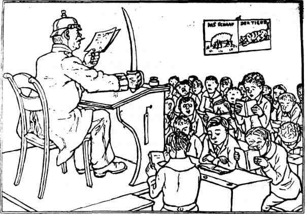

# ZEILER .me - IT & Medien, Geschichte, Deutsch - Das 20. Jahrhundert

*In den preußischen Schulen soll jetzt als neues Unterrichtsfach Staatsbürgerkunde eingeführt werden. Es ist wohl selbstverständlich, daß der Unterricht von Schutzleuten erteilt wird.*

Die Organisation des mittleren und höheren Bildungswesens sowie die Lehrerausbildung blieben in Länderhoheit. Das private Vorschulwesen be­kam so großzügige Übergangsbestimmungen, dass es häufig bis 1933 (!) fortbestand. Die obligatorische Volksschule galt vielen begüterten Familien als "unfein", als "Armeleuteschule", andere standen ihr offen ablehnend gegenüber, weil sie darin ein "Produkt der Revolution", ein "Machwerk der Novemberverbrecher" sahen. Konservativ eingestellte El­tern boykottierten die Schulveränderung, wo immer es ging, ließen ihren Kindern vom Hausarzt Atteste schreiben, dass der Grundschulbesuch nicht möglich sei, bezahlten Hauslehrer oder richteten regelrechte Fa­milienschulen ein. Ab 1925 (bis 1933!) kam mit dem "kleinen Grund­schulgesetz" sogar noch die Möglichkeit hinzu, die Grundschule bereits nach drei Jahren wieder zu verlassen.

Trotz allem gab es viele Verbesserungen. Gerade die ab 1926 auf den neugeschaffenen Pädagogischen Akademien ausgebildeten Lehrer versuchten, Elemente der Reformpädagogik nicht nur auf privaten Schulinseln, sondern in der öffentlichen Schule durchzusetzen. Immer häufiger zeigte sich der Stil der Erlebnis- und Arbeitsschule auf Initiative einzelner Lehrer hin auch im Alltag der Schule (68). Auch aus Heidel­berg sind uns Beispiele einzelner Lehrer bekannt, die, nachdem 1926 das Eingangsniveau der Lehrerbildungsanstalten auf die Reifeprüfung angehoben worden war, ihren Beruf ernst nahmen und energisch für eine "Pädagogik vom Kinde aus" eintraten.

Neugeschaffene Elternbeiräte konnten nach 1919 offen gegen die immer noch praktizierte Prügelstrafe auftreten oder gegen Schikanen an Kindern, die nicht am Religionsunterricht teilnahmen. Dass dies alles nicht genügte, dass die Trägheit der Institution Schule und die äußere politische Entwicklung zentrale Faktoren waren, zeigte sich rasch nach 1933.

In vielen pädagogischen Werken nach 1945 ist die Zeit des Nationalso­zialismus nur floskelhaft zusammengefasst: "In der Zeit der Schreckens­herrschaft..." In den letzten Jahren hat sich dies geändert, und man kann heute tatsächlich erfahren, was den Schrecken ausmachte und wie viele, die später über kleine Demonstrationen von Jugendlichen ent­rüstet waren, bei der Zerstörung Europas bis 1945 beteiligt waren und millionenfachen Tod ins Land gebracht hatten. Ärzte, Juristen, alle waren sie nach 1933 (viel mehr noch als die Arbeitslosen) begeistert dabei gewesen. Aber auch die Lehrer, vor allem die "unteren" Ränge hatten sich Verbesserungen erhofft. In der Gegend um Heidelberg wurden sie "Kirchturmsgockel" genannt, weil sie sich so rasch nach dem "Wind" richteten. Heidelbergs Kreisleiter Wilhelm Seiler war Volks­schullehrer. Nach einer Erhebung von 1936 (69) waren im Reich 97 % (!) aller Erzieher Mitglied im NSLB (Nationalsozialistischer Lehrerbund), davon 32% Parteigenossen. Unzählige Lehrer bekleideten hohe bis sehr hohe Parteiämter, und 62% aller männlichen Parteigenossen im NSLB waren politische Leiter. Nicht genug damit: 32% der männlichen Mit­glieder und 52% der männlichen Parteigenossen waren in SS, SA, NSKK, NSFK oder NS-Marinebund organisiert, über 10 000 Lehrer organisierten die HJ oder das Jungvolk, 27 000 Lehrerinnen gehörten der NS-Frauenschaft an. Selbst wenn viele nur "mitliefen", war das ein ungeheures Ideologiepotential, das die Ideale eines größenwahnsinnig gewordenen Spießertums weitergab. Elternbeiräte wurden aufgelöst, Lehrerkonferen­zen verloren an Bedeutung, alles und jedes wurde einem "Führer" unter­stellt und straff von oben nach unten gegliedert. (Dies hat sicherlich dazu beigetragen, dass der Begriff "Führer" heute so absolut negativ besetzt ist - im Gegensatz beispielsweise zu dem englischen Wort "leader".)

Bezeichnend dennoch, wie wenig Achtung das zu-Kreuze-kriechen den Lehrern einbrachte. Von einem "Tischgespräch" am 12. April 1942 ist die Aussage Adolf Hitlers überliefert: "Lehrer werde leider nur ein bestimmter Typ von Mensch, der sich für den Kampf in freien Lebensbe­rufen nicht eigne. Menschen, die das Zeug in sich fühlten, aus eigener Kraft etwas zu leisten und zu gestalten, werden nicht Lehrer, zumin­dest nicht Volksschullehrer."(70)

Wie es nach dem Kriege weiterging, wissen heute noch viele aus eigener Erfahrung oder über ihre Eltern. Nationalsozialisten gab es plötzlich keine mehr, die waren auf einmal vom Erdboden verschwunden. Dennoch bestand in Heidelberg für einige Zeit Lehrernot, da von den 251 Lehr­kräften im Jahre 1939 144 durch die Militärregierung ihres Amtes ent­hoben waren und nur 50 direkt in den Schuldienst kamen. Trotz der 25 zugezogenen Lehrkräfte und einiger verheirateter ehemaliger Lehrerin­nen waren die Klassen lange Zeit überfüllt. Dazu trugen allerdings auch die vielen Flüchtlingskinder bei, die in das unzerstörte Heidel­berg gekommen waren. Kohlemangel im Winter brachte Unterrichtsausfall, und Unterrichtsmittel waren lange noch knapp. Aber schon 1948 war das Schlimmste überwunden. In Heidelberg zogen die damals immer noch neuen Medien: Film, Dia, Magnetton über die neueingerichtete Stadtbildstelle ein, die alle Schulabteilungen mit Apparaten und Lehrfilmen versorgte. Die Schülerspeisung (Hooverspeisung) verbesserte den Gesundheitszu­stand der Schüler und das Ende der "Entnazifizierung" brachte neue Lehrkräfte, über "Reeducation"-Programme versuchten vor allem die Ame­rikaner, den Deutschen demokratische Werte zu vermitteln. Man mag über die Amerikanisierung unserer Kultur nach 1945 sagen, was man will, sie war auf jeden Fall ein Schutzschild für die jüngere Generation gegen die Vermischungen, in denen die braune Ideologie noch immer in so vielen Bereichen unserer deutschen Kultur - auch in der Schule -weiterlebte.

Die äußere Entwicklung der Schulen nach 1945 ist allgemein gut doku­mentiert. Beinahe jede Schule hat heute ihre Chronik. Die innere Ent­wicklung zu beschreiben, dazu wäre es jetzt bald an der Zeit. Die Ausweitung des Schulwesens und die Demokratisierung der Zugangsmög­lichkeiten nach dem "Sputnikschock" Ende der 50er Jahre waren keine nur äußerliche Angelegenheit. Hier gab es ein vorübergehendes Bündnis zwischen technischer und geisteswissenschaftlicher Intelligenz, das spätestens Anfang der 70er Jahre wieder zerfallen ist. Bildung und Wissen als "human capital" in der internationalen Konkurrenz war mit Sicherheit ein gemeinsames Motiv. Daneben aber auch der endlich fälli­ge Generationenbruch, bei dem eine neue Generation versuchte, demokra­tische Postulate auch in der Realität einzufordern. Und dann 1968: Der internationale Aufbruch der Jugend und der kritischen Intelligenz. Nicht nur in der Bundesrepublik, auch in Frankreich, den USA und eini­gen Ostblockstaaten (CSSR) versuchte man, Reformen einzufordern, Eine neue Generation hat 1968 auch im Schulbereich Veränderungen eingeklagt, alte Tabus aufgebrochen und den Anschluss an die reformpädagogi­sche Diskussion vor 1933 geschafft. Das Modell einer Gesamtschule aus dem Jahre 1970 ist sicher Ausdruck davon.

Die Reformgeneration ist inzwischen selbst älter geworden und kann via "oral-History" über ihre Zeit befragt werden - so wie wir das in unse­rem Film vorgeführt haben. Wir möchten den Übergang in die Gegenwart -und damit den Schluss dieser Abhandlung offen lassen. Einige Daten aus der neueren Sozialforschung mögen allerdings Denkanstöße geben...

*(71)Abbildung: Relativer Schulbesuch der 13jährigen an Realschulen und Gymnasien nach dem Geschlecht 1952 bis 1978.*

