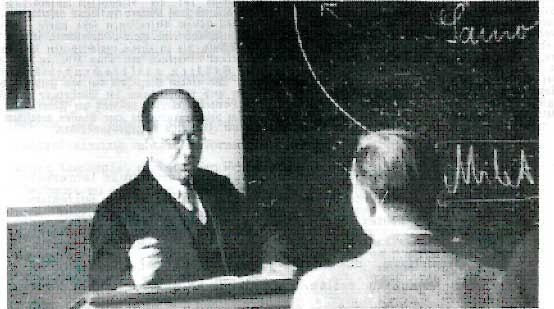
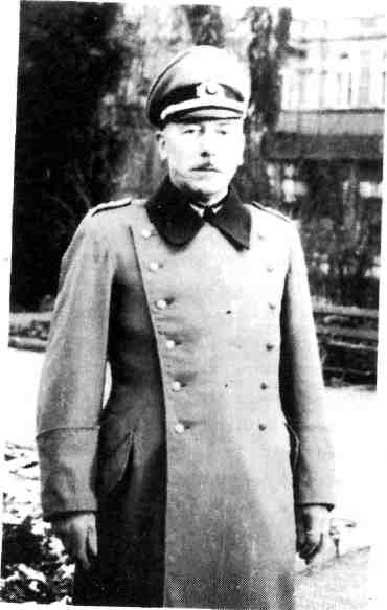

# ZEILER .me - IT & Medien, Geschichte, Deutsch - Die Lehrerschaft des Heidelberger Kurfürst-Friedrich-Gymnasiums in der Zeit des Nationalsozialismus

"Schluß mit dem verkalkten Paukersystem. Wir revolutionieren die Schule." Mit dieser Schlagzeile erschien das badische Kampfblatt der NSDAP ("Der Führer") am 23. Juni 1934, kurz vor dem sog. Röhm-Putsch. Die radikalen Nazis in Baden gaben sich nicht damit zufrieden, dass sofort nach der Machtübertragung im Jahre 1933 reichsweit ein breiter Zustrom von Lehrern in die NSDAP eingesetzt hatte. Zwar waren bald 1/4 aller Pädagogen Parteigenossen (ein doppelt so hoher Anteil wie bei den übrigen Beamten!), doch fiel der Opportunismus der Lehrer so sehr ins Auge, dass selbst die Parteiführer vor deren "Konjunkturrittertum" warnten und misstrauisch blieben. Auch wenn nach der Röhm-Affäre die revolutionären Töne gegen das gesamte Schulsystem etwas zurückgenommen wurden, so blieb doch als Ziel die totalitäre Ausrichtung des Schul­wesens, was die Institutionen und was das Personal anging, bestehen. Dass dies aber weder in dem einen noch in dem anderen Aspekt vollständig erreicht wurde, zeigt auch das Beispiel des Heidelberger Gymnasiums.

Auch das Gymnasium, dessen Lehrerschaft mehrheitlich dem Parteienspek­trum zwischen Deutschnationalen und Zentrum zugeordnet werden konnte, versuchte sich 1933 mit dem neuen Regime möglichst geräuschlos zu arrangieren. Neben den erwähnten Opportunitätserwägungen und dem Loyalitätsdruck, dem alle staatlichen Instanzen sofort ausgesetzt wa­ren, spielte auch eine Rolle, dass diese national-konservative Lehrer­schaft - scheinbar unpolitisch - gegenüber der Republik in kühler Di­stanz verblieben war. Gerade die engagierten Verfechter des Schulhuma­nismus hofften wohl sogar 1933 einen Moment lang, das altsprachliche Gymnasium könnte jetzt wieder aus der Defensive herausfinden und durch die neuen Machthaber seine alte bevorrechtigte Stellung wiedererlan­gen. Doch diese standespolitischen Illusionen zerstoben sehr rasch, als die ersten Planungen des neuen Reichserziehungsministeriums zur Reform des Höheren Schulwesens bekannt wurden: Vereinheitlichung und Zentralisierung unter NS-Vorzeichen, aufgeladen mit germanisch-völki­scher Ideologie, drohten den Weiterbestand der altsprachlichen Schulen überhaupt zu gefährden. Kein Wunder, dass die Schüler dieses Wechselbad von Hoffnungen und Enttäuschungen aus ihrer Perspektive nicht nachvollziehen konnten; sie bemerkten die Verwirrung und tiefe Verun­sicherung ihrer Lehrer in dieser Anfangsphase sehr wohl und nutzten sie für Provokationen gerade bei den immer häufiger verordneten poli­tischen Festreden und Feierstunden, bis sie ihrerseits Zug um Zug in den Hitler-Jugend-Formationen wieder diszipliniert wurden.

Ab 1934 klärten sich die Fronten und die Gruppierungen im Lehrerkol­legium etwas. Die größte Gruppe machte fast die Hälfte des Kollegiums aus und wurde später nach dem Umbruch 1945 im Entnazifizierungs-verfahren der amerikanischen Besatzungszone als "Mitläufer" eingestuft - eine Bezeichnung, die das Anpassungsverhalten der früheren NSDAP-Mitglieder anprangern sollte. Trotzdem gab es auch hier neben Anpassung an die Politik der Machthaber auch Ansätze zur Selbstbehauptung gegenüber bestimmten Zumutungen des Regimes, neben Konformität auch partielle Resistenz. Als Beispiel dafür kann Gustav Klingenstein gel­ten, prominenter Germanist und engagierter Verteidiger des Schulhuma­nismus, der über viele Jahre hinweg mit großem Erfolg Schülerauffüh­rungen antiker Dramen in der Heidelberger Stadthalle inszenierte. Er war auch 1933 in die NSDAP und SA eingetreten, weil er sich Hoffnungen machte, seinen Einfluss im Badischen Philologen-Verein erhalten zu kön­nen. Schon die Auflösung des Philologen-Vereins und die Röhm-Affäre im Jahr 1934 haben ihn anscheinend eines Besseren belehrt. Die Spruchkammer trug seinen Verdiensten "um die Reinerhaltung der Schule von nationalsozialistischem Gift" dadurch Rechnung, dass sie ihm nur ein symbolisches Sühnegeld auferlegte. Doch waren unter den altphi­lologischen "Mitläufern" die umgekehrten Fälle wohl häufiger: nämlich dass man die Beschäftigung mit antiken Texten nunmehr dadurch schmackhaft machen wollte, dass man sie als geeignete Einführung in Führertum und Volksgemeinschaftsdenken anpries.

Die zweitgrößte Gruppe im Kollegium stellten die "Entlasteten" und diejenigen, die vom Entnazifizierungsverfahren "Nicht betroffen" wa­ren. Zu ihnen sind jene vier Kollegen (1/10 des Kollegiums) hinzuzu­rechnen, die in Konflikte mit den Verfolgungsinstanzen gerieten und von denen drei die Schule deswegen verlassen mussten. Es handelte sich dabei um die Religionslehrer Richard Lossen (Suspendierung im Jahre 1934), Theodor Steltz (Suspendierung im Jahre 1937) und Karl Dörner (Androhung der Suspendierung im Jahre 1942) und um den Schulleiter Hermann Ostern (Suspendierung im Jahre 1939).

Direktor Ostern, seit 1932 im Amt, bemühte sich als Mitherausgeber der reichsweit wichtig­sten Fachzeitschrift "Das humanistische Gymnasium" auch in der NS-Zeit um eine ernsthafte Debatte über den aktuellen Bildungswert der alten Sprachen und trat besonders dafür ein, die Vielfalt der Aspekte und Deutungsmöglichkeiten gegen den herrschenden Konformitätsdruck und ge­gen die drohende geistige Provinzialisierung zu erhalten. Ostern scheiterte schließlich nach jahrelangem Hin und Her an Auseinander­setzungen innerhalb des Kollegiums.

Diese Querelen gingen von den überzeugten Nationalsozialisten des Kol­legiums aus. Diese drei oder vier Lehrer (also ebenfalls 1/10 des Kol­legiums) standen dem Regime zur Verfügung, auch wenn Verfolgungshilfs­dienste verlangt wurden; sie wurden nach 1945 als "Belastete" einge­stuft und über Jahre mit Berufsverbot bestraft. Aber auch sie kooperierten keineswegs als Gruppe, sondern agierten eher als 'Einzelkämpfer' - meist in Distanz zu den übrigen Kollegen: einer von ihnen, Parteimitglied seit 1932, brachte in Zusammenarbeit mit dem Heidel­berger Kreisleiter der NSDAP nach jahrelangen Konflikten, die er immer mehr politisierte, Schulleiter Ostern durch Denunziation zu Fall; ein weiterer Lehrer, ebenfalls "alter Kämpfer" für die NSDAP, beteiligte sich während der sog. Reichskristallnacht 1938 am Sturm auf jüdisches Eigentum; ein dritter aus der jüngeren Generation, der erst Mitte der dreißiger Jahre in den Schuldienst eintrat, war während des Krieges zugleich für den SD und die Gestapo tätig und nahm in dieser Funktion z. B. eine Hausdurchsuchung und Verhöre bei einem Kollegen und einem Schüler der eigenen Schule vor und wirkte - außerhalb des Schulbe­reichs - in Heidelberg auch an Verfahren mit, in denen ein Regimegegner hingerichtet wurde.

Als "Belasteter" wurde auch der Nachfolger Osterns, Direktor Mildenberger, eingestuft. In einer gleichsam nebenamtlichen SS-Karriere brachte er es bis zum Sturmbann-Führer; als Nationalsozialist solda­tisch-autoritären Typs fiel er bis in die allerletzten Kriegstage im März 1945 im Gymnasium mit Durchhalte-Parolen auf. Dies ging jedoch, auch wenn es heute schwer nachzuvollziehen ist, mit bemerkenswerter persönlicher Integrität einher. Gerade an der Person Mildenbergers, der sich vor seiner Heidelberger Schulleitertätigkeit im Karlsruher Kultusministerium in den entscheidenden Jahren für die Verteidigung des humanistischen Schultyps engagiert hatte, wird deutlich, daß die Erhaltung der Institution mit beträchtlicher Verstrickung ins System erkauft war.