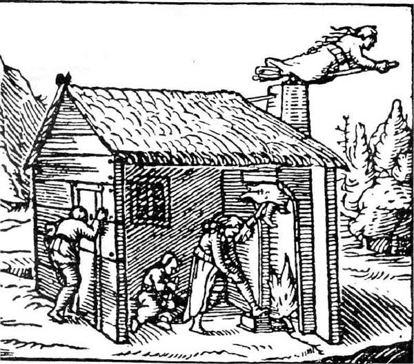
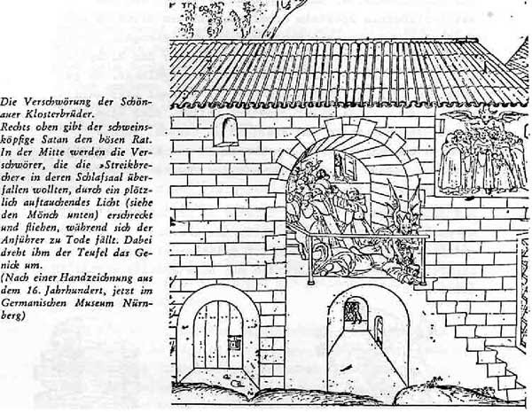
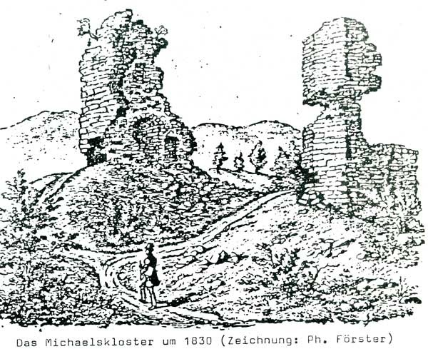
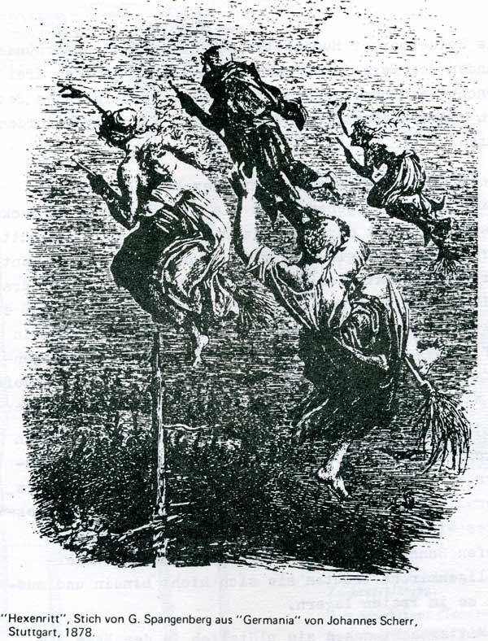

# ZEILER .me - IT & Medien, Geschichte, Deutsch - Der unheimliche Berg

Von alters her sind Sagen und schriftliche Berichte von geheimnisvollen Begebenheiten überliefert, die sich auf dem Heiligenberg zugetragen haben sollen. Man erzählte von heidnischen Höhlen und tiefen Gängen, von römischen Altären und Hexentanzplätzen. Auch wusste man von ver­grabenen Schätzen und warnte vor Irrlichtern, die ins Verderben stürzten, wer diese Schätze heben wollte.

An die Klosterzeit knüpfen zwei Sagen an. Die eine gibt Kenntnis vom "Glockenwunder": Alljährlich begingen die Mönche des Heiligenberges mit ihren Brüdern vom Kloster Schönau auf dem Schriesheimer Hof ein Mai­fest. Einmal hatten die Schönauer Mönche gebackene Forellen, Kuchen und Wildbraten mitgebracht, die Heiligenberger dagegen nur hartes Kleie- und Haferbrot, denn sie hatten am Tage verschlafen und mussten deshalb fasten.

Als sie abends müde und hungrig ins Kloster zurückkehr­ten, hieß der Abt sie noch Glocken läuten und die Abend­mette beten. Die Mönche verweigerten den Gehorsam, und als der Abt ihnen mit Strafe drohte, fielen sie über ihn her, banden ihn an Händen und Füßen und sperrten ihn in den Keller.

Nun wurde aufgetischt, was Speisekammer und Weinkeller boten, und die Mönche aßen und tranken bis zum frühen Morgen und schliefen endlich vor Ermüdung ein. Niemand dachte daran, die Glocken zur Frühmesse zu läuten.

Plötzlich - kurz vor Sonnenaufgang - fingen alle Klosterglocken an zu läuten, ohne dass jemand die Glockenstränge zog. Zugleich ertönten sämtliche Glocken der Umgebung. Alles rief: Ein Wunder! Ein Wunder! Die Leute strömten hinauf zum Kloster, wo die Mönche noch im Schlaf lagen.

Der Abt wurde befreit und die Mönche auf seinen Befehl in den Keller gesperrt. Die Abte aus Lorsch und Schönau und der Burggraf mit seinem Gefolge eilten herbei. Es wurde strenges Gericht über die Mönche gehalten, sie wurden verbannt oder ins Burgverlies geworfen, andere Mönche aus Lorsch und Limburg rief man auf den Heiligen­berg.

So wurde der Heiligenberg zum Schauplatz einer Klosterrevolte, die in der Geschichte des Berges nicht belegt ist. Ein ähnlicher Mönchsaufstand ist indes aus dem be­nachbarten Kloster Schönau bekannt.

Sein reales Vorbild könnte der unnachsichtige Heiligenberger Abt aus der "Glockenwunder"-Sage in Friedrich von Hirsau gehabt haben, der in dem Ruf steht, ein außerordentlich gestrenger Klostervorsteher gewesen zu sein.

Eine andere Überlieferung trug zu seiner Heiligsprechung bei. Nach seinem Tode entdeckte man, dass er unter seiner armseligen Leinenkutte eine eiserne Kette um den Leib getragen hatte, um sich zu kasteien. Die Kette hatte er so fest geschnürt, dass sie mit der Zeit ins Fleisch ein­gewachsen war und furchtbare Schmerzen verursacht haben muss.

Das Grabmal Friedrichs von Hirsau ist längst verloren gegangen. Über dem mutmaßlichen Grab in der Ostkrypta hält eine neugefertigte Platte seinen Namen fest.

Aus dem Mittelalter hat sich auch die Fabel von den zwölf silbernen Aposteln erhalten, die den Reichtum und Kunstverstand der Heiligenberger Mönche bezeugen, um 870 vom Abt des Klosters Lorsch gegründet, war das Michaels-Kloster bald zu beträchtlichem Wohlstand gelangt. Es gab kaum ein Dorf im Umkreis, in dem St. Michael oder wenig­stens Lorsch keine Güter besessen hätten. Hier sind vor allem Handschuhsheim und Wiesloch zu nennen, wo die Erträge des Marktrechts zum Unterhalt der Klosterkirche dienten, ebenso wie die Ausbeute der dortigen Silber­gruben.

Die Abte wetteiferten, das Kloster so prächtig wie möglich auszustatten mit Gemälden, silbernen Kreuzen, Statuen und kostbarem Altarschmuck. Der Ruf dieser Kostbarkeiten lockte noch nach Jahrhunderten die Schatzgräber nachts in die Ruinen.

Besonders zwölf Apostelstatuen aus massivem Silber, die rings in der Basilika gestanden und von den letzten Mönchen beim Verlassen des Klosters an einem geheimen Ort - nach anderen Versionen auch im Heidenloch - vergraben worden sein sollen, waren das Ziel der Handschuhsheimer noch im letzten Jahrhundert«,

Die Sage von den zwölf silbernen Aposteln kann sich auch auf silberne Votivdarstellungen in dem heidnischen Tempe beziehen, von denen vielleicht hin und wieder etwas zu­tage kam. Tatsächlich wurden bei den Ausgrabungen in nur geringer Tiefe letzte Bruchstücke einer solchen Aus­stattung gefunden. Eine fast gleichlautende Sage erzählt man sich über die Flur "Hinter Muren" bei Schleitheim, wo vor kurzem durch Grabungen ein gallo-römisches Heiligtum nachgewiesen wurde.

Die Heidenlöcher auf dem Heiligenberg - eins schon im Zusammenhang mit den silbernen Aposteln erwähnt - haben ebenfalls die Phantasie der Menschen beschäftigt. Man kennt drei Heidenlöcher, zwei im Bereich der Kloster­ruine auf der Kuppe des Berges: einmal das Loch, das aus dem Kapitelsaal in das unter diesem befindliche Ge­wölbe führt, dann die Zisterne außerhalb des Kapitelsaals und schließlich das eigentliche Heidenloch in der Nähe des heutigen Aussichtsturms auf der vorderen Kuppe.

Eine Gans, die man in eines der Löcher im Bereich der Kirche hineingelassen haben soll, sei, so sagt man, beim Kloster Neuburg (gegenüber von Schlierbach am Neckar gelegen) wieder herausgekommen.

Auch das Heidenloch beim Aussichtsturm soll bis zum Neckar hinunterreichen. Ein "Jakobs Bruder" hatte sich zweimal hinabgleiten lassen und war in ein riesiges Gemach gelangt, in dem zwei große eisenbeschlagene Kisten gestanden haben sollen. Auf jeder Kiste lag ein schwarzer Hund, der mit einer schweren Eisenkette darauf gebunden war.

Die Heidelberger Humanisten des 16. und 17. Jahrhunderts fanden den Berg immer unheimlich, zumal nachdem drei Mönche im Michaels-Kloster im Jahre 1503 in ihren Betten von einem einstürzenden Glockenturm erschlagen worden waren«

Die Heidelberger glaubten auf dem Heiligenberg die Hexen tanzen zu sehen, wenn sie bei Sturmwind am Neckar standen, obwohl doch nur die Bäume hin- und her gerüttelt wurden. Der Aberglaube war auch unter gebildeten Leuten verbreitet: Matthias von Kemnat, Chronist des Kurfürsten Friedrich des Siegreichen, versicherte um 1470, daß die Hexen aus Heidelberg auf Katzen, Besen und Gabeln in der ersten Mainacht durch die Luft über den Heiligen­berg zur Angelgrube (die Gegend des Schriesheimer Hofes in Wilhelmsfeld) flögen, um dort ihre Orgien zu feiern.

Aus der im 16. Jahrhundert entstandenen Zimmern‘schen Chronik stammt die folgende Erzählung: Graf von Zim­mern ritt im Winter 1542 mit seinem Diener durch den Odenwald und verirrte sich in der Gegend des (späteren) Ortes Wilhelmsfeld. Die beiden Männer gerieten im tiefen Schnee bis zum Heiligenberg. In die Aller­heiligenkirche trauten sie sich nicht hinein und mussten so im Freien lagern.

Um Mitternacht sahen sie plötzlich in der Nähe ein Licht, und der Diener folgte ihm vorsichtig. Immer wenn er es erreicht zu haben glaubte, entfernte es sich. Mit einer Lanze stocherte er im Schnee und merk­te, dass der Boden unter ihm wich und sich ein Abgrund öffnete. Noch ein zweites Mal versuchte das Licht die beiden Männer irrezuführen.

Bei Tagesanbruch stiegen sie den Berg hinab und sahen nach der Stelle, wohin das Licht sie hatte locken wollen - auch hier tat sich ein tiefer Abgrund voller Schneewehen auf.

***"Hexenritt", Stich von G. Spangenberg aus "Germania" von Johannes Scherr Stuttgart, 1878.***

