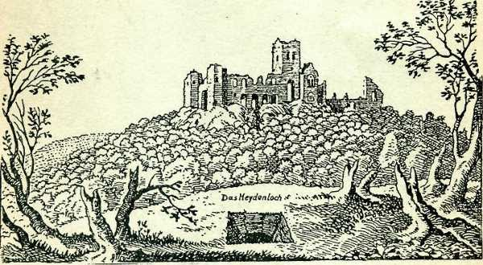
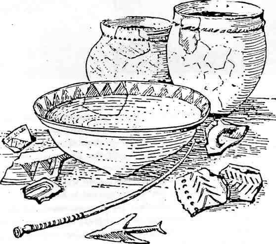
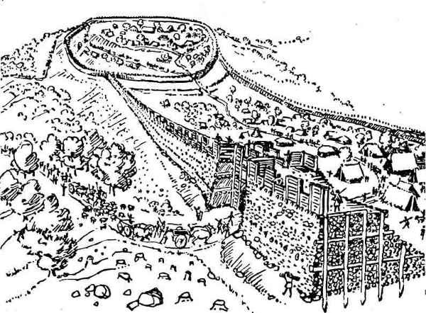
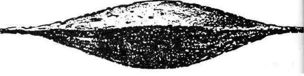
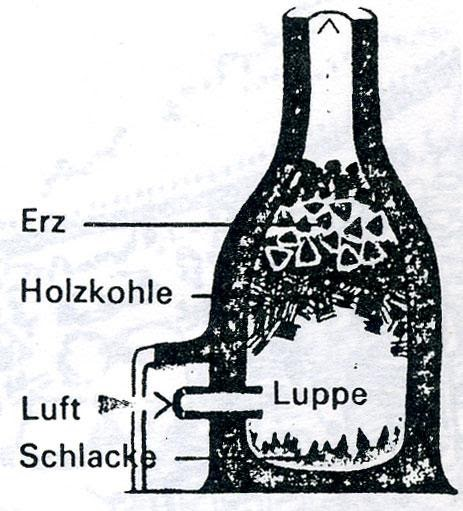
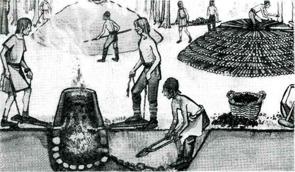
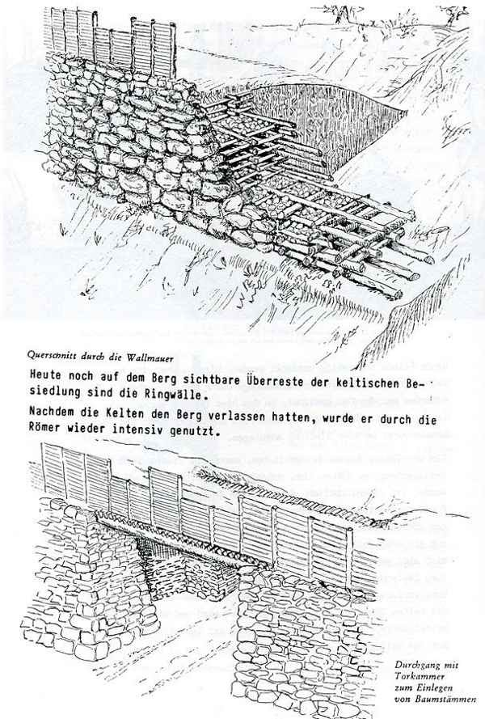
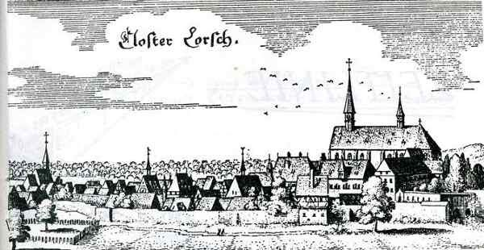
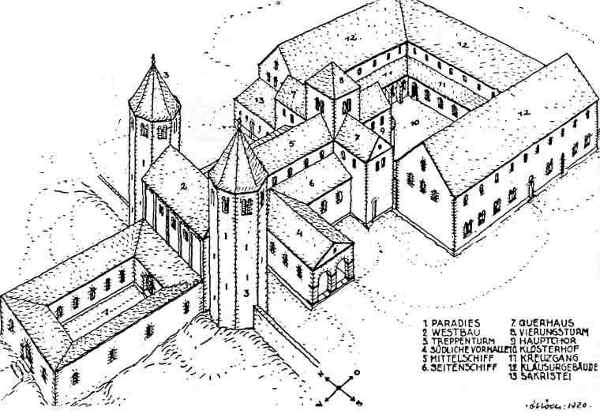
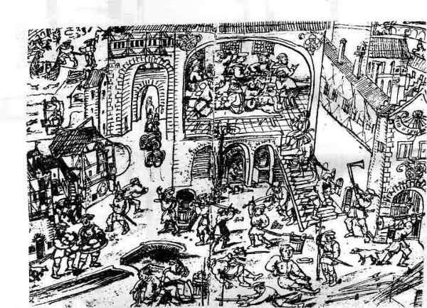

# ZEILER .me - IT & Medien, Geschichte, Deutsch - Die Geschichte des Heiligenbergs

Die 1978 wiederaufgenommenen Restaurierungsarbeiten am Kloster St. Michael hatten es sich zum Ziel gesetzt, dem Besucher ein räumliches Nachempfinden der ehemaligen Klosteranlage zu ermög­lichen. Verantwortlich für das Gelingen dieses Vorhabens waren neben den Geldgebern vor allem P. Marzolff, Bauforscher am Insti­tut für Ur- und Frühgeschichte der Universität Heidelberg, der engagierte Architekt B. Burger und auch B. Heukemes, der immer wieder sein Wissen zur Verfügung stellte. Leider musste man während der Arbeiten entdecken, dass in den vergangenen Jahrzehnten neben beaufsichtigten Grabungen auch Raubgrabungen vorgenommen worden waren, die Beschädigungen und Zerstörungen zur Folge gehabt hatten. Auch der zur nationalso­zialistischen Zeit eingesetzte Aufräumdienst hatte vielfach mehr geschadet denn genutzt. Türen waren dort eingesetzt wor­den, wo keine hingehörten und andere wiederum waren zugemauert worden. So hatte man lange Zeit nicht gewusst, welchem Zweck die einzelnen Räume gedient hatten. Es ist eigentlich nur den Auf­zeichnungen des Architekten Koch die Chance zu verdanken, den ehemaligen Zustand der Ruine wiederherstellen zu können. Dieser hatte seit 1911 immer wieder dort oben gearbeitet. Obwohl jetzt oft vom Boden her aufgebaut werden musste, entspricht alles heu­te Sichtbare dem ursprünglichen Zustand und entspringt keines­wegs den Phantasien der Archäologen und Architekten. Ihrer mühevollen Kleinarbeit ist es zu verdanken, dass der Be­sucher des Heiligenbergs heute die Möglichkeit hat, eine recht ungewöhnliche und einzigartige Klosteranlage betrachten zu kön­nen. Lediglich die einst wohl imposante Höhe der Bauten ist auf­grund fehlenden Materials nicht rekonstruierbar und nur auf dem Merianstich von 1645 nachzuempfinden. Aber nicht nur die mühevolle bauliche Rekonstruktion der Klosterruine ist bemerkenswert, sondern auch eine Reihe historisch bedeutsamer Ergebnisse, die die Grabungen erbracht haben. Das bedeutendste ist, dass nunmehr feststeht, dass der Heiligenberg seit ca. 1000 v. Chr. lange Zeit ununterbrochen besiedelt war. Hinzu kommt, dass es sich keineswegs um eine kleine, unbedeutende, sondern um eine große, zentrale Siedlung gehandelt hat. Daneben ist er wohl schon früh ein Ort mit kultischer Bedeutung gewesen. Das älteste auf dem Heiligenberg gefundene Stück stammt aus der mittleren Jungsteinzeit. Es handelt sich um eine Lanzenspitze. Sie ist freilich kein Beweis für eine dauerhafte Besiedlung des Berges zu jener Zeit und wird eher von Jägern aus dem Neckarvorland stammen, die den Berg für die Holzausbeute und als Weide­land nutzten. Ob eine Mitteilung vom Anfang dieses Jahrhunderts, man habe sogar Scherben der frühen Jungsteinzeit (5. Jahrtausend v. Chr.) gefunden, zutrifft, wird sich bei der von B. Heukemes betriebenen Bearbeitung der Altfunde im Kurpfälzischen Museum überprüfen lassen.

***Etwa 3000-jährige Funde der Urnenfelderkultur vom Heiligenberg***

Eindeutig scheint der Berg seit dem Ende der Bronzezeit dicht besiedelt gewesen zu sein. Hier beginnen die Funde sich zu häu­fen. Eine andauernde Siedlungstätigkeit durch ein und dieselbe keltische Bevölkerungsgruppe beginnt und dauert über Jahrhun­derte hinweg an, bis ca. 250 v. Chr. Die Größe dieser Siedlung entsprach in etwa der heutigen Hei­delberger Altstadt und konnte gut an die 2000 Menschen aufneh­men. Außergewöhnlich war, dass auch der Gipfel selbst besiedelt war. Im Laufe der Zeit entstanden dann auch außerhalb der Ring­wälle, die vermutlich aus fortgeschrittener keltischer Zeit stammen, den Berg hinab Behausungen.

Die zentrale Funktion dieser Siedlung lässt sich zum einen an ihrer Größe, zum anderen aber auch daran erkennen, dass dort oben Eisen­barren gefunden worden sind. Zwar wurde bei den jüngsten Ausgrabun­gen nur ein Schmelzofen aus frühmittelalterlicher Zeit gefunden, was aber nicht ausschließt, dass es diese zur keltischen Zeit auch gegeben hat. Vermutlich befanden sie sich weiter unterhalb des Gipfels. Immerhin wurden in vorrömischen Schichten des Gipfels Erzbrocken und Schlacken entdeckt. Die Herstellung von Eisenbar­ren ist insofern ein Hinweis auf die Bedeutung des Ortes, da sie das Zahlungsmittel jener Zeit waren und nur in Fürstenburgen hergestellt werden durften.

***keltischer Eisenbarren von 0,44 m Länge***

***Keltischer Eisenofen (Siegerland). Das Eisenerz wird im Rennverfah­ren bei 1100-1400° C aus den Erzbrocken geschmolzen.***

Dass ausgerechnet der Heiligenberg Sitz einer bedeutenden Siedlung geworden ist, hatte sicherlich mehrere Gründe. Zunächst befindet er sich an einer südwestlichen Ecke des mittleren Odenwaldes und grenzt sich deutlich von anderen Bergen ab. Im Gegensatz zum Kö­nigstuhl, der nach hinten flach verläuft, fällt er an allen vier Seiten steil ab, so dass er leicht zu verteidigen war. Von seinem Gipfel hat man eine hervorragende Sicht über die Rheinebene und in das Neckartal hinein. Bei guter Sicht kann man im Süden den Schwarzwald erkennen. So konnten heranziehende Feinde frühzeitig entdeckt werden. Hinzu kommen die an seinem Fuß sich kreuzenden Handelswege durch die Rheinebene. Außerdem war der Ort geeignet, in dem hier flachen Neckar, der ansonsten recht tief war, eine Furt anzulegen. Also ein idealer Ort, um eine Siedlung anzulegen. Ein ungelöstes Rätsel ist geblieben, warum die Siedlung auf dem Heiligenberg ca. 250 v. Chr. aufgegeben wurde. Dass sie aufgegeben wurde, ist offensichtlich, da für diese Zeit plötzlich kaum noch Funde vorzuweisen sind, während sie vorher und einige Zeit spä­ter wieder reichlich vorhanden sind. Auffallend ist, dass etwa zur gleichen Zeit eine Siedlung in Ladenburg entsteht. Es lässt sich aber weder nachweisen, dass eine Verbindung zu dieser Sied­lung bestanden hat, noch dass der Heiligenberg unter Gewaltanwen­dung verlassen wurde. Bekannt ist lediglich, dass zu dieser Zeit die Kelten überall sehr unruhig geworden sind und viele in den Mittelmeerraum gezogen sind. Vielleicht ist lediglich der Platz auf dem Heiligenberg zu eng geworden. Im 16./17. Jahrhundert ist man noch von der Aussagekraft der römi­schen Inschriftsteine überzeugt gewesen, die zahlreiche Hinweise z.B. auf Merkurtempel beinhalten. Das beweisen z.B. die Schriften Melanchthons. Später erschien es unglaubhaft, dass es im rechts­rheinischen Gebiet ein römisches Gipfelheiligtum gegeben haben soll. Die gefundenen Inschriftsteine mit Hinweisen auf Tempel hielt man für Beutestücke, die aus der Ebene als Baumaterial auf den Berg geschleppt worden seien. Die kürzlich durchgeführten Grabungen ha­ben endlich Klarheit geschaffen. Man hat die Überreste eines römischen Merkurtempels gefunden. Leider mussten sie, um das Gesamtbild der Klosteranlage herstellen zu können, wieder zugeschüttet werden. Für den Besucher wurden die Umrisse im Langhaus aber mit Pflaster­steinen kenntlich gemacht. Es ist anzunehmen, dass zur Zeit der Errichtung des Tempels noch Überreste der keltischen Anlage sichtbar gewesen sind. Unter dem Tempel hat man die Reste einer mutmaßlichen keltischen Opfergrube ausmachen können. Wahrscheinlich hatte der Ort im Bewusstsein der Bevölkerung einen gewissen Stellenwert beibehalten. Denn auch die Weihung eines Tempels für den Gott Mercurius Cimbrianus, der ger­manischen Ursprungs ist, oder auch die für einen keltischen Mercu­rius Visucius, lassen die Annahme zu, dass die Römer ihr Heiligtum bewusst an einem Ort errichtet haben, an dem sie nichtrömischen Vor­stellungen Raum geben konnten - ein Beispiel für kluge Kulturpolitik? Außer dem Merkurtempel lässt die Anzahl der gefundenen Trümmer­stücke vermuten, dass sich dort oben noch weitere Tempel befunden haben. Man fand Trümmer, die zu einem beheizbaren Gebäude gehört haben. Hierbei hat es sich vielleicht um die Herberge für die Pil­ger gehandelt. Eine militärische Nutzung des Berges durch die Römer ist unwahr­scheinlich. Es mag sein, dass sich auf dem vorderen Gipfel ein Wachtturm befunden hat. Vor allem ist er aber ein kultischer Ort gewesen. Bereits in der späten Antike sind diese Gebäude, möglicherweise von frühen Christen, zerstört worden. Das betraf aber nur ihre In­nenausstattung, die üppig und anspruchsvoll gewesen ist. Das Mau­erwerk des obengenannten Tempels blieb bestehen und wurde später als kleine Grabkapelle benützt. Man hat zahlreiche merowingische Gräber gefunden. Das älteste stammt spätestens aus der Zeit um 600 n. Chr. Die Siedlung dieser Neubewohner könnte, verstreuten Funden nach zu schließen, ebenfalls auf dem Berg gelegen haben. Das wäre für unsere Gegend im frühsten Mittelalter ein bemerkens­wertes Faktum. Im 7./8. Jahrhundert wird dann das Leben auf dem Berg wieder in­tensiver. Die Ringwälle werden wieder instandgesetzt, und man­ches deutet daraufhin, dass ein fränkischer Königshof entstand. Man kann vermuten, dass er der Sitz eines königlichen Beauftrag­ten gewesen ist und zentrale Funktionen dort ausgeübt wurden. Teilweise waren es recht prächtige Bauten. Das weiß man durch das Fragment einer kunstvollen Wandmalerei, das bei den Grabun­gen gefunden wurde. Sie muss während folgender Bauarbeiten in die Erde gelangt sein, als man einen Teil der Anlage planierte und - unter Einbeziehung römischer Bauteile - einen größeren, wirk­lichen Kirchenbau errichtete. Bald schon, wohl im 9. Jahrhundert, wurde derselbe durch einen nächsten Kirchenbau ersetzt, der den Kern der heute sichtbaren Kirche bilden sollte. Als in spätkarolingischer Zeit die fränkische Herrschaft gefe­stigt war, benötigten die Könige die gesicherten Höhenpositionen nicht mehr und verlagerten ihre Machtzentren in die Ebene. Dies betraf auch die Anlage auf dem Heiligenberg, so dass Ludwig III. sich 872 entschloss, den "Aberinsberg" mit seinen ganzen Besitz­tümern dem Benediktinerkloster Lorsch zu schenken. Diese Schen­kung ist aus mehreren Urkunden bekannt. In diesen Urkunden ist stets die Rede von einer "Aberinsburg". Das hatte man bisher für einen Schreibfehler gehalten. Jetzt weiß man, dass es sich tat­sächlich um eine Burganlage und nicht nur um einen relativ wert­losen Berg gehandelt hat. Wie der Berg, der ursprünglich "Aberinsberg" hieß, zu dem Namen "Allerheiligenberg" oder verkürzt "Heiligenberg" gekommen ist, lässt sich nicht eindeutig klären. Ein Hinweis könnten die beiden Klöster St. Michael und St. Stefan gewesen sein sowie die Tat­sache, dass auf dem Berg schließlich ein namentlich bekannter Heiliger verehrt worden ist. Dies war der ehemalige Abt des Klo­sters Hirsau, Friedrich, der nach seiner Vertreibung hier als Asylant Zuflucht fand. Eine weitere Möglichkeit für die Namensgebung ist die Verbindung mit dem Kloster "Allerheiligen" im Schwarzwald, von wo der Erz­bischof von Mainz im 13. Jahrhundert neue Mönche auf den Heili­genberg holen ließ. In diesem Zusammenhang interessant ist auch die Benennung des Klo­sters St. Michael. Da sowohl Merkur als auch St. Michael die Pa­trone sind, die die Seelen in das Reich der Toten geleiten, war das die direkte Fortführung des römischen Kultes, der wie bereits erwähnt wiederum an einheimische Kulte anknüpfte. Bald nach dem Jahr 1000 kam es zur Planung einer großen neuen Klo­steranlage, die aber erst in mehreren Etappen den heute verfolgba­ren Umfang annahm, d.h. eine Länge von ca. 95 m und eine Breite von ca. 44 m erreichte. Es ist kein Zufall, dass die Pläne in diese Zeit zurückgehen. Um 1000 herum beginnt überall in Europa eine rege Kir­chenbautätigkeit. Das hatte einen einfachen Grund. Jesus hatte ge­sagt "Mein Reich währe 1000 Jahre". Daher glaubte man, der Weltun­tergang stünde kurz bevor. Um ihre Seelen zu retten, gingen die Menschen in die Klöster oder spendeten ihr Vermögen der Kirche. Während nun der Platz in den Klöstern zu eng wurde, hatte man gleichzeitig die nötigen Mittel, um bauliche Erweiterungen vorzu­nehmen. Man wartete mehrere Jahre, und als der Weltuntergang nicht kam, fing man an zu bauen. Die Klosteranlage auf dem Heiligenberg weist nun einige bauliche Besonderheiten auf, von denen hier insbesondere eine genannt wer­den soll. Sie ergab sich aufgrund schwer zu deutender Gegebenhei­ten. Statt wie sonst üblich wurde der Kreuzgang im Anschluss an die Ostteile der Kirche, also in östlicher Verlängerung der Kirchen­achse, angelegt. Dadurch verblieben ihm statt vier nur drei Seiten. Gerade aber die vierte, normalerweise sich an die Südseite der Kirche anlehnende Seite, hatte eine besondere Bedeutung. In die­sem Teil des Kreuzgangs wurden die Versammlungen sowie die Ge­richtssitzungen über "gefallene" Brüder abgehalten. Man wusste sich aber zu helfen. Neben dem rechten Kreuzgang wurde ein besonderer Raum eingerichtet: wohl ein Kapitelsaal. Wenn die Er­klärung zutrifft, dann würde es sich um einen der ältesten Ka­pitelsäle der europäischen Klosterarchitektur handeln. In sei­ner Mitte befindet sich im Boden ein Loch, das man lange Zeit für eine Zisterne gehalten hat. Eine solche wurde aber außer­halb der Klostermauern entdeckt und jetzt ebenfalls restauriert. Es scheint sich eher um einen Gerner (Ossuarium) zu handeln, d.h. um einen Raum, der die Gebeine aus aufgelassenen Mönchs­gräbern aufnahm. Eine weitere wichtige Besonderheit ist der geräumige Vorhof westlich vor der Kirche. Er war nicht ein Eingangshof (die Kirche betrat man von der Seite her), sondern Begräbnisstätte, in der man vornehme Tote, die als Laien nicht in der Klausur bestattet werden konnten, zur Ruhe bettete - unmittelbar über den frühen Gräbern aus fränkischer Zeit. Über zahlreiche Umbauten, aber auch gewaltsame Zerstörungen und Wiederaufbauten, ließe sich noch mehr sagen, was aber über den Rahmen unseres jetzigen Projektes zu weit hinausführen würde. Möglicherweise könnte dies ein Thema für ein weiteres Projekt sein.

***Der Lehmofen wurde schichtweise mit Eisenerz und Holzkohle ..beschickt". Mit dem Blasebalg fachte man das Feuer so stark an, dass das Eisen flüssig wurde und sich von der Schlacke trennte.***

Unklar erschien bisher die Endphase des Klosters St. Michael, da aus ihr kaum Urkunden vorhanden sind. Aufgrund der letzten Aus­grabungen darf man nun annehmen, dass es einen nicht geringen Wohlstand hatte und auch noch, im Gegensatz zu vielen anderen Klöstern, die unruhigen Zeiten des Bauernkrieges überstand. Es wurde wohl erst aufgegeben, als in der Kurpfalz die Reformation endgültig eingeführt wurde.

Eine Episode aus der Spätzeit des Klosters ist die Geschichte mit dem Glockenturm gewesen, der 1503 einstürzte und mehrere Mönche im Schlaf erschlug. Diese Geschichte erschien bisher nicht glaubhaft, da die Existenz dieses Turms scheinbar noch auf Merians Stich nach­zuweisen war. Bei den letzten Grabungen wurden jetzt aber an ande­rer Stelle Reste gefunden, die dem für 1503 überlieferten Turm angehört haben dürften. Damit wäre Merians Vierungsturm ein Ersatz­turm für den alten Turm, und der Stich wäre tatsächlich als eine historische Quelle verwertbar. Insbesondere, da er sehr schön den baulichen Zustand des Klosters im 17. Jahrhundert darstellt. Es war zwar noch sehr viel mehr vorhanden als heute, aber wir erkennen bereits eindeutig eine bauliche Ruine, die immer mehr zerfallen sollte. Dieser Vorgang hat sich beschleunigt, nachdem die Universität Hei­delberg, als die neue Besitzerin, den Berg 1589 als Steinbruch frei­gegeben hatte. Als Steinbruch diente die Ruine bis in unser Jahr­hundert hinein. So erklärt sich, dass an vielen Häusern, insbesondere in Handschuhsheim und in der Heidelberger Altstadt bei genauerem Hinsehen Steine entdeckt werden können, die einst Bestandteil des Klosters St. Michael gewesen sind.