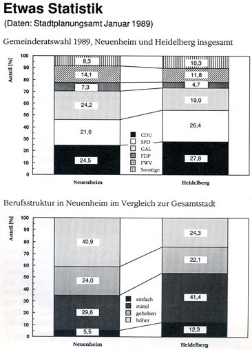

# ZEILER .me - IT & Medien, Geschichte, Deutsch - Neuenheim ist halb Europa

[Überblick](https://www.zeiler.me/neuenheim/ueberblick.html)

Inhaltsverzeichnis:

1.  [Die Eingemeindung Neuenheims](https://www.zeiler.me/neuenheim/eingemeindung.html)
    1.  Gisela Grenz befragt den Heidelberger Historiker Jochen Goetze
2.  [„Neuenheim ist halb Europa“](https://www.zeiler.me/neuenheim/ist-halb-europa.html)
    1.  Auszüge aus einem Gespräch mit Magdalena Traber und Ella Haas.
3.  [Gespräch mit Otto Jäger und Ludwig Merz](https://www.zeiler.me/neuenheim/otto-jaeger-ludwig-merz.html)
4.  [(Neuenheim wird Stadtteil von Heidelberg)](https://www.zeiler.me/neuenheim/otto-jaeger-ludwig-merz.html)
5.  [Krieg der Knöpfe - Interview mit Helmut Krauch](https://www.zeiler.me/neuenheim/interview-krauch.html)
6.  ["Und plötzlich war die Klasse judenfrei"](https://www.zeiler.me/neuenheim/judenfrei.html)
7.  [Unser Projekt](https://www.zeiler.me/neuenheim/projekt.html)
8.  Aufbau und Einsatzmöglichkeiten des Filmes
9.  [Gespräch mit Ludwig Merz. (Detlef Zeiler) Videoaufnahme](http://www.youtube.com/watch?v=3lI0piF0U7I).
10.  [Bootsfahrt mit Ludwig Merz auf dem Neckar.](http://www.youtube.com/watch?v=BpITRVlDHxM) Gespräch über Neuenheim, Bergheim und zwei Brücken.

*Statistik Neuenheim 1989*

1990, Überarbeitet im Februar 1996

Page updated

Google Sites

Report abuse