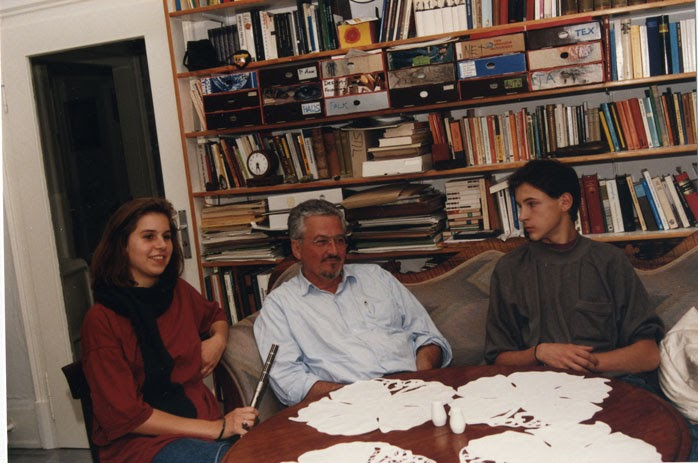

# ZEILER .me - IT & Medien, Geschichte, Deutsch - Interview mit Herrn Krauch

*Herr Krauch, Sie haben als Kind die Vorkriegs- und Kriegszeit und als Jugendlicher die Nachkriegszeit miterlebt. War das für Sie eine schlimme Zeit?*

Krauch: Nein überhaupt nicht. Also die Vorkriegszeit habe ich in ganz schöner Erinnerung und auch den Anfang des Krieges, die erste Hälfte des Krieges den haben wir eigentlich erfahren wie sie heute Krimis im Fernsehen erfahren. Das war alles voller Spannung und es ging vorwärts. Die schlimmen Zeiten fingen eigentlich erst an, als ich in die Bombenangriffe rein­kam und als ich dann schwerkrank wurde und ins Lazarett musste.

*Sie waren während der Nachkriegszeit noch sehr jung. Haben Sie die politische Entwicklung mitbekommen, bewusst mitbekommen?*

Krauch: Ja, da muss ich anfan­gen bei der Vorkriegszeit. Was ich in Erinnerung habe, ist die dau­ernde Marschmusik und die Lie­der, die gesungen wurden. Das war für mich alles nichts Negati­ves, sondern es war einfach nur interessant und aufregend, und ich hab das mir angehört und beob­achtet, während da marschiert wurde. Dann bin ich als Hitlerjun­ge selber mit marschiert und ich muss sagen, ich hab vor'm Pfarrer und vor den Lehrern wesentlich mehr Angst gehabt als vor der Polizei und vor den Hitlerjugend­führern. Die waren nett und ge­hörten zu meinen Freunden, und es wurden Geländespiele gemacht und Wanderungen. Da denkt man sich heute, das waren doch Ver­brecher! Das ist überhaupt nicht so, wir haben das alles gar nicht so empfunden.

*Frage: Wie haben sich die Leute hier nach dem Krieg an die neue Zeit, also an die Amerikanisierung gewöhnt?*

Krauch: Ja, das war natürlich für viele sehr hart, weil die neue liberalisierte Lebenseinstellung für viele ganz fremd war. Sie müssen sich das so vorstellen, dass eben in den 30er Jahren, als ich aufge­wachsen bin, sehr viel Autorität auf die Kinder ausgeübt wurde. Die Lehrer waren streng, die Pfar­rer haben moralisiert und gedroht, die Eltern waren auch sehr viel autoritärer, und nun war des plötzlich anders. Es wurde nach 45 von jedem erwartet, dass er jetzt sich selbst bestimmt und dass er sich an die Demokratie gewöhnt. Und daran konnten sich viele Leute überhaupt nicht gewöhnen. Es ging sehr langsam.

*Wenn man nun die Zeit vor und während des Kriegs mit der heutigen Zeit vergleicht, nach der Amerikanisierung, ist das Lebensgefühl dann heute freier als damals?*

Krauch: Nein, das würde ich nicht einmal sagen, weil man heue viel Zwängen unterliegt, Konsum­zwängen, die Umwelt ist bedroht, der Verkehr hat enorm zugenom­men. Wir haben damals das Ge­fühl gehabt, ziemlich frei zu sein, weil wir gewandert sind und ge­sungen haben. Und es waren auch sehr positive Gefühle, und die Verbindung zur Natur war sehr eng. Also ich würde das nicht unbedingt abgrenzen als was Schlechtes und des heute als bes­ser bezeichnen.

*Sie sagten, Sie sind als Kind, als Jugendlicher krank geworden, was war das genau?*

Krauch: Ja, ich bin mit 16 ein­gezogen worden, und war dann schon Soldat bei der Flak, also der Fliegerabwehr und im Herbst 1944 habe ich Kinderlähmung bekom­men und hab den Rest des Krieges im Lazarett erlebt. Aber es war einfach das zusammen, dass ich schlimme Sachen in den Bomben­angriffen erlebt habe und dann eben schwer krank wurde, des­wegen ist der ganze Krieg für mich ein schwer dramatisches Erlebnis geblieben.

*Ja, das war wegen Ihrer Krankheit jetzt?*

Krauch: Nein. Im Lazarett habe ich SS-Leute getroffen, die mir erzählt haben, dass sie an Judener­mordungen beteiligt waren, und da ist alles plötzlich über mich hereingebrochen, zusammen mit meiner Krankheit und mit dem verlorengehenden Krieg und mit den Bombenangriffen ist das alles hoch gekommen und aufgekom­men.

*Aber gesehen haben Sie nichts wirklich?*

Krauch: Doch, ich habe einen KZ-Zug gesehen mit jüdischen Frauen, die am Sterben waren. Der stand neben uns, in der Gegend von Kaiserslautern, als wir einen Stellungswechsel machen mussten, kurz bevor ich krank wurde. Das haben wir aber nicht richtig ein­ordnen können. Wir haben zwar gesehen, dass die bewacht waren und dass sie am Sterben waren, und mit Stacheldraht die Waggons zugenagelt waren. Aber wir ha­ben, glaub ich, alle nicht richtig verstanden, um was es da ging, damals, im Sommer 44.

*Also, wenn wir jetzt näher auf die Nachkriegszeit eingehen, was haben Sie denn da so als Jugendlicher in der Freizeit gemacht?*

Krauch: Ich konnte, dadurch, dass ich gelähmt war, nicht tanzen, und da war mein Aktionsradius von vornherein beschränkt. Ich spielte aber Schlagzeug und Gi­tarre und das war dann ein weites Feld. Ich hab dann sofort 'ne Band aufgemacht. Ich hab auch schon im Krieg Jazz gespielt und nach dem Krieg hatte ich sofort 'ne Band und hab dann Engagements ge­kriegt. Für mich war das Lebensgefühl eigentlich die Fortsetzung der Welt, die ich vorher insgeheim auch schon gefühlt und gelebt habe.

*Ich hob auch gehört, dass Heidelberg überhaupt für den Jazz ziemlich berühmt war damals. Stichwort "Cave".*

Krauch: Ja, an der Gründung vom Cave war ich beteiligt. Wir hatten damals sehr gute Musiker in den 50er Jahren im Cave und auch noch heute ist Heidelberg zwar lang nicht mehr so wie damals, aber es ist immer noch 'ne gute Jazz-Szene.

*Stichwort: Neger-Musik. Wie war es vor 1945 und wie war es nach 1945?*

Krauch: Ja, also meine Jazz-Aktivitäten die wurden von den meisten Menschen, die mich umgeben haben in der Kriegszeit, nicht sehr gern gesehen. Tanten und meine Eltern usw., die haben nicht so viel davon gehalten. Aber des hat mich nicht so furchtbar beirrt. Immerhin hatte mein Vater BluesPlatten in den 30er Jahren aus den USA mitgebracht, und die waren mein wichtigstes Repertoire, und darauf habe ich meine musi­kalischen Kenntnisse aufgebaut. Ich bin einmal in das Musikhaus Pfeifer gegangen, um ein Jazz-Besen zu kaufen für mein Schlag­zeug. Und dann hat der Verkäufer empört sich über mich gebeugt und gesagt: "So etwas führen wir nicht!" Und zwei Jahre später, nach dem Krieg, bin ich wieder hin und hab ein Saxophon ausprobiert. Und da sprach der schon ganz im amerikanischen Tonfall: "Na Mei­ster, das hat aber einen duften Sound." Der hat sich also schnell umgestellt. Aber bei dem ersten Verkaufsgespräch war er noch ganz autoritär und moralisierend und hat mir richtig Angst einge­jagt.

*Also für die Zeit während des Krieges und danach, speziell auf Neuenheim, bezogen, was kann man da sagen?*

Krauch: \]a, die Neuenheimer waren immer brave Bürger. Die haben Geige, meistens Klavier ge­spielt. Und als wir eingezogen waren, da hat der Zugführer, der Feldwebel gefragt: "Wer spielt ein Instrument?" Da sollt nämlich 'ne Marschkapelle zusammengestellt werden. Die ganzen Neuenheimer Bübchen haben sich gemel­det, und ja, was für'n Instrument? Ja alles Klavier und Geige. Könnt man natürlich nicht brauchen für 'ne Militärkapelle. Und ich war der einzige, der "Schlagwerk", sagte man damals, spielte. Ich war sofort engagiert und von da an hatte ich es wunderbar gut. Ich konnte zwar keine Schlagzeugno­ten, hatte aber den Badenweiler-Marsch, Hitlers Lieblingsmarsch, so oft im Radio gehört und alle anderen Märsche auch. Ich konn­te alles frei spielen. Da hatte ich eine sehr gute Zeit, leider nur sehr kurz.

Aber die Neuenheimer Buben, die waren also sehr nett. Ich war ja mit denen in der Klasse, aber die wurden von den Schlierbacher und Ziegelhäuserjungvolk, also die junge Hitlerjugend unheim­lich verdroschen. Da war die be­rühmte Schlachtauf der Mausbach­wiese und da waren die Neuen­heimer in riesen Überlegenheit. Aber die Schlierbacher und Zie­gelhäuser und Peterstaler hatten Jungzugführer, die den Cäsar genau gelesen hatten. Und die haben dann eine Phalanx aufge­baut, mit Flügeln, mit starken Stein­werfern und Knüppeldreschern auf den Flügeln, und die Neuenheimer Truppe ist also rettungslos niedergemetzelt worden, zusammengehauen worden. Das war so 42/43, da war also die schwere Niederlage. Später hat so was nie mehr stattgefunden. Und auch die Jazz-Musiker haben sich eigent­lich nicht so sehr aus Neuenheim rekrutiert. Die kamen eigentlich immer so aus Pfaffengrund oder aus Handschuhsheim oder aus Ziegelhausen, des waren also die Bürgerjungs, die waren durch die klassische Musikerziehung gegan­gen und irgendwie hatten die nicht den direkten Zugang zum Jazz. Aber in Neuenheim war viel los, und da wurden sofort Partys ge­feiert und da war auch vor der Währungsreform eine Schwarz­marktszene unter den Oberschü­lern, da ging's schon ziemlich rund. Und Jazz wurde gehört, natürlich. Nur, die Bürger konnten ihn nicht spielen.

*Weshalb kam es zu den Rivalitäten zwischen den Jugendlichen aus den verschiedenen Stadtteilen?"*

Krauch: Also die Neuenheimer waren halt zu einem großen Anteil gehobenes Bürgertum. Und die Ziegelhäuser, zu denen ich gehörte als Schlierbacher, das waren vorwiegend Arbeiterkinder, also Proletarierkinder. Wir hatten auch einige Jungens, die in der Oberschule waren und Jungzug­führer waren. Die haben sozusa­gen das Offizierskorps dargestellt. Aber der Hass, der losbrach in der berühmten Schlacht auf der Maus­bachwiese, das war ganz klar ein Konflikt zwischen gesellschaftli­chen Schichten oder Klassen, hat man später gesagt. Aber es gab noch andere Rivalitäten: Als ich in die Volksschule kam, da war die Hauptspannung zwischen katho­lisch und evangelisch. Die Katho­lischen wurden Kartoffeln genannt und die Evangelischen Gelbe Rübe. Und da fanden die ersten Schlachten statt.

Die Hitlerjugend hat da über­haupt keine Rolle gespielt. Das ging alles völlig daran vorbei. Aber dann gab's Schlachten zwischen Schlierbach und Ziegelhausen. Da wurden Brückenkämpfe ausge­führt auf der Brücke zwischen Schlierbach und Ziegelhausen.

Aber die Wut auf die wohlhaben­den und weichlichen Bürgerkin­der von Neuenheim, das war was ganz Besonderes. Und das ist in der berühmten Schlacht auf der Mausbachwiese voll zum Aus­bruch gekommen.

