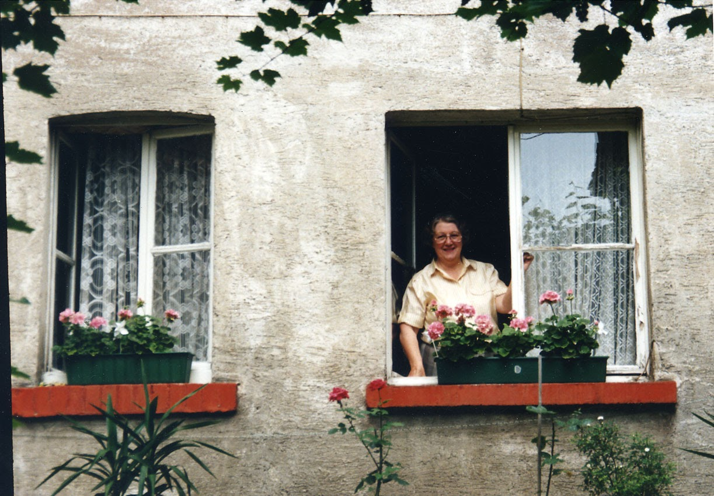
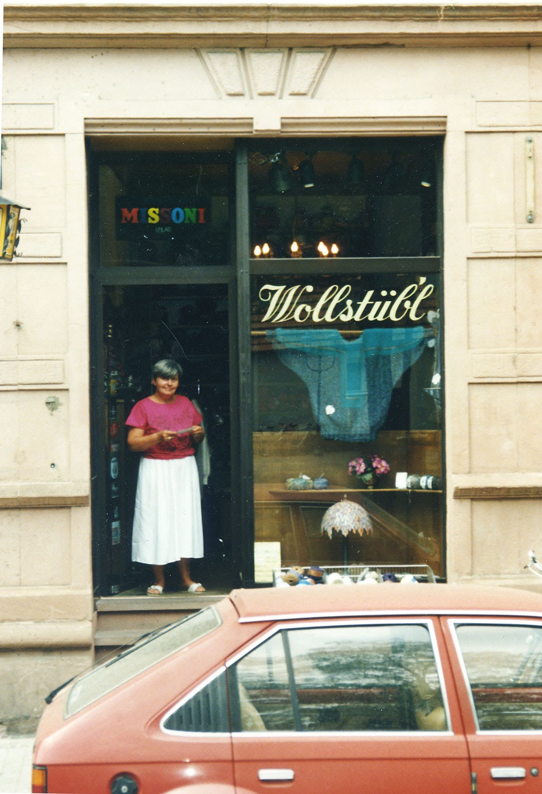

# ZEILER .me - IT & Medien, Geschichte, Deutsch - „Neuenheim ist halb Europa“

*Auszüge aus einem Gespräch mit Magdalena Traber und Ella Haas.*

**Magdalena Traber**, geboren am 19.9.1938 in Neuenheim, stammt aus der alten Neuenheimer Familie Hornung. Sie besucht die Mönchhofschule und danach das katholische Mädcheninternat in Bruchsal. 1960 heiratet sie und ist dann von 1970 bis 1981 selbständig in der Gastronomie tätig. Danach ist sie als Inhaberin des „Wollstübl“ am Neuenheimer Markt bekannt.

**Ella Haas**, geb. am 19.9.1938 in Handschuhsheim (Familie Wolfgang) besucht zunächst die Tiefburgschule und danach die Hauswirtschaftliche Berufsschule in Neuenheim. Sie arbeitet im Elternhaus mit. Von 1939 bis 1943 arbeitet sie als Verkäuferin in Metzingen und danach in Baden-Baden. Ab 1947 wohnt sie wieder in Heidelberg-Handschuhsheim.

*Frage: Wie war das denn? Haben die Kinder und Jugendlichen aus Neuenheim auch mit Kindern und Jugendlichen aus anderen Stadtteilen gespielt oder blieb das eher beschränkt?*

***Magdalena Traber**:* Neuen­heim war schon immer sehr auf sich bedacht, ne. Es gibt einen ganz blöden Ausspruch: 'Neuen­heim ist halb Europa' - und da ging nichts vorbei. Das hat sich auch nicht geändert. Meine Schwester hat nach Handschuhsheim gehei­ratet. Die heißt noch immer: 'Die Neuenheimerin'. Das war was Besseres.

***Ella Haas:*** Ja, für uns Handschuhsheimer war das Neuenheim 'das bessere Viertel'!

***Magdalena Traber**:* Man war freundlich, aber distanziert. Auch die Altstadt ist extra geblieben. Neuenheim war ein Viertel, das von den anderen als affektiert empfunden worden ist. Man war anders angezogen und das Milieu war anders - und früher war der Milieuunterschied enorm!

***Ella Haas:*** Obwohl, die Hendsemer waren nach Liegenschaften reicher. Nur, sie haben halt kein Geld gehabt. Die Neuenheimer haben Geld gehabt, aber dann in der Not auch nichts zu essen. Wir waren halt einfacher gekleidet. Die Eltern haben net so viel Zeit ge­habt für so Firlefanz: die Kinder rauszuputzen.

***Magdalena Traber:*** Die Mütter haben hier mehr Zeit gehabt. Und früher gab's ja keine Waschma­schinen. Und hier sind die Kleider immer gleich wieder gewaschen worden - und sie sind dann mor­gens tipp topp in die Schule ge­kommen

**Bilder von: Ella Haas (links) und Magdalena Traber (rechts)**

