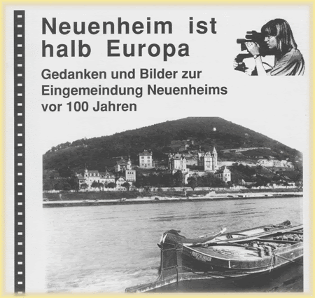

# ZEILER .me - IT & Medien, Geschichte, Deutsch - Projekt

[ZEILER .me - IT & Medien, Geschichte, Deutsch](https://www.zeiler.me/home.html)

-   [Startseite](https://www.zeiler.me/home.html)
    
-   [Detlef Zeiler](https://www.zeiler.me/detlef.html)
    
    -   [Deutsch](https://www.zeiler.me/deutsch.html)
        
    -   [Geschichte](https://www.zeiler.me/geschichte.html)
        
    -   [Impressum](https://www.zeiler.me/impressum.html)
        
    -   [Medien](https://www.zeiler.me/medien.html)
        
    -   [Projekte](https://www.zeiler.me/projekte.html)
        
        -   [Der Heiligenberg bei Heidelberg](https://www.zeiler.me/heiligenberg.html)
            
        -   [Die Elsenz und der Kraichgau](https://www.zeiler.me/die-elsenz-und-der-kraichgau.html)
            
        -   [Dritte Gewalt - Strafvollzug](https://www.zeiler.me/dritte-gewalt-strafvollzug.html)
            
        -   [Heidelberg im Mittelalter](https://www.zeiler.me/heidelberg-im-mittelalter.html)
            
        -   [Heidelberger Schulgeschichten](https://www.zeiler.me/heidelberger-schulgeschichten.html)
            
        -   [Neuenheim ist halb Europa](https://www.zeiler.me/neuenheim.html)
            
            -   [Die Eingemeindung Neuenheims 1891](https://www.zeiler.me/eingemeindung.html)
                
            -   [Interview mit Herrn Krauch](https://www.zeiler.me/interview-krauch.html)
                
            -   [MOPÄD - Mobile Pädagogen](https://www.zeiler.me/mopaed.html)
                
            -   [Neuenheim wird Stadtteil von Heidelberg](https://www.zeiler.me/otto-jaeger-ludwig-merz.html)
                
            -   [Projekt](https://www.zeiler.me/projekt.html)
                
            -   [Und plötzlich war die Klasse "judenfrei"...](https://www.zeiler.me/judenfrei.html)
                
            -   [Überblick](https://www.zeiler.me/ueberblick.html)
                
            -   [„Neuenheim ist halb Europa“](https://www.zeiler.me/ist-halb-europa.html)
                
            
        -   [Old Providence - Die Insel Providencia](https://www.zeiler.me/old-providence-die-insel-providencia.html)
            
        
    -   [Jeremia](https://www.zeiler.me/jeremia.html)
        
    
-   [Julian Zeiler](https://www.zeiler.me/julian.html)
    

[ZEILER .me - IT & Medien, Geschichte, Deutsch](https://www.zeiler.me/home.html)

1.  Die Schüler
2.  Experten
3.  Arbeitsschritte
4.  Ergebnisse
5.  Ausblick

Page updated

Google Sites

Report abuse