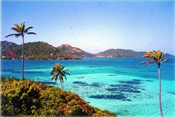

# ZEILER .me - IT & Medien, Geschichte, Deutsch - Old Providence - Die Insel Providencia

Die Insel Providencia

Copyright © Detlef Zeiler

Providencia ist eine kleine Insel in der Karibik, etwa 7 KM lang und 4 KM breit, auf der knapp 4000 Menschen leben. Sie liegt etwa 90 KM nördlich der etwas größeren und bekannteren Ferieninsel San Andres und ist nur von dieser aus zu erreichen. Von der Lage her könnte sie eigentlich zu Mittelamerika gehören, denn sie liegt näher an Nicaragua, Costa Rica oder Panama als an Kolumbien. Ich bin zwischen 1997 und 1999 mehrmals dorthin geflogen, um tauchen zu lernen und die Ruhe zu genießen, die man in anderen Ferienorten kaum noch findet.

Da ich mich gerne mit Geschichte beschäftige, war es ein Glück, dass ich 1998 Virginia Archibold kennen lernte, eine damals knapp 80-jährige Einheimische, die sich schon über Jahrzehnte mit der Geschichte der Insel beschäftigt hatte. Die Gespräche mit ihr habe ich auf Videobändern aufgezeichnet - und hier in einem kleinen Resumé zusammengefasst.

-   [Jahr 1629](https://www.zeiler.me/old-providence-die-insel-providencia/jahr-1629.html)
-   [Jahr 1641](https://www.zeiler.me/old-providence-die-insel-providencia/jahr-1641.html)
-   [Jahr 1666 - Piraterie](https://www.zeiler.me/old-providence-die-insel-providencia/jahr-1666-piraterie.html)
-   [Jahr 1666-1670](https://www.zeiler.me/old-providence-die-insel-providencia/jahr-1666-1670.html)
-   [Jahr 1670](https://www.zeiler.me/old-providence-die-insel-providencia/jahr-1670.html)
-   [Jahr 1670-1767](https://www.zeiler.me/old-providence-die-insel-providencia/jahr-1670-1767.html)
-   [Jahr 1767](https://www.zeiler.me/old-providence-die-insel-providencia/jahr-1767.html)
-   [Jahr 1790-1803](https://www.zeiler.me/old-providence-die-insel-providencia/jahr-1790-1803.html)
-   [1817-1821 - Die Korsaren](https://www.zeiler.me/old-providence-die-insel-providencia/1817-1821-die-korsaren.html)
-   [Jahr 1822 - Die Republik](https://www.zeiler.me/old-providence-die-insel-providencia/jahr-1822-die-republik.html)
-   [Aktuell - 1903-heute](https://www.zeiler.me/old-providence-die-insel-providencia/aktuell-1903-heute.html)
-   [Interview mit Virginia Archbold (Teil I)](http://www.youtube.com/watch?v=ESR6wD91ZUI)
-   [Interview mit Virginia Archbold. Teil II](http://youtu.be/3BZ1hGiKU1Q)
-   [Rundfahrt um die Insel Providencia (1998)](http://youtu.be/z9xKtMfxQs8)
-   Einige Eindrücke von der Insel --- folgen bald.
-   [Julians Inselrundfahrt mit dem Motorrad](http://youtu.be/UNBGqmKFWhI)

