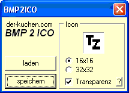

# ZEILER .me - IT & Medien, Geschichte, Deutsch - favicon ico mit MS Paint und BMP2ICO erstellen

## 

Problem: Microsoft Paint erstellt nur die Web-Grafikformate .jpg, .gif und .png - Das .ico Format für favicon-Dateien wird nicht unterstützt.

Da MS Paint das Dateiformat von favicon Dateien (.ico) nicht unterstützt, verwenden wir das kostenlose Programm BMP2ICO von [Der Kuchen](http://www.google.com/url?q=http%3A%2F%2Fwww.der-kuchen.com%2F%3FDownloadBMP2ICO&sa=D&sntz=1&usg=AOvVaw2Yjs3_GGCprbCHu2E4k-au), um das Unterstützte Format .bmp in eine .ico Datei umzuwandeln.

## 

Lösung:

Zunächst wird mit Microsoft Paint die Datei favicon.bmp erstellt. Das Programm findet man unter Start -> Programme -> Zubehör -> Paint. Dort sollte man noch die Größe des Bildes angeben (16x16 oder 32x32 Pixel):

Im Menü "Bild" -> Attribute -> Breite: 16 Höhe: 16

Dann das Bild erstellen und als 24-Bit-Bitmap (\*.bmp; \*.dib) z.B. unter dem Namen favicon.bmp abspeichern.

Anschließend BMP2ICO ([herunterladen](http://www.google.com/url?q=http%3A%2F%2Fwww.der-kuchen.com%2F%3FDownloadBMP2ICO&sa=D&sntz=1&usg=AOvVaw2Yjs3_GGCprbCHu2E4k-au)) starten und das soeben erstellte favicon.bmp laden. Dann die Gewünschte Größe angeben (z.B.16x16) und auswählen, ob das obere linke Pixel als Transparenz-Farbe gewählt werden soll:

